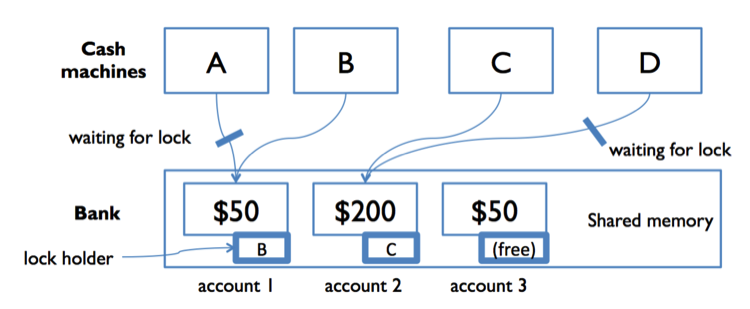

# 阅读 23：锁和同步

#### 在 6.005 软件中

| 免受错误影响 | 易于理解 | 可随时更改 |
| --- | --- | --- |
| 今天正确，未来也正确。 | 与未来程序员清晰沟通，包括未来的你。 | 设计以适应更改而无需重写。 |

#### 目标

+   了解锁如何用于保护共享可变数据

+   能够识别死锁并知道预防死锁的策略。

+   了解监视器模式并能够将其应用于数据类型

## 介绍

早些时候，我们定义了数据类型或函数的线程安全性，即*在多个线程使用时表现正确，无论这些线程如何执行，都不需要额外的协调*。

这是一般原则：**并发程序的正确性不应取决于时间的偶然性**。

为了实现这种正确性，我们列举了使代码安全并发的四种策略：

1.  **隔离**：不要在线程之间共享数据。

1.  **不可变性**：使共享数据不可变。

1.  **使用现有线程安全的数据类型**：使用一个为您进行协调的数据类型。

1.  **同步**：防止线程同时访问共享数据。这是我们用来实现线程安全类型的方法，但当时我们没有讨论它。

我们之前讨论过策略 1-3。在本文中，我们将结束对策略 4 的讨论，使用**同步**来实现您自己的数据类型，使其**适用于共享内存并发**。

## 同步

**并发程序的正确性不应取决于时间的偶然性。**

由于并发操作共享可变数据导致的竞态条件是灾难性的错误——难以发现、难以重现、难以调试——我们需要一种让共享内存的并发模块之间**同步**的方法。

**锁**是一种同步技术。锁是一种允许最多一个线程*拥有*它的抽象。*持有锁*是一个线程告诉其他线程：“我正在处理这个东西，请现在不要碰它。”

锁有两个操作：

+   **`acquire`** 允许线程获取锁的所有权。如果一个线程试图获取当前由另一个线程拥有的锁，它会*阻塞*，直到另一个线程释放锁。此时，它将与试图获取锁的任何其他线程竞争。最多只能有一个线程拥有该锁。

+   **`release`** 释放锁的所有权，允许另一个线程获取它的所有权。

使用锁还告诉编译器和处理器，你正在同时使用共享内存，因此寄存器和缓存将被刷新到共享存储中。这避免了重新排序的问题，确保锁的所有者始终查看最新的数据。

### 银行账户示例


我们第一个共享内存并发的示例是一个带有取款机的银行。该示例的图表在右侧。

银行有几台取款机，它们都可以读取和写入内存中相同的账户对象。

当然，如果并发读写账户余额之间没有任何协调，事情会变得非常糟糕。

要解决这个锁的问题，我们可以为每个银行账户添加一个保护锁。现在，在取款机可以访问或更新账户余额之前，必须首先获取该账户的锁。



在右侧的图表中，A 和 B 都试图访问账户 1。假设 B 先获取锁。然后 A 必须等待读取和写入余额，直到 B 完成并释放锁。这确保了 A 和 B 的同步，但另一个取款机 C 可以独立运行在另一个账户上（因为该账户受到不同锁的保护）。

## 死锁

当锁被正确和谨慎地使用时，可以防止竞争条件。但另一个问题随之而来。因为使用锁需要线程等待（当另一个线程持有锁时，`acquire`会阻塞），可能会出现两个线程互相等待*对方*的情况，因此都无法继续执行。


在右侧的图中，假设 A 和 B 在我们的银行账户之间进行同时转账。

在账户之间进行转账需要锁定两个账户，以防资金从系统中消失。A 和 B 分别获取其各自“从”账户的锁：A 获取账户 1 的锁，B 获取账户 2 的锁。现在，每个人都必须获取其“到”账户的锁：因此 A 正在等待 B 释放账户 2 的锁，而 B 正在等待 A 释放账户 1 的锁。僵局！A 和 B 被困在“致命的拥抱”中，账户被锁定。

**死锁**发生在并发模块相互等待对方执行某些操作时。死锁可能涉及两个以上的模块：死锁的特征是**依赖循环**，例如 A 等待 B，B 等待 C，C 等待 A。它们都无法继续执行。

你也可以在不使用任何锁的情况下发生死锁。例如，当消息缓冲区填满时，消息传递系统可能会发生死锁。如果客户端用请求填满了服务器的缓冲区，然后*阻塞*等待添加另一个请求，那么服务器可能会用结果填满客户端的缓冲区，然后自己阻塞。所以客户端正在等待服务器，服务器正在等待客户端，两者都无法取得进展，直到另一个取得进展。同样，死锁随之而来。

在 Java 教程中，阅读：

+   [死锁](http://docs.oracle.com/javase/tutorial/essential/concurrency/deadlock.html) (1 页)

## 开发线程安全的抽象数据类型

让我们看看如何使用同步来实现一个线程安全的 ADT。

您可以在 GitHub 上查看此示例的所有代码：[**编辑缓冲区示例**](https://github.com/mit6005/fa16-ex23-editor)。您*不*需要阅读和理解所有代码。以下是所有相关部分的摘录。

假设我们正在构建一个多用户编辑器，类似于 Google Docs，允许多人同时连接并编辑。我们需要一个可变的数据类型来表示文档中的文本。这是接口；基本上它表示一个带有插入和删除操作的字符串：

[`EditBuffer.java`](https://github.com/mit6005/fa16-ex23-editor/blob/master/src/editor/EditBuffer.java)

```
/** An EditBuffer represents a threadsafe mutable
 *  string of characters in a text editor. */
public interface EditBuffer {
    /**
     * Modifies this by inserting a string.
     * @param pos position to insert at
                      (requires 0 <= pos <= current buffer length)
     * @param ins string to insert
     */
    public void insert(int pos, String ins);

    /**
     * Modifies this by deleting a substring
     * @param pos starting position of substring to delete 
     *                (requires 0 <= pos <= current buffer length)
     * @param len length of substring to delete 
     *                (requires 0 <= len <= current buffer length - pos)
     */
    public void delete(int pos, int len);

    /**
     * @return length of text sequence in this edit buffer
     */
    public int length();

    /**
     * @return content of this edit buffer
     */
    public String toString();
}
```

这种数据类型的一个非常简单的表示只是一个字符串：

[`SimpleBuffer.java`](https://github.com/mit6005/fa16-ex23-editor/blob/master/src/editor/SimpleBuffer.java)

```
public class SimpleBuffer implements EditBuffer {
    private String text;
    // Rep invariant: 
    //   text != null
    // Abstraction function: 
    //   represents the sequence text[0],...,text[text.length()-1]
```

这种表示的缺点是，每次进行插入或删除操作时，都必须将整个字符串复制到一个新字符串中。这很昂贵。我们可以使用的另一种表示方法是字符数组，末尾带有空间。如果用户只是在文档末尾输入新文本（我们不必复制任何内容），那么这是很好的，但如果用户在文档开头输入文本，那么我们就必须在每次按键时复制整个文档。

更有趣的表示方法，在实践中许多文本编辑器都使用，称为*间隙缓冲区*。它基本上是一个带有额外空间的字符数组，但是额外空间不是全部在末尾，而是一个*间隙*，可以出现在缓冲区的任何位置。每当需要进行插入或删除操作时，数据类型首先将间隙移动到操作的位置，然后执行插入或删除。如果间隙已经存在，那么就不需要复制任何内容——插入只消耗部分间隙，删除只扩大间隙！间隙缓冲区特别适合表示由具有光标的用户编辑的字符串，因为插入和删除倾向于围绕光标进行，所以间隙很少移动。

[`GapBuffer.java`](https://github.com/mit6005/fa16-ex23-editor/blob/master/src/editor/GapBuffer.java)

```
/** GapBuffer is a non-threadsafe EditBuffer that is optimized
 *  for editing with a cursor, which tends to make a sequence of
 *  inserts and deletes at the same place in the buffer. */
public class GapBuffer implements EditBuffer {
    private char[] a;
    private int gapStart;
    private int gapLength;
    // Rep invariant: 
    //   a != null
    //   0 <= gapStart <= a.length
    //   0 <= gapLength <= a.length - gapStart
    // Abstraction function: 
    //   represents the sequence a[0],...,a[gapStart-1],
    //                           a[gapStart+gapLength],...,a[length-1]
```

在多用户场景中，我们希望有多个间隙，每个用户的光标都有一个，但现在我们暂时只使用一个间隙。

### 开发数据类型的步骤

回想一下我们设计和实现 ADT 的方法：

1.  **指定。** 定义操作（方法签名和规范）。我们在`EditBuffer`接口中完成了这项工作。

1.  **测试。** 为操作开发测试用例。请参阅所提供代码中的`EditBufferTest`。测试套件包括基于对操作的参数空间进行分区的测试策略。

1.  **Rep。** 选择一个 rep。我们为`EditBuffer`选择了两个 rep，这通常是个好主意：

    1.  **首先实现一个简单的、蛮力的版本。**这样做更容易，您更有可能做对，并且它将验证您的测试用例和规范，以便您在继续进行更难的实现之前可以解决其中的问题。这就是为什么我们在转向`GapBuffer`之前先实现了`SimpleBuffer`。不要丢弃您的简单版本，保留它，以便您有一些东西可以测试和与之比较，以防更复杂的版本出现问题。

    1.  **记录 rep 不变式和抽象函数，并实现`checkRep()`。** `checkRep()`在每个构造函数、生产者和修改器方法的末尾断言 rep 不变式。（通常不需要在观察者的末尾调用它，因为 rep 没有改变。）实际上，断言对于测试复杂实现非常有用，因此在复杂方法的末尾也断言后条件并不是一个坏主意。您将在本文中的代码中`GapBuffer.moveGap()`中看到这样的示例。

在所有这些步骤中，我们首先完全单线程工作。在编写规范和选择代表时，多线程客户端应始终在我们的头脑中，因为（我们将在稍后看到，小心选择操作可能是必要的，以避免数据类型客户端中的竞争条件）。但首先使其在顺序的、单线程的环境中工作，并进行彻底测试。

现在我们准备进行下一步：

1.  **同步。** 提出您的 rep 是线程安全的论点。将其明确写成注释添加到您的类中，就在 rep 不变式旁边，以便维护人员知道您如何将线程安全性设计到类中。

本阅读的这部分是关于如何执行第 4 步的。我们已经看到如何提出线程安全性论点，但这次，我们将依赖于该论点中的同步。

然后我们上面提到的额外步骤：

1.  **迭代**。您可能会发现，您选择的操作方式使得编写符合客户要求的线程安全类型变得困难。您可能会在第 1 步中发现这一点，或者在编写测试时发现，在步骤 3 或 4 中实现时发现。如果是这种情况，请返回并完善您的 ADT 提供的操作集。

## 锁定

锁是如此常用，以至于 Java 将它们作为内置语言特性提供。

在 Java 中，每个对象都隐含与之关联的锁 —— 一个`String`、一个数组、一个`ArrayList`，以及您创建的每个类，它们的所有对象实例都有一个锁。甚至一个简单的`Object`也有一个锁，因此裸`Object`经常用于显式锁定。

```
Object lock = new Object();
```

但是在 Java 的内置锁上不能调用`acquire`和`release`。相反，您可以使用**`synchronized`**语句在语句块的持续时间内获取锁：

```
synchronized (lock) { // thread blocks here until lock is free
    // now this thread has the lock
    balance = balance + 1;
    // exiting the block releases the lock
}
```

像这样的同步区域提供了**互斥**：同一时间只能有一个线程在由给定对象的锁保护的同步区域中。换句话说，您回到了顺序编程的世界中，一次只有一个线程在运行，至少是对于引用相同对象的其他同步区域而言。

### 锁保护数据的访问

锁用于**保护**共享数据变量，如此处显示的账户余额。如果对数据变量的所有访问都由相同的锁对象保护（包围在同步块中），那么这些访问将被保证是原子的——不会被其他线程打断。

因为 Java 中的每个对象都隐含与之关联的锁，所以您可能会认为拥有对象的锁就会阻止其他线程访问该对象。**事实并非如此。**使用下面的代码获取与对象`obj`关联的锁时，

```
synchronized (obj) { ... }
```

线程*t*只做一件事：防止其他线程进入`synchronized(obj)`块，直到线程*t*完成其同步块。就是这样。

锁只与获取相同锁的其他线程提供互斥。对数据变量的所有访问都必须由相同的锁保护。您可能会将整个变量集合放在单个锁后面，但所有模块必须同意它们将获取和释放哪个锁。

## 监视器模式

当你编写类的方法时，最方便的锁是对象实例本身，即`this`。作为一种简单的方法，我们可以通过在所有对 rep 的访问都包装在`synchronized (this)`内部来保护整个类的 rep。

```
/** SimpleBuffer is a threadsafe EditBuffer with a simple rep. */
public class SimpleBuffer implements EditBuffer {
    private String text;
    ...
    public SimpleBuffer() {
        **synchronized (this) {**
            text = "";
            checkRep();
        **}**
    }
    public void insert(int pos, String ins) {
        **synchronized (this) {**
            text = text.substring(0, pos) + ins + text.substring(pos);
            checkRep();
        **}**
    }
    public void delete(int pos, int len) {
        **synchronized (this) {**
            text = text.substring(0, pos) + text.substring(pos+len);
            checkRep();
        **}**
    }
    public int length() {
        **synchronized (this) {**
            return text.length();
        **}**
    }
    public String toString() {
        **synchronized (this) {**
            return text;
        **}**
    }
} 
```

请注意这里非常谨慎的规范。*每个*触及 rep 的方法都必须使用锁进行保护——甚至看似小而琐碎的方法，如`length()`和`toString()`。这是因为读取必须像写入一样受到保护——如果读取未经保护，则它们可能能够看到 rep 处于部分修改状态。

这种方法称为**监视器模式**。监视器是一个类，其方法是互斥的，因此一次只能有一个线程在类的实例内部。

Java 为监视器模式提供了一些语法糖。如果你在方法签名中添加关键字`synchronized`，那么 Java 会像你在方法体周围写了`synchronized (this)`一样运行。因此，下面的代码是实现同步的`SimpleBuffer`的等效方式：

```
/** SimpleBuffer is a threadsafe EditBuffer with a simple rep. */
public class SimpleBuffer implements EditBuffer {
    private String text;
    ...
    public SimpleBuffer() {
        text = "";
        checkRep();
    }
    public **synchronized** void insert(int pos, String ins) {
        text = text.substring(0, pos) + ins + text.substring(pos);
        checkRep();
    }
    public **synchronized** void delete(int pos, int len) {
        text = text.substring(0, pos) + text.substring(pos+len);
        checkRep();
    }
    public **synchronized** int length() {
        return text.length();
    }
    public **synchronized** String toString() {
        return text;
    }
} 
```

请注意，`SimpleBuffer`构造函数没有`synchronized`关键字。实际上，Java 在语法上禁止这样做，因为一个正在构造的对象预期应该在返回构造函数之前被限制在一个线程中。因此，同步构造函数应该是不必要的。

在 Java 教程中，阅读：

+   [同步方法](http://docs.oracle.com/javase/tutorial/essential/concurrency/syncmeth.html)（1 页）

+   [内在锁和同步](http://docs.oracle.com/javase/tutorial/essential/concurrency/locksync.html)（1 页）

#### 阅读练习

使用锁进行同步

如果线程 B 尝试获取线程 A 当前持有的锁：

线程 A 会发生什么？

（缺少答案）（缺少答案）（缺少答案）

线程 B 会发生什么？

（缺少答案）（缺少答案）（缺少答案）

（缺少解释）

这个列表是我的，完全属于我。

假设`list`是一个`ArrayList<String>`的实例。

当 A 在`synchronized (list) { ... }`块中时，哪些是真的？

（缺少答案）（缺少答案）（缺少答案）（缺少答案）（缺少答案）（缺少答案）

（缺少解释）

好吧，但是这个同步的 List 完全属于我。

假设`sharedList`是由[`Collections.synchronizedList`](http://docs.oracle.com/javase/8/docs/api/java/util/Collections.html#synchronizedList-java.util.List-)返回的`List`。

现在可以在多个线程中安全地使用`sharedList`而不需要获取任何锁……除了！以下哪种情况需要一个`synchronized(sharedList) { ... }`块？

（缺少答案）（缺少答案）（缺少答案）（缺少答案）

（缺少解释）

我听说你喜欢锁，所以我获得了你的锁，这样你就可以在获得的同时锁定。

假设我们运行这段代码：

```
synchronized (obj) {
    // ...
    synchronized (obj) { // <-- uh oh, deadlock?
        // ...
    }
    // <-- do we own the lock on obj?
}
```

在“噢噢，死锁了？”那一行，我们会经历死锁吗？

（缺少答案）（缺少答案）

如果我们没有死锁，在“我们是否拥有 obj 上的锁”的那一行，线程是否拥有 obj 上的锁？

（缺少答案）（缺少答案）（缺少答案）

（缺少解释）

## 使用同步进行线程安全论证

现在我们正在使用锁保护`SimpleBuffer`的 rep，我们可以写一个更好的线程安全论证：

```
/** SimpleBuffer is a threadsafe EditBuffer with a simple rep. */
public class SimpleBuffer implements EditBuffer {
    private String text;
    // Rep invariant: 
    //   text != null
    // Abstraction function: 
    //   represents the sequence text[0],...,text[text.length()-1]
    // Thread safety argument:
    //   all accesses to text happen within SimpleBuffer methods,
    //   which are all guarded by SimpleBuffer's lock
```

如果我们使用监视器模式来同步`GapBuffer`的所有方法，那么相同的论点适用于`GapBuffer`。

请注意，类的封装，即没有 rep 曝光，对于提出这个论点非常重要。如果 text 是 public 的：

```
 public String text;
```

那么`SimpleBuffer`之外的客户端将能够读取和写入它，而不知道他们应该首先获取锁，而`SimpleBuffer`将不再是线程安全的。

### 锁定纪律

锁定纪律是确保同步代码是线程安全的策略。我们必须满足两个条件：

1.  每个共享的可变变量都必须由某个锁保护。除了在获得该锁的同步块内部读取或写入数据外，不得读取或写入数据。

1.  如果不变量涉及多个共享可变变量（甚至可能在不同的对象中），则所涉及的所有变量必须由*相同*的锁保护。一旦线程获取锁，则必须在释放锁之前重新建立不变量。

此处使用的监视器模式满足了两条规则。所有与 rep 不变量相关的共享可变数据都由相同的锁保护。

## 原子操作

考虑对`EditBuffer`数据类型进行查找和替换操作：

```
/** Modifies buf by replacing the first occurrence of s with t.
 *  If s not found in buf, then has no effect.
 *  @returns true if and only if a replacement was made
 */
public static boolean findReplace(EditBuffer buf, String s, String t) {
    int i = buf.toString().indexOf(s);
    if (i == -1) {
        return false;
    }
    buf.delete(i, s.length());
    buf.insert(i, t);
    return true;
}
```

此方法对`buf`进行了三个不同的调用 —— 将其转换为字符串以便搜索`s`，删除旧文本，然后在其位置插入`t`。即使这些调用中的每个调用都是原子的，`findReplace`方法作为一个整体却不是线程安全的，因为其他线程可能会在`findReplace`工作时对缓冲区进行突变，导致删除错误的区域或将替换放回到错误的位置。

为了防止这种情况发生，`findReplace`需要与`buf`的所有其他客户端同步。

### 给客户端访问锁

有时，将您数据类型的锁提供给客户可能是有用的，这样他们就可以使用它来实现使用您数据类型的更高级原子操作。

因此，解决`findReplace`问题的一种方法是记录客户端可以使用`EditBuffer`的锁来彼此同步：

```
/** An EditBuffer represents a threadsafe mutable string of characters
 *  in a text editor. **Clients may synchronize with each other using the
 *  EditBuffer object itself.** */
public interface EditBuffer {
   ...
} 
```

然后`findReplace`可以对`buf`进行同步：

```
public static boolean findReplace(EditBuffer buf, String s, String t) {
    **synchronized (buf) {**
        int i = buf.toString().indexOf(s);
        if (i == -1) {
            return false;
        }
        buf.delete(i, s.length());
        buf.insert(i, t);
        return true;
    **}**
} 
```

这样做的效果是将监视器模式已经放置在个别`toString`、`delete`和`insert`方法周围的同步区域扩大到一个单一的原子区域，确保所有三个方法在没有其他线程干扰的情况下执行。

### 到处都加上`synchronized`吗？

所以线程安全仅仅是在程序的每个方法上都加上`synchronized`关键字吗？不幸的是，不是。

首先，您实际上不希望随意同步方法。同步对您的程序施加了很大的成本。由于需要获取锁（并刷新缓存并与其他处理器通信），进行同步方法调用可能需要更长的时间。Java 默认情况下将其许多可变数据类型保持不同步正是出于这些性能原因。当您不需要同步时，请不要使用它。

更谨慎地使用`synchronized`的另一个论点是，它将锁的访问范围最小化。将`synchronized`添加到每个方法中意味着您的锁是对象本身，并且每个具有对您对象引用的客户端自动具有对您锁的引用，可以随意获取和释放。因此，您的线程安全机制是公开的，并且可以被客户端干扰。相比之下，使用作为对象内部的锁，使用`Synchronized()`块适当且节制地获取。

最后，仅仅在任何地方添加`synchronized`是不够的。毫无思考地在方法上添加`synchronized`意味着你在获取一个锁而没有考虑是哪个锁，或者是否是用于保护即将进行的共享数据访问的正确锁。假设我们尝试通过简单地在`findReplace`的声明上添加`synchronized`来解决同步问题：

```
public static synchronized boolean findReplace(EditBuffer buf, ...) {
```

这不会达到我们的目的。它确实会获取一个锁——因为`findReplace`是一个静态方法，它会获取整个类的静态锁，而不是实例对象锁。因此，只有一个线程可以一次调用`findReplace`——即使其他线程想要操作*不同*的缓冲区，这应该是安全的，它们仍然会被阻塞，直到单个锁被释放。因此，我们会遭受显著的性能损失，因为我们庞大的多用户编辑器只允许一个用户一次执行查找和替换，即使他们都在编辑不同的文档。

然而更糟糕的是，它不会提供有用的保护，因为触及文档的其他代码可能不会获取相同的锁。它实际上不会消除我们的竞态条件。

`synchronized`关键字并非万能药。线程安全需要纪律——使用封装、不可变性或锁来保护共享数据。而且这种纪律需要被记录下来，否则维护者就不会知道是什么。

## 为并发设计数据类型

`findReplace`的问题可以另一种方式解释：`EditBuffer`接口对于多个同时客户端并不友好。它依赖于整数索引来指定插入和删除位置，这对其他变化非常脆弱。如果其他人在索引位置之前插入或删除，那么索引就会变得无效。

因此，如果我们专门为并发系统设计数据类型，我们需要考虑提供在交错时具有更明确定义语义的操作。例如，将`EditBuffer`与表示缓冲区中光标位置的`Position`数据类型配对，甚至是表示选定范围的`Selection`数据类型。一旦获得，`Position`可以在文本中的插入和删除操作中保持其位置，直到客户端准备使用该`Position`。如果其他线程删除了`Position`周围的所有文本，那么`Position`将能够通知后续客户端发生了什么（可能会有异常），并允许客户端决定如何处理。在设计用于并发的数据类型时，这些考虑因素会起作用。

另一个例子是考虑 Java 中的[`ConcurrentMap`](http://docs.oracle.com/javase/8/docs/api/?java/util/concurrent/ConcurrentMap.html)接口。该接口扩展了现有的`Map`接口，添加了一些常用的在共享可变映射上作为原子操作的关键方法，例如：

+   `map.putIfAbsent(key,value)` 是

    如果（`map.containsKey(key)`）则`map.put(key, value);`

+   `map.replace(key, value)` 是

    如果（`map.containsKey(key)`）则`map.put(key, value);`

## 死锁出现了

线程安全的加锁方法非常强大，但是（与封装和不可变性不同）它引入了程序中的阻塞。有时线程必须等待其他线程退出同步区域才能继续。而且阻塞会增加死锁的可能性 —— 这是一个非常真实的风险，并且坦率地说*在这种设置中比在具有阻塞 I/O 的消息传递中要常见得多*。

通过加锁，死锁发生在线程同时获取多个锁并且两个线程最终被阻塞，同时持有它们各自等待另一个释放的锁。监视器模式不幸地使这相当容易实现。下面是一个例子。

假设我们正在对一系列书的社交网络进行建模：

```
public class Wizard {
    private final String name;
    private final Set<Wizard> friends;
    // Rep invariant:
    //    name, friends != null
    //    friend links are bidirectional: 
    //        for all f in friends, f.friends contains this
    // Concurrency argument:
    //    threadsafe by monitor pattern: all accesses to rep 
    //    are guarded by this object's lock

    public Wizard(String name) {
        this.name = name;
        this.friends = new HashSet<Wizard>();
    }

    public synchronized boolean isFriendsWith(Wizard that) {
        return this.friends.contains(that);
    }

    public synchronized void friend(Wizard that) {
        if (friends.add(that)) {
            that.friend(this);
        } 
    }

    public synchronized void defriend(Wizard that) {
        if (friends.remove(that)) {
            that.defriend(this);
        } 
    }
}
```

像 Facebook 一样，这个社交网络是双向的：如果*x*和*y*是朋友，那么*y*也是*x*的朋友。`friend()`和`defriend()`方法通过修改两个对象的代表来执行不变性，这意味着它们使用了监视器模式，因此需要获取两个对象的锁。

让我们创建一对巫师：

```
 Wizard harry = new Wizard("Harry Potter");
    Wizard snape = new Wizard("Severus Snape");
```

然后想想当两个独立的线程反复运行时会发生什么：

```
 // thread A                   // thread B
    harry.friend(snape);          snape.friend(harry);
    harry.defriend(snape);        snape.defriend(harry);
```

我们将非常迅速地发生死锁。原因如下。假设线程 A 即将执行`harry.friend(snape)`，而线程 B 即将执行`snape.friend(harry)`。

+   线程 A 获取了`harry`上的锁（因为`friend`方法是同步的）。

+   然后线程 B 以相同的原因获取了`snape`上的锁。

+   它们都独立地更新各自的代表，并尝试在另一个对象上调用`friend()` —— 这要求它们获取另一个对象上的锁。

因此 A 持有 Harry 并等待 Snape，而 B 持有 Snape 并等待 Harry。两个线程都被卡在`friend()`中，因此它们中的任何一个都不会成功退出同步区域并释放锁给另一个。这是一个经典的致命拥抱。程序停止运行。

问题的本质是获取多个锁，并在等待另一个锁变得可用时保持某些锁的状态。

请注意，线程 A 和线程 B 可能交错执行，以致死锁不会发生：也许线程 A 在线程 B 有足够时间获取第一个锁之前获取并释放了两个锁。如果死锁涉及的锁也涉及竞争条件 —— 而很多时候确实如此 —— 那么死锁将同样难以重现或调试。

### 死锁解决方案 1：锁的排序

防止死锁的一种方法是对需要同时获取的锁进行排序，并确保所有代码按照该顺序获取锁。

在我们的社交网络示例中，我们可能总是按照巫师的名字的字母顺序获取`Wizard`对象的锁。由于线程 A 和线程 B 都需要 Harry 和 Snape 的锁，它们都会按照这个顺序获取：首先是 Harry 的锁，然后是 Snape 的锁。如果线程 A 在 B 之前获取了 Harry 的锁，那么它也会在 B 之前获取 Snape 的锁，因为 B 在 A 释放 Harry 的锁之前无法继续。锁的顺序强制了获取它们的线程的顺序，因此无法在等待图中产生循环。

代码可能如下所示：

```
 public void friend(Wizard that) {
        Wizard first, second;
        if (this.name.compareTo(that.name) < 0) {
            first = this; second = that;
        } else {
            first = that; second = this;
        }
        synchronized (first) {
            synchronized (second) {
                if (friends.add(that)) {
                    that.friend(this);
                } 
            }
        }
    }
```

（请注意，按照人名的字母顺序对锁进行排序的决定对于本书来说是可以的，但在现实生活中的社交网络中不适用。为什么？在锁的排序中，比名字更好的选择是什么？）

尽管锁的排序在实践中很有用（特别是在像操作系统内核这样的代码中），但实际上有许多缺点。

+   首先，这不是模块化的 —— 代码必须了解系统中的所有锁，或者至少了解其子系统中的所有锁。

+   其次，代码可能很难或不可能知道在获取第一个锁之前将需要哪些锁。它可能需要进行一些计算来弄清楚。例如，考虑在社交网络图上进行深度优先搜索 —— 在开始查找之前，你如何知道哪些节点需要被锁定？

### 死锁解决方案 2：粗粒度锁

比锁的排序更常见的方法，特别是对于应用程序编程（而不是操作系统或设备驱动程序编程），是使用更粗的锁 —— 使用单个锁来保护许多对象实例，甚至是程序的整个子系统。

例如，我们可能为整个社交网络设置一个单独的锁，并使其所有组成部分的操作在该锁上同步。在下面的代码中，所有`Wizard`都属于一个`Castle`，我们只需使用该`Castle`对象的锁来同步：

```
public class Wizard {
    private final Castle castle;
    private final String name;
    private final Set<Wizard> friends;
    ...
    public void friend(Wizard that) {
        synchronized (castle) {
            if (this.friends.add(that)) {
                that.friend(this);
            }
        }
    }
}
```

粗粒度锁可能会带来显著的性能损失。如果用单个锁保护一大堆可变数据，那么你就放弃了同时访问任何数据的能力。在最坏的情况下，如果一个锁保护所有内容，你的程序可能基本上是顺序执行的 —— 一次只允许一个线程取得进展。

#### 阅读练习

死锁

在下面的代码中，三个线程 1、2 和 3 正在尝试获取对象`alpha`、`beta`和`gamma`上的锁。

| 线程 1 | 线程 2 | 线程 3 |
| --- | --- | --- |

|

```
synchronized (alpha) {
    // using alpha
    // ...
}

synchronized (gamma) {
    synchronized (beta) {
        // using beta & gamma
        // ...
    }
}
// finished
```

|

```
synchronized (gamma) {
    synchronized (alpha) {
        synchronized (beta) {
            // using alpha, beta, & gamma
            // ...
        }
    }
}
// finished
```

|

```
synchronized (gamma) {
    synchronized (alpha) {
        // using alpha & gamma
        // ...
    }
}

synchronized (beta) {
    synchronized (gamma) {
        // using beta & gamma
        // ...
    }
}
// finished
```

|

这个系统容易发生死锁。

对于下面的每个情景，请确定如果线程当前位于指定的代码行，则系统是否处于死锁状态。

****情景 A**

线程 1 在`using alpha`内部

线程 2 被阻塞在`synchronized (alpha)`上

线程 3 完成

（缺失答案）（缺失答案）

（缺失解释）

****情景 B**

线程 1 完成

线程 2 被阻塞在`synchronized (beta)`上

线程 3 被阻塞在第 2 个`synchronized (gamma)`上

（缺失答案）（缺失答案）

（缺失解释）

****情景 C**

线程 1 在运行`synchronized (beta)`中

线程 2 被阻塞在`synchronized (gamma)`上

线程 3 被阻塞在第 1 个`synchronized (gamma)`上

（缺失答案）（缺失答案）

（缺失解释）

****情景 D**

线程 1 被阻塞在`synchronized (beta)`上

线程 2 完成

线程 3 被阻塞在第 2 个`synchronized (gamma)`上

（缺失答案）（缺失答案）

（缺失解释）******** ****被锁定

再次检查代码。

在前一个问题中，我们看到了涉及`beta`和`gamma`的死锁。

什么情况下会出现`alpha`？

（缺失答案）（缺失答案）（缺失答案）（缺失答案）

（缺失解释）****  ****## 并发程序设计目标

现在是升级并查看我们正在做的内容的好时机。回想一下我们的主要目标是创建**免受错误**，**易于理解**且**能够应对变化**的软件。

构建并发软件显然是所有这三个目标的挑战。我们可以将问题分为两类。当我们询问并发程序是否*免受错误*时，我们关心两个属性：

+   **安全性。**并发程序是否满足其不变量和规范？在访问可变数据时的竞争威胁到安全性。安全性问的问题是：你能证明**一些坏事永远不会发生**吗？

+   **活跃性。**程序是否持续运行并最终按照您的意愿执行，或者它是否在某个地方永远等待永远不会发生的事件？你能证明**一些好事最终会发生**吗？

死锁威胁到活跃性。活跃性可能还需要*公平性*，这意味着并发模块被给予处理能力以在其计算上取得进展。公平性在很大程度上是操作系统的线程调度器的问题，但你可以通过设置线程优先级来影响它（好的或坏的）。

## 实践中的并发

在实际程序中通常采用哪些策略？

+   **库数据结构**要么不使用同步（为单线程客户端提供高性能，同时让多线程客户端在顶部添加锁定），要么使用监视器模式。

+   具有许多部分的**可变数据结构**通常使用粗粒度锁定或线程封闭。大多数图形用户界面工具包遵循这些方法之一，因为图形用户界面基本上是一个由可变对象组成的大型可变树。Java Swing，图形用户界面工具包，使用线程封闭。只允许单个专用线程访问 Swing 的树。其他线程必须向该专用线程发送消息以访问树。

+   **搜索**通常使用不可变数据类型。我们的布尔公式可满足性搜索很容易实现多线程，因为涉及的所有数据类型都是不可变的。既不会出现竞争，也不会出现死锁的风险。

+   **操作系统**通常使用细粒度锁以获得高性能，并使用锁排序来处理死锁问题。

我们省略了一种重要的可变共享数据的方法，因为它超出了本课程的范围，但值得一提：**数据库**。数据库系统广泛用于分布式客户端/服务器系统，如 Web 应用程序。数据库使用*事务*来避免竞争条件，类似于同步区域，其效果是原子的，但不必获取锁，尽管如果发生竞争，则事务可能失败并回滚。数据库还可以管理锁，并自动处理锁定顺序。关于如何在系统设计中使用数据库，强烈推荐 6.170 软件工作室；关于数据库内部工作原理的更多信息，请参加 6.814 数据库系统课程。

如果您对并发程序的**性能**感兴趣 - 因为性能通常是我们首次向系统添加并发性的原因之一 - 那么 6.172 性能工程课程就是适合您的课程。

## 总结

制作一个安全免于错误、易于理解且准备好进行更改的并发程序需要仔细思考。当您试图确定 Heisenbugs 时，它们会立即逃跑，因此调试根本不是实现正确线程安全代码的有效方法。线程可以以许多不同的方式交错执行其操作，以至于您永远无法测试所有可能的执行的一小部分。

+   对于您的数据类型进行线程安全性论证，并在代码中进行文档记录。

+   获取锁允许线程独占访问由该锁保护的数据，迫使其他线程阻塞 - 只要这些线程也试图获取相同的锁。

+   *监视器模式*使用单个锁来保护数据类型的表示，该锁由每个方法获取。

+   由于获取多个锁导致的阻塞可能会导致死锁的可能性。
