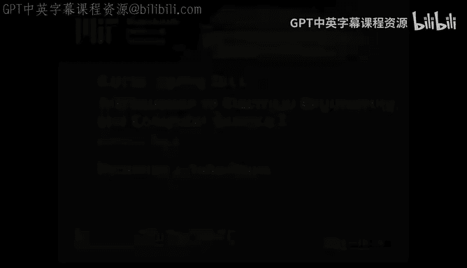

# 003：Python中的继承概念与实践 🐍




在本节课中，我们将学习面向对象编程中的一个核心概念——继承。我们将探讨继承的基本思想，如何在Python中实现它，并了解在6.01课程中使用继承时的一些技巧和常见注意事项。

## 概述：什么是继承？ 🧬

上一节我们介绍了面向对象编程的基础，本节中我们来看看继承。继承是一种将对象按层次结构排列的思想。这样，适用于整个对象组的、非常通用或基本的属性可以在更高的层级指定，然后可以逐步向下深入到更具体的层级。

你可能在生物学分类法中最正式地接触过这种方法：界、门、纲、目、科、属、种。每个物种都具有其所属属的所有属性，而一个科的所有属又具有该科的所有属性，依此类推。

为了更生动地说明，我们以犬种为例。金毛寻回犬是寻回犬的一种，而寻回犬是狗的一个特定种类。你可以根据对狗的了解来推断金毛的普遍特性。例如，所有的狗都会叫，所有的狗都有四条腿。金毛也具有寻回犬的所有属性，它们能够去叼回猎物。金毛还有其特有的属性，这些属性定义了金毛与一般寻回犬的区别。

当我们想要创建具有特定属性，同时又与其他对象共享通用属性的对象时，我们会创建一个新的对象类别，并将具体特性放入这个特定类别中。然后，将我们可以概括的通用部分放入更通用的类别中。这样做可以避免重复编写大量代码，或者避免到处复制粘贴代码以实现代码复用。

使用继承的另一个主要优势是代码更直观。你可以到处引用同一段代码，但反复这样做并不那么直观。将金毛视为寻回犬的子类或子类型，而寻回犬又是狗的子类或子类型，这种思考方式非常方便。

在面向对象编程中讨论这种关系时，金毛是寻回犬的子类或子类，而寻回犬是金毛的父类或超类。同样，狗是寻回犬的父类。

## Python中的继承实践 💻

现在，让我们转向Python中的具体实现。这里有一个非常简短的狗类定义。

```python
class Dog:
    cry = "Bark"

    def __init__(self, name):
        self.name = name

    def greeting(self):
        return "I'm " + self.name + " " + self.cry
```

每个狗都有类属性 `cry`。每个狗都有一个初始化方法，为每只狗赋予一个在初始化时传入的特定名字。每只狗都可以访问类方法 `greeting`，该方法返回一个字符串，内容是“我是[狗的名字]”以及特定的叫声（本例中实际上是类的叫声）。如果你不熟悉字符串中使用加号，它只是一个连接符。

如果创建一个实例 `Lassie`，调用 `Lassie.name` 会指向初始化对象时指定的 `self.name`，所以 Lassie 的名字是 Lassie。同样，如果你输入 `print(Lassie.greeting())` 并回车，应该会返回一个字符串：“I‘m Lassie Bark”。

### 创建子类

现在，我们看看当你想建立一个子类时会发生什么。如果我建立 `Retriever` 类，并想从超类 `Dog` 继承，我会传入 `Dog`。其语法与我想向函数传递参数时使用的语法相同。

```python
class Retriever(Dog):
    pass
```

注意，我这里没有写任何代码。这明确指明了 `Retriever` 实际上不会为 `Dog` 引入任何新属性。它们的类型会不同。如果我创建一个 `Retriever` 对象，它的对象类型将是 `Retriever`，而如果我创建一个 `Dog` 对象，它的类型将是 `Dog`。

当我创建一个 `Retriever` 对象时（比如叫 Benji），它首先会在 `Retriever` 类定义中寻找初始化方法或其他方法或属性。运行这里的所有代码，然后转到父类，运行那里的所有代码。因此，即使 `Retriever` 下面没有任何显式代码，我仍然可以以与 `Lassie` 对象相同的方式与 `Benji` 对象交互。它拥有所有相同的方法和属性。

这就是基本的继承。需要说明的是，如果你这样做，可能一开始就不需要创建子类。如果你在设计自己的代码，并思考组织事物的最佳方式，如果你必须创建一个子类型或子类，而又没有新的方法或属性，或者没有处理这些方法或属性的不同方式，那么这个类别可能实际上并不需要单独存在。你可能为了进行有趣的类型检查而区分它们，但这是我能想到的唯一理由。

### 多级继承

我们已经完成了继承的第一部分，我们将再继承一次，为金毛寻回犬创建一个类。

```python
class Golden(Retriever):
    def greeting(self):
        return "Oh, hi " + Retriever.greeting(self)
```

我再次有了类定义，并指明我将从 `Retriever` 继承。我没有任何初始化或属性赋值，只有一个 `greeting` 的定义。

那么这里会发生什么？我们首先总是寻找初始化方法。`Golden` 没有，所以它会检查 `Retriever` 类。`Retriever` 也没有，所以它会检查 `Dog` 类。初始化方法在这里，所以当它运行初始化方法时，会运行这里的代码。

这里任何代码或属性赋值或方法定义都将被视为任何金毛对象首先要引用的规范。因此，`greeting` 方法将在任何其他地方使用 `greeting` 之前被执行。你注意到这个 `greeting` 和狗的 `greeting` 之间的唯一区别是，在短语前添加了“Oh, hi”。我们实现这一点的方式是，我们先连接字符串，然后引用超类。同样，当我们在类定义中讨论时，必须传入显式参数 `self`。稍后当你实际实例化一个对象并使用它时，你不需要将 `self` 作为参数放入，否则会引起混淆。

假设我创建一只金毛寻回犬 Sydney，我将传入一个参数，即名字。我们将首先考虑这里的所有定义，这意味着金毛将拥有一个在这里指定的 `greeting` 方法。它将使用来自 `Retriever` 的 `greeting` 方法。我们也可以在这里放入任何东西，比如 `Dog.greeting`，或者与 `Golden` 在同一环境中的其他函数。但在这里，我们可以显式地访问我们在这里定义的超类。

我们将转到 `Retriever`，查看是否有任何作为 `Retriever` 子类的结果需要添加到我们定义中的额外方法或属性。这里我们只遇到了 `pass`。另一方面，`Retriever` 继承自 `Dog`，所以我们必须再次跳转到超类，并获取那里定义的任何属性或方法。

回到 Sydney，当我调用 `Sydney.greeting()` 时，发生的第一件事是我在最具体的子类（或我的对象类型）中查找该方法是否有定义。因为这里有定义，所以我不会使用 `Dog.greeting`，而是使用 `Golden.greeting`。`Golden.greeting` 说：返回一个字符串“Oh, hi”，并将其附加到 `Retriever.greeting` 返回的内容上。我转到 `Retriever`，这里没有，但我仍然有对 `Dog` 的引用。我转到 `Dog`，它有一个 `greeting` 方法，它说：“I‘m Sydney Bark”。所以最终的返回类型应该是：“Oh, hi I‘m Sydney Bark”。

## 总结 📚

本节课中我们一起学习了面向对象编程中的继承概念。我们了解到继承允许我们创建层次化的类结构，将通用属性放在父类中，特定属性放在子类中，从而实现代码复用和更直观的设计。在Python中，通过在类定义时在括号内指定父类来实现继承。子类会自动获得父类的方法和属性，并可以重写或扩展它们。我们还通过犬种的例子，演示了从 `Dog` 到 `Retriever` 再到 `Golden` 的多级继承过程，以及方法解析的顺序。理解继承对于阅读和编写6.01课程中使用面向对象范式的代码至关重要。