# 004：编程范式与状态机 🚀

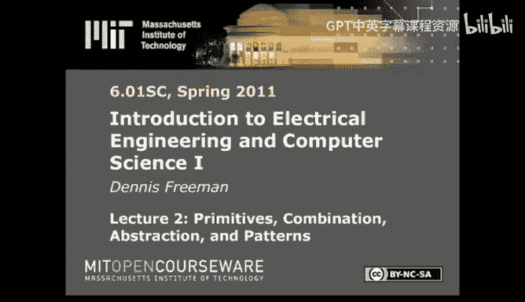

## 概述
在本节课中，我们将学习如何通过不同的编程范式来组织和管理复杂系统的构建。我们将首先回顾PCAP（原语、组合、抽象、模式）的核心思想，然后探讨三种不同的编程风格：命令式、函数式和面向对象编程。最后，我们将引入一个更高级别的概念——状态机，作为构建动态过程（如机器人控制）的模块化工具。

---

## 编程范式：管理复杂性的不同视角

上一节我们介绍了PCAP作为管理复杂性的核心思想。本节中，我们来看看如何通过不同的编程范式来实现这一目标。编程的基本结构会显著影响你构建抽象的能力。

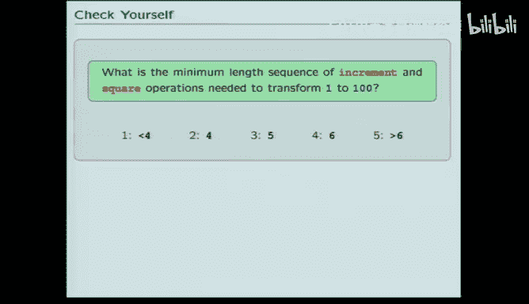

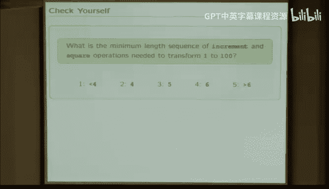

我们将探讨三种构建程序的方法论：

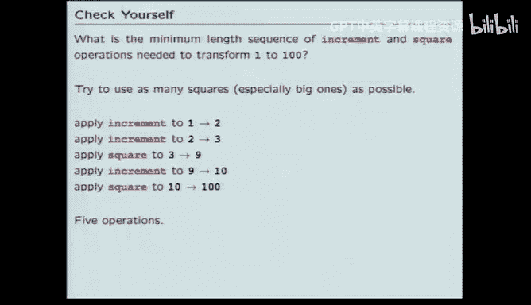

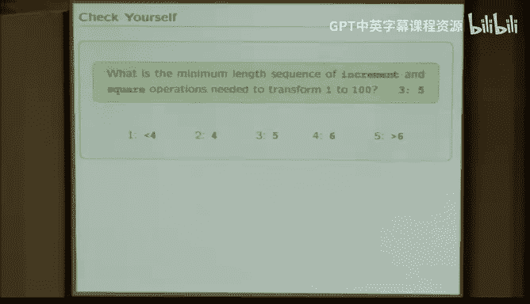

1.  **命令式（过程式）编程**：像遵循食谱一样，专注于“下一步做什么”的逐步指令。
2.  **函数式编程**：关注数学意义上的函数，它们接收输入、产生输出，并且没有副作用（如修改变量）。
3.  **面向对象编程**：围绕数据和相关过程的集合（对象）来组织解决方案，并构建这些对象的层次结构。

为了理解这些范式的区别，我们将通过一个具体问题来展示每种方法。

### 示例问题：寻找操作序列
**问题**：找到一系列操作（“递增”或“平方”），将一个初始整数 `I` 转换成一个目标整数 `G`。
*   **操作**：`increment` (加1) 或 `square` (平方)。
*   **示例**：序列 `increment, increment, increment, square` 作用于 `1` 会得到 `16`。
    *   `1 -> 2 -> 3 -> 4 -> 16`

---

## 命令式（过程式）方法 🧾

命令式方法通过预先设计好的步骤来解决问题，就像一份详细的食谱。

解决上述问题的一个合理步骤是：按长度枚举所有可能的操作序列。先检查所有长度为1的序列，然后长度2，依此类推，直到找到能实现目标的序列。

以下是该思路的关键实现点：
*   使用**元组** `(操作描述字符串, 执行后的结果值)` 来表示一个序列及其结果。
*   程序结构包含**三层嵌套循环**来生成和测试不同长度的序列。

**核心挑战**：保持多层循环中索引的正确性很容易出错，代码的模块化程度较低。

---

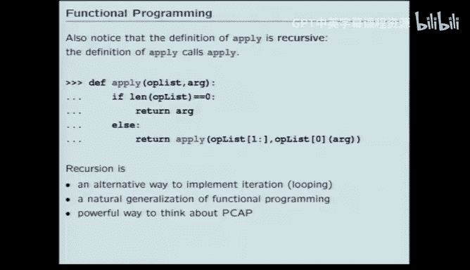

## 函数式方法 🔄

函数式方法将问题分解为多个纯函数（无副作用）的计算模块。

我们定义两个核心函数：
1.  **`apply` 函数**：接收一个**函数列表**和一个初始值，按顺序应用这些函数，返回最终结果。这体现了“函数是一等公民”的思想，即函数可以像数据一样被存储在列表中传递。
    ```python
    # 示例
    apply([], 7) -> 7
    apply([increment], 7) -> 8
    apply([square], 7) -> 49
    apply([increment, square], 7) -> 64
    ```
2.  **`add_level` 函数**：接收一个“序列列表”（每个序列是一个函数列表），并通过为每个现有序列添加 `increment` 或 `square` 操作，生成一个包含所有可能更长序列的新列表。

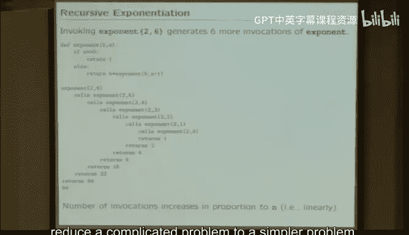

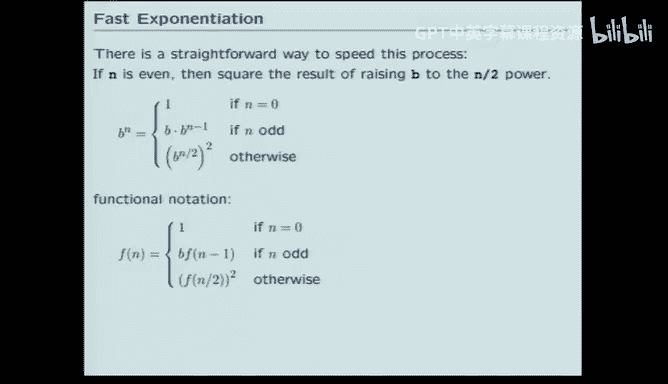

**优势**：
*   **模块化与易调试**：每个函数都是独立的模块，可以单独测试。
*   **表达力强**：自然地支持递归思想，使算法描述更清晰。

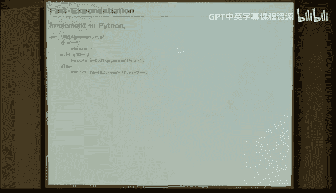

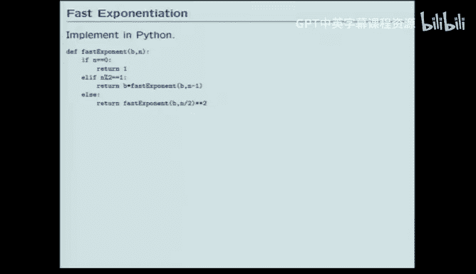

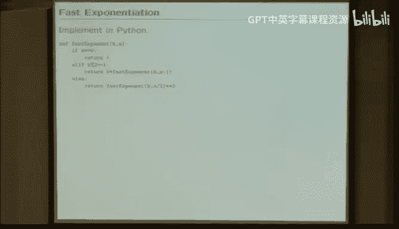

### 递归：强大的表达工具
递归是一种函数调用自身的技术，它将复杂问题逐步简化为已知的基本情况。

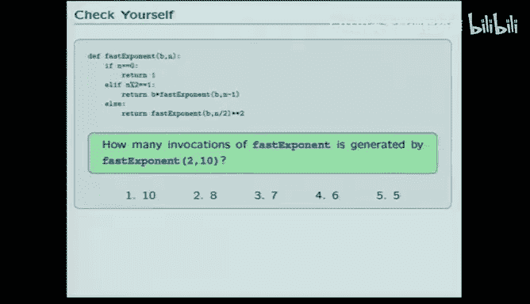

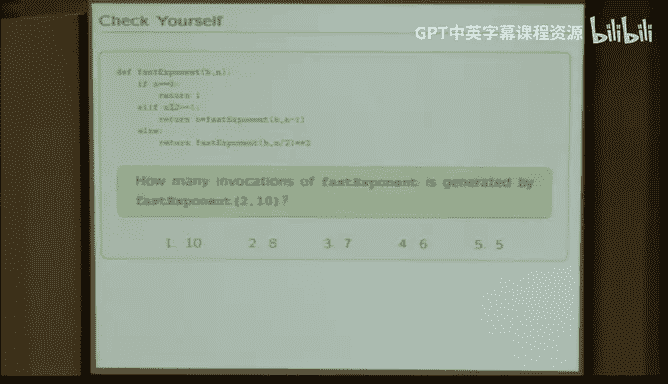

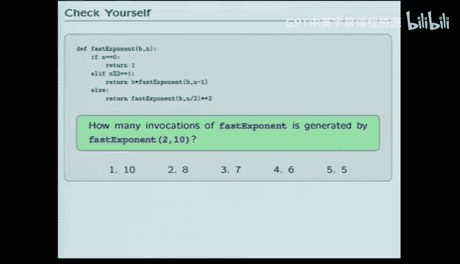

**示例1：线性递归求幂**
```python
def exponent(b, n):
    if n == 0:
        return 1
    else:
        return b * exponent(b, n-1)
```
计算 `b^n` 需要大约 `n` 次递归调用。

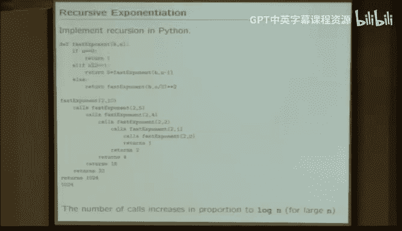

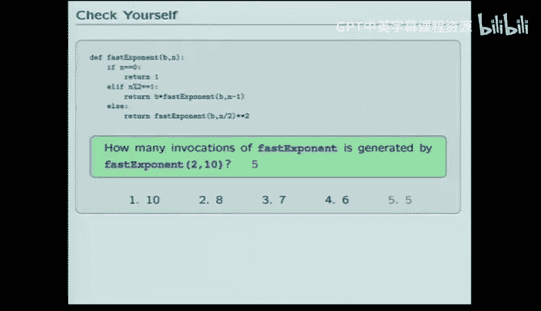

**示例2：快速求幂（利用数学知识）**
通过增加一个判断条件（如果`n`是偶数），可以大幅减少递归步骤，这体现了函数式方法易于融入新规则的优点。
```python
def fast_exponent(b, n):
    if n == 0:
        return 1
    elif n % 2 == 1: # n 是奇数
        return b * fast_exponent(b, n-1)
    else: # n 是偶数
        t = fast_exponent(b, n//2)
        return t * t
```
计算 `b^10` 只需约5次调用，而非10次。

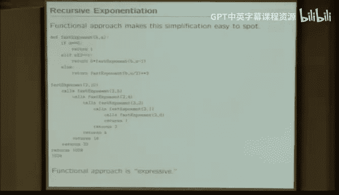

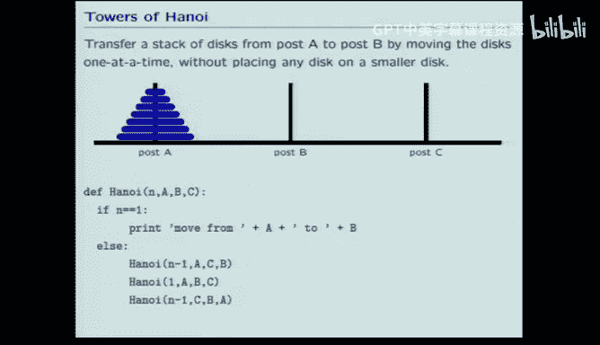

**示例3：汉诺塔问题**
汉诺塔的解决方案用循环描述非常晦涩，但用递归描述则异常简洁：
> 要将 `n` 个盘子从A柱移到B柱：
> 1.  将上面 `n-1` 个盘子从A移到C（借助B）。
> 2.  将最大的盘子从A移到B。
> 3.  将 `n-1` 个盘子从C移到B（借助A）。


递归的核心优势在于其**表达力**，它能将复杂算法用简洁、符合直觉的方式描述出来。

---

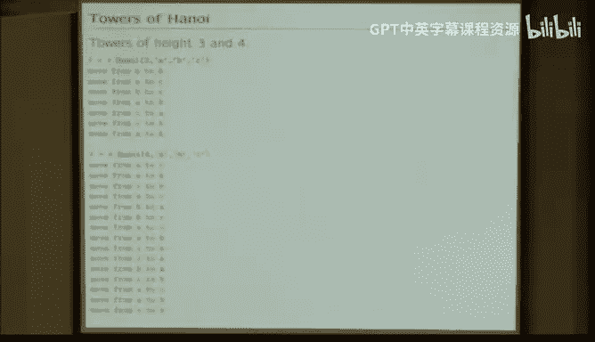

## 面向对象方法 🧱

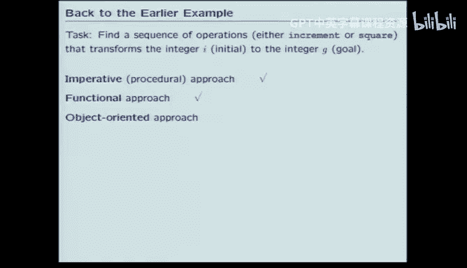

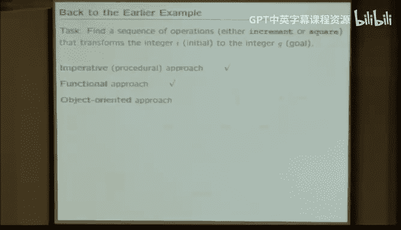

面向对象方法使用对象（数据与方法的集合）来构建解决方案。

对于操作序列问题，我们可以将所有可能的序列想象成一棵**树**：
*   每个**节点**代表一个状态。
*   节点包含：父节点引用、导致此状态的操作、当前状态的结果值。
*   定义一个 `Node` **类**来封装这些信息。
*   程序通过创建和连接`Node`对象来构建这棵树，并搜索目标值。

**优势**：将问题的表示（树形结构）与解决方案逻辑紧密结合，循环结构更简单，因为核心信息都封装在对象内部。

---

## 状态机：对动态过程的高级抽象 ⚙️

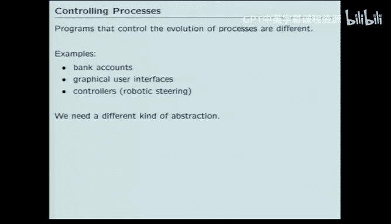

前面我们探讨了在代码层面的模块化。现在，我们将抽象级别再提高一层，思考如何为**随时间演化的过程**（如银行账户、图形用户界面、机器人控制器）建模。我们仍要遵循PCAP原则，但使用新的编程模块——**状态机**。

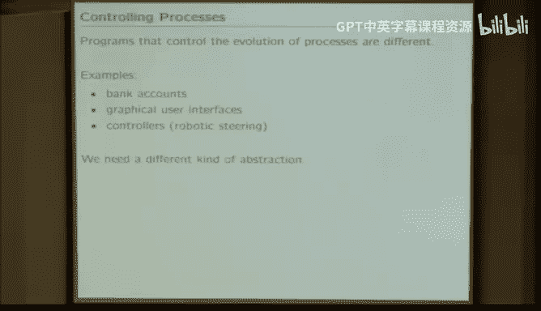

### 什么是状态机？
状态机是描述过程行为的模型，它在每个**步骤**中：
1.  接收一个**输入**。
2.  根据当前**状态**和输入，计算一个**输出**。
3.  更新为下一个**状态**。
状态机通过其**状态**来记忆过去发生的一切必要信息。

**核心要素**：`(输入， 状态， 输出)`

### 示例：十字转门
十字转门是一个经典的状态机例子。
*   **状态**：`锁定` 或 `解锁`。
*   **输入**：`投币`、`推动`、`无`。
*   **输出**：`请付款`、`请通行`。

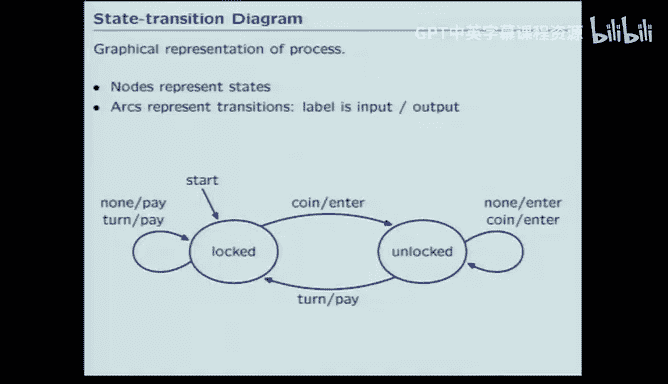

其行为可以用**状态图**清晰描述：
```
        [投币 / 请通行]
     ----------------
    |                |
锁定                 解锁
    |                |
     ----------------
        [推动 / 请付款]
```
（初始状态为`锁定`，`无`输入时保持当前状态并输出相应信息）。

状态机表示法将**时间步进的循环逻辑**与**每一步的状态转换逻辑**分离开，提高了模块性。

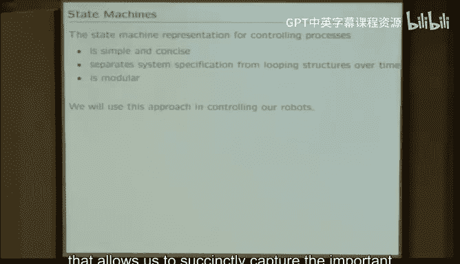

### 状态机在机器人控制中的应用
考虑一个机器人从A点移动到B点的问题，它不知道中途的障碍物。每一步，它：
1.  用传感器（如声纳）探测环境，**更新地图**。
2.  根据最新地图，**规划**一条新路径。
3.  根据规划出的路径，**控制**轮子移动。

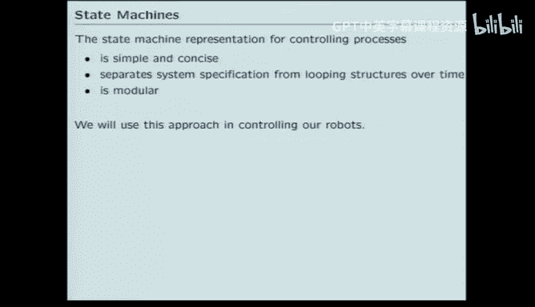

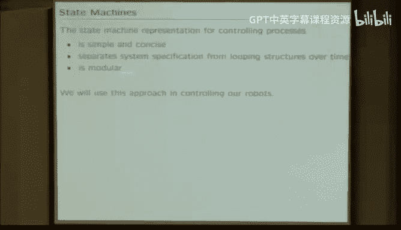

我们可以用三个模块化的状态机来建模这个复杂过程：
*   **`Mapper`（地图构建器）**：输入传感器数据，输出更新后的地图。
*   **`Planner`（路径规划器）**：输入地图，输出规划路径。
*   **`Mover`（运动控制器）**：输入路径，输出轮子控制指令。

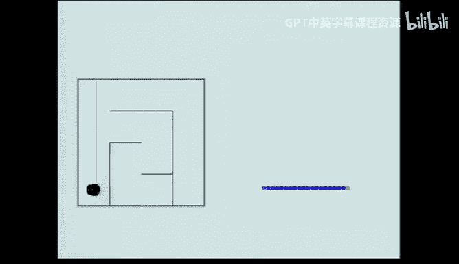

这些状态机可以**独立开发、测试和调试**，最后组合起来形成复杂的机器人行为。这正是模块化的威力所在。

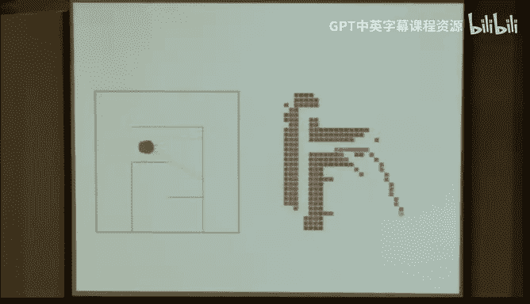

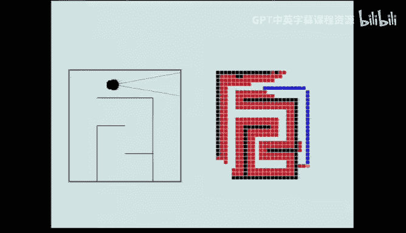

---

## 在Python中实现状态机 🐍

我们将使用面向对象技术，在三个层次上实现状态机：

1.  **通用`StateMachine`类**：定义所有状态机的共同接口。
    *   `start()`: 初始化状态。
    *   `step(输入)`: 执行一步，返回输出。其内部会调用...
    *   `get_next_values(状态, 输入)`: **纯函数**，根据当前状态和输入，计算**下一个状态**和**输出**。这是子类必须定义的核心。
    *   `transduce(输入列表)`: 对一系列输入，返回对应的输出列表。

2.  **特定状态机子类**（如`Accumulator`累加器，`Turnstile`十字转门）。
    *   定义 `start_state`。
    *   实现 `get_next_values` 方法。

3.  **状态机实例**：子类的具体对象（如“中央地铁站的第一个转门”）。

**示例：`Accumulator` 累加器**
```python
class Accumulator(StateMachine):
    start_state = 0
    def get_next_values(self, state, inp):
        next_state = state + inp
        return (next_state, next_state)
```
这个状态机将输入值不断累加到状态上，并将新状态作为输出。

### 状态机的组合
我们可以像组合电路一样组合状态机，这是PCAP中“组合”的体现：
*   **级联**：一个状态机的输出作为另一个的输入。
*   **并行**：多个状态机处理相同的输入。
*   **反馈**：将输出作为输入的一部分反馈回去。

**示例：两个累加器级联**
如果 `A` 和 `B` 都是累加器，`C` 是 `A` 和 `B` 的级联。
输入 `[7, 3, 4]` 到 `C`：
1.  `A` 处理：`[7, 10, 14]` (输出序列)。
2.  `B` 接收 `A` 的输出作为输入：`[7, 17, 31]`。
因此，`C.transduce([7,3,4])` 的结果是 `[7, 17, 31]`。

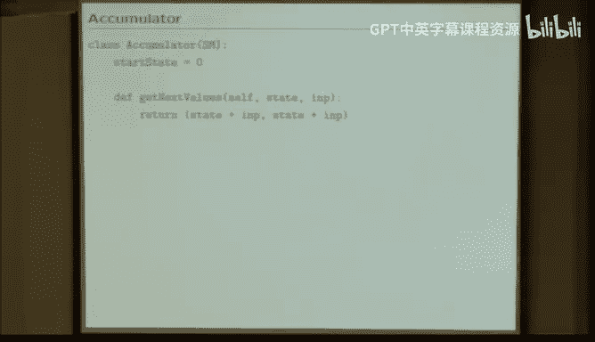

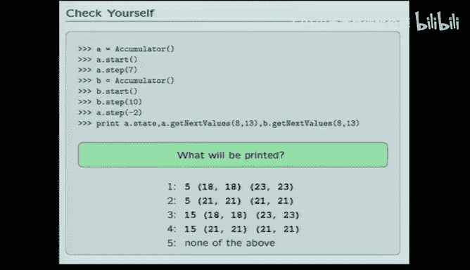

通过这种方式，我们可以用简单的状态机构建出复杂的大脑。

---

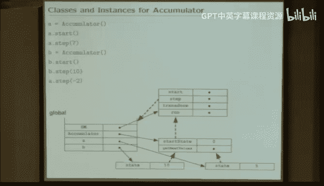

## 总结 🎯

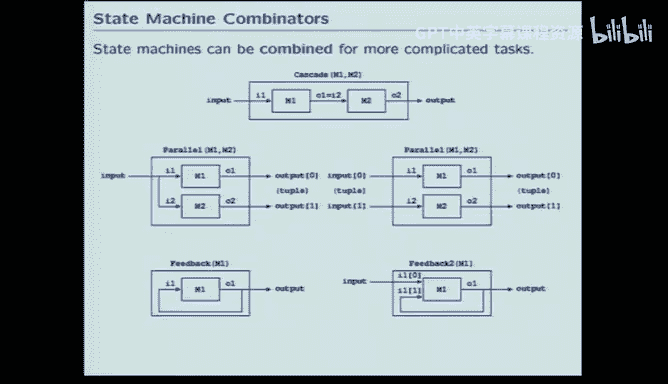

本节课中我们一起学习了：
1.  **三种编程范式**：命令式、函数式和面向对象编程，它们以不同的方式组织代码，影响模块化和抽象能力。
2.  **递归的强大表达力**：它使某些算法（如汉诺塔）的描述变得异常简洁。
3.  **状态机**：作为对动态过程进行高级抽象和模块化设计的强大工具。状态机通过`（输入，状态，输出）`模型，将时间逻辑与业务逻辑分离。
4.  **状态机的实现与组合**：在Python中通过类层次结构实现，并可以通过级联、并行等方式组合，从而构建复杂的系统（如机器人控制系统）。

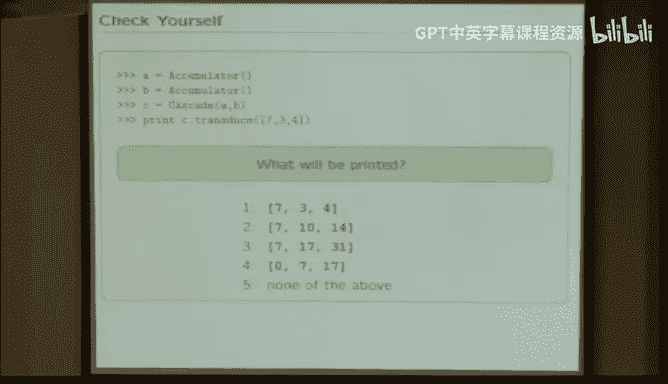

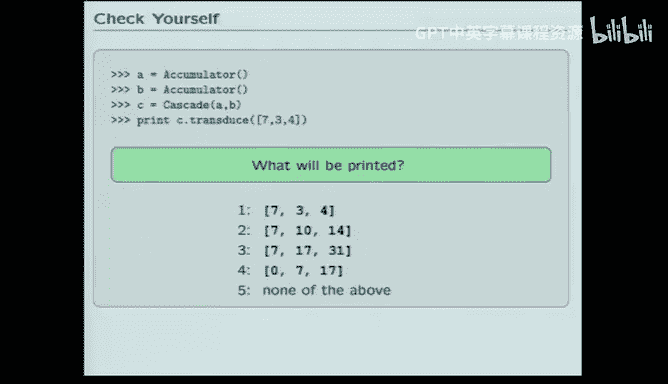

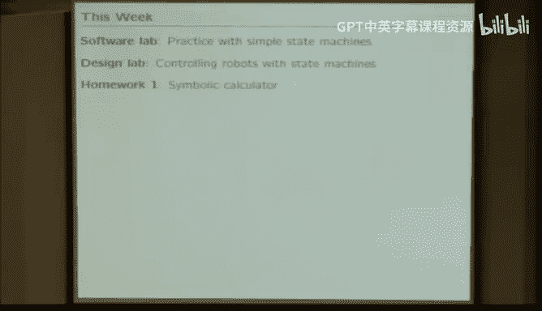

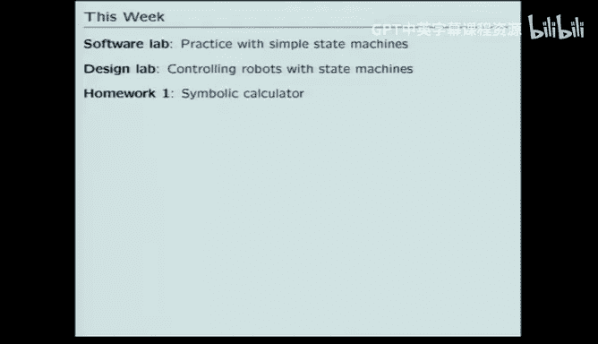


掌握这些概念和工具，将帮助你更好地管理复杂性，构建更清晰、更健壮、更易维护的软件系统。