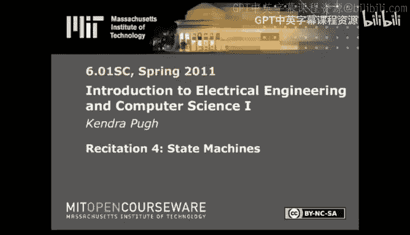

# 006：状态机 🧠

在本节课中，我们将学习状态机这一核心概念。状态机在控制理论、人工智能和可计算性理论等领域都至关重要。我们将回顾已学的编程范式，解释为何需要状态机来为模型增加复杂性，并探讨状态机在不同领域的表示方法，最后介绍如何在课程软件中使用状态机。

## 回顾已学编程范式

上一节我们介绍了不同的编程范式。到目前为止，我们讨论了函数式、命令式和面向对象编程范式。

*   在**函数式编程**中，一切皆是函数。
*   在**命令式编程**中，我们可以使用函数，但也允许函数产生副作用。
*   在**面向对象编程**中，一切皆是对象。

我们可以用前两种范式来实现最后一种，也可以用第一种范式加上变量赋值等概念来实现第二种。这体现了计算机科学语言范式的演进脉络。

然而，这些范式本身都无法让我们维护**内部状态**。所谓内部状态，是指我们希望建模的系统能够随时间推移而演化，或能追踪系统中随时间累积的数据。函数式编程无法做到这一点，因为它接受一个输入，产生一个输出。虽然可以编写一个函数来处理所有可能的情况并产生逻辑输出，但这将导致代码量巨大。命令式和面向对象编程同样无法单独解决这个问题。我们需要的是能够审视随时间发生的一切事件和所有数据，对其进行综合处理，然后生成相应输出的能力。这就是内部状态的概念。

## 状态机的基本概念

状态机，也称为离散有限自动机，已经存在很长时间。本课程主要讨论离散状态机。在数学文献中，状态机或离散有限自动机通常由五个要素定义：

1.  **状态集合**：状态机可能处于的所有状态的集合。
2.  **输入集合**：状态机可能接收的所有输入的集合。
3.  **输出集合**：状态机可能产生的所有输出的集合。
4.  **转移函数**：该函数查看当前状态和当前输入，确定因此次转移将进入的下一个状态以及将产生的输出。
5.  **起始状态**：状态机开始运行时的初始状态。

为了更具体地理解，我们来看一个状态转移图。

## 状态转移图示例

假设有一个地铁旋转闸门（MBTA turnstile）。它有四个状态：

*   **关闭**：闸门关闭，等待交互。
*   **开放且愉快**：因投入钱币而开放。
*   **开放且安静**：通常因前一个人的交互而开放。
*   **开放且愤怒**：因不当交互而开放。

在这个有向图中，**顶点**就是我们的状态集合。假设起始状态为“关闭”（通常用一个从无处指向某个状态的箭头表示）。

现在，我们需要输入和输出。向闸门投币构成**输入**。**转移函数**会查看当前状态和当前输入，生成**输出**和**下一个状态**。图中的所有**箭头**（除了包含目标顶点信息外）就指定了我们的转移函数。任何未指定的转移都不在函数考虑范围内。

以下是状态转移过程示例：

1.  起始状态为“关闭”。
2.  有人通过闸门**退出**（输入：“退出”）。输出：“无”。新状态：“开放且安静”。
3.  此时，我尝试**进入**（输入：“进入”）。输出：“发出噪音”。新状态：“开放且愤怒”。
4.  随后，闸门会自动**关闭**（输入：无或任何输入）。输出：“关闭”。新状态：“关闭”。

总结一下映射关系：
*   **状态集合**：图中的顶点。
*   **输入集合**：转移边上标注的第一部分。
*   **输出集合**：转移边上标注的第二部分（作为转移的结果）。
*   **转移函数**：由有向边及其标注表示。
*   **起始状态**：指定的开始顶点。

## 在软件中实现状态机

一旦理清了所有这些集合，就可以讨论如何在软件中实现状态机了。课程库已经对此进行了抽象，但你需要知道如何与之交互。

让我们看一个状态机类的例子。假设我们要构建一个**累加器**，它在每个时间步查看输入，将其与此前所有输入值相加，然后输出新值并将其保留为新状态。

首先，需要用初始值初始化累加器，这就是我们的**起始状态**。我们还需要一个 `getNextValues` 方法，它在功能上等同于**转移函数**。

`getNextValues` 方法会查看当前状态和当前输入，进行一些内部数据处理（例如乘以2，或与先前输入比较并根据条件判断等）。对于前几周的内容，这通常是一个简单的函数。然后，它返回一个包含新状态和输出的元组。

对于这个累加器，新状态和输出都是当前状态与当前输入的线性组合。

如果用状态转移图表示这个累加器，会是这样的：起始状态是初始值。传入一个新输入（称为 input0）后，输出和新状态都是这两个值的线性组合。进行下一次转移时，会取下一个输入，将其与当前状态值相加并作为输出返回，依此类推。

鼓励你在 Python（或课程指定的 IDE）中尝试此操作。你可能需要输入 `import lib601` 来获取状态机类。除此之外，这些内容足以让你开始学习状态机。

## 总结

本节课我们一起学习了状态机。我们回顾了函数式、命令式和面向对象编程范式的局限性，引出了对内部状态的需求。我们详细介绍了状态机的五个核心组成部分：状态集合、输入集合、输出集合、转移函数和起始状态，并通过地铁闸门的例子，用状态转移图直观地展示了这些概念。最后，我们探讨了如何在软件中实现一个简单的累加器状态机，并鼓励你通过实践来加深理解。如果你遇到困难，强烈建议阅读课程材料中的所有示例，它们非常全面，也包含了累加器的例子。

下次课，我们将讨论线性时不变系统。