# 010：反馈系统与极点分析 🧠

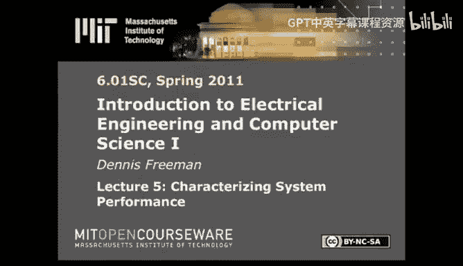

以下内容基于知识共享许可协议提供。您的支持将帮助麻省理工学院开放式课程网站继续免费提供高质量教育资源。如需捐款或查看来自数百门麻省理工学院课程的更多材料，请访问 MIT OpenCourseWare 网站。

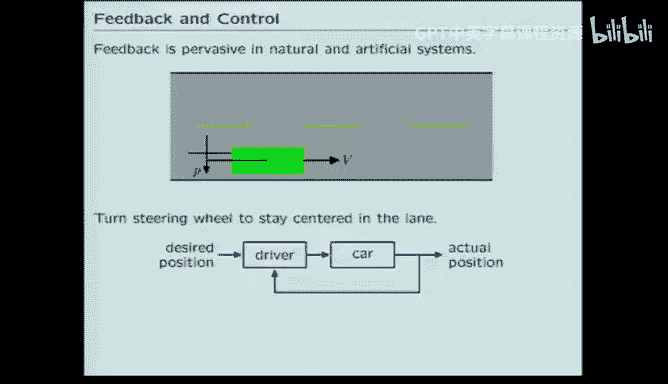

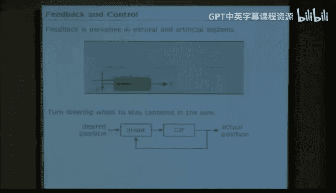

## 概述
在本节课中，我们将学习如何运用信号与系统的方法来分析反馈系统。我们将探讨反馈的普遍性，学习如何使用算子方法简化系统分析，并最终引入“极点”这一核心概念来定量表征系统的性能。通过极点，我们可以预测系统对瞬态信号的响应是收敛、发散还是振荡。

## 反馈无处不在
反馈在我们的生活中无处不在。例如，当你驾驶汽车并试图保持在车道中央时，你就在进行反馈控制：你不断比较当前位置与期望位置，并据此做出微小调整。

另一个简单例子是房屋内的恒温器。当温度下降时，恒温器会启动加热系统进行补偿，以维持设定温度。

生物学中也充满了精妙的反馈调节。例如，人体通过胰岛素等激素的反馈系统，将血糖浓度精确维持在每升2到10毫摩尔的狭窄范围内。考虑到饮食和运动的间歇性，这种调节的精度令人惊叹。

即使是拧灯泡这样简单的任务，也依赖于来自触觉、本体感觉和肌肉应力传感器的反馈，以防止用力过猛而损坏灯泡。

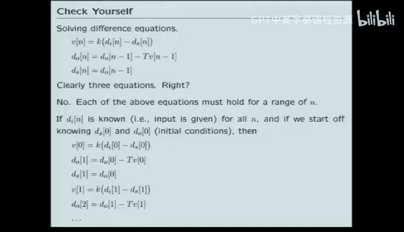

## 在信号与系统框架中分析反馈
我们希望将反馈系统纳入信号与系统的框架中进行分析。以上周设计实验室中的“寻墙”问题为例，该系统试图让机器人与墙壁保持固定距离。我们将其建模为一个由控制器、被控对象和传感器三部分组成的反馈系统，并用差分方程描述各部分。

为了让大家跟上思路，这里有一个关于“寻墙”问题方程组的问题。

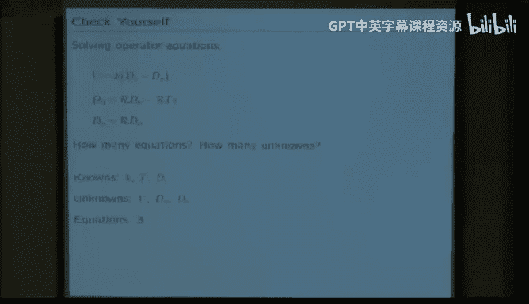

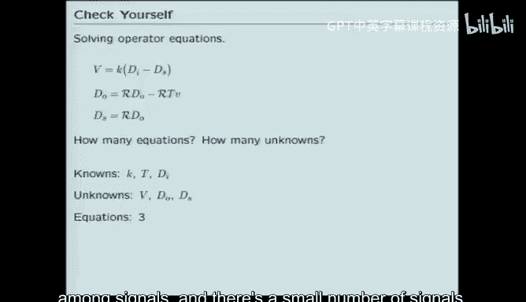

以下是描述“寻墙”问题的方程：
*   `v[n] = K * e[n]`
*   `d_o[n] = d_o[n-1] + T * v[n-1]`
*   `d_s[n] = p * d_o[n]`
*   `e[n] = d_i[n] - d_s[n]`

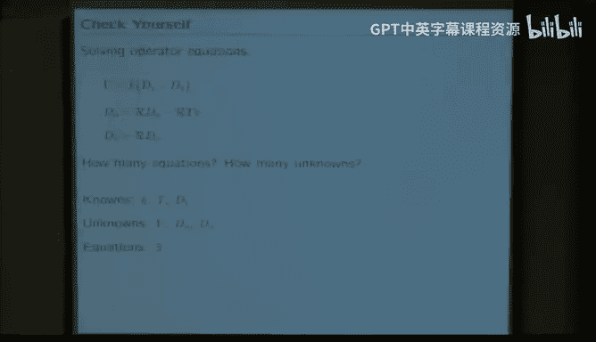

其中 `T` 和 `K` 是已知参数。这个方程组有多少个方程和未知数？

如果采用逐样本的代数方程视角，我们需要为每个 `n` 值列出方程，因此会得到无限多个方程和无限多个未知数。这种方法非常复杂。

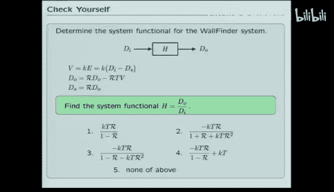

## 算子方法：简化复杂性
相比之下，如果我们采用算子方法，将整个信号视为一个整体，情况会大大简化。

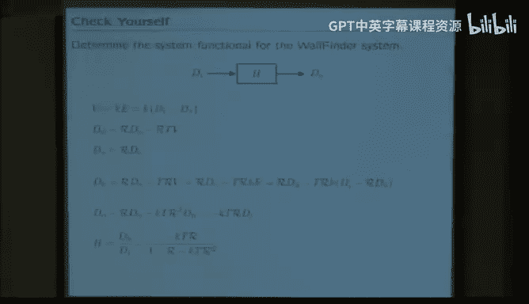

在算子视角下，已知量是参数 `K`、`T` 以及输入信号 `D_i`。未知量是三个完整的信号：速度 `V`、机器人输出 `D_o` 和传感器信号 `D_s`。这样，我们就得到了三个方程和三个未知数。

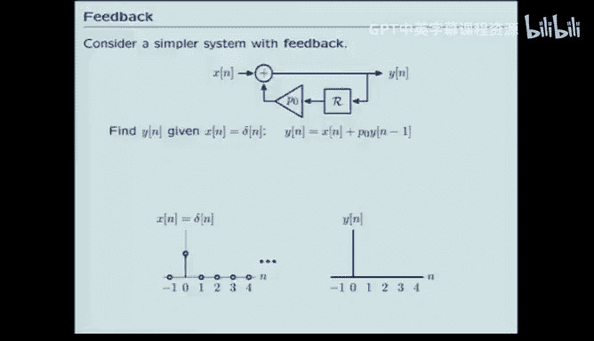

算子方法的核心价值在于降低复杂性。它让我们能够专注于信号之间的关系，这种关系现在由一个称为**系统函数**的算子 `H` 来表示。我们通常将 `H` 视为 `R` 的多项式之比，即 `H = Y / X`。

## 计算系统函数
现在，让我们对“寻墙”系统应用算子方法。思考以算子形式表示的各组件方程，并计算出该系统的系统函数 `H`，即用 `R` 的多项式之比表示。

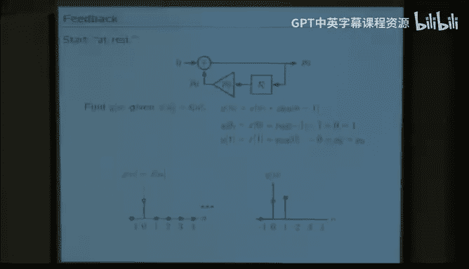

通过代数运算（将算子视为代数符号处理），我们可以求解出 `H`。从第二个方程开始，逐步代入，最终得到 `D_o` 和 `D_i` 的关系，从而解出比值。

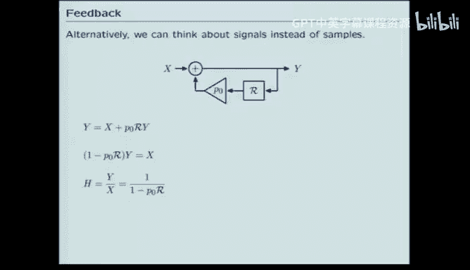

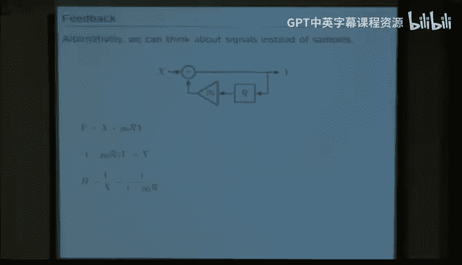

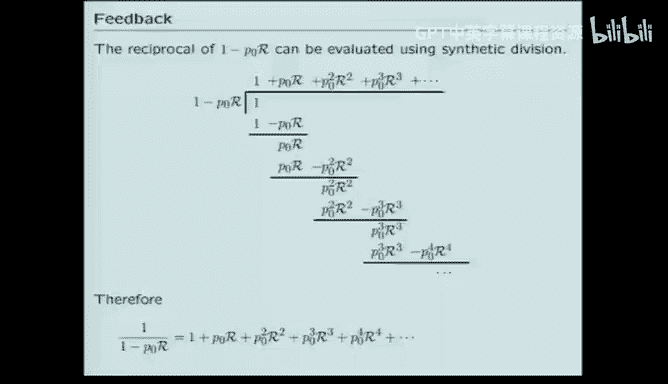

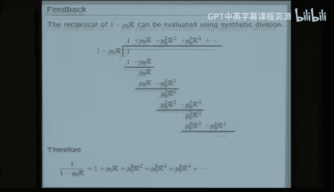

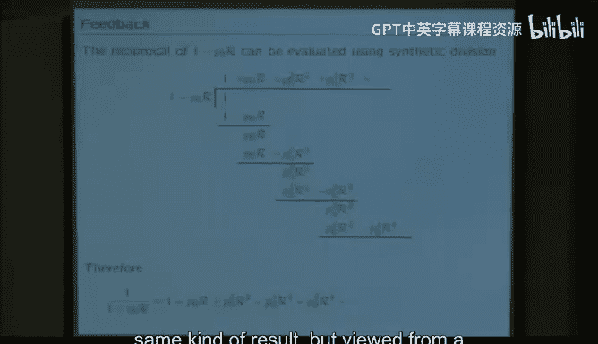

计算过程如下：
1.  由 `v[n] = K * e[n]` 得 `V = K * E`
2.  由 `e[n] = d_i[n] - d_s[n]` 且 `d_s[n] = p * d_o[n]` 得 `E = D_i - p * D_o`
3.  由 `d_o[n] = d_o[n-1] + T * v[n-1]` 得 `D_o = R * D_o + T * R * V` （这里 `R` 是延迟算子）
4.  代入 `V` 和 `E`，最终得到 `H = D_o / D_i = (K T R) / (1 - R + p K T R^2)`

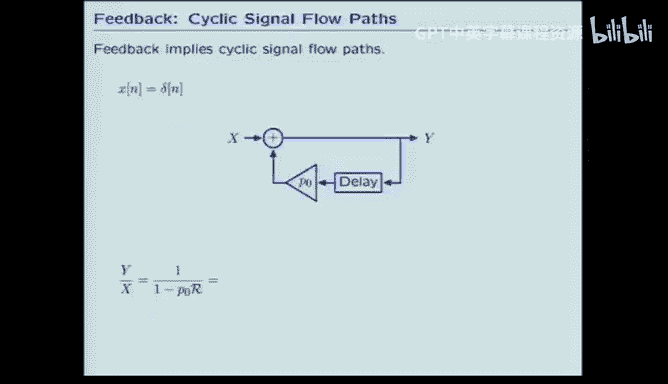

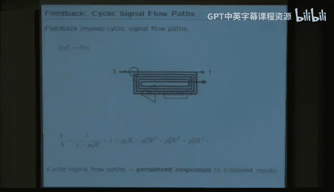

因此，正确答案是选项三。这表明我们可以像处理代数一样处理算子，从而带来巨大的简化。

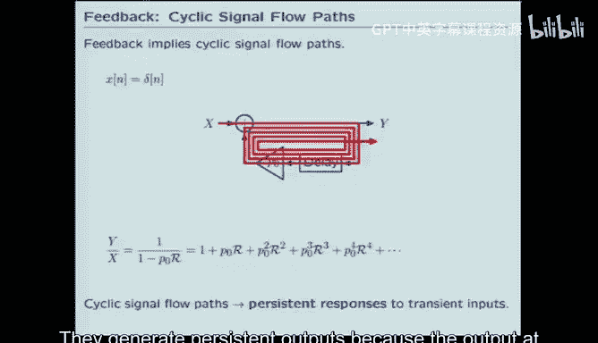

## 从简单系统入手：一阶反馈系统
我们最终希望理解系统函数 `H` 与系统实际行为（如单调、振荡等）之间的关系。为了分析更复杂的系统，我们采用自底向上的方法：先从最简单的行为（原语）开始，然后组合它们以理解更复杂的事物。

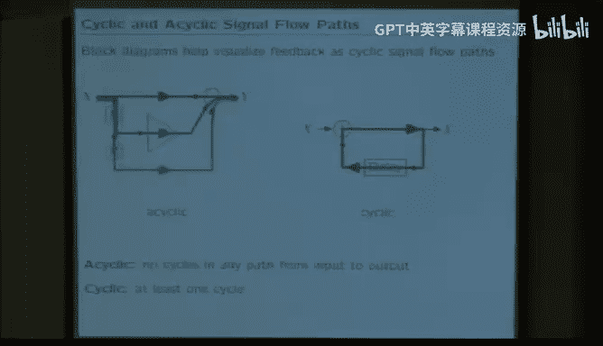

考虑一个非常简单的反馈系统，它包含一个延迟环节和一个增益为 `P` 的放大器。

我们假设系统初始处于**静止状态**（所有延迟框的输出为零），并输入一个单位采样信号 `δ[n]`。通过逐样本推导或算子分析，可以求出输出 `y[n]`。

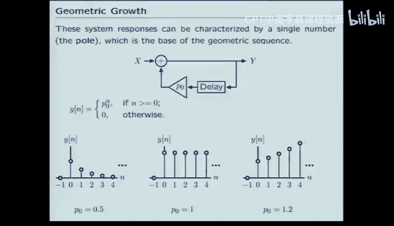

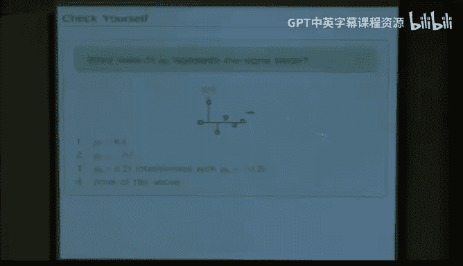

**逐样本推导**：
*   `n=0`: 输入为1，延迟输出为0，所以 `y[0] = 1`
*   `n=1`: 之前的输出1经过延迟和增益 `P` 变为 `P`，当前输入为0，所以 `y[1] = P`
*   `n=2`: 之前的输出 `P` 经过延迟和增益 `P` 变为 `P^2`，所以 `y[2] = P^2`
*   ...
*   规律：`y[n] = P^n` （当 `n>=0`）

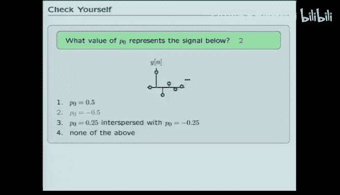

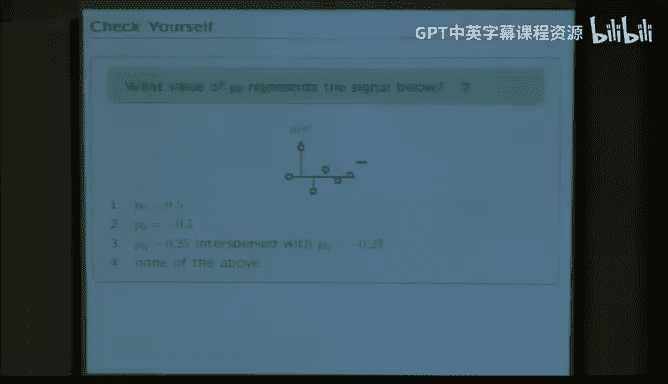

**算子分析**：
系统方程可写为：`Y = X + P R Y`
解得系统函数：`H = Y / X = 1 / (1 - P R)`
将 `1/(1-PR)` 展开为幂级数：`1 + P R + P^2 R^2 + P^3 R^3 + ...`
这对应于输出信号：`y[n] = P^n` （当 `n>=0`），与逐样本结果一致。

## 框图与反馈的本质
从框图的信号流角度，可以可视化这个结果。系统函数展开式的每一项对应一条从输入到输出的路径：
*   `1` 对应直接路径（无延迟）。
*   `P R` 对应经过一次反馈循环的路径（一次延迟和一次乘以 `P`）。
*   `P^2 R^2` 对应经过两次反馈循环的路径，以此类推。

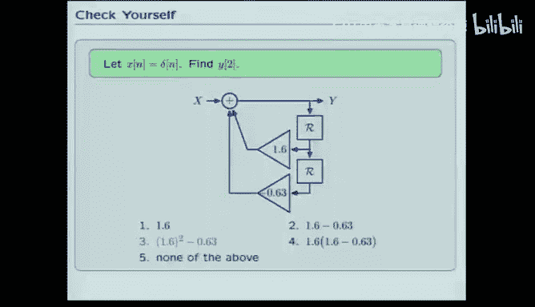

这个流程图揭示了一个关键点：**循环流路径**的存在。反馈意味着信号可以回流，形成循环。这使得即使像单位采样这样的瞬态输入，也能产生持续不断的输出。这是反馈系统的一个基本特性。

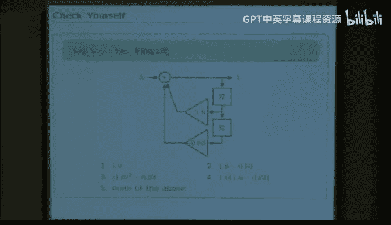

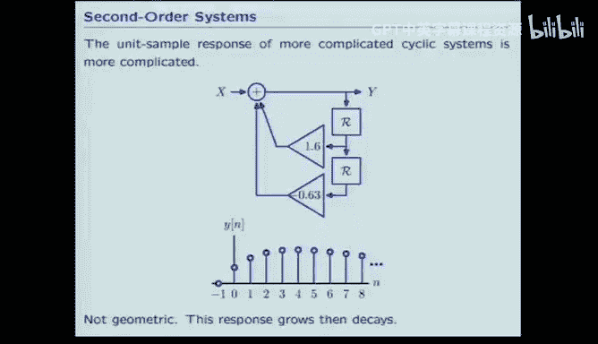

系统可以分为两类：
*   **前馈系统**：信号流图中没有循环路径。瞬态输入产生瞬态输出。
*   **反馈系统**：信号流图中存在循环路径。瞬态输入可能产生持续（甚至无限）的输出。

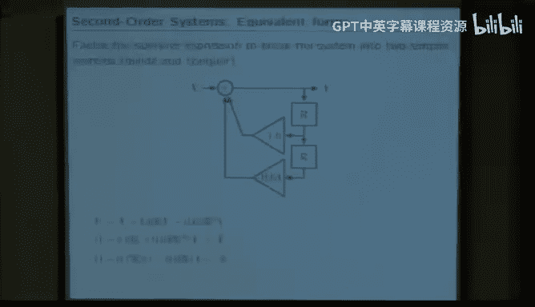

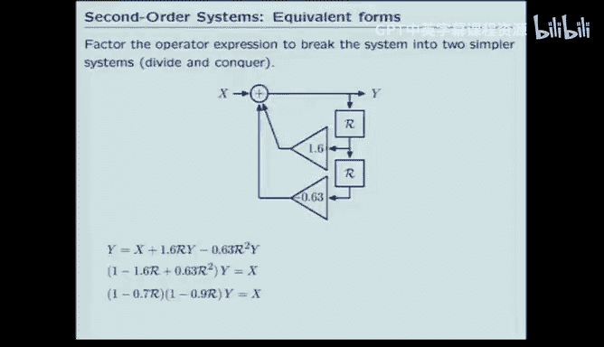

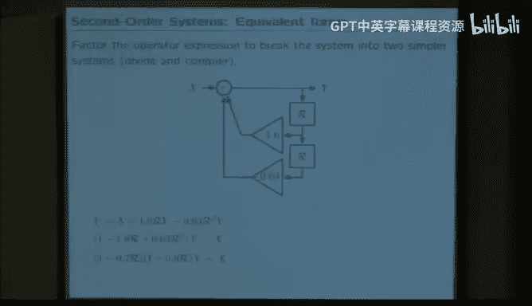

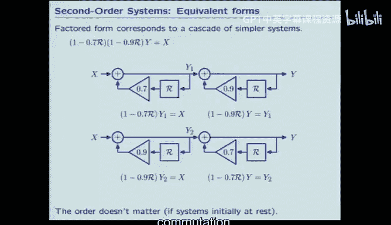

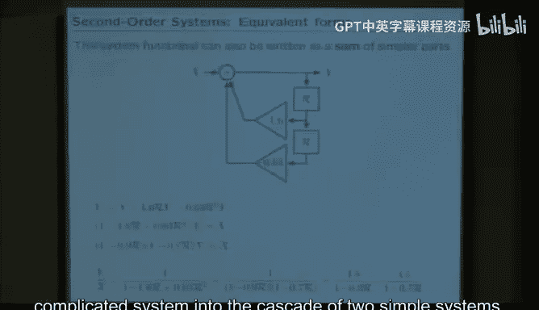

## 极点的概念
对于只有一个反馈环路的简单系统，其行为完全由环路增益 `P` 决定。每次循环，信号幅度乘以 `P`。这个 `P` 值我们称之为系统的**极点**。

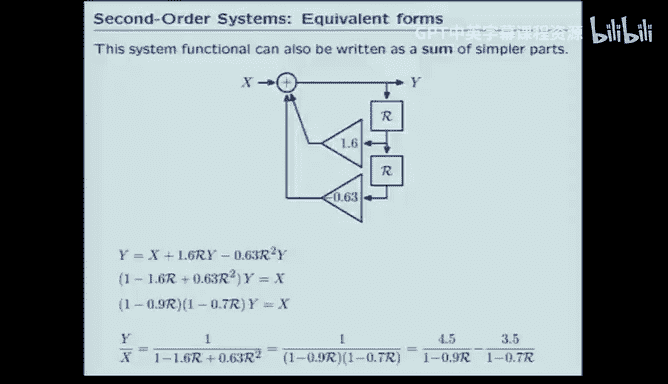

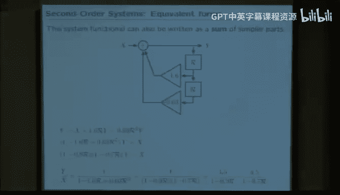

极点决定了系统对单位采样信号的响应模式：
*   `|P| > 1`：响应幅度发散（增长）。
*   `|P| < 1`：响应幅度收敛（衰减至零）。
*   `P > 0`：响应符号不变（单调）。
*   `P < 0`：响应符号交替（振荡）。

因此，对于一个单极点系统，所有可能的行为都包含在下图中。这是一个非常强大的结论：我们完全刻画了这个简单系统的所有动态特性。

## 扩展到高阶系统：分解与部分分式
上一节我们分析了一阶系统，那么更复杂的系统呢？考虑一个二阶系统，其差分方程为：`y[n] = 1.6 y[n-1] - 0.63 y[n-2] + x[n]`。

如果计算其单位采样响应，会发现它先增长后衰减，并不像简单的几何序列。这是否意味着先前的理论失效了？

并非如此。关键在于，我们可以利用**算子与多项式同构**这一强大工具。对于上述系统，其系统函数为：
`H = 1 / (1 - 1.6 R + 0.63 R^2)`

根据代数中的因式定理，我们可以对分母进行因式分解：
`H = 1 / ((1 - 0.9 R)(1 - 0.7 R))`

这意味着，这个复杂的二阶系统可以看作是两个一阶系统的**级联**。更进一步，我们可以使用**部分分式展开法**将其分解为两个简单分式的和：
`H = 4.5/(1 - 0.9 R) - 3.5/(1 - 0.7 R)`

这个结果的系统意义非常深刻：**该复杂系统的单位采样响应，可以表示为两个几何序列（分别以0.9和0.7为底）的加权和**。尽管响应看起来复杂，但其本质仍是简单几何序列的组合。

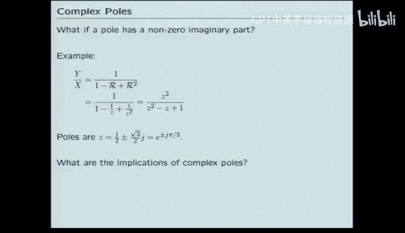

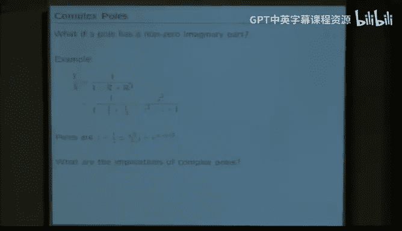

## 一般性结论：极点与模态
这个结论可以推广到一般情况。任何由加法器、增益器和延迟器构成的线性常系数差分方程系统，其系统函数都可以表示为 `R` 的两个多项式之比：
`H = (多项式_B(R)) / (多项式_A(R))`

通过因式分解和部分分式展开，系统的单位采样响应总可以写成若干几何序列之和的形式：
`y[n] = C1 * p1^n + C2 * p2^n + ... + Ck * pk^n`
其中 `p1, p2, ..., pk` 是分母多项式 `多项式_A(R)` 的根，也就是系统的**极点**。每个极点 `p_i` 对应的几何序列 `p_i^n` 称为一个**模态**。

因此，**知道了一个系统的极点，我们就知道了其响应模态的基本形状（增长/衰减，振荡频率）**。常数 `C_i` 可以通过初始条件确定。

求极点的一个实用技巧是进行变量代换 `R = 1/z`，将系统函数转化为 `z` 的多项式之比，然后求分母多项式的根。这些根就是极点。

## 复极点与振荡
在代数中，多项式的根可能是复数。在系统分析中，这意味着极点可以是复数值。例如，系统函数 `H = 1 / (1 - R + R^2)` 的极点就是复数：`0.5 ± j*(√3/2)`。

这会产生复数值的模态 `p^n`。对于实系数系统，如果有一个复极点，则其共轭复数也必然是极点。这两个共轭复极点对应的模态会相互“合谋”，使得总输出的虚部抵消，最终产生**实数的正弦振荡输出**。

将复极点 `p` 用极坐标表示非常有用：`p = r * e^(jω)`。那么模态 `p^n = r^n * e^(jωn)`。这里：
*   `r` 是极点的**幅度**，决定模态的衰减(`r<1`)或增长(`r>1`)。
*   `ω` 是极点的**角度**，决定模态的振荡频率（周期 `T = 2π/ω`）。

这种表示法将幅度和角度的影响分离开，便于分析。例如，观察一个衰减振荡的响应曲线，我们可以估算出 `r` 略小于1，并根据振荡周期估算出 `ω`。

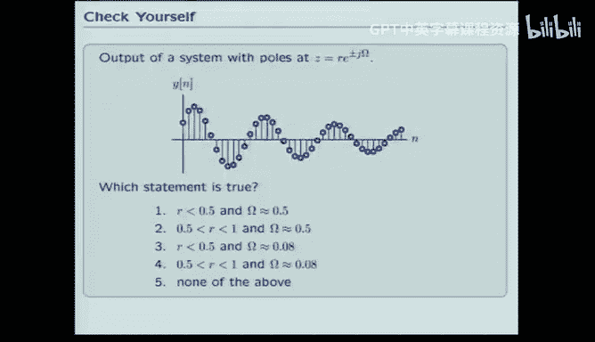

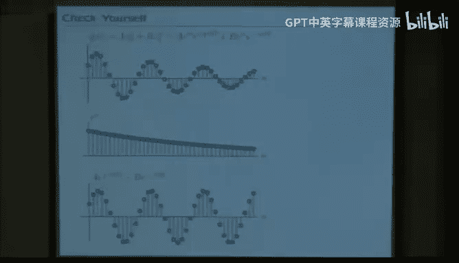

## 应用实例：斐波那契数列
让我们用极点分析法重新审视著名的斐波那契数列。斐波那契数列的差分方程为：`y[n] = y[n-1] + y[n-2] + x[n]`，其中 `x[n]` 是单位采样信号，用于提供初始条件 `y[0]=1`。

按照标准步骤：
1.  写出算子方程：`Y = R Y + R^2 Y + X`
2.  得到系统函数：`H = Y / X = 1 / (1 - R - R^2)`
3.  代换 `R=1/z`：`H = z^2 / (z^2 - z - 1)`
4.  求分母多项式的根（极点）：`z = (1 ± √5)/2`

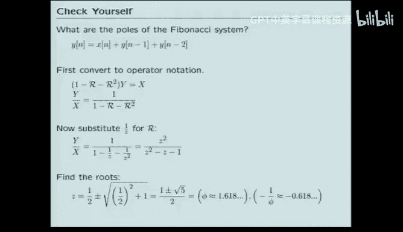

这两个极点是：
*   `p1 = (1 + √5)/2 ≈ 1.618` （黄金比例）
*   `p2 = (1 - √5)/2 ≈ -0.618`

因此，斐波那契数列的通项公式可以写成：`y[n] = C1 * p1^n + C2 * p2^n`。通过初始条件可以解出 `C1` 和 `C2`，最终得到我们熟知的闭式解。这个例子展示了极点分析法如何为经典问题提供一个全新而强大的视角。

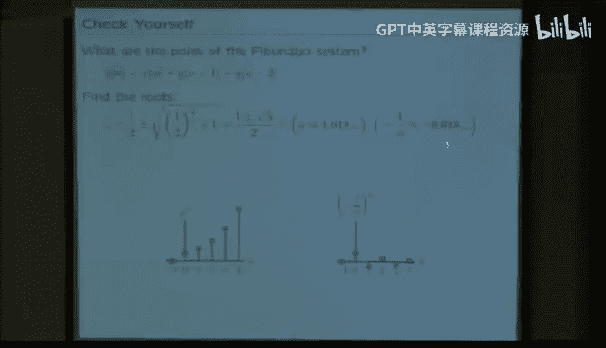
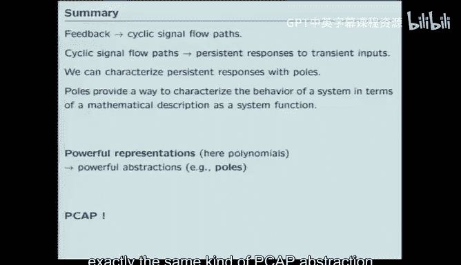

## 总结
本节课我们一起深入学习了信号与系统框架下的反馈分析。
1.  我们认识到反馈的普遍性和重要性。
2.  我们引入了**算子方法**，将系统视为输入到输出的变换 `H`，这极大地简化了复杂系统的描述和分析。
3.  我们从最简单的单极点反馈系统入手，引入了**极点**的概念，并看到极点完全决定了系统的响应模式（收敛/发散，单调/振荡）。
4.  我们将分析推广到高阶系统，利用**因式分解**和**部分分式展开**，证明了任何此类系统的响应都可以分解为多个简单几何序列（模态）的加权和，每个模态对应一个极点。
5.  我们探讨了**复极点**的情况，并解释了它们如何产生实数的正弦振荡，以及如何用极坐标（幅度 `r` 和角度 `ω`）来直观理解振荡的衰减和频率。
6.  最后，我们以**斐波那契数列**为例，展示了极点分析法如何为传统问题提供简洁而深刻的洞察。

通过引入极点这一核心概念，我们获得了一种定量分析和预测线性反馈系统行为的强大工具。