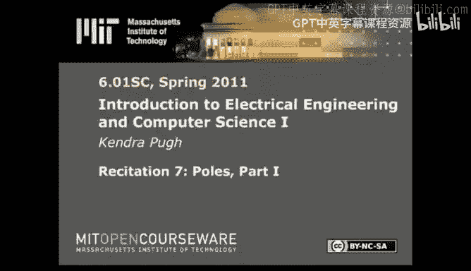
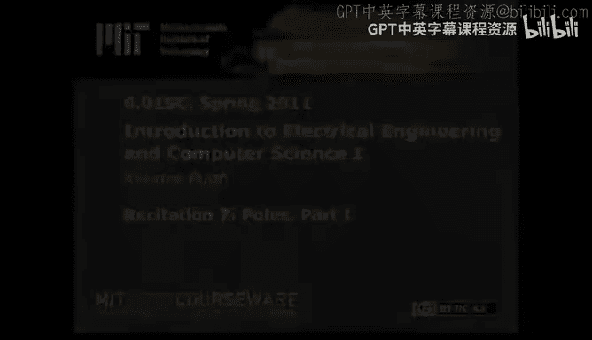

# 011：极点分析 🧮

在本节课中，我们将要学习系统分析中的一个核心概念——极点。我们将探讨如何求解极点，以及如何利用极点的信息来预测系统的长期行为。

上一节我们介绍了线性时不变系统的表示与操作，特别是前馈系统与反馈系统之间的关系。本节中，我们将基于这种关系，深入探讨如何通过极点来分析系统的长期响应。

## 系统回顾：前馈与反馈

首先，快速回顾一下。上次我们讨论了前馈系统。需要强调的是，如果你给前馈系统一个瞬态输入，你只会得到一个瞬态响应。前馈系统无法将信息保留超过你输入信息的时间步长。

反馈系统则不同，它能对瞬态输入产生持续响应。因为反馈系统的工作原理，你输入的信息可以反映在不止一个时间步长上，具体取决于系统中延迟单元的数量。

上次我们还画出了前馈系统与反馈系统之间的关系。实际上，你可以将一个反馈系统，描述为一个接收无限个输入样本，并通过一个包含无限延迟的求和过程的前馈系统。这种转换可以用一个几何序列来表示。

该几何序列的基底，正是我们将用来预测未来的对象，也就是我们所说的“极点”。

## 什么是极点？

在确定系统的长期行为时，可能会涉及多个几何序列。如果只有一个，事情就很简单：找到你的系统函数，然后找出表达式中与 `p0` 相关的值。在这个表达式中，外部可能存在一个标量系数。由于我们处理的是线性时不变系统，这个标量会影响系统的初始响应，但对于长期行为而言，其影响不大，目前无需过分担心。

对于二阶或更高阶的系统，求解这些表达式最终需要进行部分分式分解。你可以这样做，部分原因是为了在讨论瞬态输入等情况的短期响应时，能够提取出那些标量系数。不过在本课程中，我们主要关注长期响应，因此不会过多涉及这些。

我们可以通过引入一个称为 `Z` 的表达式来绕过处理高阶系统而不进行部分分式分解的问题，`Z` 实际上代表了 `R` 的负幂。然后求解该方程的根。如果你将 `Z` 代入分母中的 `1/R`，然后求解该表达式的根，你会得到相同的结果，最终得到 `p0`。

## 如何利用极点分析长期行为？

现在我们知道如何找到一个或多个极点了。接下来，我们如何确定系统的长期行为呢？

以下是分析步骤：

首先，查看你求解出的所有极点的**幅度**，并选择幅度最大的极点。如果存在多个幅度相同的极点，则需要同时考虑它们。如果遇到此处未提及的复杂情况，不必过于担心，或可咨询教授或助教。

**幅度分析：**
*   **若主导极点的幅度大于1**：系统将长期发散。这很直观：如果每个时间步，单位采样响应都乘以一个大于1的值，那么它就会增长。主导极点幅度超过1的程度决定了增长率，也决定了系统响应“包络线”膨胀的速度。
*   **若主导极点的幅度小于1**：在单位采样输入或δ函数的作用下，系统将收敛。这同样直观：如果你持续用小于1的标量乘以系统中的值，最终将收敛到零。
*   **若主导极点的幅度等于1**：系统既不会收敛也不会发散。在这种情况下，之前提到的外部标量系数可能会变得相关。我们不会过多关注这种情况，但了解主导极点幅度为一时会发生什么是有益的。

## 极点的角度与振荡行为

当我们观察系统的主导极点时，另一个感兴趣的特征是，如果我们将主导极点用极坐标形式表示，那么与该极点相关联的**角度**是多少？如果你在复平面上用极坐标绘制该极点：

**角度分析：**
*   **若极点位于实轴上（无虚部）**：你会看到两种情况之一。
    *   **若主导极点为实数且为正**：你会看到绝对非交替的行为。系统响应保持在X轴的一侧，根据输入收敛、发散或保持恒定，不会出现任何交替或振荡行为。
    *   **若主导极点为实数且为负**：这意味着它仍在实轴上，但其值为负。在极坐标中，它将与角度 `π` 相关联。这会导致**交替行为**，即你的单位采样响应在每个时间步都会跨越坐标轴跳变，这等效于周期为2。
*   **若该角度既不是0也不是π**：此时你将讨论**振荡行为**或正弦响应，其“包络线”决定了函数的边界。

为了找到周期，即你的单位采样响应完成一个周期所需的时间，你需要取主导极点相关联的**角度**，然后用 `2π` 除以它。这是计算周期的一般公式：
`周期 = 2π / 极点角度`

## 总结

本节课中，我们一起学习了系统分析中的极点概念。我们回顾了前馈与反馈系统的区别，了解了极点如何从系统函数中求解，并掌握了如何通过分析主导极点的**幅度**来判断系统长期是发散、收敛还是保持稳定。同时，我们也学习了如何通过分析主导极点的**角度**来预测系统响应是单调、交替还是振荡，并能计算振荡的周期。

这些是利用极点信息预测系统未来行为的基础。下次课程，我将通过解决一个具体的极点问题，向你展示长期响应是什么样的，并讨论一些本节课略过的关于极点的细节。到那时，你应该能够自己求解并分析极点了。