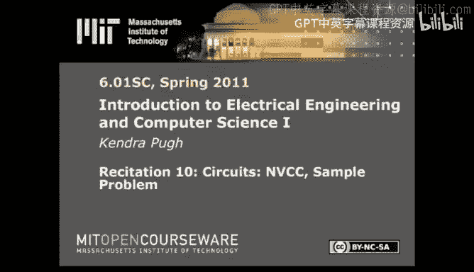

# 016：节点电压与元件电流法（NVCC）教程

## 概述
在本节课中，我们将学习一种新的电路分析方法——节点电压与元件电流法。上一节我们回顾了使用基尔霍夫电压定律、基尔霍夫电流定律和欧姆定律来求解电路的一般方法，但该方法通常会产生大量冗余或非独立的方程。本节介绍的NVCC方法能够更简洁、更有效地表达电路中元件之间的关系，并可能更快地求解方程，这在考试或日常工作中节省时间尤为重要。

## 节点电压与元件电流法（NVCC）简介
NVCC代表节点电压与元件电流法。它与节点分析法非常相似，如果你听到其中一种说法，可以理解为大致相同的内容。我们将在稍后介绍两者之间的细微差别。一旦掌握了使用NVCC方法求解电路，我们就能更简洁、更有效地表达电路中元件之间的关系。

## NVCC方法的核心步骤
以下是应用NVCC方法分析电路的具体步骤。

### 第一步：标记节点与电流
首先，标记电路中的所有节点。节点是元件相互连接的任何点。同时，标记与电路中每个元件相关联的电流。在NVCC方法中，我们将关注流经特定元件的电流，而不是流入或流出特定节点的电流。从某种意义上说，NVCC方法与KVL和KCL的思路相反，尽管最终仍会使用相同的关系式。

### 第二步：设定参考地并建立电压关系
接下来，指定一个节点作为“地”或参考点，即设定其相对电压为零。然后，写出特定元件两端的电压降、流经该元件的电流以及该元件本身所要求的电压与电流关系（例如欧姆定律 `V = I * R`）之间的方程式。

### 第三步：应用基尔霍夫电流定律（KCL）
对相关节点应用基尔霍夫电流定律。在NVCC框架下，我们通常关注流经元件的电流在节点处的代数和为零。

### 第四步：联立求解
将前几步得到的方程组合并，形成一个方程组，然后求解未知的节点电压和元件电流。

## NVCC与节点分析法的区别
节点分析法与NVCC方法非常相似。主要区别在于处理电压源时：当元件是电压源且有多个电流流入该电压源时，在节点分析法中，可以将电压源及其连接点视为一个单一的电压节点（其电压值已知），并直接为此节点写出KCL方程，仿佛这些连接点被合并了。这是两者之间的一个主要差异。

## 实例分析
让我们通过一个例子来具体说明。你可以在课程阅读材料6.4.3节找到这个例子。

### 电路描述与第一步：标记
假设我们有一个简单电路，包含一个电压源和几个电阻。我们首先标记所有节点（例如N0, N1, N2）和每个元件上的电流（例如I0, I1, I2, I3）。

### 第二步：设定参考地与电压关系
设定节点N0为地，即其电压 `V_N0 = 0`。根据电路，我们知道电压源使节点N1的电压 `V_N1 = 15V`。
接着，根据标记的电流方向，写出每个元件两端的电压降表达式。通常约定电压降的方向与假设的电流方向一致。例如，对于一个电阻R，其电压降 `V_drop = I * R`，其中I是流经它的电流。

### 第三步：应用KCL
对关键节点应用KCL：
*   对于节点N1：流入电流 `I0` 等于流出电流 `I1`。因此，`I0 = I1`。
*   对于节点N2：流入电流 `I1` 和 `I3` 等于流出电流 `I2`。因此，`I1 + I3 = I2`。
*   对于节点N0：其KCL方程通常依赖于前两个方程，可能不是独立的，因此可以不必单独列出。
*   此外，已知 `I3 = 10A`。

### 第四步：联立求解
利用第二步的电压关系（例如，对于电阻，`V_N1 - V_N2 = I1 * R1`，`V_N2 - V_N0 = I2 * R2`）和第三步的KCL方程，将电流用节点电压表示。
例如，将 `I1 = (V_N1 - V_N2) / R1` 和 `I2 = (V_N2 - V_N0) / R2` 代入节点N2的KCL方程 `I1 + I3 = I2`。
代入已知值 `V_N1 = 15V`，`V_N0 = 0V`，`I3 = 10A`，以及电阻值，可以得到一个仅含未知数 `V_N2` 的方程：
`(15 - V_N2) / 3 + 10 = V_N2 / 6`
解这个方程：
两边乘以6以消去分母：`2*(15 - V_N2) + 60 = V_N2`
计算：`30 - 2*V_N2 + 60 = V_N2` => `90 = 3*V_N2` => `V_N2 = 30V`
求得 `V_N2` 后，可以回代计算所有电流：
`I2 = V_N2 / 6 = 30 / 6 = 5A`
`I1 = (15 - 30) / 3 = -5A` （负号表示实际电流方向与假设相反）
`I0 = I1 = -5A`
最后，可以计算各电阻的电压降：
3Ω电阻的电压降：`V_N1 - V_N2 = 15 - 30 = -15V`
2Ω电阻的电压降：`V_N2 - V_N0 = 30 - 0 = 30V`

## 总结
本节课我们一起学习了节点电压与元件电流法。这种方法通过关注节点电压和流经元件的电流，能够系统化地建立电路方程，通常比直接应用KVL和KCL更简洁。其核心步骤包括标记节点与电流、设定参考地、建立元件电压-电流关系、对节点应用KCL，最后联立求解。我们还简要比较了NVCC与节点分析法的异同，并通过一个实例完整演示了分析过程。掌握此法将有助于你更高效地分析和求解复杂电路。