# 017：运算放大器与电路模块化 🎛️

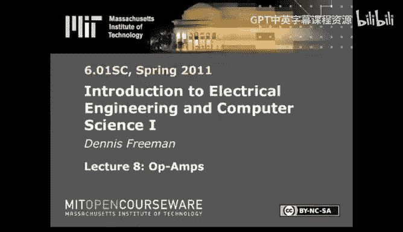

在本节课中，我们将要学习运算放大器，并探讨如何在电路设计中实现模块化。我们将看到，电路模块化面临特殊挑战，而运算放大器是解决这些挑战的关键工具之一。

## 回顾：电路分析基础

在开始新内容之前，我们先简要回顾一下电路分析的基础知识。上一讲我们首次接触了电路。电路与我们之前学习的编程和线性系统理论不同，其各个部分是相互连接的，电压和电流在整个网络中共享。

电路分析可以归结为三个核心方面：
1.  **电压**：遵循基尔霍夫电压定律，即沿任何闭合回路的电压代数和为零。公式表示为：`∑V = 0`。
2.  **电流**：遵循基尔霍夫电流定律，即流入任何节点的电流代数和为零。公式表示为：`∑I = 0`。
3.  **元件特性**：取决于具体元件。例如，线性电阻遵循欧姆定律 `V = IR`；电压源提供固定电压 `Vs = V0`；电流源提供固定电流 `Is = I0`。

结合这些定律和关系，我们就能求解电路。为了简化求解过程，我们介绍了三种方法：
*   **原始变量法**：为每个元件设定电压和电流变量。变量多，方程也多。
*   **节点电压法**：设定最少数量的节点电压，足以确定所有元件电压。通常变量更少。
*   **回路电流法**：设定最少数量的回路电流，足以确定所有元件电流。通常变量也更少。

这三种方法本质上是等价的，但节点电压法和回路电流法通常能减少未知数数量，更便于求解。在编写程序自动求解电路时，节点电压法（或其变体）通常是更易于自动化的选择。

## 电路模块化的挑战

本节中，我们来看看是什么让电路设计变得困难，特别是模块化设计。与之前讨论的线性时不变系统不同，在电路中，**每个元件的存在都会影响电路中所有其他元件的电压和电流**。改变一个元件，就可能改变全局。

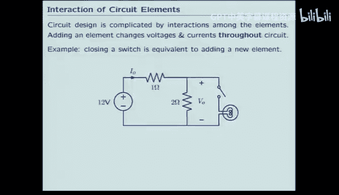

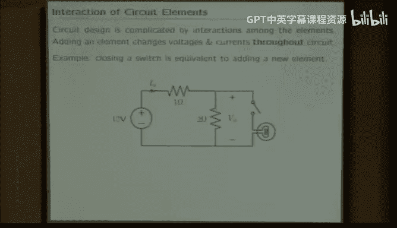

### 一个例子：灯泡亮度控制

设想一个用分压器控制灯泡亮度的电路。初始电路有一个电压源和两个电阻。当我们闭合开关，接入灯泡（可视为一个电阻）后，情况发生了变化。

以下是分析步骤：
1.  **开关断开时**：电路是简单的分压器。`V_not` 为 8V，`I_not` 为 4A。
2.  **开关闭合后**：灯泡电阻 `R` 与 `R2` 并联，改变了整个电路的等效电阻。通过计算可以发现，`V_not` 下降，`I_not` 上升。

这个例子说明，**添加一个新元件会改变远处其他元件的电压和电流**。如果我们希望分压器稳定地提供8V电压给灯泡，这个简单的电路无法实现，因为接入负载（灯泡）后，分压关系被破坏了（电流被分流）。

我们真正需要的是一种“魔法”电路，能够**隔离**负载对前级电路的影响。这就是**运算放大器**的作用。

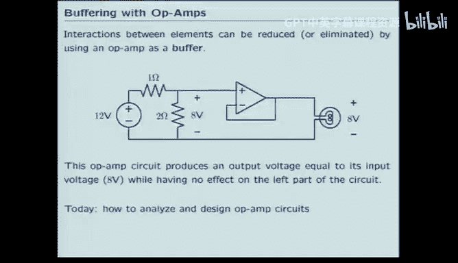

## 运算放大器简介

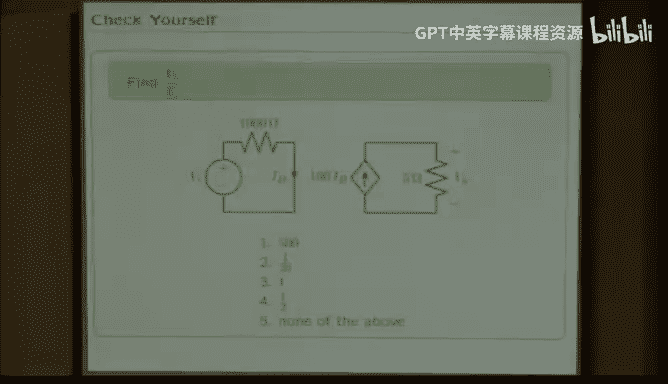

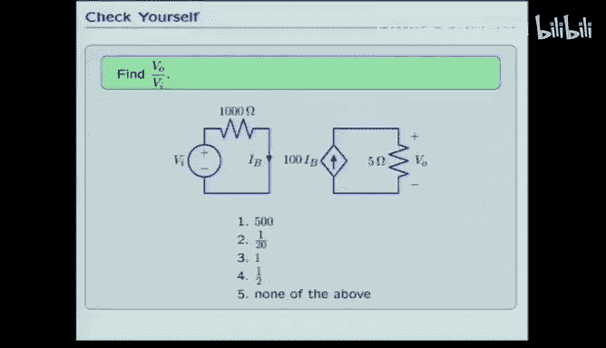

运算放大器是一种特殊的电路元件，它可以帮助我们实现电路模块化。一个理想的缓冲器可以测量一侧的电压，并在另一侧“神奇地”生成相同的电压，而不影响前一级。

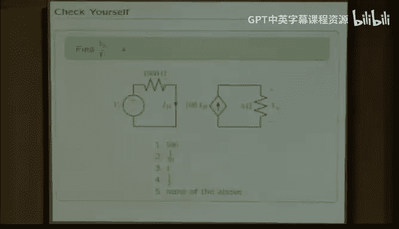

运算放大器看起来与普通二端元件（如电阻）不同，它通常有多个引脚（至少五个）。理解它的关键在于**受控源**的概念。

### 受控源

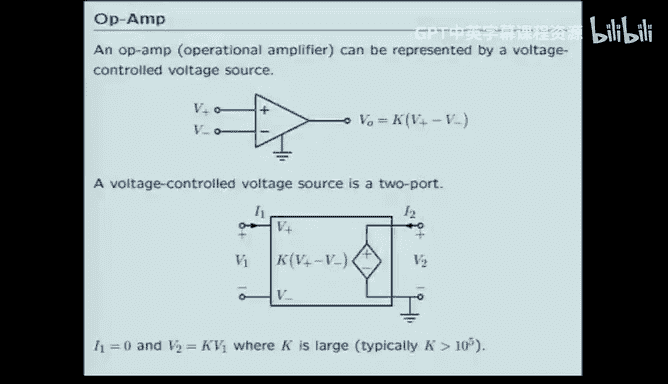

受控源是其电压-电流关系依赖于电路中其他地方电压或电流的元件。例如：
*   **电流控制电流源**：其输出电流 `I_out` 受另一个电流 `I_B` 控制，例如 `I_out = β * I_B`。
*   **电压控制电压源**：其输出电压 `V_out` 受另一个电压差 `(V+ - V-)` 控制，例如 `V_out = A * (V+ - V-)`。

运算放大器的一个基本模型就是**电压控制电压源**。其符号有一个同相输入端（+）、一个反相输入端（-）和一个输出端。其关系为：
`V_out = K * (V_plus - V_minus)`
其中 `K` 是一个非常大的数（通常 > 10^5）。

## 理想运算放大器模型

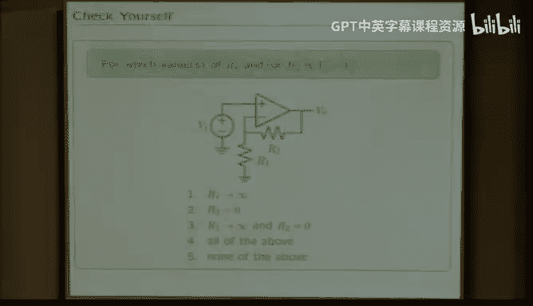

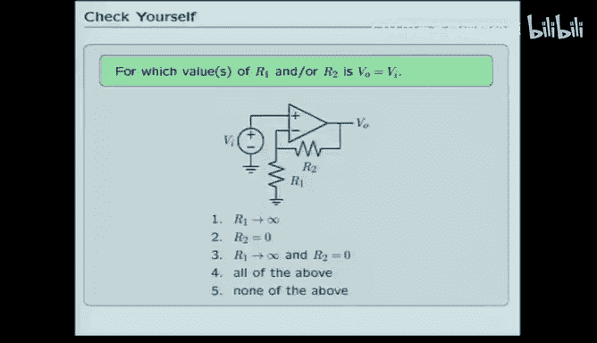

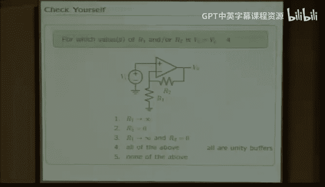

由于 `K` 非常大，为了得到合理的有限输出电压 `V_out`，输入端的电压差 `(V_plus - V_minus)` 必须非常小，趋近于零。这引出了**理想运算放大器模型**的两个关键规则：
1.  **虚短**：`V_plus ≈ V_minus`。
2.  **虚断**：流入运算放大器两个输入端的电流为零。

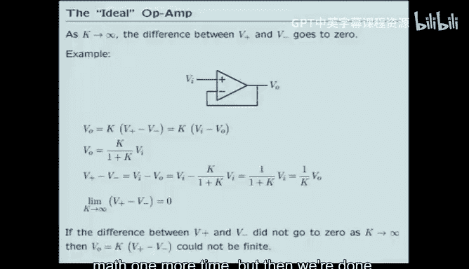

使用这个模型，可以极大地简化电路分析。

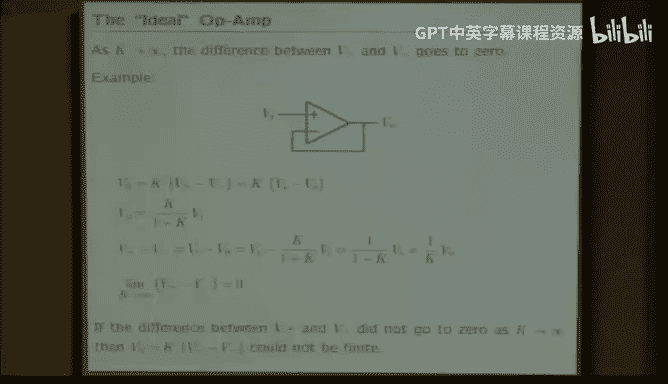

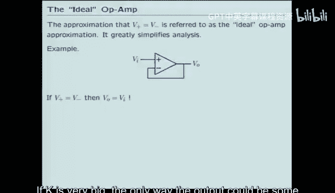

### 应用示例1：电压跟随器

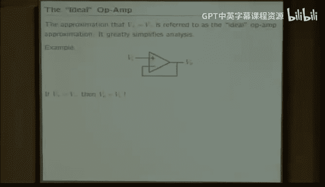

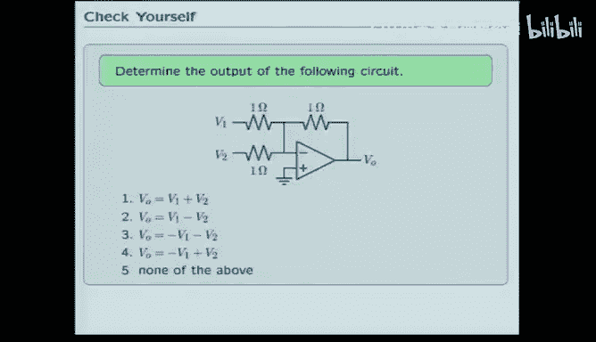

考虑一个将输出直接反馈到反相输入端的电路（电压跟随器）。根据理想模型：
*   由于 `V_plus = V_in` 且 `V_plus ≈ V_minus`，所以 `V_minus ≈ V_in`。
*   又因为 `V_out` 直接连接到 `V_minus`，所以 `V_out = V_in`。

这个电路实现了完美的缓冲隔离，输出跟随输入，但不会像简单分压器那样因负载接入而改变。

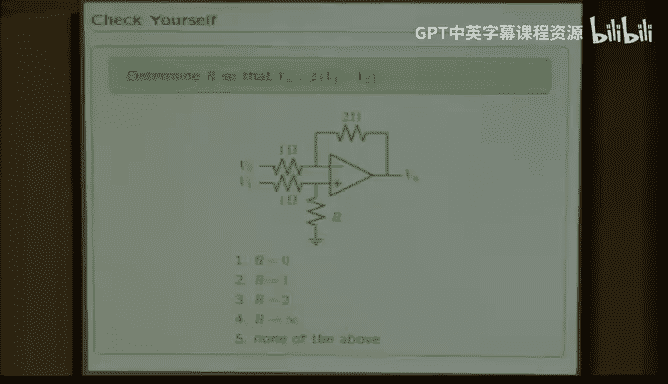

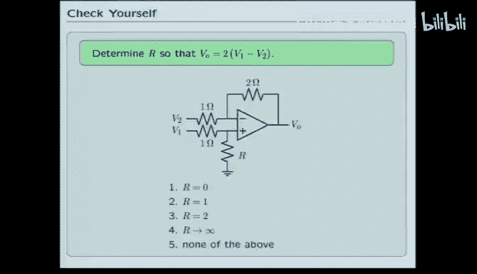

### 应用示例2：反相加法器

考虑一个更复杂的电路，有两个输入电压 `V1` 和 `V2` 通过电阻连接到反相输入端。
1.  根据虚短，反相输入端电压 `V_minus ≈ V_plus = 0V`（接地）。
2.  根据虚断，流入该节点的电流和为零：`(V1/R) + (V2/R) + (V_out/R_f) = 0`。
3.  解得：`V_out = -R_f/R * (V1 + V2)`。当 `R_f = R` 时，`V_out = -(V1 + V2)`。

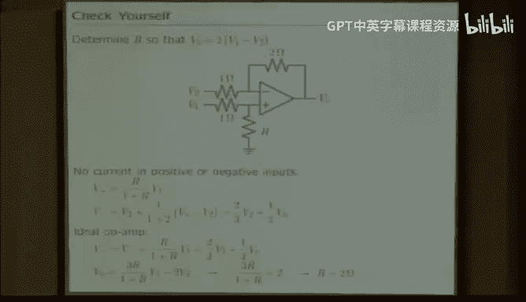

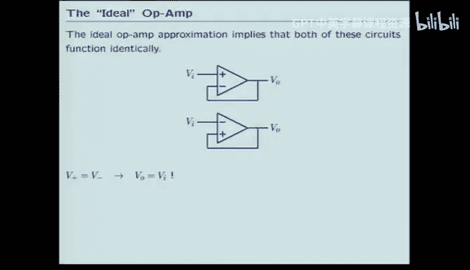

这个电路实现了对输入电压求反相和的功能。

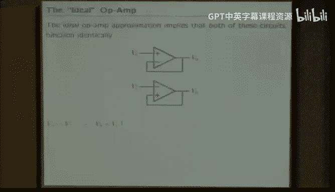

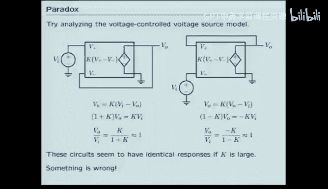

## 深入理解：为什么反馈极性很重要

理想运算放大器模型似乎暗示，无论将输入接在同相端还是反相端，只要构成反馈，结果都一样（`V_out = V_in`）。但这与实际情况不符。我们需要更深入的模型来理解其工作机制。

### 动态模型：考虑电荷流动

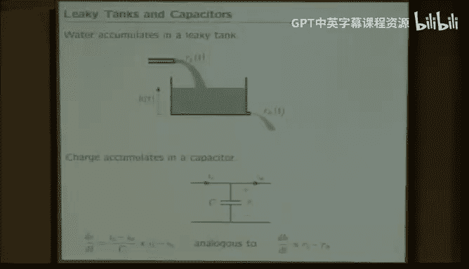

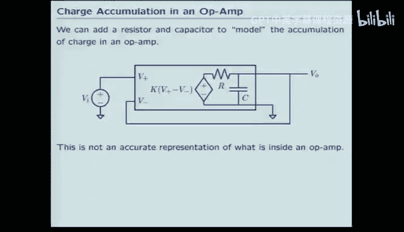

运算放大器内部通过感知输入电压差，并向输出端的寄生电容充电或放电来调整输出电压。这可以用一个包含受控电流源的动态模型来描述。

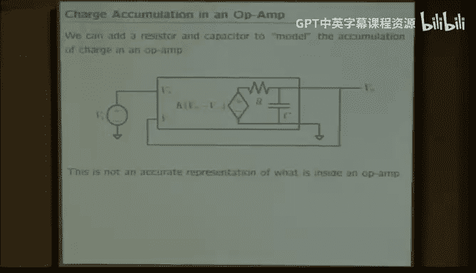

*   **负反馈（稳定）**：输入接同相端，输出反馈到反相端。若 `V_in` 上升，`V_out` 也会上升，使 `(V+ - V-)` 减小，充电电流减弱，最终稳定在 `V_out ≈ V_in`。这像一个位于山谷的小球，扰动后会回到平衡点。
*   **正反馈（不稳定）**：输入接反相端。若 `V_in` 上升，`V_out` 反而下降，使 `(V+ - V-)` 变得更大，导致 `V_out` 进一步下降，形成恶性循环。这像一个位于山顶的小球，稍有扰动就会滚落。

因此，**必须将运算放大器连接成负反馈形式，电路才能稳定工作**。只要确保是负反馈配置，就可以安全地使用理想运算放大器模型进行分析。

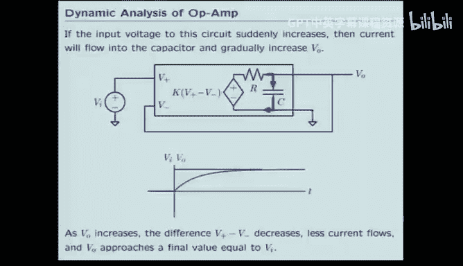

## 实际考量：电源轨

最后需要指出，运算放大器要实现其功能，必须从外部获取能量。因此，实际的运算放大器除了输入、输出引脚外，还有正、负电源引脚（如 `+V_s` 和 `-V_s`）。这意味着**运算放大器的输出电压范围受限于其电源电压**，无法输出超过电源轨的电压。在设计电路（如机器人头部控制电路）时，这是一个重要的约束条件。

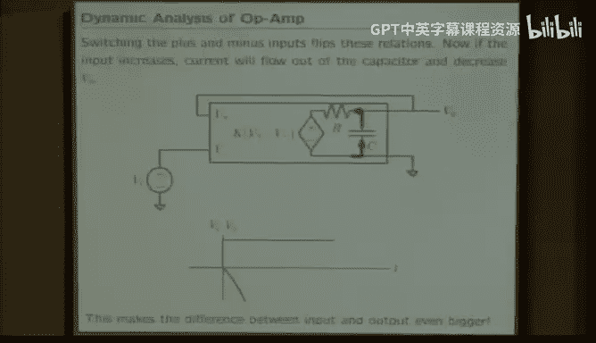

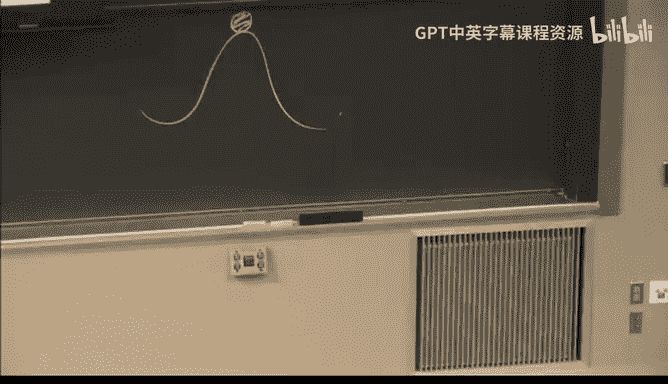

## 总结

本节课中我们一起学习了：
1.  **电路模块化的挑战**：由于元件间相互影响，直接连接电路会破坏前级的工作状态。
2.  **运算放大器的引入**：作为一种解决方案，它能提供缓冲隔离。
3.  **运算放大器的模型**：从电压控制电压源模型，到简化的理想模型（虚短、虚断）。
4.  **理想模型的应用**：利用该模型可以轻松分析如电压跟随器、反相加法器等电路。
5.  **稳定性的关键**：通过动态模型理解了负反馈的重要性，这是运算放大器电路稳定工作的前提。
6.  **实际限制**：运算放大器的输出电压范围受其电源电压限制。

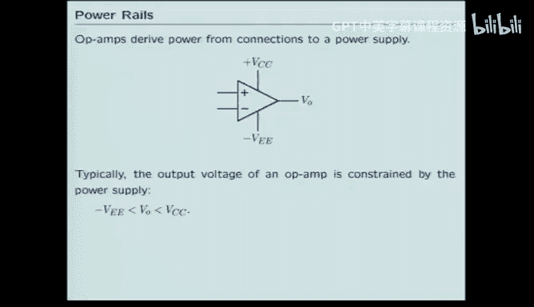

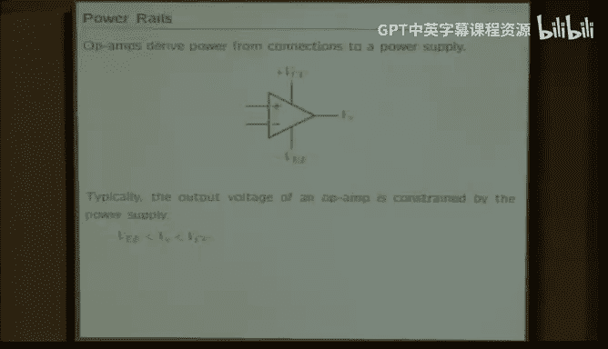

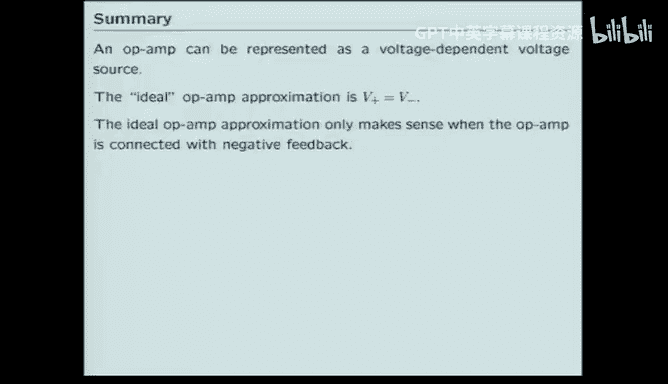

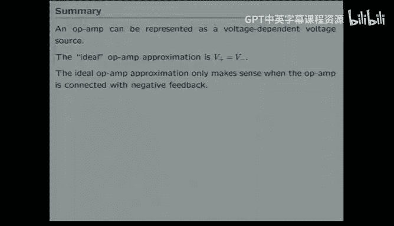

总之，运算放大器通过提供高输入阻抗和低输出阻抗，有效地隔离了电路的不同部分，使我们能够设计出模块化、可预测的复杂电路系统。