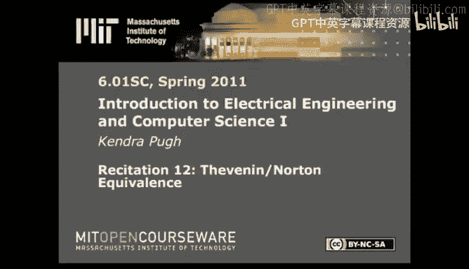
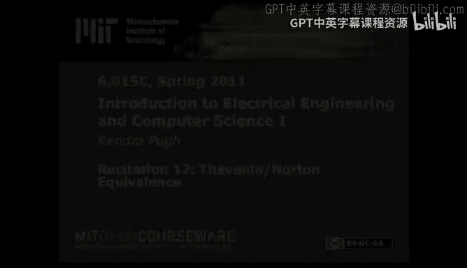

# 020：戴维南/诺顿等效与叠加原理 📚

在本节课中，我们将学习两个重要的电路分析概念：戴维南/诺顿等效，以及叠加原理。这两个概念都源于我们所处理的系统是线性时不变系统这一事实，它们能帮助我们简化复杂电路的分析过程。

上一节我们讨论了运算放大器，它允许我们抽象化电路的某些部分，并以线性时不变的方式对电压进行采样和修改。本节中，我们将探讨由LTI系统特性衍生出的其他有趣概念。

## 戴维南与诺顿等效 ⚡

戴维南与诺顿等效的核心思想是：对于一个复杂的LTI电路，你可以将其在特定两个端点处的特性，用一个简单的线性关系（一条直线）来表示。这在你只想关注电路中某特定位置的电压或电流，而不想分析整个复杂电路时非常有用。

因为处理的是LTI系统，我们可以将特定采样点的特性，用其**电压(V)**和**电流(I)**之间的关系来表达，这个关系通常与一个等效电阻有关。

我们通过以下步骤来确定这条关系曲线（即等效电路）：
1.  **求开路电压**：在我们采样的两个端点处开路（即不连接任何东西），测量两点之间的电压。这就是戴维南等效电压 **`V_th`**。
2.  **求短路电流**：将我们采样的两个端点用导线短接，测量流经该导线的电流。这就是诺顿等效电流 **`I_n`**。
3.  **求等效电阻**：关系曲线的斜率代表了等效电阻 **`R_th`**。它可以通过公式 **`R_th = V_th / I_n`** 计算得出（注意电流方向，通常取绝对值）。

一旦求出这些值，我们可以用两种等效电路来表示原电路在该端口处的特性：
*   **戴维南等效电路**：一个电压源 **`V_th`** 与一个电阻 **`R_th`** 串联。
*   **诺顿等效电路**：一个电流源 **`I_n`** 与一个电阻 **`R_th`** 并联。

这两种等效电路可以相互转换。

让我们通过一个例子来实践。假设我们有一个简单电路，并希望找到跨越图中某个电阻两端的戴维南等效电路。

首先，我们求解**开路电压 `V_th`**。在我们采样的两点之间开路，这形成了一个分压器。根据分压原理，采样点间的电压占总电压的特定比例。通过计算，我们得到 **`V_th = 24V`**。

接下来，求解**短路电流 `I_n`**。将采样两点短接。此时，被短接的电阻被旁路，电流将全部流经短路线。根据欧姆定律，短路电流为总电压除以短路线之外路径上的电阻。计算得到 **`I_n = -6A`**（负号表示电流方向与参考方向相反）。

最后，计算**等效电阻 `R_th`**。利用公式 **`R_th = V_th / |I_n| = 24V / 6A = 4Ω`**。

这样，我们就得到了该端口的戴维南等效电路：一个 **24V** 的电压源与一个 **4Ω** 的电阻串联。同样可以转换为诺顿等效电路。

## 叠加原理 ➕

叠加原理是另一种电路求解策略，它同样是LTI系统特性的直接结果。其含义是：为了求解某个元件上的电流或电压，你可以通过计算每个独立电源单独作用时，在该元件上产生的贡献，然后将这些贡献线性叠加起来。

具体操作步骤如下：
1.  保留一个独立电源（电压源或电流源），将其他所有独立电源“置零”。
    *   **电压源置零**：相当于用一根导线代替（短路），使其两端电压为0。
    *   **电流源置零**：相当于将其移开，使该支路断开（开路），因为零电流意味着没有连接。
2.  分析简化后的电路，计算目标元件上的电流或电压。
3.  对每个独立电源重复步骤1和2。
4.  将所有独立电源单独作用时得到的结果代数相加，即为原电路中目标元件上的总电流或电压。

让我们看一个例子。假设我们要求解下图中电阻R1上的电流 **`I1`**。

根据叠加原理，**`I1`** 等于仅电压源作用时的 **`I1_v`** 加上仅电流源作用时的 **`I1_i`**。

*   在**仅电压源作用**的电路中（电流源开路），电路简化。使用欧姆定律 **`V=IR`**，可以计算出 **`I1_v = 3A`**（假设方向向下）。
*   在**仅电流源作用**的电路中（电压源短路），电路形成一个分流器。根据分流原理，流经R1的电流占总电流的比例由电阻值决定。计算可得 **`I1_i = -4A`**（负号表示方向与参考方向相反，即向上）。

因此，原电路中的总电流 **`I1 = I1_v + I1_i = 3A + (-4A) = -1A`**。这个结果与使用其他方法（如节点电压法）求解的结果一致。

---

本节课中，我们一起学习了两个基于LTI系统特性的重要电路分析工具：**戴维南/诺顿等效**和**叠加原理**。戴维南/诺顿等效允许我们将复杂电路在特定端口简化为一个简单的电压源/电阻串联或电流源/电阻并联模型，极大地方便了分析。叠加原理则提供了一种化整为零的求解思路，通过分别计算各独立电源的贡献并叠加，来求解复杂电路中的响应。掌握这两个概念，将为分析更复杂的电子系统奠定坚实基础。

下一讲，我们将开始一个全新的模块。