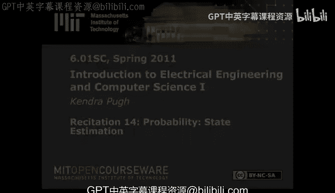

# 023：状态估计教程 🧠

在本节课中，我们将学习**状态估计**。状态估计是一种处理系统不确定性的方法。我们将通过一个“生病诊断”的例子，学习如何对一个不完全理解的系统进行建模，并基于可观察的信息来推断其内部状态。

上一节我们介绍了概率论作为建模不确定性的基础。本节中我们来看看如何应用概率进行状态估计。

## 概述：什么是状态估计？

状态估计是我们处理系统不确定性的一种方式。我们可以对一个不完全理解的模型，尝试基于对该系统可观察的事物来推断其信息。

具体来说，我们将观察一系列系统采取的动作或我们对系统采取的动作。如果我们持续多个时间步进行这个过程，就可以不断尝试了解这个特定系统。这种在多个时间步中持续进行推断的过程，就是我们所说的状态估计。

首先，状态估计是一个过程，它是我们想要理解一个**随机状态机**的产物。状态估计本身不是一个随机状态机。状态估计试图获取一个随机状态机，为其建立模型，然后迭代地（或递归地）运行状态估计，以试图弄清楚该随机状态机内部发生了什么。

## 构建随机状态机模型 🏗️

当你构建一个随机状态机模型时，需要指定三个组成部分。

以下是构建模型所需的三个核心部分：

1.  **初始状态分布**：这是你对系统初始状态的信念。例如，假设我生病了，试图弄清楚病因。我认为可能患有三种疾病：链球菌性喉炎（Strep）、普通病毒性感冒，或单核细胞增多症（Mono）。初始分布就是指我对这些可能性的初始信念。一个常见的假设是初始分布是均匀的，即每种可能性概率相等。
    *   **公式表示**：`P(S0)`，其中 `S0` 代表初始状态。

2.  **观测分布**：这是在给定当前状态下，做出特定观测的可能性。例如，如果我患有单核细胞增多症，观察到喉咙后部有白色斑块的可能性有多大？如果我患有链球菌性喉炎，观察到这种症状的可能性又有多大？通常，观测变量可以分解为几个不同的现象。在生病的例子中，最好的观测就是症状，例如：是否嗜睡、喉咙是否有白斑、是否发烧等。
    *   **公式表示**：`P(O | S)`，即在状态 `S` 下观测到 `O` 的概率。

3.  **转移分布**：你假设状态机会随时间变化。例如，我病情加重或减轻的可能性。你可以采取一些行动来促使这种变化，或者有些行动可以模拟时间的流逝。在随机状态机模型中，你的动作可以是模型自身采取的动作（你只进行观测），也可以是你对模型采取的动作。在生病的例子中，我可以采取一些行动让自己感觉好些，或者更好地了解病情，例如：服用抗生素、多休息多喝橙汁、或正常生活。
    *   **公式表示**：`P(S' | S, A)`，即在状态 `S` 下采取动作 `A` 后，转移到新状态 `S'` 的概率。

## 状态估计的步骤 🔄

现在，我将逐步讲解状态估计的一个步骤。每个状态估计步骤都是相同的。事实上，如果你基于前一步获得的信息执行多个步骤，这就被称为**递归状态估计**。我将继续使用生病的例子。

当你进行状态估计时，你试图弄清楚一个你无法完美建模的系统的某些信息。你拥有随机状态机模型的所有组件。由于时间的流逝，或者由于进行了观测并观察到了随机状态机采取的动作（或你对它执行了动作），你将对该不可知系统（或对你来说不完全可观测的系统）的当前状态做出一个新的估计。简而言之，你将求解 `S` 在时间 `T+1` 的概率分布 `P(S_{T+1})`。

状态估计分为两个步骤：

### 第一步：贝叶斯推理

第一步被称为**贝叶斯推理**步骤，它涉及对当前状态分布应用贝叶斯规则，给定一个特定的观测。

此时，我已经对自己进行了一些观察。如果以生病模型为例，我可能观察到自己整天咳嗽、发烧、喉咙痛或感到极度嗜睡。给定这个观测 `O`，我可以从观测分布中取出 `P(O|S)`，将其乘以我当前对状态分布的理解 `P(S)`，然后除以 `P(O)` 进行归一化。

完成此操作最慢的方法是构建联合分布，然后以特定列为条件。这是非常规范的做法，但你可以通过以下方式节省计算量：

假设我从均匀分布开始，即我患有链球菌性喉炎、普通病毒或单核细胞增多症的可能性相等。作为进行观测的结果，例如，我观察到喉咙后部没有白斑，我可以说，我处于普通病毒状态的可能性更高，而患有链球菌性喉炎或单核细胞增多症的可能性更低。

这个步骤计算 `P(S) * P(O|S)`。一旦我有了这些值，我必须将它们归一化，使其总和为1。这样我就得到了 `P(S_T | O)`。至此，我已经考虑了我所做的观测，但尚未考虑对系统采取的动作。

### 第二步：转移更新

我们将以贝叶斯推理的结果（有时称为 `B'(S_T)`）作为输入，结合采取的动作，找出经过一个时间步或一次状态估计迭代后的状态分布。

第二步被称为**转移更新**。我们有了更新后的信念 `P(S_T | O)`。我们将使用转移分布，即给定当前状态和已采取的动作，系统会如何变化的规范。此时，我们将得到新状态的概率分布。

以下是我第一步得到的值作为示例。假设我采取的行动是“多休息多喝橙汁”。作为这个行动的结果，我继续患有链球菌性喉炎有一定的可能性，或者我实际上只是患有普通病毒的可能性也存在。

如果我患有普通病毒并且多休息多喝橙汁，那么我鼓励自己进入的状态将是“患有病毒”。如果我患有单核细胞增多症并且多休息多喝橙汁，那么第二天我仍处于类似单核细胞增多症的状态有一定的可能性，但也存在一些可能性使我进入类似链球菌性喉炎的状态。

这就是运行转移更新时发生的情况。当你运行转移更新时，最终会累积所有与进入一个特定新状态相关的概率，这些概率是基于处于特定先前状态并根据转移分布进入该新状态而产生的。一旦你累积了所有这些值，你就得到了新状态的新分布 `P(S_{T+1})`。

## 递归状态估计 ♾️

这代表了一步状态估计。如果我想运行多步，我会将这里得到的 `S_{T+1}` 的值，替换为 `S_T` 的值，然后再次运行相同的贝叶斯推理和转移更新过程。

## 总结

本节课中我们一起学习了**状态估计**。我们了解到状态估计是处理系统不确定性的关键方法，通过为随机状态机建立模型（包括初始分布、观测分布和转移分布），并迭代应用**贝叶斯推理**和**转移更新**两个步骤，我们可以基于不完全的观测来持续推断系统的内部状态。递归地进行这一过程，使我们能够随着时间推移不断更新对系统的认知。