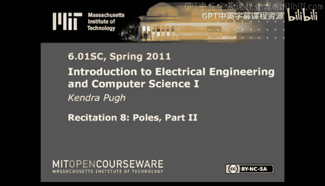
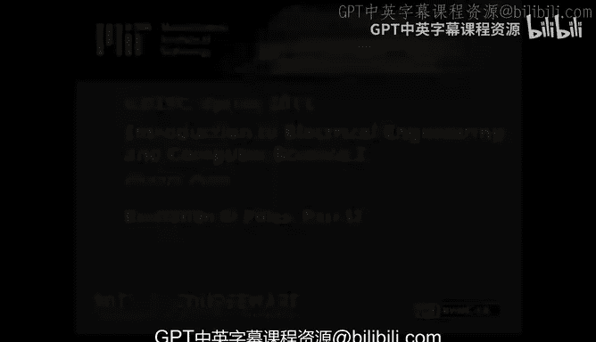

# 《电气工程与计算机科学导论1｜6.01SC Introduction to EECS I, Spring 2011》 - P12：-12-Rec 8 _ MIT 6.01SC Introduction to Electrical Engineering and Computer Scien - GPT中英字幕课程资源 - BV1oLBRB5EfQ

Last time we introduced polls and in particular， we introduced how to move from the manipulation of feed forward and feedback systems and the geometric sequence that fell out into using the base of that geometric sequence to attempted to predict the long term behavior of the system。

When we're solving for poles and we're only interested in long term behavior。

 one of the easiest ways to do so is to solve for the roots of Z。

 whereas Z is a substitution for 1 over R in the denominator of the system function。

Once we've done that， we have a list of polls。From that list of poles we would like to select the dominant pole or the pole with the greatest magnitude。

 and then based on the magnitude and period of that pole。

 we can determine what the long term behavior of our system looks like。

Today I'd like to mention to you some notable things about polls。

 if you are interested in this information or feedback and controls in the general sense。

 I highly recommend 6003， but heres some information you should at least be aware of as a consequence of 601。

The other thing I would like to do is just walk through a couple of poll problems to familiarize you or get you more comfortable with the idea of solving for the poles of a system function or looking at the unit sample response of a system function and then graphing the poles。

The first thing that I want to mention is pull zero cancellation。

 And what do I mean when I say that I mean that。If's both the numerator？And the denominator。

Have a degree of algorithmism？Then you're going to have both a zero and a pole。

It's the zero and the pole。Have the same value associated with them。

You may be tempted to cancel them out。Unless both the zero and the pole are equal to zero。

 don't do it。The reason why is that when you get to an implementation of a real system。

 it is highly unlikely that both the zero and the pole will be implemented to a degree of accuracy that you will actually see those two things cancel out the only exception to this is when both the poll and the zero are equal to zero or in this case。

This， you should feel free to convert to this。And almost any other situation。Dont factor。

The other thing I want to talk about is repeated roots。If you have a repeated root。

 you'll have repeated poles。This does get tricky when you're talking about how to。

Add the unit response of those poles。But the long term behavior of your system is going to look the same。

 so if both of these poles are the dominant pole， then the characteristics of both。

 which are the same， are going to determine what your long- term behavior looks like。If they're not。

 then。The dominant poll is going to determine what your long term behavior looks like。

The last thing I want to mention is superposition。So far we've only talked about the unit sample response of a system function and how we use poles to determine what the long term behavior of our system is going to be。

We can look at the response to complicated more complicated inputs than the unit sample response or the deelta。

 In fact， one of the things we'll probably end up looking at at some point is the step function。

The thing that you need to know to go from talking about unit sample response to any other sort of response is that we're still working with an LTI system。

What that means is。If you take the summation of your inputs， apply the system function。

 It is the same and apply the system function to that summation。 It is the same as。

The output that would result。From inputting all those values at once。

The best way I would like to explain it is by referring again， too。

If your function was a system function？The same property applies。

Now let's walk through a poll problem。Here I have a second order system set。

 we've got two degrees of R。I have feedback。And I can solve for an expression of y in terms of x。

In fact， let's do that right now。W is the result of the summation。Or a linear combination of x。Plus。

Delayed signal of Y。Scaled by 1。6。In a linear combination with。

A scaled value or a delayed value of the delayed value of y。Scacaled by negative 0。1。63。

There's my first degree。Let's。For consistency's sake。There's my second degree。

Let's first solvefur the system function。If you're confused。I recommend doing the algebra from here。

To this expression。You should get this fraction out。Our second step is to solve for the roots of Z。

Remember that Z。Sql to1 over R。In the denominator of the system function。In this case。

We'll be working with。All I've done there is taken。

Every degree of R substituted in for 1 over z and then multiplied out so that I'm not working with Z and the denominator anymore。

 I'm actually just working with everything in the numerator。If I fo this back out。

 I get this expression。And my polls are going to be 0。7。0。9。Or right。Based on my polls。

 what are the properties of the unit sample response in the long term？

The first thing I'm going to do is look for the dominant pole among the poles that I found。

In this case， I don't even have to worry about finding the length of the distance from the origin for poles in the complex plane。

 all I have to worry about is the magnitude of poles on the real axis。0。

9 is my dominant pole because it's the largest pole。0。9 is less than1。

So I'm going to end up with convergence。Eventually， my system is going to converge。10 toward 0。

The other interesting property of my system is what is this period and how does that relate to？

What my function is going to look like。In this case， we're only working on the positive real axis。

 so the angle associated with graphing this pole on the complex plane is zero。

 so there is no period for our system。This means that our system is going to converge monotonically。

Now let's walk through some unit sample responses。And then graph through the poles that generated those unit sample responses。

On the unit circle where this is the complex plane。Let's look at this graph first。

The first thing that I notice about this graph is that like in the previous example。

 we have monotonic convergence。We're  tend towards zero。

 and we're not alternating or oscillating about the x axis。

So I know I'm going to be working somewhere along this line。Before the edge of the unit circle。

 because at the edge of the unit circle， the distance from the origin is equal to one。

If you made me guess。Then I would look at the distance here。

And compare it to the distance the next time step。I realize this is Blackboard。

It's not entirely to scale， but for the purposes of this demonstration。

 I'd like to say that the signal at this time step is 0。5 the signal from the previous time step。

Likewise， at the next time step。I would like to say that this signal is 0。

5 the signal from the previous time step。And so on。And so forth。Therefore。

 I'm going to graph my poll。Right here。Let's take a look at this graphuff。I've drawn these wheels。

To indicate that the unit sample response exceeds the bounds of the space that I gave for this graph。

 so just assume that these values are much larger than I've drawn them。

The first thing that I noticed about this human sample response graph is the fact that。

Not only am I increasing。In a way that。Does not seem to。Change it anyway， right。

 we're going to end up diverging。Is that I'm actually alternating about the X axis。And particularly。

That if I were to call this in oscillation， then I would say it's in oscillation with period two。

This means that I'm working with a negative real pull。

The fact that I'm diverging means that I'm working with a negative real pole。

That is greater than one or has magnitude greater than one。If you had to make the guess。

I would look at the distance associated with this time step。

Compare it to the distance associated with this time step。And if you had to ask me。

I would say this is about 1。3。The value at the previous time step。Likewise。

 if I were to look at the next time step。I would say that this increase is about。

30% of the previous value。I'm not even going to try that one， but what I'm trying to get at is that。

You can use comparisons of previous future time steps in order to attempt to determine the magnitude of your dominant poll if you're working with the first order system。

 if you're working with a second order system， then it's possible that you'll see some really interesting initialization effects and you should probably ask one of us。

 you know what's up。But for this example。We're going to put our poll over here。

Here's the last graph I want to talk about。The first thing that I notice is that it doesn't seem to be diverging。

 but it doesn't really seem to be converging either。If this is the case。Then I'm going to put it。

On the unit circle。The second thing that I notice is that it's not monotonic。

And it's not alternating。This is oscillatingning。 So in order to determine what angle I'm going to assign to my。

Unit sample response。I'm going to count out the time steps that it takes to cycle through an entire period。

 and then from there， figure out what the angle would have to be in order to determine a period of that length。

So me start here。I'm just going to count one， two， three， four， five， six， seven， eight。

To complete one full oscillation。This means that my period is eight。

 if I have to divide2 pi by a particular angle in order to get out eight。

I want to divide by pi over4。So at this point， I'm working with a magnitude of about one。

And I want this angle to be about pi over4。This concludes my tutorial on solving polls next time we'll end up talking about circuits。

