# 电气工程与计算机科学导论1：13：控制系统设计

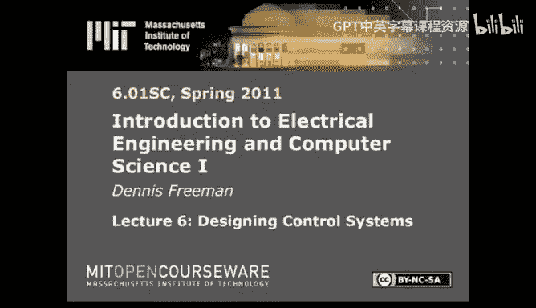

在本节课中，我们将学习如何设计控制系统。这将完成我们对信号与系统的讨论。

## 概述

首先，让我们简要回顾一下我们目前所处的位置。这也有助于你为今晚的考试理清思路。

我们研究了离散时间系统的多种表示方法。

*   **差分方程**是最简单、最简洁的数学表示方法。但它没有明确指出谁是输入、谁是输出，以及从输入到输出的所有可能路径。
*   **框图**是图形化的表示，可以清晰地展示信号流路径，例如是否存在循环路径。但它不如差分方程简洁。
*   **算子**表示法同样简洁，并且包含了额外信息，因为算子有隐含的参数，可以区分输入和输出。它结合了差分方程和框图的优点，提供了包含完整信号流路径信息的简洁表示。

此外，我们可以使用多项式数学来分析算子，这引出了**系统函数**的概念。系统函数是一个很好的抽象，让我们可以将整个系统视为一个单一的算子。

我们利用所有这些表示方法来理解**反馈**。从框图中可以很容易看出，只要有反馈，就会存在循环。循环意味着即使瞬态输入也能产生持续的输出，这种行为是我们希望理解的。

我们通过将复杂系统的响应分解为基于**极点**的多个相加分量来表征这种行为。每个极点对应的响应称为**模态**。

上一节我们介绍了如何通过极点分解系统响应。本节中，我们将利用这个框架来思考设计问题。

## 设计优化：如何选择控制器参数

回顾我们在实验四中的内容，我们研究了如何编程让机器人接近墙壁。我们发现，根据系统设置的不同，会得到非常不同的性能表现。我们希望有一种方法，可以在不实际构建系统的情况下设计性能。

在实验四中，构建系统并测试其行为并不困难。但一般来说，如果你要设计一个像波音777这样具有多个极点的复杂系统，你肯定不希望测试所有的不良配置。因此，我们希望有能力从分析的角度理解这类问题。

### 从差分方程到框图

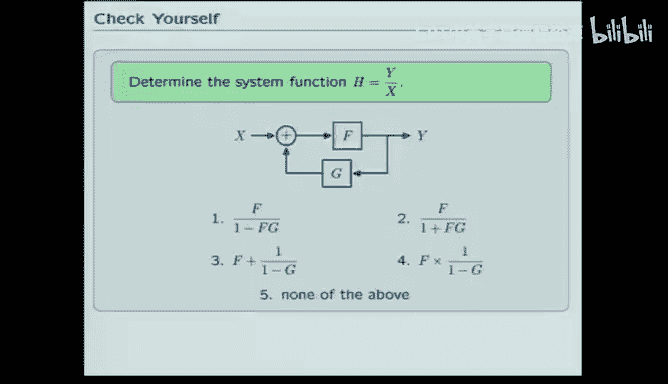

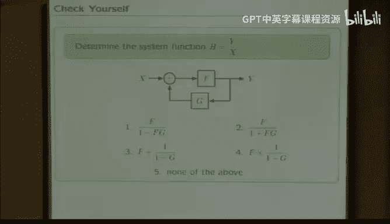

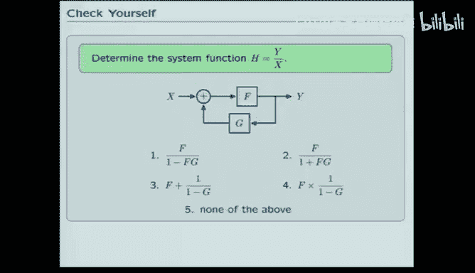

使用不同的表示方法，你可以生成非常简洁的表示。就像你们在实验四中所做的那样，可以从差分方程开始。

以下是一个简单控制器的差分方程示例：
```
y[n] = y[n-1] + K * (d[n] - y[n-1])
```
其中 `y[n]` 是输出（例如机器人的位置），`d[n]` 是期望输入，`K` 是增益参数。

这个差分方程原则上包含了一切信息，但不易于分析。如果将其转化为框图，情况会好一些。

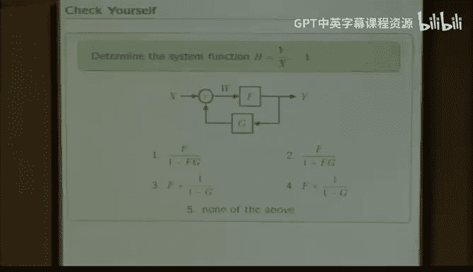

在框图中，你可以看到这个方程组实际上包含两个反馈回路（两个循环）。这两个循环都可能对瞬态信号产生持续的响应，从而可能降低性能。例如，如果瞬态响应持续很长时间，或者小的扰动随时间增大，那将是非常糟糕的。

我们希望理解这个由差分方程描述的简单控制器何时会出现这种情况。

### 分析内环：累加器

分析这个问题最简单的方法是首先关注内环。我们需要找出那个被称为**累加器**的方框（它在其输出端累积所有曾经输入的总和）的函数表示。

我们使用多项式数学来推导。从框图中，我们可以看出信号 `Y` 可以通过将算子 `R` 应用于 `W` 得到：`Y = R * W`。同时，`W` 是 `X` 和 `Y` 的和：`W = X + Y`。

结合这两个方程，我们得到一个只涉及 `X` 和 `Y` 的表达式，可以求解 `Y/X` 的比值：
```
Y = R * (X + Y)
Y = R*X + R*Y
Y - R*Y = R*X
Y*(1 - R) = R*X
Y/X = R / (1 - R)
```
因此，累加器的函数表示是 `R / (1 - R)`。

这个结果在控制系统设计中经常出现，我们称之为**布莱克公式**。它对于避免繁琐的代数步骤直接得到答案非常有用。

为了确保大家理解，我们来看一个练习。

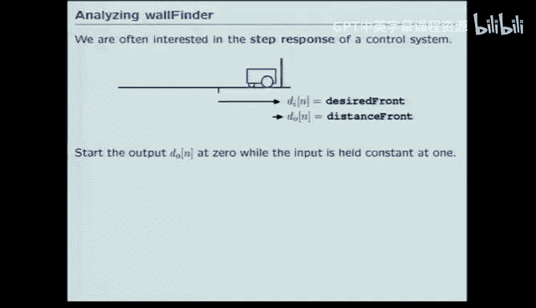

**练习：推导布莱克公式**

对于下图所示的反馈系统，其中前向路径增益为 `F`，反馈路径增益为 `G`，求从输入 `x` 到输出 `y` 的系统函数形式。

（图示：一个标准负反馈系统框图，前向路径为 `F`，反馈路径为 `G`，求和点为 `x - G*y` 输出到 `F`）

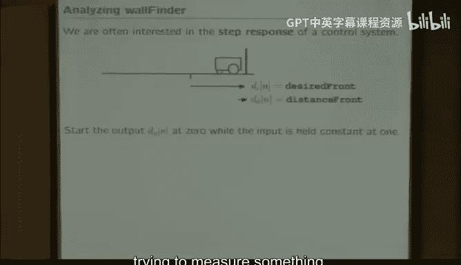

以下是选项：
1.  `F / (1 - F*G)`
2.  `F / (1 + F*G)`
3.  `1 / (1 - F*G)`
4.  `G / (1 - F*G)`
5.  以上都不是

**答案分析**

通过简单代数推导：设求和点输出为 `e = x - G*y`，则 `y = F * e = F*(x - G*y)`。整理得 `y = F*x - F*G*y`，进而 `y + F*G*y = F*x`，所以 `y*(1 + F*G) = F*x`，最终 `y/x = F / (1 + F*G)`。因此正确答案是 **2**。

设计师们会这样理解这个形式：`F` 是**前向增益**（从输入直接到输出的增益），`F*G` 是**环路增益**（绕环路一周的增益乘积）。闭环系统的响应就是前向增益 `F` 除以 `1` 加上环路增益 `F*G`。

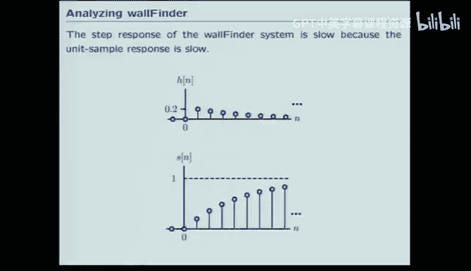

通常，我们会看到这种系统的两种表示形式：一种是求和点为加法（如之前的累加器例子），另一种是求和点为减法（如本练习）。减法形式在控制问题中更常见，因为我们希望控制器驱动误差信号趋于零。这两种形式本质相同，只是差一个负号，可以认为是将 `-G` 代入加法形式的公式中。

### 应用布莱克公式分析完整系统

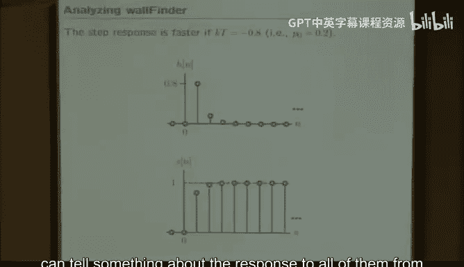

现在，我们使用这个思想来分析完整的机器人控制器系统。首先，用等效系统 `R/(1-R)` 替换内环（累加器）部分。

然后，对外层反馈环路再次应用布莱克公式。此时，前向增益是 `K * (-T) * [R/(1-R)]`，环路增益（因为下方的反馈路径增益为1）也是 `K * (-T) * [R/(1-R)]`。

应用公式 `前向增益 / (1 + 环路增益)`，我们得到：
```
H = [ -K T R / (1-R) ] / [ 1 + (-K T R / (1-R)) ]
```
简化后得到：
```
H = (-K T R) / (1 - R + K T R) = (-K T R) / (1 - (1 - K T) R)
```

这个结果有两点需要注意：
1.  尽管直接代入会得到一个分式除以分式的形式，但它简化为一个单一的比值。对于仅由加法器、增益和延迟构成的系统，其系统函数总是可以表示为 `R` 的多项式之比。
2.  这种表示形式有助于我们直观理解系统行为。我们可以将其解释为一个更简单的系统。

具体来说，这个系统函数 `H = (-K T R) / (1 - (1 - K T) R)` 可以看作三个部分的级联：一个延迟 `R`、一个增益 `-K T`，以及一个极点位于 `p = 1 - K T` 的一阶系统。极点 `p` 是 `R` 的系数。

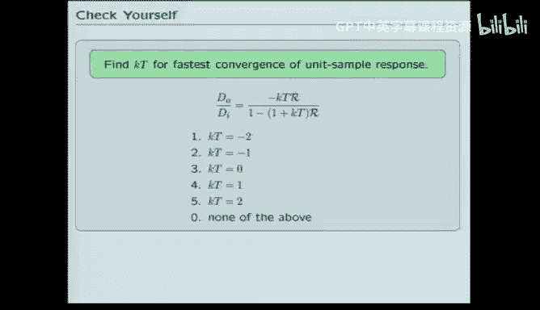

例如，如果选择 `K T = -0.2`，那么极点 `p = 1 - (-0.2) = 1.2`？等等，这里需要检查公式。根据分母 `1 - (1 - K T) R`，极点是 `(1 - K T)` 的倒数吗？实际上，将 `R` 替换为 `1/z` 更易求极点。`H = (-K T / z) / (1 - (1 - K T)/z) = (-K T) / (z - (1 - K T))`。所以极点位于 `z = 1 - K T`。
因此，若 `K T = -0.2`，则极点 `p = 1 - (-0.2) = 1.2`。这似乎不在单位圆内，会导致发散。让我们重新审视原差分方程和推导。典型的稳定控制器增益 `K` 应在一定范围内。假设 `T` 为正，为了使系统稳定，可能需要 `K` 为负且幅度适中。例如，若 `K T = -0.2`，则 `p = 1.2`，在单位圆外，不稳定。若 `K T = 0.2`，则 `p = 0.8`，在单位圆内，稳定。这说明我们需要仔细选择 `K` 的值。

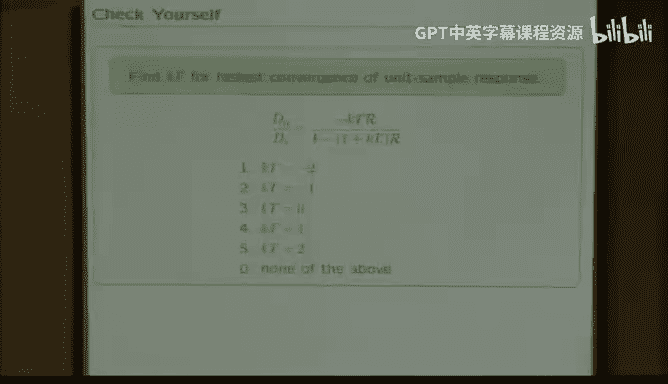

与极点 `p` 相关的模态响应具有 `p^n` 的形式（几何序列）。通过将系统操作视为算子，我们可以识别并简化行为形式，从而直观地掌握如何最佳选择 `K T` 参数。

## 单位采样响应与阶跃响应

我们关注的行为并不总是单位采样响应。我们使用单位采样响应是因为它是最简单的信号：仅在 `n=0` 处值为1，其余处为0。

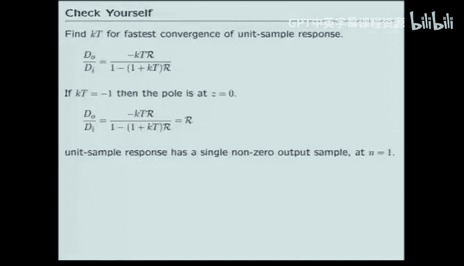

但在实践中，我们经常考虑**阶跃响应**。阶跃响应描述的是系统初始静止（输出为零）时，突然施加一个恒为1的信号后系统的输出。

在机器人例子中，如果机器人从靠近墙壁的位置（输出接近0）开始，而期望输入在其后方1米处，那么输入信号就是从 `n=0` 开始恒为1的阶跃信号。系统的响应就是阶跃响应。

阶跃响应通常在实验室中比单位采样响应更容易测量。因此，我们在做理论分析计算时使用单位采样响应，在实验室测量时使用阶跃响应。

如果这两种响应之间没有密切关系，整个理论就不会非常有用。下图说明了它们之间的关系。

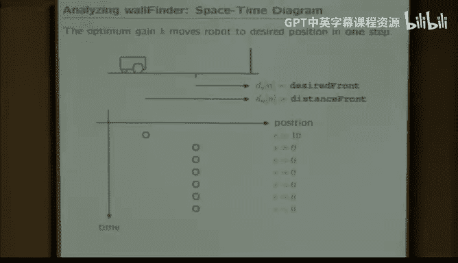

（图示：系统 `H` 的阶跃响应等于将单位阶跃 `U[n]` 输入 `H` 的输出。而单位阶跃 `U[n]` 是单位采样 `δ[n]` 的累加。因此，`H` 的阶跃响应等于 `H` 的单位采样响应 `h[n]` 再经过一个累加器的输出。）

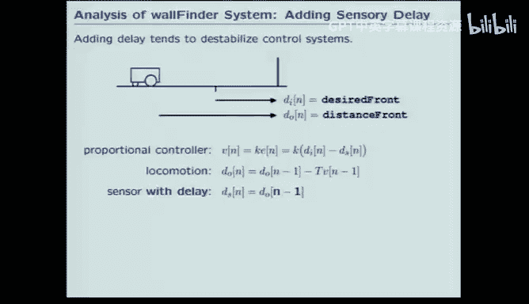

由于多项式的性质和框图遵循多项式规则，当系统都从静止开始时，我们可以交换级联系统的顺序。这意味着，如果你用单位采样激励 `H` 得到单位采样响应 `h[n]`，那么将 `h[n]` 通过一个累加器就可以得到阶跃响应。

因此，单位采样响应和单位阶跃响应之间存在紧密联系：**阶跃响应是单位采样响应的累加和**。

这意味着，在前面的例子中，如果我们设置 `K T = -0.2`（假设修正后是稳定值）得到了某个单位采样响应，那么对应的阶跃响应就是对该单位采样响应进行累加求和。累加和会从0开始，逐渐逼近1，这符合直觉：如果机器人从墙壁开始，期望位置在后方1米，它会单调地接近1。

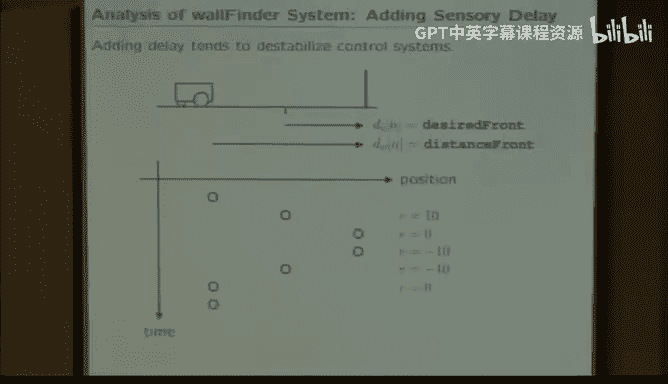

如果改变极点的值，例如将 `K T` 从 `-0.2` 改为 `-0.8`（假设对应稳定的极点），单位采样响应会变快，阶跃响应也会相应变快。

关键是，我们可能使用不同种类的性能指标（单位采样响应、阶跃响应等），但**从单位采样响应可以了解所有响应的特性**。这就是我们如此关注单位采样信号的原因：并非因为它在实验室最常用，而是因为它最容易计算，并能为我们提供在实验室想要测量的 insights。

## 系统行为分类与极点关系

对于这个非常简单的单极点系统，其行为只有几种可能的类别。

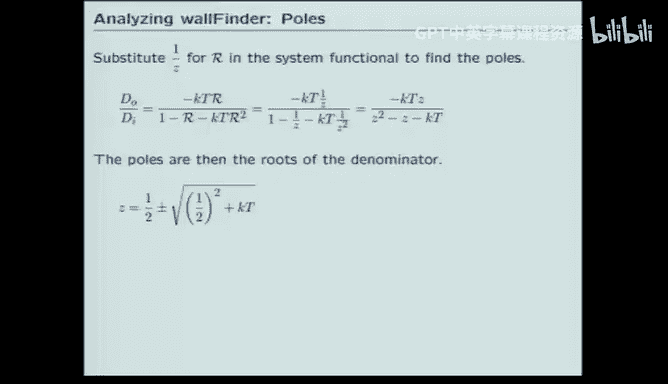

*   如果选择 `K T` 在 `0` 到 `1` 之间（假设 `T>0`），那么极点 `p = 1 - K T` 将在 `0` 到 `1` 之间。响应将是**单调收敛**的。因为单位采样响应始终为正，并衰减趋于零，这使得阶跃响应单调收敛至终值。
*   如果 `K T` 在 `-1` 到 `0` 之间，那么极点 `p` 将在 `1` 到 `2` 之间？实际上，`p = 1 - K T`，若 `K T` 为负，`p > 1`，会导致发散。我们需要重新界定稳定范围。稳定要求极点幅度小于1，即 `|1 - K T| < 1`。这等价于 `-1 < 1 - K T < 1` => `-2 < -K T < 0` => `0 < K T < 2`。但通常 `K` 可能为负以实现负反馈。设 `K T = -k`，则 `p = 1 + k`，稳定要求 `|1+k| < 1` => `-2 < k < 0` => `-2 < K T < 0`。这样更合理。
    *   若 `-1 < K T < 0`，则 `0 < p < 1`，响应单调收敛。
    *   若 `-2 < K T < -1`，则 `-1 < p < 0`，响应**交替收敛**（符号交替，幅度衰减）。
    *   若 `K T < -2`，则 `p < -1`，响应**交替发散**。
    *   若 `K T > 0`，则 `p > 1`，响应**单调发散**。

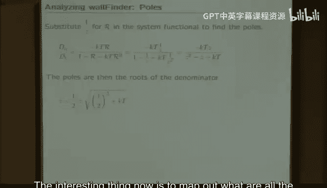

因此，通过思考系统的极点，可以推断控制系统的特性。上面是针对单极点系统的图示。

**练习：选择最佳增益**

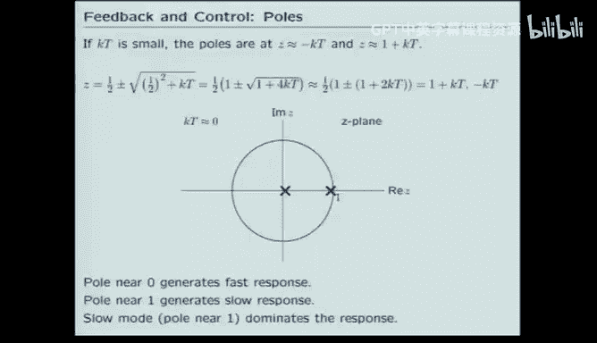

对于前述单极点系统，哪个 `K T` 值能使系统对单位采样信号的收敛速度最快？
选项：1) `K T = -2`， 2) `K T = -1`， 3) `K T = 0`， 4) `K T = 1`

**答案分析**

极点 `p = 1 - K T`。收敛速度取决于 `|p|` 的大小，`|p|` 越小，几何衰减越快。稳定区域内 (`|p|<1`)，`|p|` 的最小值出现在 `p=0` 处。令 `p = 1 - K T = 0`，得 `K T = 1`。但 `K T=1` 是否在稳定区域内？`p=0` 在单位圆内，是稳定的。然而，我们需要考虑原系统是负反馈吗？从公式 `H = (-K T R) / (1 - (1 - K T) R)` 看，似乎 `K T=1` 使分子为 `-R`，分母为 `1`，系统变为 `-R`，即一个简单的延迟和反相。其单位采样响应为 `-δ[n-1]`，确实在一个时间步后即结束，是最快响应。但在实际机器人例子中，`K T=1` 可能对应很大的增益，可能导致其他问题如饱和。但在理想线性模型下，`K T=1` 能一步到位，是最快的。因此答案可能是 **4) `K T = 1`**。但需注意上下文，有时默认 `K` 为负。若 `K` 为负，则 `K T = -1` 时 `p=0`。根据之前推导，`p = 1 - K T`，若 `K T = -1`，则 `p=2`，发散。所以必须明确参数符号。根据原始差分方程 `y[n] = y[n-1] + K*(d[n] - y[n-1])`，可重写为 `y[n] = (1-K)*y[n-1] + K*d[n]`。系统极点为 `(1-K)`。稳定要求 `|1-K| < 1`。最快收敛发生在 `1-K = 0`，即 `K=1`。此时 `K T = 1` 若 `T=1`。因此答案应为 **4) `K T = 1`**。

在机器人实例中，假设采样周期 `T=0.1` 秒，最佳 `K` 则为 `10`。这意味着如果距离期望位置1米，我们会将速度设为10米/秒。这样，经过0.1秒后，我们恰好移动1米，到达目标位置。下一步，误差为零，速度为零，保持在该位置。理论上，一步到位，性能极佳。

## 延迟的影响

问题在于，实验室中并未看到这种良好性能。原因是机器人的传感器并非瞬时工作，它们会引入**延迟**。作为对延迟的理想化，我们考虑相同的问题，但假设传感器将其输入（系统输出）延迟一个时间单位再报告。

现在，如果机器人从目标位置开始（但由于传感器延迟，控制器认为它还在1米外），它会命令高速运动，导致超调。随后，传感器报告到达目标（实际上是过冲后的位置），控制器命令停止或反向，从而产生振荡。延迟对控制器性能产生了破坏性影响。

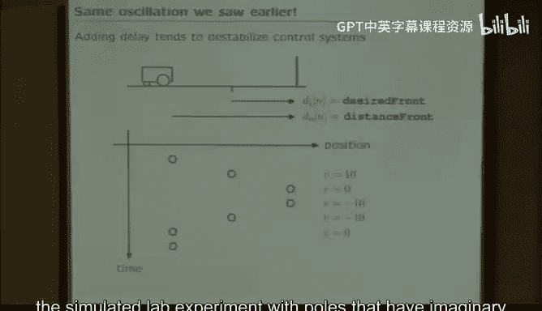

我们希望能够在无需实际测量的情况下预测这种行为。

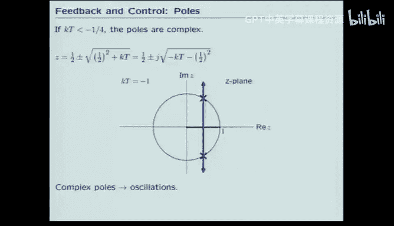

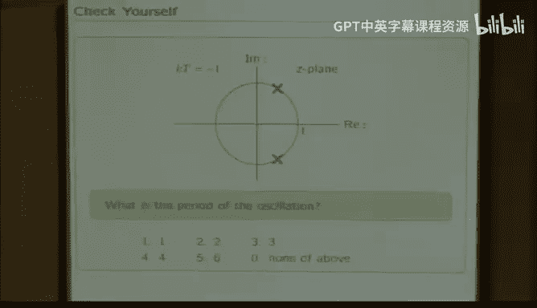

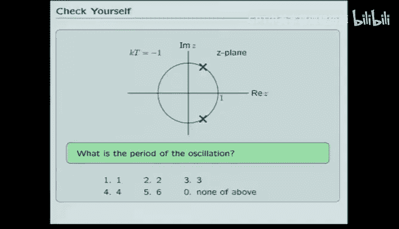

### 含延迟系统的分析

以下是包含传感器延迟的方程和框图。现在，传感器路径中有一个延迟算子 `R`。

问题：这个新控制系统的函数表示是什么？
选项：
1.  `(-K T R) / (1 - R + K T R)`
2.  `(-K T R) / (1 - R - K T R^2)`
3.  `(-K T R^2) / (1 - R + K T R^2)`
4.  `(-K T R^2) / (1 - R - K T R^2)`

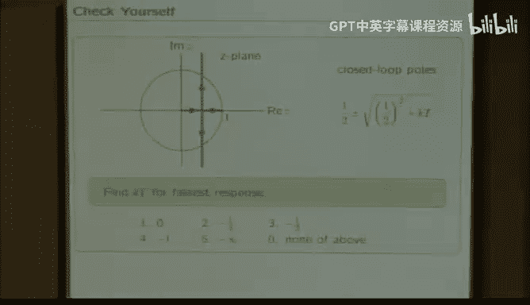

**答案分析**

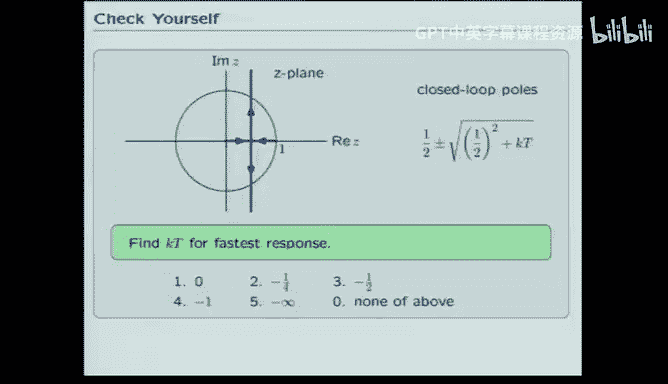

我们可以通过简化内环，然后应用布莱克公式来分析。内环（累加器加延迟）的函数是 `R/(1-R)` 吗？注意，现在从 `Y` 到求和点的反馈路径上有一个 `R`。设内环输出为 `S`，输入为 `X_in`，则 `S = R*(X_in + R*S)`？需要仔细推导。或者直接对整体应用梅森公式或逐步代数推导。
最终推导出的系统函数形式为 `H = (-K T R^2) / (1 - R + K T R^2)`。因此正确答案是 **3**。

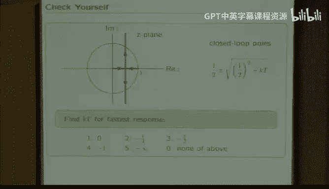

这个形式与无延迟时的区别在于，分子和分母中 `R` 的阶次发生了变化。关键点是分母中出现了 `R^2` 项，这意味着分母是 `R` 的二次多项式。因此，系统将有两个极点。

### 二阶系统的行为与根轨迹

一阶系统（单极点）可能的行为有四种：单调发散、交替发散、单调收敛、交替收敛。现在有了两个极点，我们需要思考二阶系统所有可能的行为。

为了找出极点，我们将系统函数表达式中的 `R` 替换为 `1/z`，得到 `z` 域的函数。对于 `H = (-K T R^2) / (1 - R + K T R^2)`，代入 `R=1/z`，分子为 `-K T / z^2`，分母为 `1 - 1/z + K T / z^2`。通分乘以 `z^2` 得：`H(z) = (-K T) / (z^2 - z + K T)`。极点就是分母二次方程 `z^2 - z + K T = 0` 的根。

通过求解二次方程，我们可以绘制极点随参数 `K T` 变化的轨迹，即**根轨迹**。

*   当 `K T` 幅度很小时，极点靠近 `z=0` 和 `z=1`。靠近 `z=1` 的极点响应衰减很慢，是**主导极点**，导致系统性能不佳。
*   当 `K T = -0.25` 时，根号下为零，两个极点重合于 `z=0.5`。两者都快速衰减，性能较好。
*   当 `K T = -1` 时，极点为一对共轭复数 `0.5 ± j√3/2`，位于单位圆上，导致**等幅振荡**。
*   当 `K T < -1` 且幅度更大时，极点移到单位圆外，导致**发散振荡**。

因此，通过改变增益 `K T`，我们可以得到根轨迹图上的所有行为。根轨迹显示了该系统所有可能的行为。

**练习：选择最快收敛的增益**

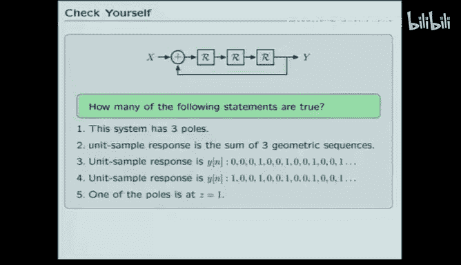

根据根轨迹，为了获得尽可能快的系统响应，应选择哪个 `K T` 值？
选项：1) `K T = -2`， 2) `K T = -0.25`， 3) `K T = 0`， 4) `K T = 1`

**答案分析**

对于二阶系统，其响应可以分解为两个一阶模态的加权和。响应速度由最慢的那个模态（即主导极点）决定。最慢的极点是离单位圆最近的那个。因此，为了获得最快响应，我们希望最慢的极点尽可能快，即所有极点的幅度都尽可能小。当两个极点重合于实轴上离原点最近的位置时，通常能达到最快收敛。从根轨迹看，当 `K T = -0.25` 时，两个极点重合于 `z=0.5`，这是稳定前提下能使极点幅度最小（0.5）的配置。因此，答案应为 **2) `K T = -0.25`**。

### 延迟的普遍影响

我们首先分析了传感器无延迟的墙循迹系统，发现其由单极点表征，我们可以通过选择增益将该极点放在实轴上任一位置，甚至放在原点以获得极佳性能。

有趣的是，当在传感器中仅增加一个延迟，使系统多出一个极点后，系统变得更复杂，性能也远不如前。事实上，如果分析在传感器中增加更多延迟的情况，会发现性能更差。

由此可以推广出一个一般性结论：**在反馈环路内增加延迟是破坏稳定性的因素**。通常，随着延迟数量的增加，你不得不降低所能使用的最大增益，因为系统变得更难稳定。总的来说，延迟是有害的。虽然可以构思一些特殊方案使其不成立，但在几乎所有实际物理系统中，增加延迟都会使系统更难稳定。这就是我们从实验室墙循迹系统中得到的重要启示：由于传感器、微处理器、模数转换等多个环节都存在延迟，延迟数量很多，因此系统难以稳定。

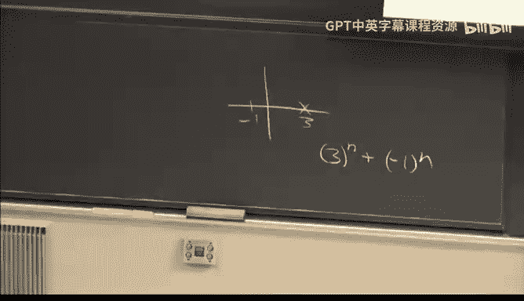

## 高阶系统特性练习

最后，我们通过一个练习来思考如何表征高阶系统的性能。

考虑下图所示系统：
（图示：一个三阶系统，包含三个延迟单元和反馈，具体结构略）

关于此系统，判断以下五个陈述中有几个是正确的：
1.  系统有三个极点。
2.  单位采样响应可以写成三个几何序列之和。
3.  单位采样响应是 `..., 0, 0, 0, 1, 0, 0, 0, 1, ...` 周期序列。
4.  单位采样响应是 `..., 0, 0, 0, 1, 1, 1, 1, 1, ...` 序列。
5.  其中一个极点在 `z=1`。

**答案分析**

1.  **正确**。将系统函数写成 `R` 的多项式之比，然后替换 `R=1/z`，分母是 `z` 的三次多项式，故有三个极点。
2.  **正确**。通过部分分式展开，任何高阶系统响应都可以表示为多个一阶项（几何序列）的加权和。
3.  **正确**？可以通过差分方程或直接模拟来求单位采样响应。假设系统初始静止（所有延迟单元输出为0），在 `n=0` 时输入 `δ[0]=1`。通过逐步计算，可以发现输出序列是周期为3的序列：`y[0]=0, y[1]=0, y[2]=1, y[3]=0, y[4]=0, y[5]=1, ...`。所以陈述3基本正确（除了初始可能不同，但周期正确）。
4.  **错误**。显然不是全1序列。
5.  **正确**？极点由分母多项式决定。对于这个具体系统，其系统函数可能为 `H = R^3 / (1 - R^3)`？如果是这样，那么极点是 `z^3 = 1` 的解，即三个单位根：`z=1`, `z=e^(j2π/3)`, `z=e^(-j2π/3)`。所以确实有一个极点在 `z=1`。

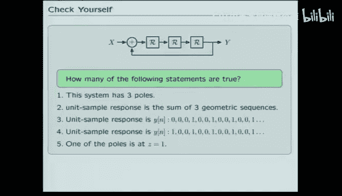

因此，五个陈述中有四个正确（1,2,3,5）。陈述3需要确认初始值，但周期性是正确的。

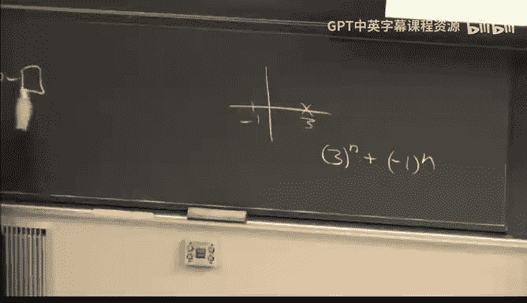

这个练习说明了两个要点：
1.  我们通过观察单极点来推断一阶系统的特性，其行为只有四种简单方式。
2.  二阶系统引入了新的行为（如振荡）。振荡源于复数极点。对于更高阶系统，代数上并无新事物出现，但当我们问及高阶系统的特性时，我们需要根据各个部分来思考，这需要一些推理。例如，**主导极点**的概念（幅度最大的极点决定长期行为），但短期行为可能由其他极点共同影响。此外，周期性等概念对于高阶系统也是有意义的。

## 总结

本节课中，我们一起学习了如何利用系统表示（差分方程、框图、算子、系统函数）来设计和分析控制系统。我们重点探讨了：

1.  **反馈与极点**：反馈引入循环，导致极点，极点决定系统模态（自然响应模式）。
2.  **性能分析**：通过极点位置可以预测系统行为（收敛性、单调性、振荡性）。单位采样响应和阶跃响应密切相关。
3.  **控制器设计**：通过调整增益 `K`，可以改变极点位置，从而优化系统性能（如收敛速度）。
4.  **延迟的影响**：反馈环路中的延迟会引入额外的极点，使系统变得更复杂，通常会对稳定性产生不利影响，限制可用的增益范围，并可能引发振荡。这是实际控制系统设计中需要谨慎处理的关键因素。

通过理解这些基本原理，我们可以在不实际构建系统的情况下，分析和设计出性能更好的控制系统。