# 《电气工程与计算机科学导论1｜6.01SC Introduction to EECS I, Spring 2011》 - P14：-14-Lec 7 _ MIT 6.01SC Introduction to Electrical Engineering and Computer Scien - GPT中英字幕课程资源 - BV1oLBRB5EfQ

The following content is provided under a creative Commons license。

 Your support will help M I T Opencourseseware continue to offer high quality educational resources for free。

To make a donation or view additional materials from hundreds of M T courses。

 visit M I T OpenCseware at O C W dot M I Tt E Du。

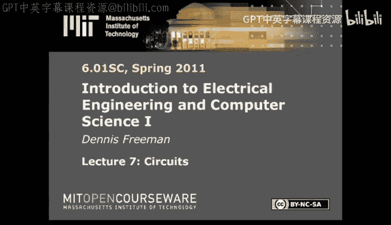

So today I want to start a new topic， Circuits。No， no， no， that's good。 That's good。

Circus were great。Thank you， thank you， much better。So just to provide some perspective。

 I want to remind you where we are， how we got here and where we're going。

 So at the beginning of the course， we promised that there were several intellectual themes that we would talk about。

Probably the most important one there is designing complex systems。That's what we're really about。

 We would like you to be able to make very complicated systems。 How do you think about parts。

 How do you think about connecting them， How do you think about things when you want to make something that's very complicated。

Part of that is modeling。😡，We just finished a module on modeling。

So in order to make a complex system， we'd like to be able to predict how it will behave before we completely build it。

Sometimes it's impossible to build the entire system before sometimes it's impossible。

 to build prototypes。Sometimes you're stuck with going with with the design at launch and figuring out how it works。

In those cases， in specific， it's very important to be able to model it。

 to have some confidence that the thing's going to work。

We're going to talk about augmenting physical systems with computation。

 That's the module we're about to begin。 And we'll conclude by talking about how to build systems that are robust to change。

So we started with the idea of how do you make complicated systems。

 And we introduced this notion of primitive combination。

 abstraction and pattern in terms of software engineering。

 We did that because that's the simplest possible way of getting started。

It provided a very good illustration of Pcap at the low level by thinking about Python。

By thinking about the primitive structures that Python gives you。How those can be combined。

 how you can abstract， how you can recognize patterns。

 But then we also built a higher level abstraction， which was the state machine idea。There。

 the idea was you didn't have to have state machines in order to build the brain for a robot。

 but it actually turns out to be easy if you do， because there's a modularity there。

 you can figure out if each part works independent of the other parts。

 And then you can be pretty sure when you put it together， the whole things going to work。

So that was kind of our introduction to this notion of PAP。

 Then we went on to think about signals and systems。

 and that was kind of our introduction to modeling。

How do you make a model of something that predicts behavior？

 So we transitioned from thinking about how do you structure a design to how do you think about behavior。

Today， we're going to start to think about circuits。 Circuits are really going to a more primitive。

 physical layer。How do you think about actually making a device？

So the device that we'll think about is a thing to augment the capabilities。

 the sensor capabilities of the robot。We'll think about making a light tracking system。

 And the idea is going to be that you'll build ahead。The head has a neck。

So you have to control the neck。 The head has eyes。It'll mount on top of the robot。

 and that'll let you drive the robot around looking for a light。

And you'll do that by designing a circuit。So that's kind of the game plan for the next three weeks。

So today what I want to do is introduce the notion of circuits。

Introduce the theory for how we think about circuits。 And then in the two labs this week。

 the idea will be to become familiar with the practice of circuits。

 How do you actually build something， How do you actually make something work。

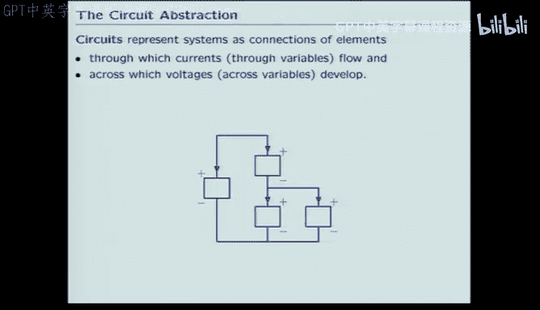

So todays the theory。 So the theory， the idea in circuits is to think about a physical system。

As the interconnection of parts。And rules that connect them。In fact。

 the rules fall into two categories。 We're going to think about the currents。

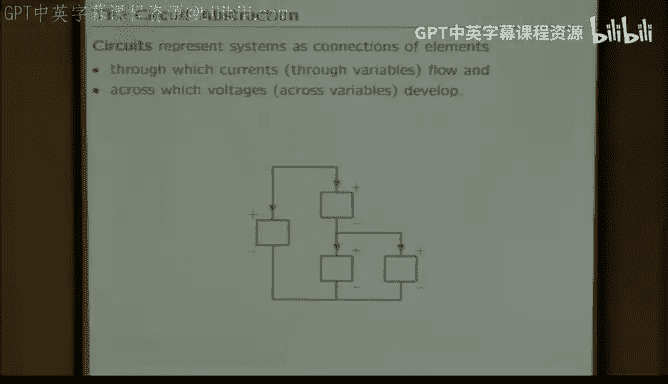

That go through parts。And the voltage that develops across parts。

 And we'll see that there's a way of thinking about the behavior of the entire circuit that integrates all of those three pieces。

 How does the part work， How does the currents that go through the part work。

And how do the voltages that are produced across the park， how do they work？

So I'll just start with two very simple examples。 The first is the most trivial example you can think about。

 You can think about a flashlight as a circuit。

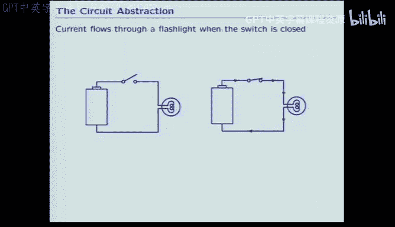

You close the switch， current flows。Very simple idea。

 We will make a model of that that looks like this。We'll think about the battery being a source。

 in this case， a voltage source。We'll think about the light bulb being a resistor。

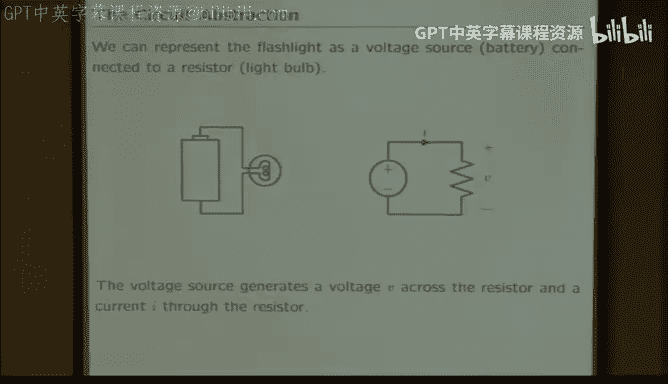

We'll have two parts。 We'll have to know the current voltage relationships for both of the parts。

 and we'll have to know the ramifications for those currents and voltages when you put them together。

Very， very simple。The other simple example that I want to illustrate is this idea of a leaky tank。

 Here， the idea that I want to get across is that the circuit idea is quite general。

When we talk about circuits， we almost always talk about electronic circuits。

But the theory is by no means， limited to electronics。So for example， if we think about a leaky tank。

 we think about a pipe spewing water into a reservoir， maybe that's the Cambridge reservoir。

 maybe that's the water coming out of the Wburn reservoir。

 Maybe that's the demand put on by the Cambridge people trying to take showers in the morning。

 I don't know。 but so we think about flow into a tank， a reservoir and flow out。

 and we can make a model for that in terms of a circuit。In the circuit。

 there are three variables and across variables。In an electronic circuit。

 the through variable is current here， the through variable is the flow rate。

 So it's the flow of water in and the flow of water out represented here by these things that look like currents。

And the across variable for an electronic device is voltage。

 The across variable for this kind of a fluidic device， the across variable is pressure。

So we think of as this thing gets ahead of that thing。

 as there's more stuff coming in than going out， the height goes up and the pressure builds。

 same idea。 So the point is that will develop the theory for circuits in terms of electronics。

 But you should keep in the back of your mind that it's a lot more general idea than just electronics。

In fact， there are two completely distinct reasons why we even bother with circuits。

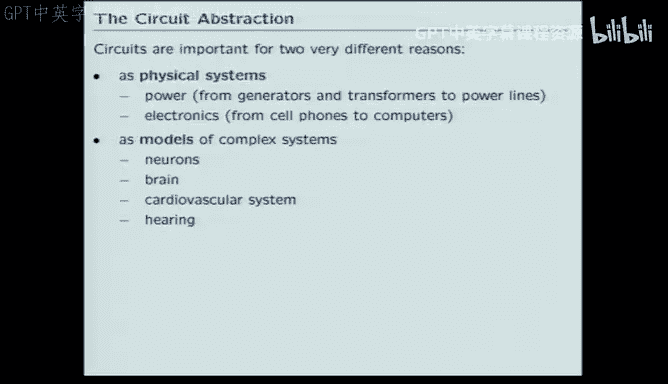

One is。That they're very important to physical systems。If you're designing a power network。

 of course， you have to think about the way the power network， the power grid works， as a circuit。

That's obvious。In electronics， So， of course， if you're going to build a cell phone。

 you have to know how the parts interconnect electronically。 That's obvious。

But probably the biggest use for circuits these days is not those applications。

 although those are very important。Circuulates are also used as models of things。

So many models for complex behaviors are in fact circuit models。

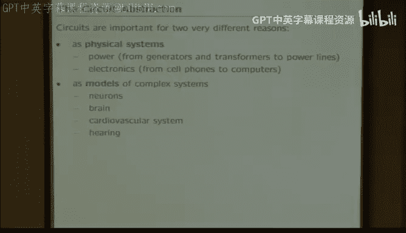

So in terms of electronics， the idea is that we want to get on top of electronics。

 We want to understand how circuits work so we can understand things like that。

If you look at how complex processors have got over my professional life。

 we start with my professional life down at about 1000 transistors per processor。

And today we're up at about a billion。That's enormous。Even in the Stone Ages。

When we were designing things that had 1000 parts， we still had trouble thinking about those thousand parts all at once。

 We still need Pcap。 We still needed ways of combining the activities of many things into a conceptual unit that was bigger here。

 it's just impossible。If you don't have that。So that's one of the reasons we study circuits。

And the other reason is here。 So here I'm showing a model for the way a nerve cell works。

 This model is taken from 6021。The idea， this comes from the study of the Hotkin Huuxity model for neural conduction。

Arguably， the most successful mathematical theory in biophysics。😊。

Which explains the completely nontrivi relationship。Between how the parts from biology works。

And the behavior in terms of propagated action potentials works。

So the idea is that we understand how this biological system works because we think about it in terms of a circuit。

That's the only successful way we have to think about that。

So what I want to do then is spend today figuring out circuits。At the very most primitive level。

The level that I'm going to talk about in terms of circuits is roughly analogous to the level that we talked about with Python。

When we were thinking about how Python provides。utilitiesilities for primitives combinations。

 abstractions and patterns。

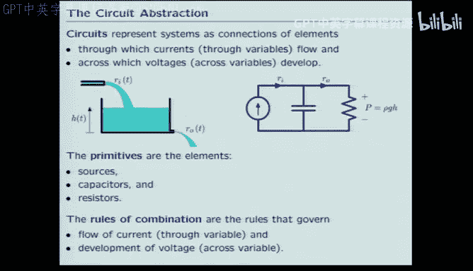

So I'm going to start at the very lowest level and think about what are the basic primitives？

The smallest units we'll ever think about in terms of circuits。

 And what are the rules by which we combine them。So I'll start with the very simplest ideas。

 the very simplest elements。We will oversimplify things and think about the very simplest kind of electronic elements as resistors that obey Ohm's law V equals IR。

Voltage sources， things that maintain a constant voltage， regardless of what you do。

And current sources， things that maintain a constant current。Regardless of what you do。

 these things are， as I said， analogous to the primitive things that we looked at in Python。

 Theyre also analogous to the primitive things that we looked at in system functions。

Can somebody think of when we were doing difference equations？

What were the primitives that we started with？When we started to study difference equations。

 what's the most primitive elements that we thought about。Delay， yeah。

 so we thought about things like。So， we had delay。Anything else？Gain， anything else。Addd。

So we had exactly three primes。And we got pretty far with those three primitives。

We learned the rules for interconnection。Right， we didn't really make a big deal out of it。

 We didn't formalize it。 But the rules for interconnection were something like。

Every node has to have exactly one generator。😡，You can't connect the output of this to this。

 That's illegal。Every node has to have one source， and every node can source lots of inputs。

 That was kind of the rules of the interconnect。 The interconect here will be a little bit more complicated。

So those are the elements that we'll think about。

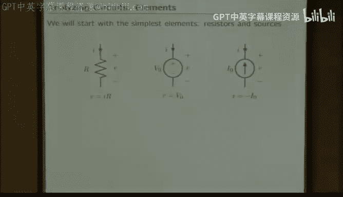

And the first step is going to be to think about how do they interconnect？

The simplest possible interconnections are trivial。In the case of the battery。

 you hook up the voltage source to the resistor。The voltage source makes the voltage across the resistor 1volt。

If we say the resistor is one ohm， then there's one amp current period done， easy。Similarly。

 if we were to hook up the the resistor to a current source， we would get something equally easy。

 except now the current source would guarantee that the current。Through the resistor is an amp。

Therefore， the voltage across the resistor by Om's law would be a va。

 So we would end up with the same solution for a completely different reason。Here。

 the voltage is constrained。 Here's the currents constrained。Just to make sure everybodys with me。

Figure out。What's's the current I that goes through this resistor， slightly more complicated system。

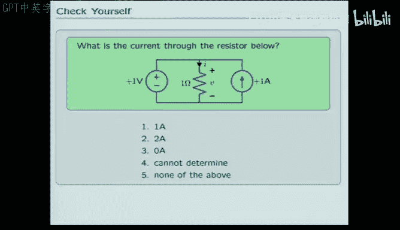

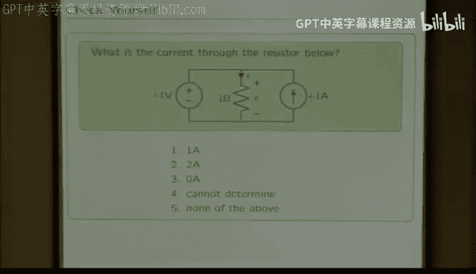

Take 20 seconds， talk to your neighbor， figure out a number between one and five。

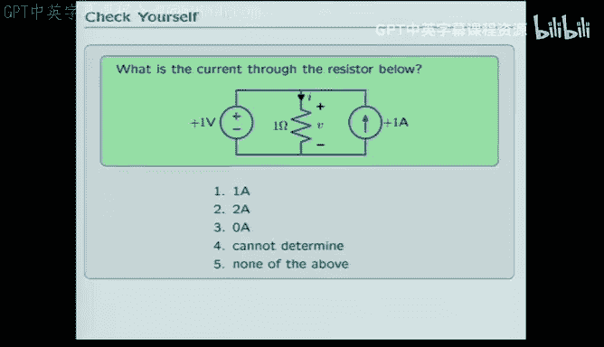

Okay， so what's the answer， Everybodybody raise your hand with a number one through5。 Come on。

 come on come on。 everybody vote， Come on， come on， come on。 You can blame it on your neighbor。

 That's the rules， right， You talk to your neighbor。

 then you can blame dumb answers on your neighbor。Okay， about 80% correct， I'd say。

So how do you think about this， What， what's going be the current。

 How would you calculate the current， What do I do first。Shout if you shout。

 and especially if I hit away from you there who you are。Here wonderful， which one。也是は。

What loop do you want to use？Left side， so if we use the left side move。

We concluded that there's a boltt across the resistor， so the current would be。And那样。我也去看了看场。

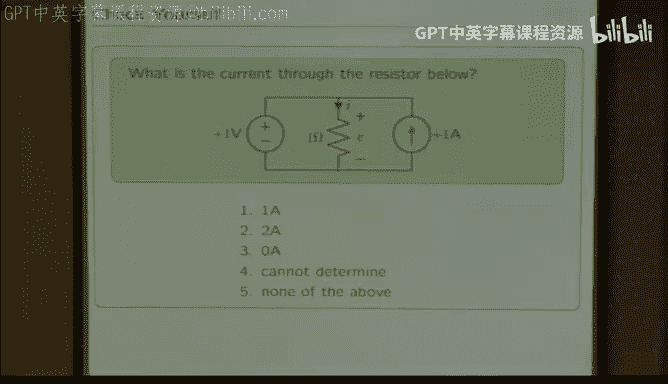

The voltage source just like before， right？所以他反应。So the voltage source establishes this voltage would be one。

 that makes this current be one。That would be consistent with the current coming out of here。

 except we have to also think about that one amp source。So the question is， what's one a source do。

 nothing。It's just there sort for decoration or for offfu stations so that we can make an interesting question to ask and lecture。

啊北京。So where's the one anth that go through the resistor come？It comes from the right。

 it comes from the current over here， so the idea is that if this current ignore the voltage over here for the moment。

 if this current flowed through the resistor， then you'd have one amp going through there and you'd have one vol generated by that current。

 which just happens to be exactly the right voltage。To match the voltage from the voltage source。

So if you think about this， the voltage guarantees that this is one volt， but so does the current。

In order to simultaneously satisfy everything， all you need to do is have all of this current go around and come down through that resistor。

That'll generate the volt。 So there's no propensity for more current to flow out of the source because the source is one volt and it's facing a circuit that's already one volt。

So the idea is to try to give you something that's relatively simple that you can think through on your own。

 but not trivial。 So the answer was one amp， but the one amp was not for the trivial reason。

 The one amp is because the current from the from the right flows through the resistor and makes the voltage be one Okay。

 so so so the right answer is one， but for the reason that you might not have originally thought。

But more importantly， I wanted to use that as a motivation for thinking about。

 how do we think about bigger circuits。So when the simple circuit， like two parts。

 there's no problem figuring out what the answer is going to be but when the circuit has even three parts。

 it may require more thinking and you may want to have a more structured way of thinking about the solution。

 yes。

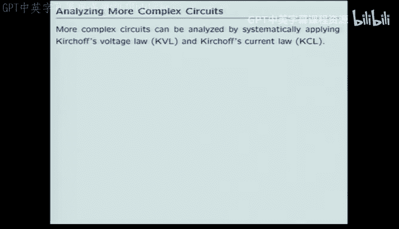

Provider on the right side please。Great question， had this been two hands？😊。

You can't violate this voltage。So that would have been one vote。

So that would have been one amp through the resistor。

So then you're left with the problem that this guy's pushing two， and that guy's only eating one。

But the rules for the voltage source say eat or source。

 however much current is necessary in order to make the voltage equal to one。

 So the excess amp goes through the voltage source。So the voltage source is， in fact。

Being supplied power rather than supplying power itself。Had this been two ammps。

 some of the power from this。Soaurus would have gone into the resistor。

And some of the power from this source would have actually gone into the voltage source。

 So if the voltage source were， for example， a model for a rechargeable battery。

That rechargeable battery would be charging。Does that make sense？

So if there had been a mismatchching the conditions。

 you still have to satisfy all the relationships from， from all the sources。

What if the voltage was splueric？It same they would have happened that now flow of power would within in the opposite direction。

 Let's say that if the voltage here had been two vols。

 then the voltage would have required that there is two amps flowing here。

One amp would come from here。But another amp would come from here。

 This voltage source will supply whatever current is necessary to make its voltage law real。Okay。

In fact， what we'll do now。Is turned toward a discussion of more complicated systems that will let you go back and in retrospect。

 analyze all those cases that we just did。 And you'll be able to see trivially how that has to be the right answer。

 So what I want to do now is generate a formal structure。For how you solve circuits， yes。

Kn of anything that could generate。Gerrated。Can anything generate a current without generating of all these。

 That's a tricky question。If you think about something as generating a current。

Then the voltage is not necessarily determined by that part。So that's kind of illustrated here。

 If this guy is generating a current。This guy is not actually the person who the the element that is controlling its own voltage。

In general， if you want to speak simultaneously about the current and voltage across the device。

You have to know what it was connected to。Each part will。

 will'll get to this in a moment in case some of you are worried about launching ahead。

 We will cover this。 So this is not， this is， this is very good motivation for figuring out what's going to happen in the next three slides。

So each part。Gets to tell you one relationship。Between voltage and current。Generally speaking。

 that's not enough。To solve for voltage and current， voltage and current is like two unknowns。

Each element relationship is one equation。So the current source gets to say current equals x。

 current equals1 amp。Doesn't get to tell you what the voltage is。

So being a little more physical to try to address your question more physically， there are processes。

That can be extremely well modeled as current generators。In fact。

 many electronic semiconductor parts， like transistors。

 work more like a current source than like anything else。

So there are devices that behave as though they were current sources。

But they don't simultaneously get to tell you what is their current and what is their voltage。

 They only get to tell you， what is their current。Okay。So let's think about now。

 if you had a more complicated system。How could you systematically go about finding the solution。

As was mentioned earlier， there's something called Kerka Law， in fact， there's two of them。

Kierhouse voltage law and Khouse current law， Khouse voltage law。In its most elementary form。

Says that if you trace the path around any closed path in a circuit， regardless of what the path is。

 Every closed path， the sum of the voltages going around a closed path is 0。So for example。

 in this circuit。The red。The red path illustrates one closed path through the circuit。

 It goes up through the voltage source down through this resistor and then down through that resistor。

Kac cost' voltage law says。The sum of the voltages around that loop is 0。

That's written mathematically here。 minus v1 for here plus V2 for here plus v4 for here is 0。 Okay。

 where did the signs come from， The signs came from the reference directions that we assigned arbitrarily。

To the elements， before I ever do a circuit question， I always assign a reference direction。

Every voltage has a positive terminal， and a negative terminal。

And I must be consistent in order to apply these rules。 these rules only work。

If I declare a reference direction and stick with it。If midway through a problem， I flip it。

 I'll get the wrong answer。So the minus sign has to do with the fact that as I trace this path。

I enter the minus part of this guy， but the plus part of that guy and that guy。

 So that the s of V1 is negated relative to the others。A different way to think about that is here。

 We can think that V1 is the sum of V2 and V4。 That's sometimes more intuitive because if you started here。

Going through this path， you would end up with a voltage that is V1 higher than where you started。

Whereas starting here， you would end up with a voltage here。 this V4 higher than where you started。

And then by the time you got to hear it would be V2 plus V4 higher than where you started。

You start one place and on one route， you end up V1 higher。 and in the other route。

 you get V 4 plus V2 higher。 So it must be the case that V1 is the same as V 2 plus V 4。

Those are absolutely equivalent ways of thinking about it。So those laws are equivalent。

 If you think about it as a path， you think about some of the path， some of the paths， No。

 the path coinciding with the negative direction of some of the elements and the positive direction of others。

Okay。How many other paths are there on？Take 20 seconds， talk to your neighbor。

 figure out all the possible paths。

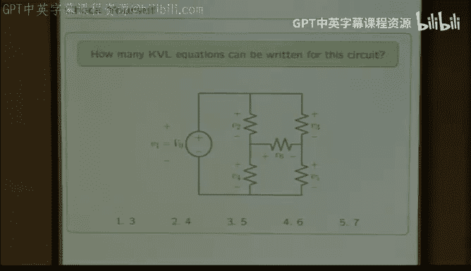

For which KBL has to apply。Okay， so everybody raise your hand and show a number of fingers equal to the number of KVL equations。

 less 2。That very good。Is virtually 100% correct， why do you all say five？W just to say seven。

Why do you all say seven？So there's three obvious wins。 I was expecting a couple of threes。 right。

 This was supposed to be， okay， yeah， I do plot against you。I was expecting some threes。

So there's three obvious paths that are analogous to the first one we looked at。

 if I call the first path A， then there's B and C， which are the excursions around here。

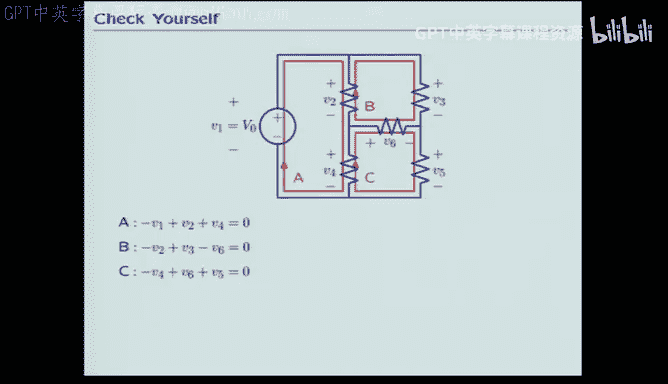

And you can write the equations just the same。 They each involve three voltages。

 and they each go through some starting at the negative side and some starting at the positive side。

So those are， in some sense， the obvious ones， but there are others， too。

So one way to think about it， what I'd like you to do is enumerate all the path through the circuit。

 I should have said all the path through the circuit that go through each element each element one or fewer times。

I don't want you to go through the same element twice。

So here's another path that would go through elements at most one time。 So up through here。

 over through here， which didn't go through any elements down through that element across that。

 down through here， etc。And you get an equation for that。Here's another， here's another。

 Here's another。And if you try to think about a general rule， a general rule is something like。

 how many of those panels can you make and past together。Where the loop goes through the perimeter。

You're not allowed to go through an inner place because if you went through an inner node。

 you'd have to go through it twice。 You， if you wanted the path to go through an inner element。

 you'd have to go through that element twice。

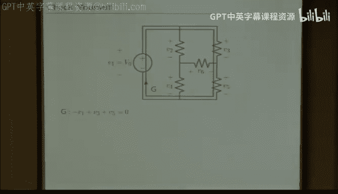

So， in fact， the answer is 7。 There are 7 different ways，7 different paths， all of which。

According to the Ker cost voltage law， all of which the sum of the voltages around those past has to be 0。

The problem is， of course， that those equations are not all linearly independent。

So if you just had a general purpose equation solver， and by the way。

 we'll write one of those in week8。For solving circuits。

 if you just passed those seven equations into a general purpose equation solver。

 it would tell you there's something awry with your equations because they're not linearly independent。

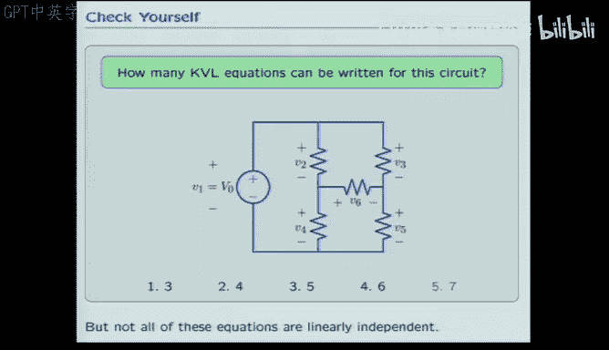

So you can， however， think about linearly independent， in particularly simple cases。

 this network is a particular kind of network that we call a planar。Network。

 a planar network is one that I can draw on a sheet of paper without crossing wires。

So I can draw this network without crossing wires， I'll call it planar。

 and it turns out that the K cost voltage laws for the innermost loops are always independent of each other。

That's kind of obvious because as you go to， each loop contains at least one element that some other loop didn't have。

So that's kind of the reasoning for why it works。So if you think about this particular loop。

 which we included in the seven。You can think about that as being the sum of the loops this way。

 the A loop and the B loop， Because if you write K VL for the A loop and KVL for the B loop and add them。

You end up deriving KVL for the more complicated path。And if you think about what's going on。

 it's not anything terribly magic。This path is the same as the A path。

Added to that path where I went through this element down when I did the A path and up。

When I did the B path。So those parts canceled out。 That was the rule that I was talking about how I don't really want to go through the same element twice。

When I'm applying KVL。So the idea then， is that theres a systematic way。

 an easy way to figure out all the K V L loops。You just think about all the possible paths through the circuit。

 You do have to worry about linearly independent。In the case of planar networks。

 that's pretty straightforward。 The planar networks。

 you can always figure out the linearly independent KVL equations by looking at the smallest possible loops。

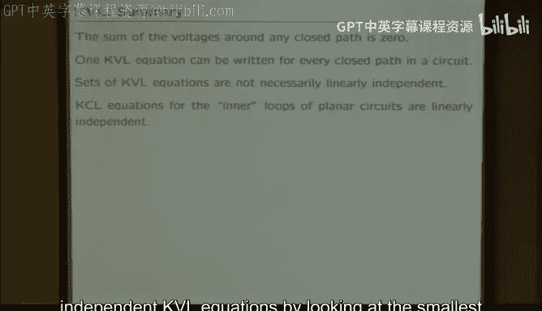

The loops was small area。Okay， so that's half of it， that's KDL。 The other Krov's law is KCL。

 Kirovoff's current law。There we're thinking about the flow of current。😡。

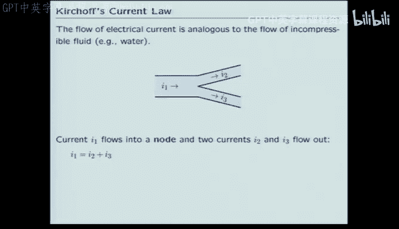

So the flow of current is analogous to the flow of the incompressible fluid。Water， for example。

If you trace the amount of water that flows through a pipe that goes into a why。

Then the sum of the flows out has to equal the flow in。If that weren't true。

 the water would be building up。😡，So we think about pipes as transporting the flow of water without allowing it to build up anywhere。

 That's precisely how we think about wires。In electrical circuits。

The wires allow the transport of electrons， but don't allow the buildup。Of electrons。Okay。

 do electrons build up。 Sure。 but we don't let in our idealized world。

 we say they don't build up in the wires。 They build up in a part and we'll have a special part that allows the electrons to build up。

 So we're not excluding the possibility that they build up。

 We're just saying that in our formal in this formalism。

We don't allow the electrons to build up in the wires。 So for the purpose of the wires。

 current n is equal to the current out。 The net current in is 0。

So we will think then about the circuit having nodes。

The nodes are the places where the elements where more than one element meets。

 two or more elements meet。And we will apply KCL at each node。So， for example。

 in this simple circuit where I would have three parts。Connected in what we would call parallel。

They share a note at the top， and they share a note at the bottom。

So even though it looks like there's multiple interconnects up here， we say that's one node。

And we would say that the sum of the currents into the node is equal to the sum of the currents out。

So if I labeled all the possible currents that come out of that node， I would have I1， I2， I3。

 I1 goes through the first one， the second one， the third one。

And so I would conclude from Kate Kirkho's current law that the sum of I1， I2 and I 3 is 0。Okay。

 easy， right。As I said。We're going to make an abstraction。

Where the electrons don't build up in the wires。They don't even build up in the parts。

They do get stored in the parts， it a little confusing， we'll come back to that。

If they don't build up in the parts， then the current that goes in this leg has to come out that leg。

If that's true， then I1 is I4， I2 is I5， I3 is I6， and we end up with another equation down here。

 which turns out to be precisely the same as the one at the top。Okay， everybody's happy with that。

So we're thinking about this just the way we would think about water flow。

If there's water flow into a part， it'd better be coming out。If there's water flow in a pipe。

The water that goes into the pipe better come out of the pipe someplace。

So here's an arbitrary network made out of four parts。

 how many literally independent KCL equations are there。

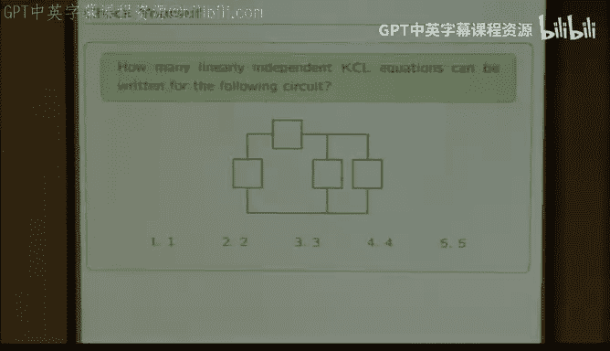

So how many linearly independent KCL equations are in that network？You're going to raise your hand。

Some number of KCL equations。Okay， I seeing a bigger variety， I see ones， twos and threes。

 I don't see any fours。 That's probably good。So how do you think about the number of linearly independent KCL equations。

So first thing to do is to leave more things。

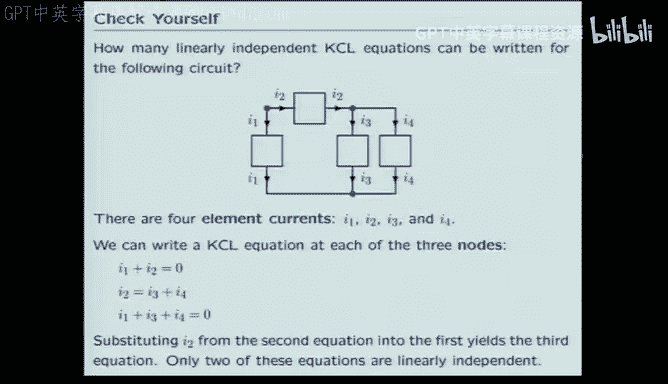

喂。All of these， so you have to have reference directions before you can sort of think about things。

So we have four elements。 We would be expecting to see four element currents。

The same current that goes into an element has to come out of it。So there's element current， one。

 two， three， and four。There are three nodes。So we might be expecting three。K CL equations。

 here's one node。From which you would conclude that the sum of I1 and I2 better be0。

Here's a node from which you would conclude that the current in I2 better be I3 plus I4。

And here is a node from which you would conclude that I1 plus 3 plus 4 is 0。

So I can write one KCL equation for every node， that's not surprising。

But if you look at those equations， you'll see that they're not linearly independent。 In fact。

 if you solve this one for I2 it's already solved for I2， stick that answer up here。

You get I 3 plus I 4 added to I 1 is 0， which is just the same as that equation。

So that there of those three equations， only two of them are linearly independent。

To the answer to that problem was two。And there's a pattern。

So think about the pattern in terms of figuring out the number of linearly independent K CL equations are in a slightly more complicated network。

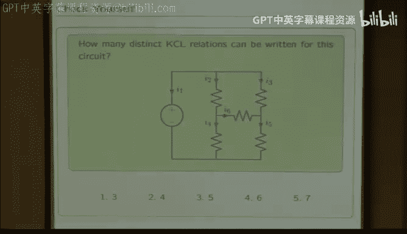

So what's the answer here， how many？How many KCL equations are in this network？W哦。Wow。😮。

Not getting any of the answers I would have said what does that mean。嗯。I'm forgetting to add tool。

 That's my problem， okay。Now I'm getting some of the answers that I would expect to get， okay。

 got it。I confused myself。Okay， the vast majority say one， how do you get that。

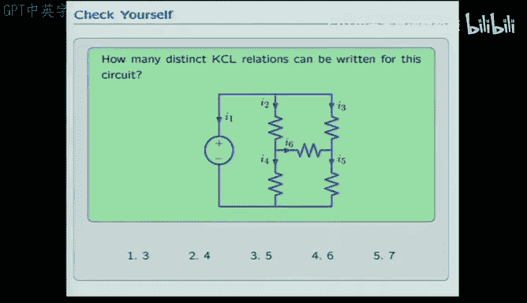

Which is 3。So again in this sur， there are four nodes， ABCD。

So we can think about writing a KCL equation for each one if we go to A。

 a has three currents coming out of it，1，2，3， so the sum of those has to be zero。Et cetera。

And if you think about those equations， they're not linear independent either。

If you work through the math， you see that there's exactly one of those equations that you can eliminate。

So you're left with three linearly independent KclL equations。And so there's a pattern emerging here。

 somebody see the pattern？1 minus， can somebody prove the pattern。So there's a pattern here。

 The pattern is， take the number of nodes。And the number of independent KCL equations is one less。

So the challenge is， can you prove it？And by the theory of lectures。Yes。

And by a corollary of the theory of lectures， the way you would prove it is。

On the next slide on the next slide， exactly。So how do I prove it？亮。

I if there's something that's special about the life。

 why should it be something special about the life？😊，Because of circuit's closed。 So that's right。

 So the idea is to sort of generalize the way we think about KCL。So we start with the circuit。

 we think about having four nodes here。It's certainly the case that KCL holds for each node。

 so here's KCL for that node。But now if you think about KCL for this node。And then add them。

That looks like a K CL equation。But it applies to a super node。

Imagine the node defined by the black box。And think about the net currents into or out of the black node。

This current I2， which leaves the red node。Enterers the green node。

But doesn't go through the surface of the black node at all。

That's exactly the current that subtracted out when we added the red equation to the green equation。

Does that make sense？So K C， L says， oh， if all of the currents at a node have to sum to 0。

And if elements have the same current coming out and going in。

Then if you draw a box around an element。What goes into the element is the same as what comes out of the element。

 It doesn't change the net current through the surface。 So the generalization of the K CL equation。

 K C L says the sum of the currents into a node is 0。 The generalization says。

 take any closed path in a circuit。The sum of the currents going across that closed path is0。

So if we apply that rule again， think about node 3。If we add the result of node 3 to the black node。

 which was the sum of one and2， we get the new green curve。We get the new green equation。

 And what that says is some of the currents going across the green super node。Okay。

 so what's going on， The I1 is coming out of it。 I4 is coming out of it， I5 is coming out of it。

 So the sum of I1，4 and 5 has to be 0。So the generalization of K， C， L is that， well， K。

 C L says sum of the currents coming out of a node must be 0。

The super K C L says the sum of the of the currents coming out of any closed region。Is also0。

But the interesting thing about this closed region。Is that it encloses all but one of the nodes。

That's always true。 regardless of the system。 regardless of the circuit。

 you can always draw a line that will isolate one node from all the others。

So what that proves is that you can always write KCL for this node in terms of KCL for those nodes。

Okay， so there's a generalization then that says that you can always write。KCL for every node。

They will always be linearly dependent， so you can always throw away one。

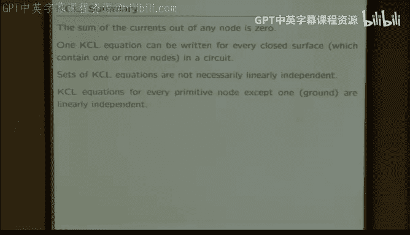

So in some sense， now， we're done。 We've just finished circuit theory。

 We talked about how every element has to have a law。 A resistor is Ohm's law。

 A voltage source says that the voltage across the terminals is always a constant。

 A current source says that the current through the current source is always a constant。

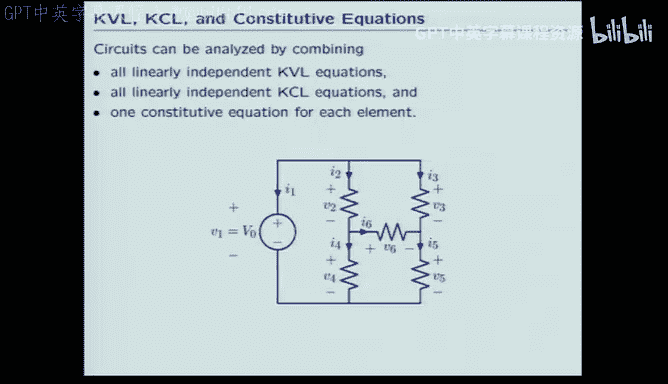

So every element tells you one law。we know how to think about KVL。

 So we know the rule for how the across variables behave。

What's the aggregate behavior of all the across variables as Well。

 KP L has to be satisfied for every possible loop。 The loops don't have to be independent。

 You have to worry about whether they're independent。

 The only simple rule we came up with will'll come up with another one in a moment。

 The only simple rule that we came up with was for planar circuits where the innermost loops were linearly independent of each other。

 And you have to write K C L for all the nodes， except one。

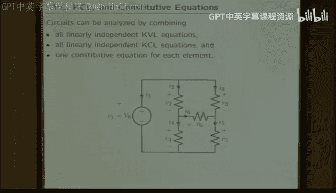

Right，1， one of them never matters。So in some sense。

 we're done what we would do to solve the circuit。 Think about every element。For every element。

 a sign a voltage， a reference voltage。For every element assign a current。

Make sure they go in the right direction。 We always define currents to go down the potential gradient。

 They always go in the direction through the element， from the positive to the negative。

So for every element， a sign a current and a voltage each。We have six elements。 That's 12 unknowns。

Now， we dig and refine find 12 equations。In this particular circuit， we found those 12 equations。

 there were three KCL equations， one for each of the inner loops， there were three KCL equations。

 one for each node， except one。There were five Ohm's law equations。

 one for each one of the resistors。 there was one source。Equation for the voltage source。

 12 equations， 12 unknowns were done。The only problem is。A lot of equations， right。

 It's not a very complicated circuit。 We've only got six elements。

 I told I tried to motivate this in terms of studying networks that had 10 to the10 to the9 elements。

 right。This technique is not particularly great at 10 to the ninth， it would probably work。

But we would probably be interested in finding simpler ways。

So there are simpler ways you might imagine。And we'll discuss two of them just very briefly。

The dumb way that I just talked about is what we call primitive variables， element variables。

 If you write all the element variables， V 1， V2 v3 V4， V5 v6， all the element currents I1， I2， I2。

 I4， I5， I6。 right， all the equations， you can solve it。 However， if you're judicious。

 you can figure out a smaller number of unknowns and a correspondingly smaller number of equations。

 One method is called the node method。When we're thinking about the individual element。

 the thing that matters is the voltage across the element。However。

 that's not the easy way to write the circuit equations。

A much easier way is not to tell me the voltage across an element。

 but instead tell me the voltage associated with each of the nodes。😡。

If I tell you the voltage associated with every node。

The important thing about that way of defining the variables is that you're guaranteed that from those variables。

 you can tell me the voltage across every part。So， for example， in this circuit， this voltage source。

 So if I call this one ground。We'll always have a magic node called ground。

 It is not special in the least。😊，It's just the reference voltage。 I'll come back to that。

 I'll say words in a minute about what the reference is。

 We always get to declare one node to be ground。 we get one free node。

It's a node whose voltage we don't care about。Because it's the reference for all voltages。

 It's a node who's current。 we don't care about。 because we get to throw away one node when we do current equations。

 So we have one special node called ground about which we don't care too much。

 except that it's the most important node in the circuit。 except for that。 we don't care about it。

 So so this guy's ground。We think about its voltage being 0。

 Then this voltage supply makes that node be v n。I don't know what that is。 So I'll call it E1。

 and I don't know what that is。 So I'll call it E 2。

So if I tell you the voltage on all of those nodes， grounds voltage is 0。 The top voltage is V。

The left voltage is e1， the right voltage is E2 from those four numbers。

Zero and three non trivial numbers。You can find all of the component voltages。 So for the example。

 the voltage V 6， the voltage across R 6 is E 2 minus E1。The voltage V4。

 the voltage across the R 4 resistor is E1 minus0。So if I tell you all the node voltages。

 you can tell me。All of the element voltages。 And in general。

 there's fewer nodes than there are components。 Okay， that's good， right。

So instead of naming the vas across the elements， we'll name the voltages at the nodes because there's fewer of them。

嗯。Then all we need to do in the node method is write the minimum number of。It'sKCL equations。

We know we only have two unknowns， E1 and E2。 And it turns out， and you can prove this。

 but I won't prove it today。It turns out that you need two K C L equations， right，2 unknowns。

 you want E2，2 K C， L equations。And it turns out those two KCL equations are exactly the KCL equations associated with the two nodes。

So the current leaving E1， so KCL at E1， well， there's a current that goes that way。Well。

 that's the voltage dropping going from E1 to v E1 minus v， divided by R2。 That's Ohm's law。

So this term represents the current going up that leg。Plus the current that goes through this lag。

 which is E1 minus E2 over r6。Plus the current going in that leg， which is e1 minus0 over r4。

 the sum of those three currents better be 0。And allously。

 the sum of the currents at this node must be 0， and the equation looks virtually the same。

Because V n is known。 So it didn't add an unknown。VO was set voltage by the voltage source。

So I have two equations， two unknowns。Solved， done。

 So rather than solving 12 equations and 12 unknowns。

 I can do it with two equations and two unknowns。 That's called the node method。

One of the most interesting theories about circuits is that。

Every simplification that you can think about for voltage has an analogous simplification that you can think about in current。

 That's called duality。 We're going to do that because it's kind of complicated。

 But it's kind of a result。 If you can think of a simplification that works in voltage。

 then there is an analogous one。 and you can prove it。 In fact， you can。

Formerly derive what it must have been。So this is a rule for how you can simplify things by thinking about voltages in aggregate。

Rather than thinking about the element voltages， Think about the node voltages。

 The analogous current law is， rather than thinking about the。Currents through the elements。

 the element currents think about loop currents。 Okay， that's a little bizarre。So we name the loop。

 the current that flows in this loop， I A， the current that flows in this loop， I B。

 and the current that flows in this loop， I C。 What on earth is he doing。

 Well the element voltages are some linear combination of those。Loop。Currents and， in fact。

 the coefficients in the linear accommodation are  one and -1。 So the element current I 4。

The current that flows through the R4 resistor is the sum of IA coming down minus I。

 which is going up。So there's a way of thinking about each element current。

As a summer difference of the loop currents。Everybody get that。

So instead of thinking about the individual element currents， I think about the loop currents。

 And now I need to write three K V L equations， right， So in the node method。In the node method。

 I named the nodes and had to write two K CL equations。Here， I named the loop current。

 and I have to write three K VL equations， one for each loop。It's completely analogous。

 If you write out a sentence， what did you do， I assigned the voltage to every node， and I wrote K C。

 L at all the nodes。 Then if you turn。The word current into the wordva each。

 the word node into the word loop。You derive this new method。

So this says that if I write K VL at the A loop， think about spinning around this loop。

As I go up through the voltage source。So I go in the negative terminal here， so that's minus v0。

As I go down through this resistor， I have to use Ohms loss。 So that's R2 times the down current。

 Well， the down current is I A down minus I B up。So I went up through here。

 down through here and now I go down through this one。 when I go down through that one。

 that's the R according to homessol， that's R four times the current through that element。

 that current， well， it's IA down。And as I see up。 So this is the the K VL equation for that loop。

 I write two more of them。And I end up with three equations and three unknowns。

Both the node method and the loop method resulted in a lot fewer equations。Then the primitives did。

 right， I had 12 primitive unknowns，6 voltages and six currents。In the node method。

 I get the number of independent nodes as the number of equations and unknowns。

 which is less than the number of primitive variables。 In the loop method。

 I have the number of independent loops。Which is again， smaller。

So the idea then is that we have a couple of ways to think about solving circuits。Fundamentally。

 all we have are the element relationships。And the rules for combination。

 this is starting to sound like Pca， primitives and combinations。 So the primitives are。

How does the element constrain the voltages and currents。We know three of those owns law， Volaurus。

 currentaurus。And what are the rules for combination， well。

 the currents add to the node and the voltages add around loops。Okay。

 just to make sure you've absorbed all that。Figure out the current eye for the circuit。

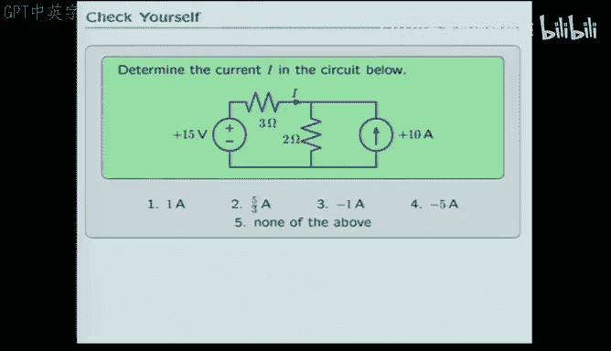

Okay， what's a good way to start？What should I do to start thinking about calculating I。Okay。

 bad way。 assign voltages and currents to everything，4 elements。 That's four voltages，4 currents。

 That's 8 unknowns。 find 8 equations， solve。 that'll work。Bad way， what's a better way？Okay。

 working to very much。😊，We've got a previous sheet because it check yourself。K me out for。这不是。

So you can the out of the left loop。AndOkay， that's begin count out side barriers。

Do you want eight primitive variables？E per variables are V1， i1，2， I2， V23， I3， V4， I4， right？

So that's what I mean byccitive variables， right or element variables is another word for it。

What's a better way than using element variables？对。ては。クリエイチブにます。でらい。

So if you do I1 going around here。Then I1 is actually I。Right。And if you do I，2 going around here。

 what's I2。So if I think about I2 spinning around this loop。

So the sum of i1 and i2 goes through that box。But the only current that goes through this box is。

So the suggestion is that I think about。So if I have， I want here。But I know that's I。

 Then I can see immediately since the only current that goes through here。 So I have I1 and I2。

 That was a very clever idea。 If you have I want an I2， the only current that goes through here is I。

 So I1 must have been I。The only current that goes over here must have been this guy。

So this must be minus 10。Right。So I could redo that this way。 I could say， I've got。

10 going that way。That makes sense。So now I only have one unknown， which is I。Right。

 so that's a very clever way of doing it。So what I could do is showed here。

I have I going around one loop。And I have 10 going around that loop。

That completely specifies all the currents。 So now all I need to do is write KVL for these different cases。

 right。So if I write KVL for the left loop。Then I get going up through here。 That's -15。

 and going down through here， going to the right through。 this guy is 3 I。

Going down through this guy is two times I plus 10。 both of these are going down。

 so you have to add them。So I get one equation and one unknown。 And when I solve it， I get -1。

Does that make sense？There's an analogous way you could have done it with one node。

You could have said that the circuit has a single node。And figured out KCL for that one node。K C。

 L would be the sum of the currents here。 There's a current that goes that way。

 that way and that way。 And again， you end up with one equation of one unknown， yes。今点る。Correct。

 so if I thought about this current going this way， it would be minus 10。If I flip the direction。

 then it's plus 10。So the loop current， the loop current。

Has the property that it's the only current through this element。 So that has to match。

It's one of two currents that go through this element。けだ。This would be ten yes。The time。Correct。

 I went on this page。😊，So if I'm doing it with loops， right， I have two loops。

The current through this element is just I。 The current through this element is just I。

 The current through this element is just 10。The current through this element。

 well the sum of these two currents go through that element。Does that make sense？て。

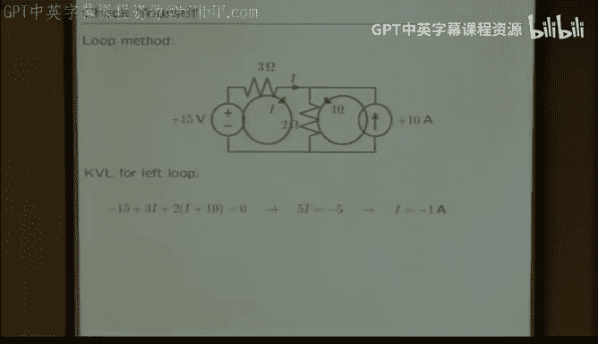

ごめけ。Make the whole week。This new current is just a fraction of the current in the whole system。😊，じゃあ。

This mo current goes through this element。And contributes to this element， but so does that one。Okay。

 if you're still confused， you should try to get it straight out in one of the software labs or the hardware lab or talk to me after lecturer。

 But the idea is to decompose in the case of the node voltages。

 Think about the element voltages in terms of differences in the node voltages。

In the case of the loop currents， think about the element currents in terms of a sum of loop currents。

Okay。So the answer is -1， regardless of how you do it。Okay。

 the remaining thing I want to do today is think about abstraction。We've talked about the primitives。

Which are things like resistors， voltage sources and current sources。Means of combinations。

 that's K V， L and K， C， L。 Now we want to think about abstraction。

 And the first abstraction that we'll talk about is， how do you think about one element。

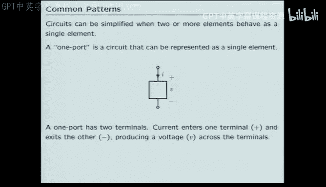

That represents more than one element。This is the same thing that we did when we thought about linear systems。

 when we did signals and systems， we started with R's and k's and pluses。And we made single boxes。

That had lots of ours and pluses and gains in them。 right。

 What was the name of the thing that was inside the box。If we combine lots of R's。

 games and pluses into a single box， what would we call the thing that's in the box。小连。

System function。Right， so we， we started with boxes that only had things like ours in them。

 But eventually we got boxes that looked like much more complicated things。Like that。

 we thought about a system function， which was a generalized box。

They could have lots of rs or lots of gains or lots of pluses in it。

And that was a way of abstracting。Complicated systems。 So they look like simple systems。

 What we want to do here is the same thing for circuits。 We want to have a single element。

 a single circuit element。That represents many circuit elements。

 And the simplest case of that is for series and parallel combinations of resistors。

 It's very simple to think about how if you had two Ohms law devices connected in series。

You could replace those two with a single resistor。

And the voltage current relationships measured at the outside of the box。Would be the same。

That's how we think about an abstraction in circuits。

When is it that you can take a circuit When is it that you can draw a box around the piece of a circuit。

And think about that as one element。 The very simplest case is the series combination of two resistors。

 Sam sort of thing happens for the parallel。Combination。

And that simple abstraction makes some things very easy What would be the equivalent resistance for a complicated system like that。

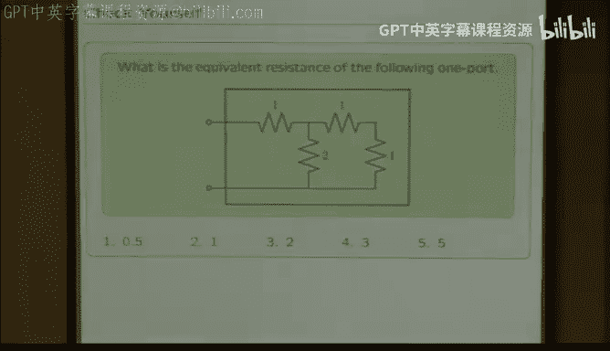

Well， that's easy。All you need to do is think about successively reducing。The pieces。

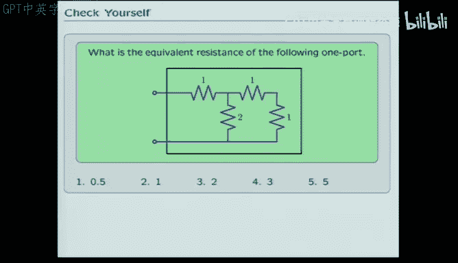

Here I'm thinking about that， having four resistors。

 I can just successively apply series in parallel in order to reduce that， make it less complicated。

 So I can think about combining these two in series to get instead of two， one om resistors， one。

 two o resistor。😊。

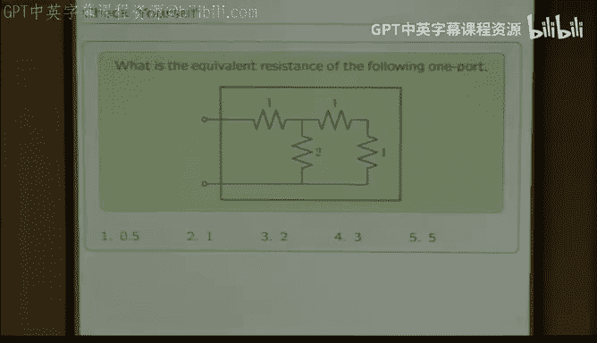

Then I can think about these22ome resistors。Being equivalently one parallel， one om resistor。

And so this whole thing looks as though it's just two ohms from the outside world。

That's what we mean by an abstraction。 What we're trying to do。

 and what we will do over the next two weeks is we'll think about ways of combining circuits。

So that we can reduce the complexity this way。Another convenient way of thinking about reducing the work that you need to do is to think about common patterns that result。

PCAP， right， primitives， combinations， abstractions。

 So the series and parallel idea was an abstraction。 a pattern。 here's a common pattern。

 If you've got two resistors in series。

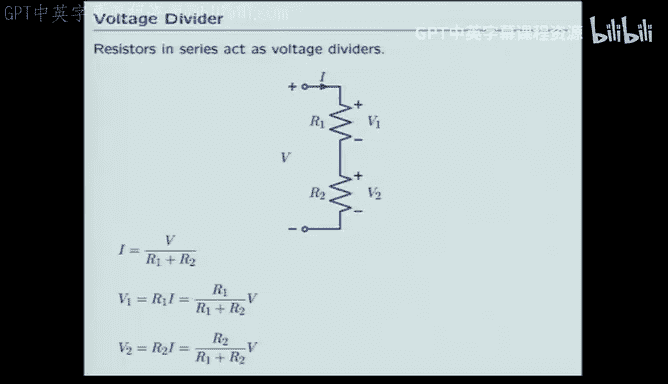

If the same current flows through two resistors。Then there's a way of very simply calculating the voltage that falls across each。

 So you can think about the sum resistor。R1 plus R2， since they're in series。

So that allows you then to compute the current from the voltage。

Then the voltage that followss across this guy is by Ohm's law， just the current times its resistor。

Which is like that。And similarly， with this one。 So you can see that some fraction of this voltage V。

Occurs across the V1 terminal， and some different fraction appears across the V2 terminal。

 such that some of the fractions is， of course， V。 right， That's what has to happen for the two。

And there's a proportional drop， the bigger R1， the bigger is the proportion of the voltage that falls across R1。

So it's a simple way of thinking about how voltage drops across two resistors。

 Theres a completely analogous way of thinking about how current splits。Between two resistors。

Here the result looks virtually the same， except it has kind of the unintuitive property。

That most of the current goes through the resistor that is the smallest。

So you get a bigger current in i1。In proportion to the R2。

So it works very much like the voltage case， except that it has this inversion in it。

 that the current likes to go through the smaller resistor。

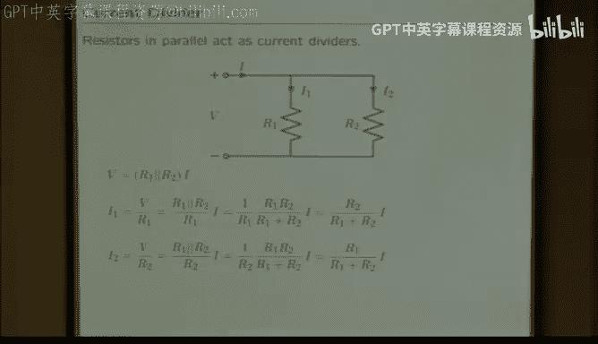

Okay， so last problem。Using those kinds of ideas。Think about how you could compute the voltage v 0 and determine what's the answer。

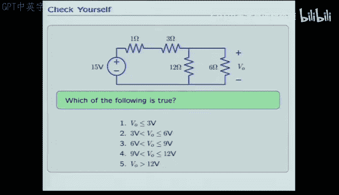

So what's the easy way to think about this answer？What do I do first？So书 position产。这个法项他除过这边现。开完。

what的。So you can treat this as a series combination。

And you can replace the series of one and three with a。4。

So this can be replaced by to our music fair and Iowa。

So mean you replace a how of a six and a2 with a。How amazing are it it for？😊。

So there's a four there and there's a four there and the answer is。

H is whatever what is by voltage dividedr relationship， So you think about this becoming that。

 you think about the parallel， becoming that， you get a simple divide by two voltage divider。

So the answer is seven and a half。Which was the middle answer。

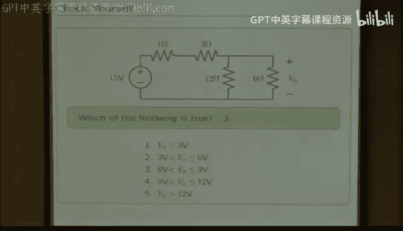

And so what I， what we did today was basically a whirlwind tour of the theory of circuits。

And the goal for the rest of the week is to go to the lab and do the same sort of thing with practical where you build a circuit and try to use some of these ideas to understand what it does。

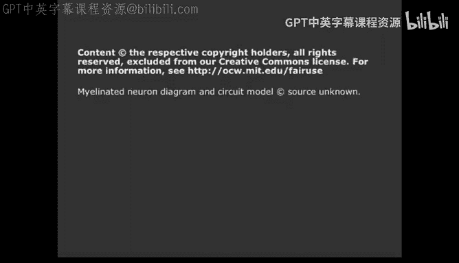