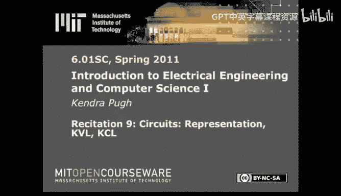
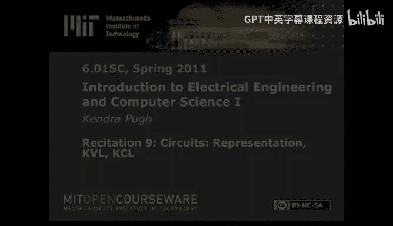

# 电气工程与计算机科学导论1：9：电路基础

在本节课中，我们将学习电路的基本概念。我们将探讨如何表示电路，并介绍一些分析电路的基本方法。电路是我们设计物理世界系统的第一步，也是使用物理组件构建系统的开端。

## 电路表示法

上一节我们介绍了系统建模，本节中我们来看看如何表示电路。电路图在广义上由许多元件和它们之间的连接组成。这些连接形成回路和节点。如果不指定具体元件，电路图看起来很像方框图。实际上，方框图与电路图密切相关，因为方框图常用于建模反馈系统，而这些系统通常由电路实现。

在本课程中，我们将主要关注两种元件：独立源和电阻。我们也会使用电位器（可调电阻）和运算放大器。运算放大器将在后续视频中详细讨论，但这里先画出它的符号以便识别。请注意，它的符号很像方框图中增益模块的符号，这是有意为之的。

我们将使用独立电流源和电压源。我们将使用电阻来调节电路中的电压和电流，然后在电路特定点采样电流或电压，以获得我们期望的数值。

在电路图中，若对某个元件两端的电压降感兴趣，通常用“+”和“-”号标注，这同时也指明了电压降的方向。同样，若对流过某个元件的电流感兴趣，通常会标注电流“I”（可能带下标），并用箭头指明电流流过该元件的方向，以避免与读图或绘图者产生符号错误。

**注意**：这就是电气工程师使用“J”来表示复平面数值的原因，因为“I”已被专门用于表示电流。

## 基尔霍夫定律

现在我们来回顾基尔霍夫电压定律和基尔霍夫电流定律。你可能在物理课上学过，但我们现在快速复习一下。

基尔霍夫电压定律指出，沿电路中任一闭合回路的电压降之和为零。即，如果取电路中某个回路的电压降，它们的总和将为0。

基尔霍夫电流定律指出，流入电路中任一节点的电流之和为零。即，如果取流入和流出某个节点的所有电流，它们的代数和应为零。

## 电路分析实践

让我们在这个具体电路上练习。需要注意的一点是，在一般情况下求解电路时，无论是寻求助教帮助还是在考试中希望获得部分分数，你都应该标注所有节点、所有元件以及所有你要求解的电流。

以下是分析此电路的第一步：

1.  **简化电路**：首先尝试将电路简化为更简单的形式。例如，将并联的两个电阻合并为一个等效电阻。
2.  **应用定律**：对于并联电阻，总电阻的倒数等于各电阻倒数之和。当只有两个电阻时，可以使用公式 `R_eq = (R1 * R2) / (R1 + R2)` 来简化计算。
3.  **分析分压与分流**：简化后，电路可能变为一个分压器或分流器。在分压器中，各电阻上的电压降与其电阻值成正比。在分流器中，各支路电流的分配与支路电阻值成反比。
4.  **求解具体值**：利用基尔霍夫定律和欧姆定律，求解特定的电流和电压值。

通过应用这些步骤，我们可以求解出电路中的各个电流（如 `I1`、`I2`、`I3`）和电压（如 `V1`、`V2`、`V3`）。例如，通过计算等效电阻和应用分压原理，可以求得 `V1 = (5/8) * V`。

---

本节课中，我们一起学习了电路的基本表示方法，回顾了基尔霍夫电压定律和电流定律，并通过一个实例练习了分析简单电路的步骤。我们了解到，电路图是连接抽象系统设计与物理实现的重要工具。下次课我们将讨论分析此电路的其他方法，并最终总结运算放大器的相关知识。