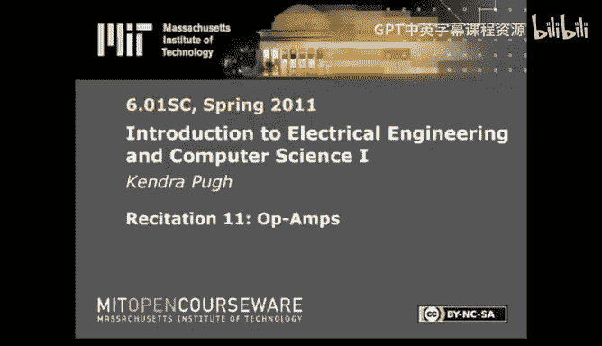
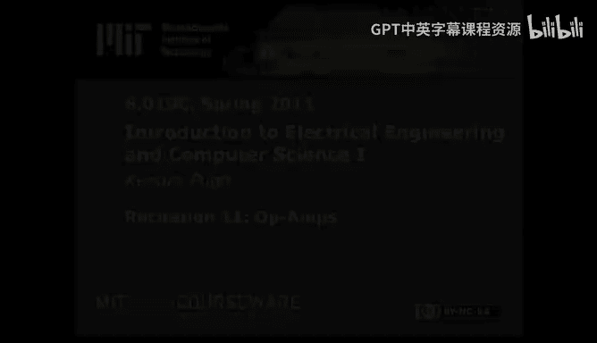

# 《电气工程与计算机科学导论1｜6.01SC Introduction to EECS I, Spring 2011》 - P18：-18-Rec 11 _ MIT 6.01SC Introduction to Electrical Engineering and Computer Scie - GPT中英字幕课程资源 - BV1oLBRB5EfQ

Hi， last time we talked about NVCC method and how to reduce the number of equations we had to deal with to solve a particular circuit at this point we're pretty well equipped to solve circuits in the general sense。

 but we really haven't talked about how to use that information or possibly use circuits in a particular way。

Before we。Jump into both that and abstraction of circuits。 We need to talk about op As。

 Op Amps is short for operational amplifier， and it's the tool that we can use in order to sample particular voltages from a subsection of the circuit without affecting it。

Another thing we can use op As to do is modify our signal。

 or if we're going to sample a voltage from a particular subsection of the circuit。

 we can then do stuff to that voltage without affecting the circuit all within the opAmp or within the op Amps special subset of circuitry。

So first of all， what is an operational amplifier。 Well。

 operational amplifier is a giant web of transistors。

 but an operational what an operational amplifier does is act as a voltage dependent voltage source。

 It can effectively sample voltages from an existing circuit and then use them to power some other object for instance。

 a light bulb。 If you set up this kind of circuit， you will not actually be powering this light bulb with five vols because the light bulb itself acts as a resistor。

 And so the voltage drop across this part of the circuit is going to be different from just five volts。

 If you want to enable a voltage drop of5volts across this。Light bulb。

 then you have to stick up an op amp， you have to use an op amp to sample the voltage drop at this component and put it in between the light bulb。

And the rest of the circuit。When you see an opampmp on the schematic diagram。

 it'll frequently look like this。You'll have a positive input voltage， a negative input voltage。

 power rails， which were actually the thing that determined the range of expressivity that the al band has。

And an output voltage。In reality， the relationship between the output voltage and the input voltages is something like this。

Whereque is a very large number。The effect that this has。

Is that V out is going to be whatever V out needs to be such that。V plus is equal to v minus。

That's the basic rule you want to use when you're interacting with OpPs。So in this case。

 if we wanted a power。This light bulb with five volts。We would do something like this。

Excuse the sloppiness of the second diagram。We still have our 10 vol voltage source。

We still have our voltage divider。This point。Samples5 volts from this sub circuitcuit。And isolates。

This part of the circuit。From the light bulb。V out has to be whatever value is necessary。

Such that this sample point and this sample point are equal。Since this value is5 volts。

This value will also be driven to5 volts by the op amp。Which means that this value is fi。

And we've successfully managed to power our light bulb with fivefolds。

The other thing you might be asked to do。Is to takeche an existing circuit diagram and figure out what the operational amplifier does to a given signal or possibly what V out is or possibly what V out is in terms of the input signal。

So let's practice。Using this diagram。Here's what we're after。I can figure out what V+ is going to be。

This is another voltage divider。I'm now interested in v minus in terms of V out。

Which is another voltage divider。I can set these two equations equal to one another and solve for V out。

I fund an expression for V out in the particular case where V is 10 volts。

If my input voltage were previously unspecified。Or if this voltage source？Pon。

We're not specified or just VN。Then I would be after this expression。

Some things I'd like to mention while we're talking about op。

All the operational amplifiers we've been working with so far。Deal with V out in terms of V in。

Where V N is driven through the positive terminal and the negative terminals is typically connected to ground。

 You can do the opposite and end up with some interesting effects， but it comes at a cost。

 It is entirely possible that you will end up driving your opM to an unstable equilibrium。

What you need to look at is this relationship。There may be a particular point。

In which case your system is stable， but if you get any sort of minor perturbations。

 you'll actually end up with divergence。If this is the case。

 then you'll probably burn out your allamp。You can do this by hooking it up in this way。

This is expensive and could possibly burn you。The other thing to note？

Is that the power rails on your op amp limit its range of expressivity。

 And I think I've said this before， but it's worth mentioning again。

If your opmpP is only powered by 10 volts， it cannot amplify your input signal to a final value greater than 10 volts。

 likewise， if your input value is a negative voltage and you're working with a non-inverting amplifier。

If your ground is truly ground or if your ground is higher relative than your input voltage。

 you cannot actually。Express a negative voltage。The third thing I'd like to quickly mention is that there are some terms associated with Op Amps that you might hear use by the staff or online that sort of thing。

 a buffer and a voltage follower are the same thing and that's explicitly when you want to sample a signal or you want to sample a particular voltage and you don't want to multiply it or add it to something or do any kind of LTI operations that we might be able to do using op Amps in this course。

You can work with amplifiers， and the thing we worked with earlier was an amplifier for a value less than one。

You can also use opampmps to some signals， and if you look for voltage summer amplifier on the internet。

 you should be able to find some information。In any case， opts are really powerful。

 they allow us to both isolate a particular section of a circuit and sample a particular voltage value from that circuit without affecting that circuit and also allow us to modify that particular voltage value before using it in another part of our overall circuit。

嗯。Therefore， we're enabled to design more complicated and powerful things。

 Next time I'll talk about LT I'll talk about superposition and fe and norton equience。

 which will further enable modularity and abstraction in our circuit design。

