# 电气工程与计算机科学导论1：9：电路抽象化方法


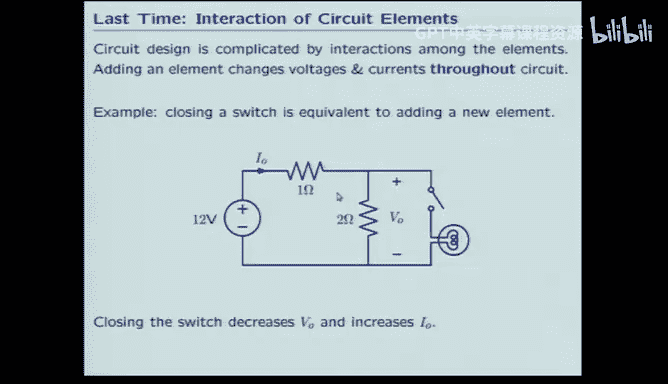

在本节课中，我们将学习如何利用线性特性来简化电路分析。我们将重点介绍戴维南等效、诺顿等效以及叠加定理这三种强大的抽象化方法，它们能帮助我们理解复杂电路中各部分的相互作用，而无需每次都进行繁琐的全电路计算。

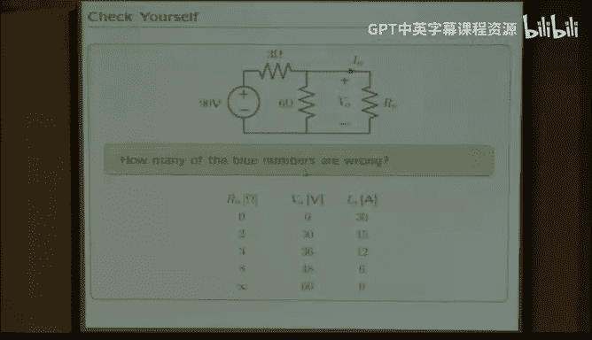

上一节我们讨论了电路中各部分的相互影响给设计带来的挑战。本节中，我们来看看如何利用线性特性来建立有效的电路抽象模型。

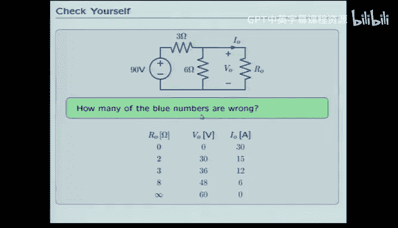

## 线性电路的伏安特性

首先，我们回顾一个基本概念：由线性元件（如电阻、独立电压源、独立电流源）组成的任意电路，从其任意一对端口看进去，端口电压 `V` 和端口电流 `I` 之间的关系是一条直线。

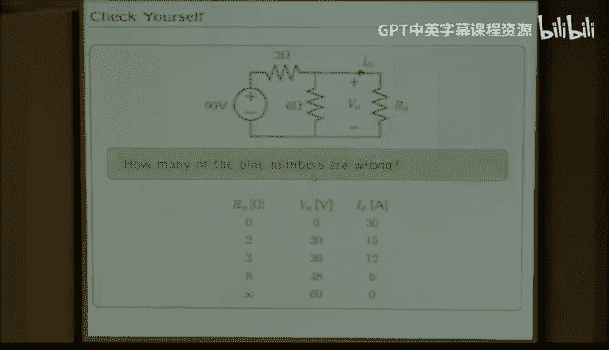

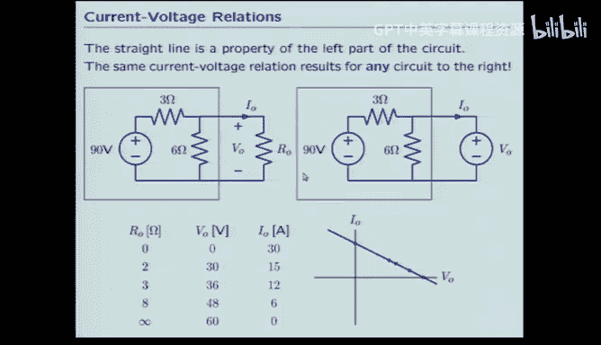

**公式**：`V = m * I + b`，其中 `m` 和 `b` 是常数。

这个结论源于电路方程（KVL、KCL和元件约束方程）都是线性方程。求解线性方程组，最终得到的端口 `V-I` 关系必然是线性的。这意味着，无论内部电路多复杂，我们只需要两个参数就能完全描述其外部特性。

## 戴维南等效与诺顿等效

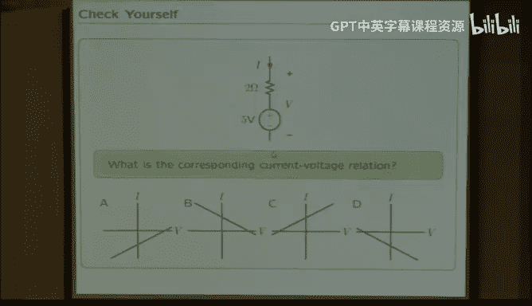


由于任意线性单口网络的 `V-I` 特性是一条直线，我们可以用非常简单的电路来等效它。以下是两种最常用的等效模型。

### 戴维南等效电路

戴维南等效电路由一个电压源 `V_th` 和一个串联电阻 `R_th` 组成。

**公式**：
*   `V_th` = 端口的开路电压（即 `I = 0` 时的 `V`）。
*   `R_th` = `V_th / I_sc`，其中 `I_sc` 是端口的短路电流（即 `V = 0` 时的 `I`，需注意电流参考方向）。

### 诺顿等效电路

诺顿等效电路由一个电流源 `I_n` 和一个并联电阻 `R_n` 组成。

**公式**：
*   `I_n` = 端口的短路电流（即 `V = 0` 时的 `I`，需注意电流参考方向）。
*   `R_n` = `V_oc / I_n`，其中 `V_oc` 是端口的开路电压（即 `I = 0` 时的 `V`）。可以证明 `R_n = R_th`。

戴维南和诺顿等效是相互转换的，它们描述了同一个 `V-I` 直线，只是表现形式不同。使用等效电路后，分析外部负载的变化将变得极其简单。

## 如何求解等效电路参数

求解戴维南或诺顿等效参数的核心是计算两个特殊工作点。

以下是关键步骤：
1.  **求开路电压 (`V_oc`)**：将端口断开，计算该处的电压。
2.  **求短路电流 (`I_sc`)**：用导线将端口短接，计算流经该导线的电流。
3.  **计算等效电阻 (`R_eq`)**：`R_eq = V_oc / I_sc`。

**示例**：对于下图电路，求其戴维南等效。
```
        1Ω
    +---/\/\/---+
    |           |
(10V)           +--- a
    |           |
    +---/\/\/---+
        3Ω
```
*   `V_oc` (a点对地电压): 使用分压公式，`V_oc = 3/(1+3) * 10V = 7.5V`。
*   `I_sc`: 将a点短接到地，则3Ω电阻被短路，电流 `I_sc = 10V / 1Ω = 10A`。
*   `R_eq = V_oc / I_sc = 7.5V / 10A = 0.75Ω`。

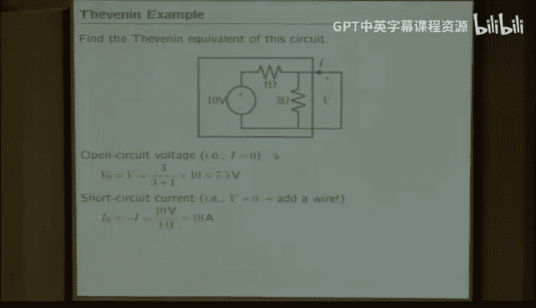

因此，该复杂电路可以等效为一个 `7.5V` 电压源串联一个 `0.75Ω` 的电阻。

## 叠加定理

叠加定理是线性系统的另一个直接结果。它指出，在含有多个独立源的线性电路中，任一支路的电压或电流，等于每个独立源单独作用时（其他独立源置零），在该支路产生的响应的代数和。

**应用规则**：
*   **电压源置零**：视为**短路**。
*   **电流源置零**：视为**开路**。

**示例**：求下图中电阻 `R` 两端的电压 `V`。
```
    +---/\/\/\/---+
    |      R      |
 (1V)             (1A)
    |             |
    +-------------+
```
*   **电压源单独作用**：电流源开路。`V1 = 1V` (全部加在R上)。
*   **电流源单独作用**：电压源短路。R被短路，故 `V2 = 0V`。
*   **总电压**：`V = V1 + V2 = 1V + 0V = 1V`。

叠加定理将多源问题分解为多个单源问题，常常能简化计算。

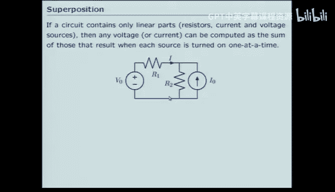

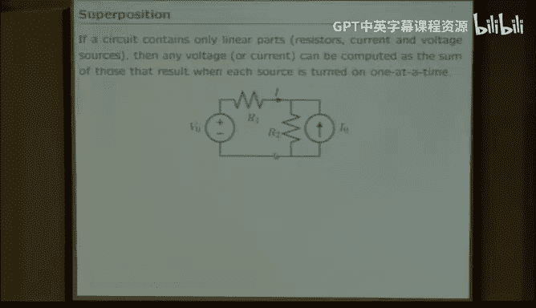

## 等效电路的应用价值

理解这些抽象化方法具有双重意义：

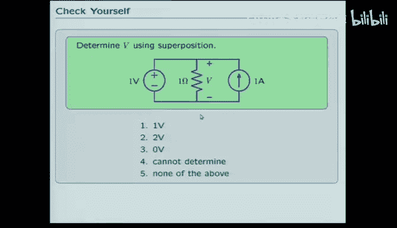

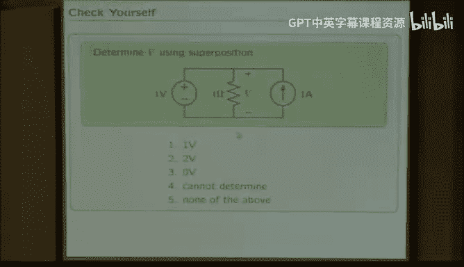

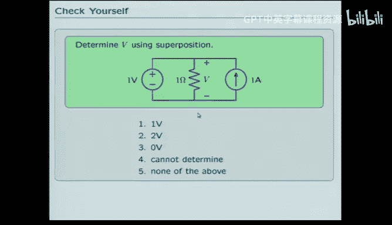

1.  **实用价值**：这是电子元器件制造商描述产品特性的标准方式。例如，运算放大器的数据手册会给出其输出端的戴维南等效电阻。
2.  **概念简化**：它让电路设计师能够快速洞察电路行为。例如，判断一个开关闭合后某支路电流是增大还是减小，通过将电路其余部分进行戴维南等效，可以立即得出结论，而无需求解整个网络。

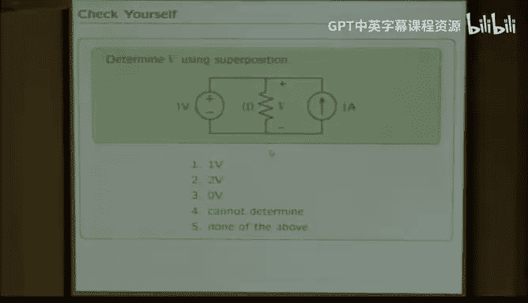

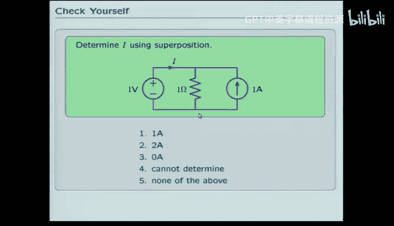

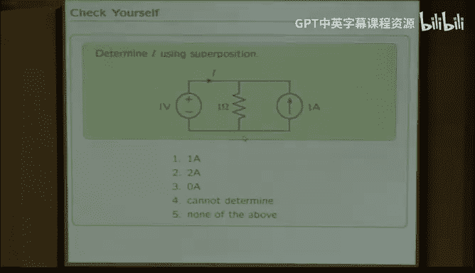

本节课中我们一起学习了三种基于线性代数核心思想的电路抽象化方法：戴维南等效、诺顿等效和叠加定理。这些工具使我们能够模块化地分析电路，预测部件间的相互影响，从而显著简化复杂电路的设计与分析过程。掌握这些方法，是成为高效电路设计者的关键一步。