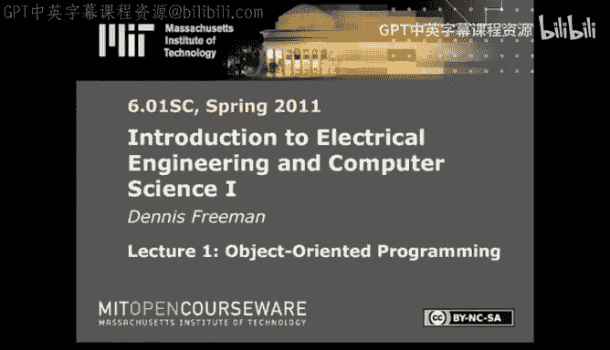
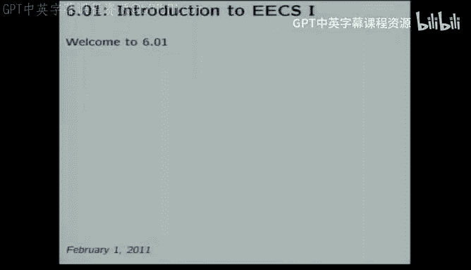
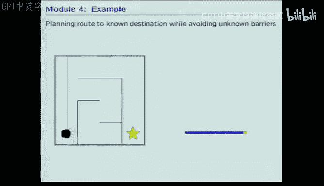
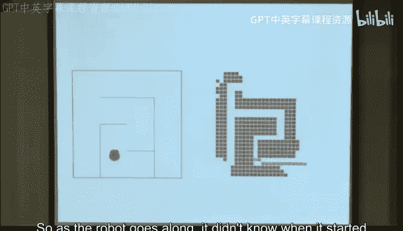
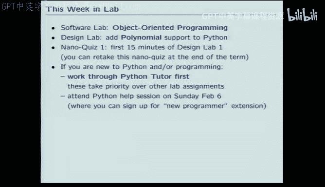

# 电气工程与计算机科学导论1：1：课程概述与软件工程基础





在本节课中，我们将要学习MIT 6.01SC课程的整体框架、教学理念，并深入探讨软件工程模块中最基础的概念：组合性、抽象与模块化。

## 课程目标与教学理念

本课程的核心是关于工程思维的模式。我们希望你们能从中学习如何设计、构建、调试复杂的系统。工程师擅长此道，我们也希望你们能变得同样出色。

为了达到这个目标，我们选择了“实践-理论-实践”的教学方法。教育研究表明，通过动手实践来学习效果最好。因此，本课程将围绕动手构建系统展开，在过程中让你们领悟高质量工程背后的核心思想。

## 课程模块概览

本课程内容广泛，我们将其组织为四个核心模块，每个模块约占课程的四分之一。以下是这四个模块的简要介绍：

*   **软件工程**：我们将聚焦于**抽象**和**模块化**这两个在构建大型系统时至关重要的思想。我们将从代码层面开始，逐步扩展到更高级的概念，如**状态机**。
*   **信号与系统**：我们将重点学习**离散时间反馈**。通过为系统行为建立**数学模型**并进行分析，我们可以预测系统性能并设计出更好的控制器。
*   **电路**：我们将学习如何为复杂系统（如机器人）增添新的传感能力。例如，你们将动手搭建一个电路，让机器人能够追踪光源。
*   **概率与规划**：我们将探讨如何设计能够应对**不确定性**并执行复杂计划的**鲁棒系统**。例如，让机器人在未知环境中构建地图、定位自身并规划路径。

## 课程组织形式

我们的教学理念直接体现在课程的组织形式上。以下是课程的主要组成部分：

*   **每周讲座**：共有13次讲座，用于介绍核心理论。
*   **阅读材料**：针对每个主题都有详尽的阅读材料，强烈建议课前阅读。
*   **在线辅导练习**：通过计算机练习来准备和巩固知识。
*   **实验课**：这是“实践”部分的核心，分为两种：
    *   **软件实验**：时长为1.5小时，个人完成，主要编写和测试小程序。
    *   **设计实验**：时长为3小时，与伙伴合作完成，解决更具开放性的设计问题。
*   **小测验**：每次设计实验开始时有15分钟的在线小测验，用于确保学习进度。
*   **考核**：包括两次期中考试、一次期末考试以及针对实验情况的一对一访谈。

## 软件工程模块入门



我们以软件工程模块开启课程，这既是EECS领域的重要组成部分，也为我们思考后续所有工程问题提供了一种便捷的“语言”。

今天，我们将从最微观的层面——单行代码的尺度——来探讨抽象与模块化。后续我们会逐步扩展到更大的尺度。



### 关于编程的特别说明

课程的前两周旨在让所有人达到一定的编程熟练度。我们**不假设**你有丰富的编程经验。

如果你编程经验较少或感到不自信，请务必优先完成Python在线辅导练习。我们甚至会为此提供专门的帮助课程和延期许可。我们的目标是让你在情人节（2月14日）前对编程感到得心应手。如果届时仍感困难，可以考虑转入专门的Python编程课程（6.00）。

### Python基础：解释器与组合性

我们选择Python是因为它简单，并能很好地展示软件工程的重要思想。Python是一个**解释器**，其基本行为模式是：询问用户输入、读取输入、解释执行、打印结果，如此循环。

这种交互特性使得“通过动手来学习”成为可能。例如，在解释器中直接输入 `2 + 3`，Python会计算并输出结果 `5`。

这揭示了一个核心思想：**组合性**。表达式 `3 * 8` 可以被视为与单个整数 `24` 完全等价。在任何后续操作中，你都可以用 `24` 来替换 `3 * 8`。这种用简单事物替代复杂表达式的特性，是构建层次化思维系统的基础。

### 命名与抽象：函数与变量

为了让常用的操作序列能被方便地复用，我们需要为其命名。在Python中，使用 `def` 关键字来定义函数。

```python
def square(x):
    return x * x
```

定义后，`square(6)` 的结果是 `36`。现在，`square` 可以像 `*` 这样的原始操作符一样被使用。我们可以利用它来构建更高级的操作。

```python
def sum_of_squares(x, y):
    return square(x) + square(y)
```

`sum_of_squares` 函数不需要知道如何计算平方，它只需相信 `square` 函数能完成这项工作。这就是**分解问题**的威力：将任务拆分成“如何平方”和“如何求和”两个更简单的部分。

同样，我们可以组合数据。Python中最基本的数据结构是**列表**，它可以包含各种类型的元素，甚至包含其他列表，从而形成复杂、层次化的数据结构。

```python
my_list = [1, 2, [‘a‘, ‘b‘], 3]
```

我们可以使用**变量**为数据命名，例如 `y = [1, 2, 3]`，然后通过 `y[0]` 或 `y[-1]` 来访问其元素，这带来了与命名函数相同的好处。

### 聚合数据与操作：类

更高阶的概念是将数据和操作聚合到一个数据结构中。Python通过**类**来实现这一点。类可以定义**属性**（数据）和**方法**（操作）。

```python
class Student:
    school = ‘MIT‘
    def calculate_final_grade(self):
        # ... 计算逻辑 ...
        pass
```

定义类之后，可以创建它的**实例**。实例继承类的所有结构，但也可以拥有自己特有的数据。

```python
mary = Student()
john = Student()
mary.section = 3
john.section = 4
```

你还可以创建**子类**，它继承父类的一切，并可以添加新的属性和方法。

```python
class Student_601(Student):
    lecture_day = ‘Tuesday‘
    def calculate_tutor_score(self):
        # ... 计算逻辑 ...
        pass
```

### 命名绑定的实现细节：环境

理解Python如何管理名称与实体（值、函数、类）的关联至关重要，其规则简单而一致。

Python在称为**环境**的列表中维护名称与值的绑定。当执行 `b = 3` 时，它就在当前环境中添加了名称 `b` 与整数 `3` 的绑定。当查询 `b` 时，Python就在当前环境中查找 `b` 并返回其值。

对于函数，当定义 `def square(x): ...` 时，Python会在当前环境中绑定名称 `square` 到一个过程对象，该对象记录了形式参数 `x`、函数体以及函数**定义时**的环境。

当调用 `square(a + 2)` 时，Python会：
1.  查找 `square`，发现它是一个过程。
2.  为这次调用创建一个**新环境**（E2），用于绑定形式参数 `x`。
3.  在**调用时**的环境（E1）中计算实际参数 `a + 2` 的值（例如得到5）。
4.  在E2中将 `x` 绑定到该值（5）。
5.  在E2中执行函数体 `return x * x`。当需要查找 `x` 时，在E2中找到其值为5。
6.  计算并返回结果25，然后销毁这个临时环境E2。

如果函数体内使用的变量不在其局部环境E2中，Python会到其父环境（即函数定义时的环境）中去查找，从而形成一条环境链。类的实现也基于环境模型，`类名.属性` 或 `实例.方法` 中的点操作符，本质就是在相应的环境链中进行查找。

---



本节课中我们一起学习了MIT 6.01SC课程的整体架构与教学法，并深入探讨了软件工程基础。我们理解了通过**组合性**构建复杂表达式，使用**函数**和**变量**进行命名与抽象，以及利用**类**来聚合数据与操作。最后，我们揭示了Python通过**环境**模型来实现这些命名绑定的核心机制，这是写出可预测、模块化代码的关键。在接下来的实践中，我们将反复运用这些基础概念。