# 电气工程与计算机科学导论1：10：概率论导论 🎲

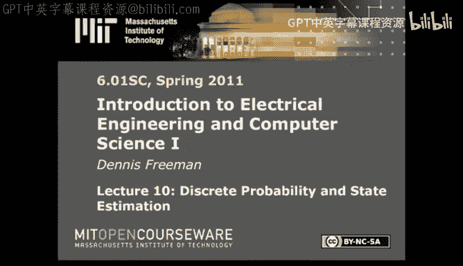

在本节课中，我们将开始学习一个全新的主题——概率论。我们将探讨如何用精确的数学语言来描述和处理不确定性，这是设计复杂、鲁棒系统的关键。

到目前为止，我们已经学习了如何通过抽象、层次化和模块化来设计复杂系统，以及如何通过建模来预测和控制物理系统。今天，我们将面对一个更现实的问题：当系统面临不确定性和未知环境时，我们该如何应对？例如，一个机器人在未知的迷宫中如何定位自己并规划路径？这正是概率论可以大显身手的地方。

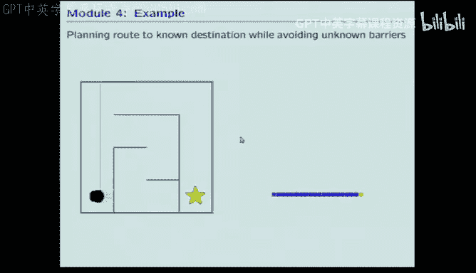

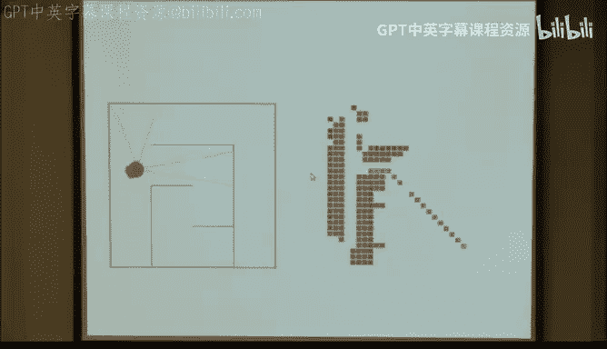

## 概率论基础：从集合论到贝叶斯定理

为了理解不确定性，我们需要一个理论框架，这就是概率论。它的核心规则非常简单，但其应用和直觉却可能非常微妙。

### 样本空间与事件

我们首先需要理解如何描述一个实验的所有可能结果。这涉及到集合论的思想。

*   **实验**：任何可能产生不同结果的过程，例如掷骰子。
*   **事件**：实验的任何可描述的结果。例如，掷三次硬币，“结果为正正正”是一个事件，“第一次为正”也是一个事件。
*   **原子事件**：最细粒度、不可再分的事件。对于掷三次硬币的实验，原子事件包括“正正正”、“正正反”等8种组合。原子事件有两个关键属性：
    1.  **互斥性**：如果一个原子事件发生，其他原子事件必然不发生。
    2.  **完备性**：所有原子事件的集合覆盖了实验的所有可能结果。
*   **样本空间**：所有原子事件的集合，通常用符号 **Ω** 或 **U** 表示。

### 概率三大公理

概率论建立在三个简单的基本规则之上：

1.  **非负性**：任何事件 **A** 的概率都是一个非负实数。`P(A) ≥ 0`
2.  **归一性**：整个样本空间的概率为1。`P(Ω) = 1`
3.  **可加性**：如果两个事件 **A** 和 **B** 互斥（即 `A ∩ B = ∅`），那么它们并集的概率等于各自概率之和。`P(A ∪ B) = P(A) + P(B)`

基于这些简单公理，可以推导出概率论的所有结论。例如，对于任意两个事件（不一定互斥），其并集的概率公式为：
`P(A ∪ B) = P(A) + P(B) - P(A ∩ B)`

### 贝叶斯定理与条件概率

最有趣且最具挑战性的规则是**贝叶斯定理**，它处理的是**条件概率**。

条件概率回答的问题是：在已知事件 **B** 发生的情况下，事件 **A** 发生的概率是多少？记作 `P(A | B)`。

贝叶斯定理的公式是：
`P(A | B) = P(A ∩ B) / P(B)`

**直观理解**：已知 **B** 发生，相当于我们的“世界”缩小到了 **B** 这个范围内。在这个新世界里，原来 **A** 与 **B** 的交集部分所占的比例，就是条件概率。这个过程也称为“归一化”——将交集部分的概率除以 **P(B)**，使得在新样本空间 **B** 中，所有概率之和重新变为1。

**示例**：掷一个公平的六面骰子。
*   问：已知点数为奇数，求点数大于3的概率。
*   解：原始样本空间为 {1,2,3,4,5,6}。条件“点数为奇数”将样本空间缩小为 {1,3,5}。在这个新空间中，“大于3”的事件只有 {5}。因此，`P(>3 | 奇数) = 1/3`。注意，无条件时 `P(>3) = 1/2`，条件信息改变了概率。

## 随机变量：更便捷的数学工具

虽然用集合和事件足以描述概率，但为了更简洁地处理复杂问题（尤其是多维问题），我们引入**随机变量**。

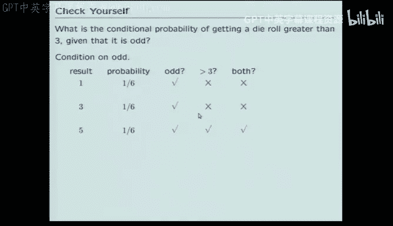

*   **随机变量**：一个变量，其值取决于随机实验的结果。通常用大写字母表示，如 **X**。
*   **取值**：随机变量的具体观测值用小写字母表示，如 **x**。
*   **概率表示**：`P(X = x)` 表示随机变量 **X** 取值为 **x** 的概率。

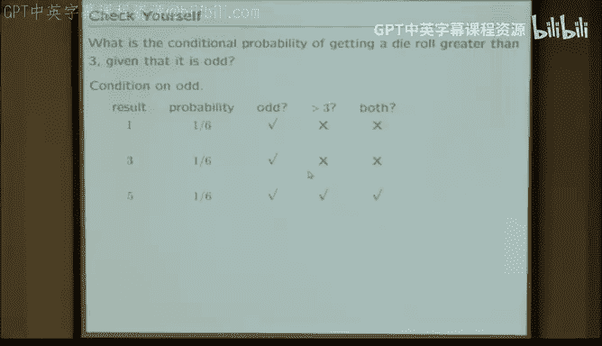

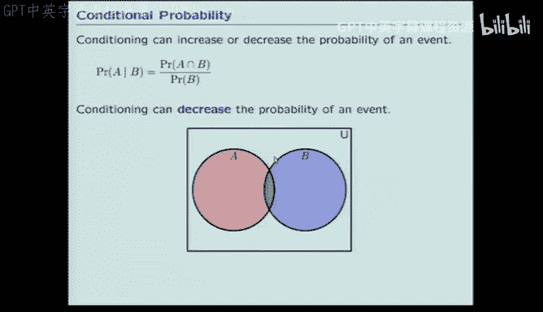

使用随机变量的好处是能方便地处理多维问题。例如，描述两次掷骰子的结果，可以定义一个二维随机变量 **(X, Y)**，其中 **X** 是第一次结果，**Y** 是第二次结果。

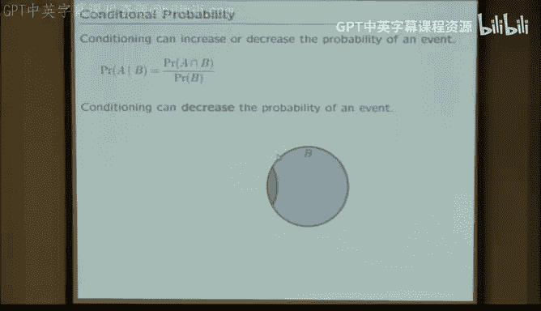

### 边缘化与条件化

对于多维随机变量，我们常需要从联合分布中获取部分信息，主要操作有两种：

1.  **边缘化**：忽略我们不关心的维度。例如，从两次掷骰子的联合分布 `P(X, Y)` 中，求第一次掷出某点数的概率 `P(X)`，需要对 **Y** 的所有可能取值求和：`P(X=x) = Σ_y P(X=x, Y=y)`
2.  **条件化**：在已知某些维度信息的条件下，求其他维度的分布。这正是贝叶斯定理的应用。例如，已知第一次掷出3点 `(X=3)`，求第二次点数的分布 `P(Y | X=3)`，需要用到公式：`P(Y=y | X=3) = P(X=3, Y=y) / P(X=3)`

**实例分析：艾滋病检测**
假设有一个艾滋病检测，已知以下联合概率数据（单位：%）：

|            | 检测阳性 | 检测阴性 | 边缘概率 |
| :--------- | :------- | :------- | :------- |
| **患病**   | 0.3648   | 0.0052   | 0.3700   |
| **未患病** | 4.9552   | 94.6748  | 99.6300  |
| **边缘概率**| 5.3200   | 94.6800  | 100.00   |

*   **问题一**：已知一个人患病，检测为阳性的概率是多少？`P(阳性 | 患病) = 0.3648 / 0.3700 ≈ 0.986`。这是一个非常准确的检测。
*   **问题二**：已知一个人检测为阳性，他实际患病的概率是多少？`P(患病 | 阳性) = 0.3648 / 5.3200 ≈ 0.0686`。这个概率很低，因为患病的基础发病率（边缘概率）很低。这说明了**先验概率**的重要性。

## Python中的概率表示 🐍

为了在计算中方便地使用概率，我们定义了一套Python表示方法。

### 离散分布类 (`DDist`)

我们用一个类来表示离散概率分布，其核心是一个Python字典，将**原子事件**（键）映射到其**概率**（值）。原子事件可以是字符串、元组等任何可哈希的Python对象。

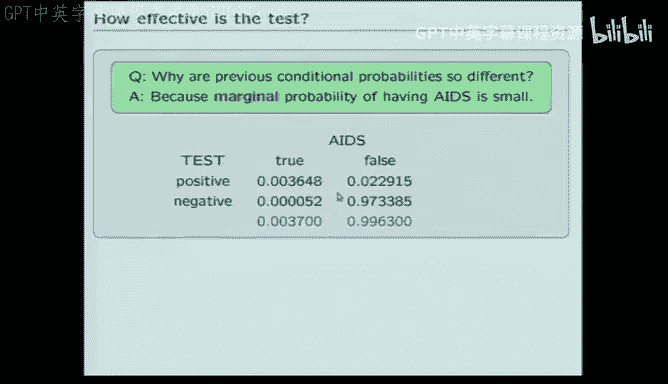

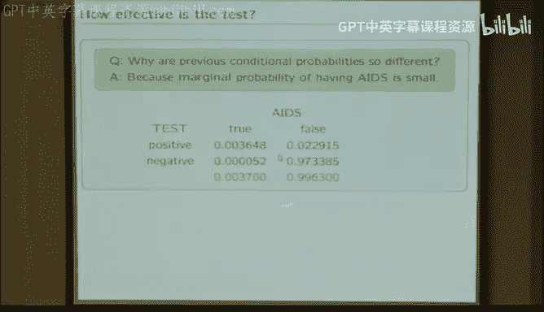

```python
# 示例：创建一个公平硬币的分布
from lib601.dist import DDist
coin = DDist({'Head': 0.5, 'Tail': 0.5})
print(coin.prob('Head')) # 输出 0.5
print(coin.prob('Heads')) # 输出 0.0 (未定义的键返回0)
```

### 条件概率分布

条件概率分布被表示为一个**函数**。输入是条件，输出是在该条件下的概率分布（一个`DDist`对象）。

```python
# 示例：定义检测结果在已知患病情况下的条件分布
def testGivenAIDS(hasAIDS):
    if hasAIDS:
        return DDist({'Positive': 0.986, 'Negative': 0.014})
    else:
        return DDist({'Positive': 0.0497, 'Negative': 0.9503})
```

### 联合概率分布

联合分布通常用**元组**作为原子事件的键。可以通过边缘分布和条件分布来构建。

```python
# 示例：构建患病状态与检测结果的联合分布
# 首先需要患病的边缘分布
pHasAIDS = DDist({True: 0.0037, False: 0.9963})
# 然后利用条件分布函数构建联合分布
# (这里示意概念，实际有特定类如JDist来处理)
joint_event = (True, 'Positive')
# 其概率为 P(True) * P('Positive' | True)
```

## 应用：理性决策与期望值 💰

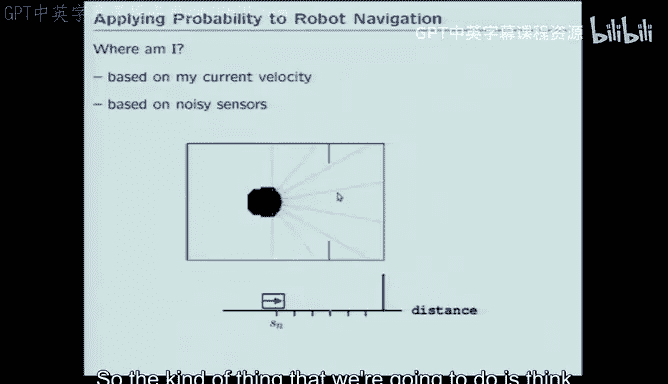

让我们回到课堂开始的乐高积木游戏，应用概率论进行理性决策分析。

**游戏规则**：袋中有4块乐高，颜色非红即白，比例未知。你付钱给我，然后抽一块。如果抽到红色，我给你20美元。

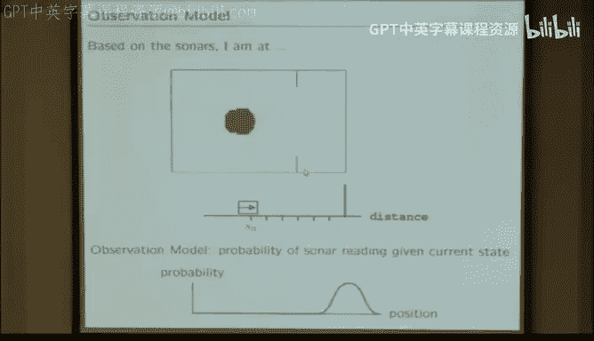

**问题**：你愿意付多少钱玩这个游戏？

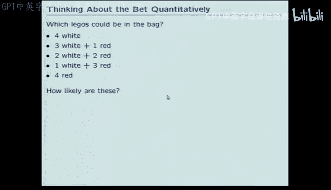

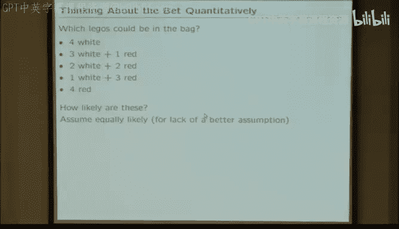

**分析步骤**：
1.  **建立先验模型**：在不知道装袋人偏好时，我们假设袋中红色积木数量 **S** 的所有可能性（0, 1, 2, 3, 4）是等可能的。即 `P(S=s) = 1/5`。
2.  **计算条件期望收益**：如果已知袋中有 **s** 个红块，抽到红块的几率是 `s/4`，期望收益是 `(s/4) * $20 = $5s`。
3.  **计算总体期望收益**：根据全期望公式，总体期望收益是各情况下的期望收益按其先验概率的加权和。
    `E[收益] = Σ_{s=0}^4 P(S=s) * ($5s) = (1/5)*(0+5+10+15+20) = $10`
4.  **决策**：一个理性的决策是，愿意支付的金额应**不高于**期望收益10美元。如果你想盈利，应支付低于10美元；如果你愿意承担风险博取更高回报，则可能支付接近10美元。

**更新信息**：如果抽出一块后发现是红色，我们就有了新信息。利用贝叶斯定理更新红色积木数量的后验概率，再重新计算期望收益，会发现期望值升高了（计算后约为15美元）。因此，在获得“至少有一红块”的信息后，游戏对你更有利，你应愿意支付更多。

## 总结与展望 🚀

本节课我们一起学习了概率论的基础知识。我们从**样本空间**和**事件**出发，理解了概率的三大**公理**。然后，我们掌握了强大的**贝叶斯定理**，它教会我们如何用新证据更新对世界的认知。为了方便计算，我们引入了**随机变量**的概念，并学会了**边缘化**和**条件化**两种基本操作。最后，我们还探讨了如何在Python中表示概率分布，并用期望值理论解决了一个简单的决策问题。

概率论为我们提供了量化不确定性的语言。在接下来的课程中，我们将把这些工具应用到机器人技术中，例如：
*   **状态估计**：机器人如何结合不可靠的运动传感器（里程计）和噪声的感知传感器（声纳）来更准确地判断自己的位置？
*   **定位与建图**：在未知环境中，机器人如何通过移动和感知来逐步构建环境地图并确定自身位姿？

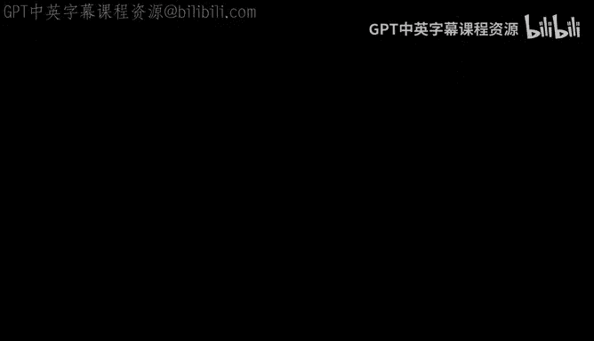

我们将建立**运动模型**（描述状态如何随时间概率性演化）和**观测模型**（描述在某个状态下得到特定观测值的概率），并利用贝叶斯框架将它们融合起来，从而设计出能够应对现实世界不确定性的鲁棒系统。