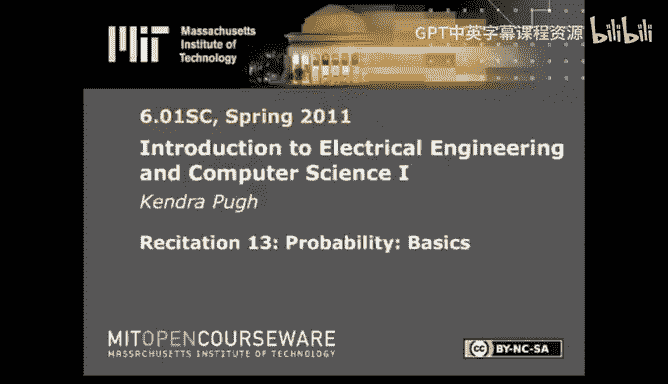
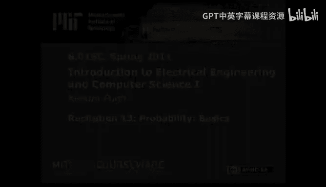

# 《电气工程与计算机科学导论1｜6.01SC Introduction to EECS I, Spring 2011》 - P22：-22-Rec 13 _ MIT 6.01SC Introduction to Electrical Engineering and Computer Scie - GPT中英字幕课程资源 - BV1oLBRB5EfQ

Hi， today I'd like to introduce a new module。In previous modules。

 we've talked about how to model particular systems。

 how to make predictions about certain kinds and classifications of systems。

 and also how to design both theoretical and physical systems。

If our systems are operating in a deterministic universe， then we're all set。

 We've accounted for all the things we can possibly account for。

 but if we're making systems that are going to operate in the real world。

Then we need to be able to deal with some level of uncertainty。

Today I'm going to talk about probability， which is the method by which we're going to model uncertainty in our world。

 and later we're going to talk about different strategies we can take to deal with that uncertainty to hopefully increase the level of autonomy of our systems as they operate in the world。

The first thing I need to talk about is how to properly model probability or how to properly talk about probability。

Such that we can use it to talk about uncertainty。When you're talking about probability， typically。

You'll end up talking about the sample space or you。 This refers to your entire universe。

Where your universe is the values that you care about or the possible assigned values of the variables that you care about。

I'm already talking about variables， but what I really mean to say is events。

There are different states that your universe can take。

 and those states can be sort of exhaustively enumerated or be atomic。Or they can be factored。

Into different variables。Let me elaborate on this a little。If I were talking about four coin flips。

If those events were specified atomically， then I would have to exhaustively specify all possible sequences of four coin flips。

 right？Four heads， three heads in one tail。ThreeTwo heads and two tails。That sort of exercise。Or。

Flipping four heads would be one event。Flipping three heads and then one tail would be a separate event。

Flipping two heads， one tail。And another head would be a third distinct event。

If we're talking about a factored state space。Then we'll have a different variable representing each one of these coin clips。

And each one of those variables will say。Here's， you know。

 here's the value associated with that particular subeven and the accumulation of all those values or the specification for all those values will end up referring to the same。

States that were addressed by the atomic events。Art。Let me talk about variables。

Because they're the thing that allow us to not exhaustively enumerate every possible event in the universe。

And talk about our universe。In meaningful ways or in ways that can be effectively communicated。

And why am I talking about random variables， Why aren't they just random variables， Well。

 random variables is the way that you specify the fact that you're talking about probabilistic variables。

When you're just dealing with regular algebra。Variables have some sort of sign value and。

It's not you're not。Forced to be in the space of 0 to 1。 when you're talking about from 0 to 1。

 when you're talking about。Probabilities， you're forced to be in the space of zero to1 and forced to remain within the reels。

If you want to talk about。All the possible assigned values of that random variable。

 then you're talking about the distribution。Over that random variable。This means that A could be。

Anyth that anything that a could be， you're talking about the function that says。

 give me a value of a， and I will tell you a probability associated with that value of a。

If you're talking about the probability of a being assigned to a particular value。

Then you'll return out the probability， right if a represents the color of the shirt I'm wearing and the probability that a is some value。

u。I want to know the probability that A is some value。

 then I look at the color of the shirt I'm wearing and try to determine whether or not it's one or0。

 or possibly look at the colors of shirts that I've worn over the past year and。Make some sort of。

Make some sort of ratio of the number of pink shirts I've worn over the past year。

If I'm dealing with a factored state space， I'm going to end up talking about more than one random variable。

There are two main ways to talk about more than one random variable at the same time。

One is joint probabilities。Where all the random variables are collectively specified at the same time。

 and the other is conditional probabilities， where you've already decided that you've specified some value for a one or more random variables。

 and then within that scope， you're going to talk about the probabilities associated with other random variables。

I want to demonstrate this graphically， but there are two more things that I need to mention。

Right now。One is the difference between the frequententist and baesian interpretations of probability。

Right now， they don't seem particularly relevant。But people will use these words。

 and it's good to know approximately what they're talking about。

The frequentist interpretation of probability。Is more relevant when you're talking about。

Actions that happen。A lot of different times， for instance。How frequently it rains。

If I say that today is Wednesday and I want to know the probability that it rains on Wednesdays。

Then that probability is open to frequententist interpretation because there are a lot of Wednesdays and it's rained a lot in the universe of Wednesdays or the space of possible Wednesdays。

So thinking about the fact that there's a 70% chance of rain or a 30% chance of rain or whatever probability of rain there is on Wednesdays。

Makes sense or is open to frequentquist interpretation。

The other interpretation that you'll hear talked about with respect to probability is the Bayesian interpretation。

Baesian interpretation。Tends to be more relevant when you are talking about spaces that are more atomic as opposed to factored or represent。

Events that are specified to the point that it does not make sense to talk about them in this in。

In the frequententas sense。When we talk about probabilities in the baesian interpretation。

 we frequently use the term likelihood。For instance。

 if I'm talking about whether or not it's likely to rain on August 24， 2011。In the afternoon。

The specificity of that event is so high that at that point。

 it doesn't make sense to talk about the frequency of。Wednesday， August 24th， 2011 in the afternoons。

At least for now。At that point， we're talking more about likelihood and less about frequency。

That event is more。Conducive to Bayesian interpretation。

No whirlwind tour probability would be complete without a mention of the three axioms of probability。

The first axiom is that。The likelihood of the universe happening is one。Or。

All random variables are going to be specified at some point。Relatedly。

The likelihood of nothing happening is 0。What these two really do？

Is established the boundaries of the graphical representation up here。

The other action my probability is that if you're going to be talking about the union of two events or the probability associated with one or the other event。

Having an assignment。Then you're talking about。The probability of that。Of。One of those variables。

And the probability of the other variable。And then removing the section that you've double counted。

So if I were to attempt to demonstrate this on this graph。I would be talking about the probability a。

Added the probability would be。And at this point， I've double counted this section in the middle where they're both one。

So I would subtract this exactly once， and then I'm talking about the size of this space。

If I'm talking about the probability of a being equal to 1。Then I'm talking about。

The space in which a is specified to be equal to 1。Divided by the area associated with my universe。

When I'm talking about joint distributions。I'm going to find the space。

In which both of these things are true。Scoopped to the size of the universe or the entire sample space。

So in this space， both A and B are true。And I'm looking at it relative to the size of the universe。

In contrast。When I'm talking about conditional probability。Or the probability of A， given B。

I'm going to look at。Where my specifications are true。Scoed。To where my givens are true。

So if I'm already dealing in the space。Restricted to B。I'm just looking at this size or this space。

But because I'm scoped to B， I'm going to end up dividing by the area of B instead of the area of U。

Oh。This is the main difference between the joint and conditional distributions。

 And a lot of people get hung up on it， which is why I'm。Exhaustively walking through it。All right。

 a couple of the things before we talk about the first way in which we can use our models for uncertainty。

To do some amount of addressing of the fact that we're going to have to deal with uncertainty in the future。

If we start off with a joint distribution and we want to reduce the number of variables that we're actually talking about。

We can do so by exhaustively walking through all the possible assigned values。

For the variable that we want to disregard。And then summing up the values appropriately。

An easy example for this is if we had the joint probabilities of all the colors of shirts that I wear and all the colors of pants that I wear。

 and we only wanted to talk about all the colors of shirts that I wear。Then， we could。

Exhaustively cover。All the different colors of pants that I wear and accumulate。

All the different values of shirts that I wear。Simultaneously。And then collect that distribution。

Related is the concept of total probability。Which is the same kind of accumulation。

It just keeps track of the fat It just。Opers in the conditional space。

 as opposed to in the joint space。So in this case。If I'm already operating in an you， A given B land。

I have to scope myself back out。To the space of the universe。

By then accounting for the fact that I've only been operating in the scope of B。Then， exhaustively。

Enumerate all the possible values of B， some of the probabilities associated with those values。

And then I've reduced。The number of dimensions that I'm talking about。

The final thing we have to talk about before we move on to state estimation is called Bays evidencevid。

 or you've probably seen this demonstrated as Bay's rule。If I want to talk about B， scope to A。

And all I have is a scoped to B。B and A。When we walked through total probability， we saw that。

The conditional probability multiplied by the probability associated with the variable that we're conditioning on is equal to the joint probability。

When we multiply a given B by P of B or P of a given B by P of B。

We're going to end up with the joint probability associated。With the two variables。

When we then divide back out by a or scope， our joint probability to A。

We end up talking about conditional probabilities again， which is where B given A comes from。

Base evidence or Bay's rule is the basis for inference。

 which is going to be really important for state estimation， which we'll cover next time。

