# 《电气工程与计算机科学导论1｜6.01SC Introduction to EECS I, Spring 2011》 - P24：-24-Lec 12 _ MIT 6.01SC Introduction to Electrical Engineering and Computer Scie - GPT中英字幕课程资源 - BV1oLBRB5EfQ

The following content is provided under a creative Commons license。

 Your support will help M T Open Coseware continue to offer high quality educational resources for free。

To make a donation or view additional materials from hundreds of M T courses。

 visit M I T OpenCseware at O C W dot M I Tt E Du。

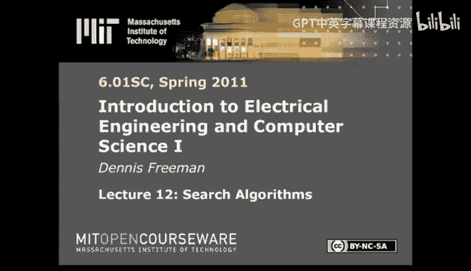

Hello， welcome。Today we're going to talk about one last new topic， which has to do with search。

So as you remember， we're working on our last topic， the last topic was probability and planning。

Last lecture， we talked about probability。The idea was mostly， mostly we focused on Bay's theorem。

 Be's rule。That was a way of updating our belief about some situation based on new information。

And this week in Design Lab 12， you'll get a chance to use that in a robot application。

The idea for design La 12 is going to be that a robot is peddling along a corridor。

With some obstacles off to its left。And the idea will be you don't know where the robot is。

But the robot will be able to estimate where it is by the signals that it receives from its left facing sonars。

So this is a very realistic type of state estimation problem。

 The idea is going to be that at any given time T， youll have access to your previous belief at time T -1。

 and you'll have access to a new observation， which is the sonar to your left。

And based on those two bits of information， you will update your belief。

 which means that when you start out， you have no idea where you are。

 but that situation should improve with time。😡，Okay。

 so that's what we're going to do in design La 12。Today。

 we're going to blast ahead and think about the other important topic， which is search。

So we anything about planning。We're going to be planning ahead。

 We're not going to just react to the situation that's given to us。

 We're going to try to figure out what's the right thing to do in the future。 And to do that。

 we're going think about all the things that we could possibly do。

Search through that space and figure out the one that's quote best。

And we'll have to define best somehow。Just to get going。

 I want to show you a very simple kind of a search problem。The search problem。

 this is called the eight puzzle。

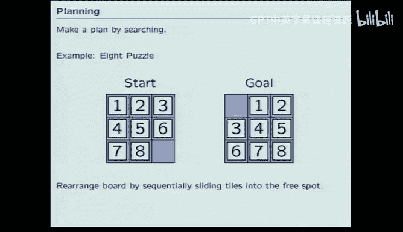

The idea is to make a plan to go from this configuration， which we'll call a state。

To this configuration， which we'll call the goal state。

And on each move you get to move one of the tiles into the free space so I could move the eight to the right or the sixth down。

 those are the only two things that I could do in the start state。

 so I have to make up my mind which of those I would like to do。

 and I would like to believe that ultimately after a series of moves I'm going to be able to perturb this state into that state。

Okay， and you can imagine sort of guessing。And we'll estimate in a moment how big is the guest space。

 I mean， if the guest space only has like four elements in it， guessing's a fine strategy。

 if the if the guest space， guest space has a lot more elements in that。

 guessing is probably not a good idea。So I previously ran our search algorithms。

 the ones that will develop during lecture on this problem。

 And here's the solution that our search algorithm came up with。😊。

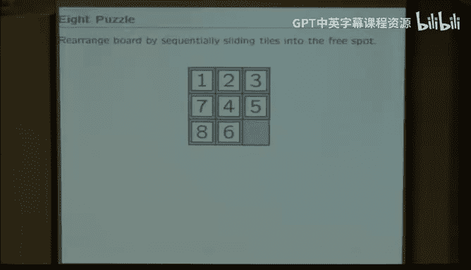

It's not exactly what you might。Do the first time you touched it。Okay， I made it。

If you were counting。I made 22 moves。The question is。

 how difficult was that problem and how good was that solution？

Was that a good solution or a bad solution， Is there a better solution。

How much work did I have to do in order to calculate that solution So to get a handle on that。

 let's start by asking a simple question， how many configurations are there。I mean。

 I got there in 22。 What was the space of things I had to look through。

 How many different board configurations exist。So think about that for 20 seconds。

 talk to your neighbor and figure out whether it is8 squared，9 squared，8 factorial，9 factorial。

 or none of those。So how many board configurations do you see？Raise your hand。

 Show me a number of fingers so I can figure out roughly how people were。 That's excellent。

 So very good participation and nearly 100% correct。 So the answer is number 4。

You can think about this， what if you took all the tiles out and threw them on the floor？

And then put them in one at the time。Well， you would have nine possibilities for where you wanted to put the first one。

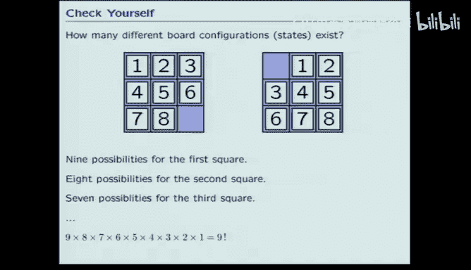

Then you would have eight possibilities for where you wanted to put the second one。

 Then you'd have seven possibilities for where you put the third one， et cetera， et cea。

 So even though the space doesn't have a number on it， it still sort of counts。

And so you end up with9 factorial。 And the point is，9 factorial is a big number。

Nine factorial is 362-880。So if you thought about simply guessing。

 that's probably not going to work all that well。Right， even if you guessed you have on each。

 So there's 30， there's。A third of a million different configurations that you have to look at。

And that's if he didn't lose track of things。If you lost track of it oh。

 mice is coming up almost anyway， it looks like it's chopped off at the top。So ignore that for now。

 look over here。So even。If you didn't confuse yourself。

There's sort of a space of a third of a million things to look at。And if you confuse yourself。

 there's even more。So it's not a huge problem by computer science standards。

 but it's certainly not a trivial problem。 It's not something that you can just guess and get right。

So what we want to do today is figure out an algorithm for conducting a search like that。

We'd like to figure out the algorithm， analyze how well it works。

Optimize it and try to find out a way to find the best solution where best for this particular problem would mean minimum path length。

So figure out the best solution by considering as few cases as possible。 Obviously。

 if you enumerate all the cases， that should work。The problem is that we'll be interested to solve problems where that enumeration is quite large。

 even here， the enumeration is quite large。So let's think about the algorithm。

 and I'll think about the algorithm by way of an even simpler， more finite problem。

 What if I thought about a grid of possible locations where I could be。

Maybe this is the intersection of streets in Manhattan。I want to go from point A to point I。

What's the minimum distance path， I hope you probably can all figure that out。

But what I want to do is write an algorithm that can figure that out。

 and then if we write the algorithm well， we'll be able to use it for the tile problem。

 which is not quite so easy to do。

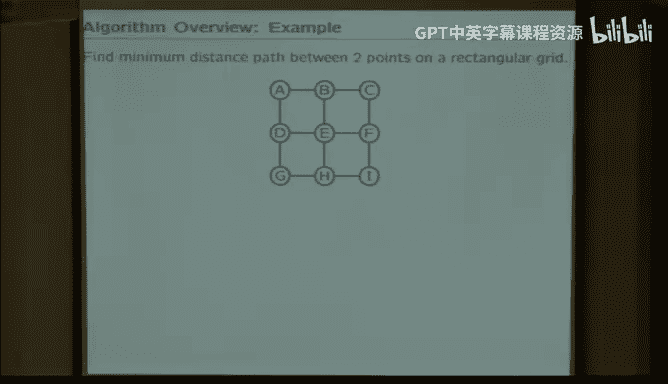

The way we're going to think about doing that。Is to organize all of our possible paths through that maze。

In a tree。So if I started at A， I have a decision to make I could either go to B or D。

Then if I went to say B， I could either then go to A or E A or C or E。

 I've organized them alphabetically for no particularly good reason， just I needed some order。

So then if I went from A to B。To a， say then I have I could either go from B from A to B or D。

 that's illustrated here。 So the idea then， it works。 Okay。

 so now it looks like they're all three working。So the idea is think about the original problem。

 The original problem is find the shortest path through some grid。 I want to go from A to I。

 and I'll think about all the possible paths on a tree。Then the。

 the problem is that for the kinds of problems we're going to look at。

 that tree could be infinite in length。Oh， that's a bummer。

 That means that the strategy of building the tree and and searching it is probably not a good strategy。

 So what we'll do instead is we'll try to write the algorithm in such a way that we construct the tree。

And search for the best solution all in one pass。Then hopefully。

 if we find the solution in some finite number of steps， we'll only have built part of the tree。

But well have built the part that has the answer。Okay。

 so the idea then is going to be think about what is the path we want to take by thinking about the tree of all possible paths。

But what we want to do is write code。That will construct the tree on the fly。😡。

While it's considering how good were all the different nodes。Okay， so how are we going do that。

 So so well， we'll be working in Python。 Not surprisingly。

 we'll represent all the possible locations。 We'll call those states。

So the problem will have states A，B，C D， and we'll just represent those by strings and that makes it flexible。

 that makes it arbitrary。Then we'll think about transitions， not by enumerating them。 Remember。

 we don't want to enumerate them because there could be infinitely many of them。

 So how's the other way we could do it。 Well， we'll embody that information in a program。

 We'll write a procedure called successor。That will， given the current state and action。

Figure out the next day。So that's a way that we can incrementally build the tree。 So imagine here。

 if I told you a and I took option I took action 0 or one。

If I started in A and I executed action 001， I would end up in B or D respectively。

So I tell you the current state and the current action and the successor program then will return to you next the new state。

That's all we need to construct the tree on the fly。😡。

Then to specify the particular problem of interest， I'll have to tell you where you start。

So I have to define initial state。And I'll have to tell you where to end。 I could just tell you。

 the final state。But in some of the problems of the type that we will want to do， there are。

 there could be multiple acceptable answers。 So I don't want to just give you the final state。

 I'll give you a test。I'll give you another procedure called goal tests。And that goal test。

 when past an input， which is a state， will tell you whether or not you reach the goal。That way。

 for example， all the even numbered squares could satisfy the goal。

 if that were the problem of interest or all the states on the right。Could satisfy the goal。

 It's just a little bit more flexible。 So the idea then， is that in order to represent that tree。

We'll do it by specifying a procedure called successor。

And specifying the start state and the goal test。So here's how I might set that up。

For the simple Manhattan problem that I started with。

So I want ultimately to have something called successor that eats a state and an action。

I've built the structure of the of Manhattan into a dictionary。The dictionary lists for every state。

ABC， D， E， FG，HI。For every state。It associates that state with a list of possible next states。

 So if I'm in A， I could next be in B or D。 I could next be in B or D。

I've organized these arbitrarily in alphabetical order so I can remember what's going on。

 So the next states are all in alphabetical order。 The number of next states depends on the state。

I'm not going to worry about that too much。 I'm just going order the I'm just going specify the action as an integer。

0，1，2，3， however many I need。So the possible actions are taken from that list。

 the possible action might be do action zero， do action 1， do action 2。

 so if I did action2 starting on state E， I would go to so action started at zero。0，1，2。

 I would go to state F。Okay， is that all clear？The initial state is a。

 and the goal state is return S equal to I。 So if S is equal to I， it returns true。

 If S is not equal to I， it returns false。Okay。I'm not quite done。

 that's enough to completely specify the tree， but now I have to build the tree in Python。

Not surprisingly， from our object oriented past， we will use an object oriented representation for that tree。

So we'll specify every node in the tree。As an instance of the class search node。

Search node is trivial， search nodes simply knows what was the action that got me here。

 who's my parent and what's my current state。So when you make a new node， you have to tell the node。

 you have to tell the constructor those three things。So what was the action that got me here。

 what's my current state and who is my parent？Knowing the node。

 you're supposed to know the entire path that got you here。

 So we'll also add a method which reports the path。So if I happen to be in node E。

 my path ought to be。I started in A。 I took action 0 and got to B。

 and then I took action 2 and got to E。And so this subr routineine is intended to do that。

If my parent is none， which will happen for the initial state。😡。

Simply report that the path to me is none A。However， if I'm anybody other than the initial state。

At the initial node， sorry， if I'm anybody other than the initial node。

 then figure out the description of the path to my parent。

And add the action that got me here and my state。😡，So that's what this is。Okay， so what are we doing。

 So we specify a problem by telling you the success the successor function。

 the start state and the goal tasks。And then we provide a class by which you can build nodes to construct on the fly。

The search tree。Okay， now we're ready to write the algorithm。

 So here's the pseudocode for the algorithm。 What do we do， We initialize。

 So we're going to be doing a Oh This is very confusing。 I'm trying to solve a search problem。

To solve the search problem， I'm going to search through the tree。 Okay。

 so I'm going to think about the state of my search through the tree。😊。

By way of something we'll call the agenda， very jargony word， I completely apologize for it。

 I didn't invent it， it's what everybody calls it， sorry。

So we'll call it the agenda is the state the agenda is the set。

Of nodes that I'm currently thinking about。So I'll initialize that to contain the starting note。Then。

I'll just systematically just keep repeating the same thing over and over again。

 Take one of the nodes out of the agenda， Think about it， replace that node by its children。

While I'm doing that， two things are supposed to happen。 I'm supposed to construct the search tree。

But I'm also going to be looking over my shoulder to see if I just constructed。

A child who was the answer。Because if I just constructed the answer， I'm done。Okay。

 so initialize the agenda to contain just the starting node， then repeat the following steps。

 remove one node from the agenda， add that node to children to the agenda and keep going until one of two things happens。

 Either you found it， Go test to return true。Or the agenda got empty。

 in which case must not be a solution。Okay， if I， if I've removed all of my options and still haven't found anything。

 then there's no solution。Okay， so what's the program look like， it's actually remarkably simple。

 especially when you think about just how hard the problem is。

 imagine if you wanted to do that tiles problem with a kind of a very simple mindded if this。

 then this， if this， than this， right， we're talking about a third of a million different ifs， right。

 that's probably not the right way to do it。So this program is going to end up being about this long。

 It'll fit on this page。 and it's going to be able to handle that case or even harder cases。

 So the idea， so define the search procedure。 The search procedure is something that's going take the initial state。

 the goal test， the possible actions， and the successor subroutine， the successor procedure。😊。

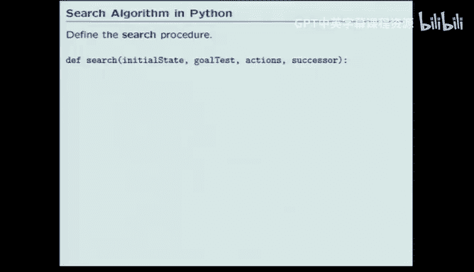

That's everything you need to specify the problem。 And it's going to return to me the optimal path。

So first， step one。Initialize the agenda to contain the start node。 Okay。

 I want to put the start node in。 Well， there's a chance。I want this procedure to be general purpose。

 right， There's a chance that that start node is the answer。Okay， so take care of that first。

 So if you're already there， return the answer。 the path to the answer is me。

So I'm trying to create the agenda。 I'm trying to put the first node into the agenda。

 There's a chance that first node is the answer。 If that first node is the answer return the path to me。

 which is， take no action。 You're here。Okay， but that's not likely to be the case for the kinds of questions we ask。

In which case we will create a list that contains one node。

 which is the node that represents the start node。

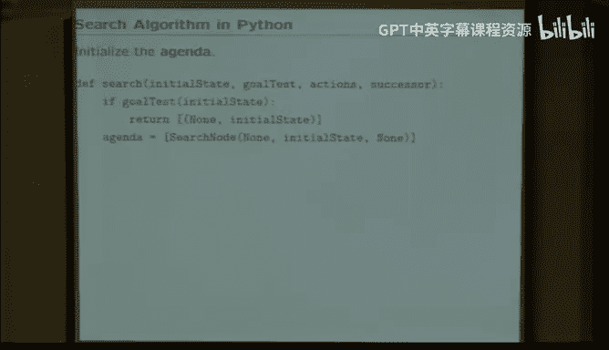

Then。Repeat， remove a node， which we'll call the parent。From the agenda。And substitute。

 replace that node that we pulled out of the agenda， replace that with the children。

So while not empty of agenda， empty is some kind of a pseudo routine that I'm going to fill in in a minute。

While the agenda is not empty。Get an element out of the agenda， which we'll call the parent。Then。

I want to think about all the children。 Well， there's a list of possible actions。

 So for A in actions， do all do the following things。 Each parent can have multiple children。

 one for every possible action。 So for A in action， figure out what would be the new state。Well。

 the new state is just the successor。Of the parent state。WeRemember the parent is a node。Right。

 the parent is a node。 We're constructing nodes in the search tree， but nodes know their state。

So figure out the new state， which is the successor of my parent。

The guy that I pulled out on the agenda。Make a new node， which corresponds to this child。

Then ask the question， did the new state satisfy the goal test。

 if it did the answer is the path to the new node。Okay， so create a new state。

 which is the successor of the parent under the given Action A。Create a new node。

 see if it's the end if it is。Just return。 I'm done。 Re from search。Otherwise， add， again。

 one of these pseudo。Procedures will fill that in in a minute。 Add the new node into the agenda。Okay。

There's several things that could happen when I run this loop。So if the node has no children。

Nothing so I will take out the parent and not put anything back in。If the node has。Multiple children。

 I could take out one node。And put in more nodes than I took out so the agenda could get longer。

So the agenda。So the agenda could either increase in length or decrease in length as a result of spinning around this loop。

Also， we could either identify a goal or fail to identify a goal。

 So as it's increasing and decreasing， we either will or won't find an answer。ok。Now the trick。

 the only thing that makes this complicated is that order matters。So those pseudo operations。

 whatever they were。 So get element and add。Exactly how I get element and exactly how I add it to the agenda affects the way I conduct the search。

Let's think of something very simple。Always remove the first item remove the first node from the agenda。

And replace it。By its children。So pull out the first node and put back into the beginning of the agenda。

 the children of the first node。 Okay， so how I would start out in step 0。

 I would put the start node into the agenda。So now there's one element in the agenda， the start node。

 then on the first pass through the loop， I would pull out that that's the first node in the agenda。

 there's only one node in the agenda， so that is the first one。

Pull out the first one and replace it by its children。 Its children are A， B and A D。

I'm representing the nodes。In this notation， by the path。Because the same state。

Can appear multiple times in the tree。Notice that I could walk A， B， A B。

 which would correspond to the same state being repeated in the tree， so I can't。

 when I'm writing it down here， represent the node by a state。But I can represent a node by a path。

So on the first pass through the loop。Pull out the first item in the agenda， which is a。

And push back that As children。 Well， A's children are A B and A D。Okay， so now on the second pass。

The rule is pull out the first guy and replace it by the children。 So now the first guy is A B。

 So I'm here。So pull that guy out and replace him by his children， his children are AB， A， ABC。

 and AB，E。AD is left over。The number of elements in the agenda got bigger。Next step。

 pull out the first item in the agenda。Replace it by his children。

 the first item in the agenda is ABA。The children of A B， A are A， B， A B and A B， A D。Okay。

So notice the structure of what's going on。😡，So ignore the stuff in the bottom and just watch the picture on the top。

 So I start by putting a in the agenda。 then its children， then its children， then its children。

So when I implemented the algorithm， take out the first and replace it by its children。

I'm searching along the depth First。 I'm going deeper and deeper into the tree。

Without fully exploring all the horizontal spaces。So I'm tracing a line down that way。

 so if you imagine this tree that I've only represented the first three layers of nodes here。

 this tree goes on forever， right it's an infinite tree because you can walk around in that Manhattan grid forever。

😡，There's no limit to how long you can walk walk around。So although I'm only listing the first three。

 the tree in principle goes on forever。And this algorithm will have the feature。😡。

That it walks along the left edge。We call that depth first search。Because we're exploring depth。

First。As opposed to breadth。Okay， that results because of our rule。

 the rule was replaced the first node by its children， let's think about a different rule。

Let's replace the last node by his children。Now， so we start by initializing the agenda to the node that represents the start state。

So that's a， the path A。Then replay， so pull out the last。Noode in the agenda。

 Well that's a and stick in and replace it by its children。 It children are still A B and A D。

 just like before。Now， the answer differs from the previous answer。

 because when I pull out the last node， I'm pulling out A D now instead。

And now I replace A G by its children， which are A D， A， A D， E， A， D， G。Repeat。

And what I've got is a different。But still depth first。Search。 so。

 so I've looked at two different orderings， pullll out the first node from the agenda and replace it by his children。

 pullll out the last node。And replace it by its children。

 Both of those algorithms give an exploration。Of the decision tree。Searching out depth first。

 So it's going to try to exhaustively go through the entire depth before it tries。

 to explore the width。As an alternative， think about a slightly more complicated rule。

 remove the first element from the agenda and add its children to the end of the agenda。

So initialize it with the start state。 So a。Pull out the first element from the agenda。

 That's a and replace it by its children， which is A B， A D。Now pull out the first guy。

 well the first guy is AB。And put its children at the end。😡，Its children are ABA， ABC， AB，E。AB， A。

 ABC， A，B， E， and they are now put at the end。 so that on the next step。I'll pick up A D。

 the guy at the beginning。And put A's children at the end， etc cea， etc cetera， etc cetera。

 etc cetera， etc cea， etc cetera。 The idea being pay no attention to the bottom for a moment and just think about the pattern that you see at the top。

So in this。Order， where we remove the first node and put its children at the end of the agenda has the effect of exploring bread。

So we call that a bread。 So the idea is。We've got this generic set of tools。

That let us construct search trees， but the order by which we manipulate the agenda plays a critical role in how the search is conducted。

And the two that epitomize the two extreme cases。Are what would happen if I replace the last node by its children or what would happen if I remove the first node and put its children's at the end。

 Those two structures have names because they happen so often。

 We'll call the first one a stack in the second one， a Q。

The stack based is going to give us depth first。 The Q based is going to give us bread first。

So stack， how do you think about a stack？you think about a stack by saying， okay， I've got。A stack。

 A stack is like a stack of dishes。 So here's my table， and I'm going to rack my dishes up。

I'm going to put them on a stack。So， so I make a stack。 okay， I made the stack， push a one， push a9。

 push a three， push a one， push a9， push a three。That's how I do a stack。Then pop。😡，Okay， when I pop。

The three comes out。Then pop。 Then the 9 comes out。Then push it -2。Then pop， now the -2 comes out。

Okay， it's stack based。So the last in。Becomes the first outage。

That was the rule that we wanted to have。For the depth first search。

And it's very easy to implement this， we can implement it as a list。

And all we need to do is be careful about how we implement the push and pop operators。So if we。

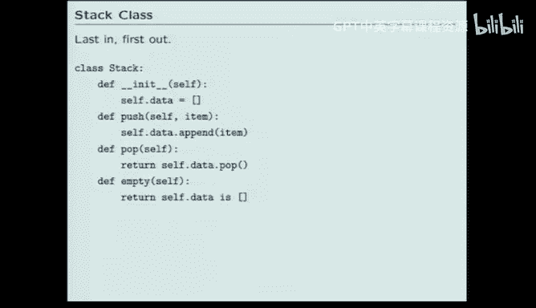

Set up the push operator to simply append to the end。And then pop pop ordinarily pops from the end。

 and so we'll get the behavior of a stack。

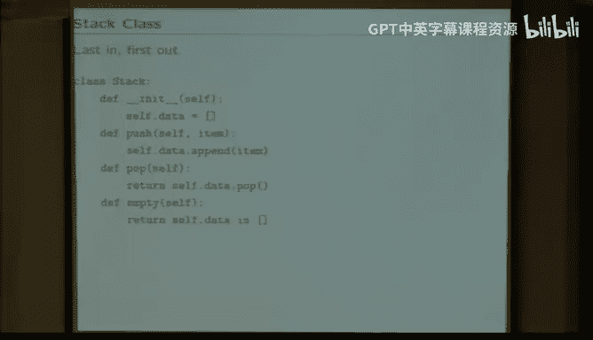

So that gives me then the rules that I would want to use for those procedures that did get element。

And add， I will use these stack based operators。The other alternative is a queue。

 So a queue is different。 A queue is like when you're waiting in line at stop and shop。So the Q is。

 I've got this Q here。And I've got the server over here。

So the first person who comes into the queue they say I push one， so now one goes into the Q。

Then another person walks up while hes the second person's lines up behind the first person。

Then I push a three。But the way the Q works is that when I pop the next person off the queue。

I take the head of the line。So the one comes out。If I pop again， the9 comes out。If I then push a -2。

And pop。Then the next person in the queue comes out and it's like that。

So it's Q based versus stack based。 And the Q based is the one that we want to do for a breadth first。

organization。And the implementation of a queue is very trivially different from the implementation for a stack。

 The only difference is that I'll manipulate the list by popping off from the head of the queue。

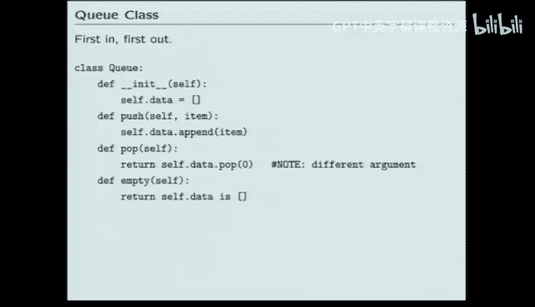

So Pop takes an optional argument。Which when zero tells you the argument tells you which element to pop。

 so when you specify the zero of1， it takes it from the head of the queue。

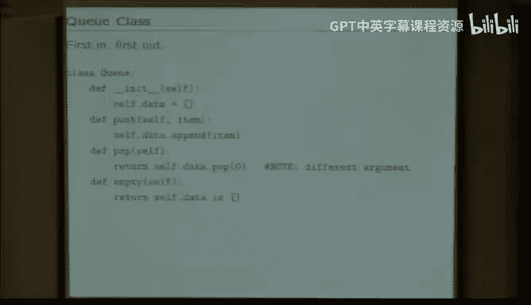

That makes it very easy now to replace the pseudo procedures with real procedures。

 If I wanted to implement a depth first search。I would replace the create a list that contains the agenda。

With create a stack。That will contain the agenda。 So create a new stack。 The agenda is a stack。

And then rather than simply sticking the node。The start node into a list。

 I will push it into the stack。So agenda is a stack。Agenda dot push the initial node。

And then every time I want to get a new element out， ourll agenda dot pop it。

And every time I want to put something into it， our agenda do't push it。Other than that。

 it looks just the same。As the pseudocode that I showed earlier。

So theres an implementation then for a depth first search。If I wanted instead to do breathth。

 it's trivial， change the word stack to the word Q。Now create an agenda that is a cu。

But queuees have the same operations， push and pop and empty。That stacks have。

 So nothing else in the program changed。 All I needed to do was change the structure of the thing that's holding the agenda。

Everything else just follows。Okay， you may have noticed。So that's everything we need。 right Now。

 what I want to do is think through examples and think about the advantages and disadvantages of different kinds of searches。

And I want to go on to the second step that I raised in the first slide。

I want to think about how do I optimize the search， As I said， even that simple little tile problem。

 even the eight puzzle，8 sounds easy， right， Even the eight puzzle took had a third of a million different states。

 I don't necessarily want to look through all of them。

 I want to think now about these different search strategies and how optimal are they relative to each other and are there ways to improve that。

 Now， some of you may have noticed。That all of these paths don't seem equally good。So take a minute。

 think about it。Remember the problem， the problem was this walk around Manhattan problem。

 I wanted to go from A to I。 this was the tree of all possible paths from A to I。

 What I'd like you to do is think about whether all of those paths are important。

 could we get rid of some of them。So the question is could I throw away some of the terminal nodes。

 notice that I'm using the word terminal kind of funny here， the tree keeps going。

The tree is actually infinite in length。So by terminal， I just mean this row3。

 So could I throw away some of the nodes in row 3？And in particular。

 how many of them could I throw away zero？2，4，6， or 8。 Raise your hand with the funny coding。

And the answer is。Come on coin。 raiseise your hand。 Raise your hands。 blameme it on your neighbor。

 right， That's the whole point。 Okay， it's  two thirds，5 and one third，4。

So how do you get five and four？Yes。So if you're walking around man。Can from嘅 hi。

And if you spun around in this loop and came back to A， that would probably be a bad path。Right。

So revisiting a place you've been before is probably a bad idea if what your goal was was to get from A to I in the shortest possible distance。

Right。So that's exactly right。 So I would like to identify instances where I I go back to where I started。

 So， for example， that a， that A is bad， right， That means I I went back to the start place。

 I'm just starting over。So if I think about those， I can identify by red all the places where I'm repeating。

 So A B， A don't really care what happens after that。A，BC B， well that's B again。

 so that's just brain did， right？So I can actually remove a fair amount of the tree。

By simply getting rid of silliness， right， don't start the path over again， right。

EWhere means if you come to a place you've been before， stop looking there。

 That's not the right answer。Okay， and so you can see there that I actually deleted half of the tree。

 So the number of nodes on the third line was 16， and eight of them had the property that they repeated。

 yes。我包。这案决。So this B and。So there's no reason to consider this D。Even though the de peace。MB。A b c。

AA。大呢啲千万。So I deal in this path。Ever hit D before us。これで那个。議績を上で実際その平均。系したや so oneせ。で。Yes。

 so this V seems clearly inferior to that。😊，Yes， that's absolutely true。 So there may be。

 so this is a very simple rule for removing things。 You're thinking of a more advanced rule。

So if you saw， if there's a shorter path to a particular place， don't look at the longer path。

 You're absolutely right。 So in fact， there might be more severe。pruning that you could do。

So there might have been an answer that was bigger than eight。Right， and so you're absolutely right。

Okay。So but let me ignore that for the moment and come back to it in about four slides。

 you're absolutely right。So what we want to do now is take that idea of throwing away silly paths。

And formalize it so that we can put it into the algorithm。

And we'll think about that as pruning rules。So the first pruning rule is the easy one。

 don't consider any path that visits the same state twice。So that doesn't pick up your case。

 but it does pick up eight。Cases here。So。That's easy to implement。

All we need to do is down here where we're thinking about whether this is a good state to add or not。

We just ask， is it in the path？So if the state that I'm about to put in the path is already in the path。

Don't put it there。 right， If you don't shove it back into the agenda， it'll get forgotten。

So before you shove it into the agenda， ask yourself the question， is it already in the path？

And so I do that here， keep in mind， I popped out an element。Called the parent。

I'm looking at the children。The children's state is called New state， so I asked， is new state？

In the parents's path。So parent got in path of New state。So that means I have to write in path。

 in path is easy。It's especially easy if we use recursion。So Ipathth says if。If my state is state。

Then return true。 I mean， the path。If that's not true。And I don't have a parent。

Then that means I'm the star state。That means it wasn't in the path。And if neither of those is true。

 ask the same question of my parent。So that makes it recursive， right？

So consider two cases that could either make it true or false。

 it would be true if I'm currently sitting on a node that happens to be the same state。

 it would be false if I recursed the whole way back to the start state。And hadn't found it yet。

So there are two termination states。I landed on a state in the path。That was the same as new state。

Or I ran the whole way back to the start state and didn't find it。

 Those two terminate by doing returns。Return true and return follows。

The other option is that I don't know the answer， ask my parent。

So just recurse on inpath and ask my parent to do the same thing。So that's the way I can figure out。

 I can implement pruning rule1。 now pruning rule 2。If multiple actions needed to the same state。

 only thing about one of them， that actually doesn't happen on the Manhattan grid problem。

 but you can imagine search cases where there are three different things that you could do， in fact。

 you saw some of those when you were coding the robot last week。

So there were multiple ways you could end up at the state at the end of the hall。

So you could get there by being there and moving left， which you hit the wall。

 or you could get there by being here and moving left。 Both of them left you in the same place。

So if you're planning a search， you don't need to distinguish among those because they take the same amount of steps。

So since they take the same amount of steps， we don't need to search further so we can collapse them。

 that's called pruning rule2。That's also easy to implement。

 What we do is we keep track of for every parent。 What are all of its children。

If the parent already has a child at that place。Throw away the excess children。It doesn't sound good。

So keep track of how many child states I have。 Make a list。

And if the new state didn't satisfy the goal， ask if it's already in the list of children。

If it's already there， past， don't do anything。Otherwise， do pruning Rule one。

 and then before you push it into the agenda， also push it in to the list of new children。

That's a way of making sure that if there's multiple ways to get the same stage。

 you only keep track of one， so that's an additional pruning rule。

So now let's think about how we would implement these。

 Let's think about the solution to a problem where we want to apply depth first search。

To on this Manhattan problem。To get from A to I。 So let's think about。So let's go up。

So I want to think about how do I apply depth for search？To that problem。 Okay。

 so think about the agenda。 So the agenda， I initialize it with the node that corresponds to the start state。

So that's A。I'm doing depth first。 What's the rule for depth first。Pop the last guy。

 replace it by his children。Okay， so pop the last guy。 What's the last guy。 The last guy is a。

 replace it by its children。 What's the children of A。Well there's two of them， A B and A D。Okay。

So I'm done with the loop for the， the first level。And so pop， the last guy。That's AD。

Replace it by his children， what are the children of AD？Well， what could D do。

 D could go to A or E or G。 A' is brain dead。So I don't want that one。So I'll think about E and G。

So AD D， E， AD D， G。By the way， stop me if I make a mistake， It's really embarrassing。Okay。

 pop the end。ADG， who's the possible children of ADG？A D G， well， could go back to D。

 but that's stupid。 So AD D G H seems to be the only good one。Pop the last one， ADGH。

And who's his children， ADGH？A DGH has children E and I。H。E G and I。

 but I don't want G because that's brain dead， so AD AD， D， G， H， E or I。And that one won， right。

 because I got to A。Everyone see what I did， I tried to work out the algorithm manually。

So the idea then was that。I visited， so how much work did I do， I visited  one，2，3，4，5，6，7。

 and then I found it， so I did seven visits。And I got the right answer。Okay。

 so both of those are good。7 is a small number and getting the right answer。

 Both of those are good things。And in general， if you think about the way a depth for search works。

 here's a transcript of what I just did。So this will be posted on the online version so that you can see it even though it's not handed out to you now。

 so you can look this up on the web。So in general， depth first search。Won't work for every problem。

It happened to work for this problem。 In fact， it happened to be very good for this problem。

 but it won't work for every problem because it could get stuck。

 It could run forever in a problem with infinite domain。 This problem has infinite domain。

 So if I were to choose my start and end state judiciously， I could get it stuck at an infinite loop。

That's a property of depth for search。 It always even when it finds a path。

 it doesn't necessarily find。The shortest path。Well， that's about herb。U。

But it's very efficient in its use of memory。So it's not a completely brain dead search strategy。

 but it's usually brain dead。Let's think about breadth for search as an alternative。 Again。

 all we need to do is switch the idea of thinking about。Stackax versus Qs。Take off the beginning。

 Add to the end。 That's the way cues work。 So now let's do the same problem with a breadth first search。

 So I start with the agenda。 I put in a。I pop off the head of the queue。

And stuff the children at the end， so I pop off the beginning and stuff the children A B， A D。

That looks right。That's the end of past one。Now I pop off the beginning and stick in the children。

 what are the children of AB well AB could go to A CE， A is brain dead， so ABC。ABC or ABE。ABC or ABE。

 that looks right。Now pop off this guy， AD D and put his children at the end， AD D， that's AD D。

 E and AD D G。I don't think I made a mistake yet， pop off the first guy， ABC， stick in his children。

 ABC， A，BC could go to B or F。It looks like F is the only one that makes any sense。ABC。

 that looks right， ABE put his children。AB E。E could go to B。 That's brain dead， D， F or H。D。F， rate。

AB， thank you。O， I'm supposed to be doing A， B， E， followed by something。 A， B， E。

 followed by something。 I don't want B。D is fine。 F is fine， and H is fine D。F。An age。Okay， so far。

Oh no， it's not right， okay， why did you wrong？Oh here， that's up there， that？Thank you，然给你买个钱。Okay。

 next。Pop off AD。 This is why we have computers， right， We don't normally do this by hand。Okay。

So ADE。Okay， if I had AD DE。I could do B， that seems okay。D seems bad F。Or H。 So it looks like B， F。

 H。Okay， ADG。Okay， A， D， G。It looks like H is my only option。ABC， F。A， B， C， F。

 it looks like I could do E or I。Finally。Okay， now the only question is whether I got the right number of states。

 let's assume I did1，2，3，4，5，6，7，8，9，10，11，12，14， 15，16。😊，Okay。Which happens to be the right answer。

 at least happens to be the answer I got this morning when I was at breakfast。 Okay。

 so what did I just do， So I just did bread for a search。Here's a transcript， 16 matches， good。诶。

Brereadth for a search has different set of properties。 Notice that it took me longer。

But because it's breakfast。 And because each row corresponds to an increasing path。

 It's always guaranteed to give you the shortest answer。 That's good。

So it always gives you the shortest answer。It requires more space， I mean。

 you can see that just on the chalkboard， right？And also， it still didn't take care of your problem。

 So this still seems like there's too much work。So I looked at 16 different places， I did 16 visits。

There's just something completely wrong about that because there's only nine states。

How could it take more visits？Then there are states。So that just doesn't sound right。

 and it's for exactly your point。So there's another idea that we can use。

 which is called dynamic programming。The idea in dynamic programming。

 the principle is if you think about a path that goes from x to Z through y。

The best path from x to z through y。Is the sum of two paths， the best paths from x to y。

 and the best path from y to Z。if you think about that， that has to be the case。And。

If we further assume that we're going to do breakfast。

Then the first time that we see a state is the best way to get there。

So what we can do then in order to take care of your case is keep track of the states we've already visited。

If we've already visited a state， it appears earlier in the tree。

 There's no point to thinking about it further。That's the idea of dynamic programming。

And that's also easy to implement。All we need to do is keep track of all those places we've already visited。

So we make a dictionary called visitedit。So invis。So I initialize。

 before I start looking at the children， I initialize right after I set up the initial contents of the agenda。

I create this dictionary called visited。 And every time I visit a new。G。

I put that state in the visit list。Then。Before I add the child to the agenda， I ask。

 is the child already in the visit list？If the child is already there， well， forget it。

 I don't need him。Otherwise， just before you push the new state。

 remember now that that's an element that's been visited。

So the idea then is that by keeping track of who you've already looked at， you can avoid looking。

 So if there's a depth three way to get to D and a depth2。

I don't need to worry about the previous ones because it's already in the visit list， yes。

Why do we still need the new childs fix up？Why do we still have to do child states？

The placement with。还会。来经一吧。I should think about that， I think you're right， I think what I was。😊。

Modifying the code for the different places I slipped in could have removed that line。

 I think you're right。I'll have to think about it， but I think you're right。

 So if that line magically disappears from the online version， he's right。Okay。

 so now one last problem， I want to see if I can figure out。What would happen with？

Dynamic programming。So I want to do breakfast。And just as a warning， I'm hypoglycemic at this point。

So。

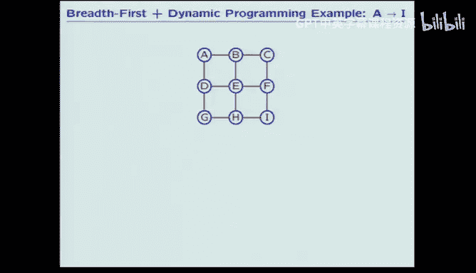

There may be more areas than usual， so I need to keep track of two things。

 I need to keep track of the visit lists。And I need to keep track of the agenda。

So there's two lists I have to keep track of。Okay， let's start out by saying that the agenda contains the start element。

 That's a。 That means we visited A。It's bread first。

So I want to take the first guy out of the queue and add his children to the end of the queue。

 Take the first guy out of the queue。 Add his children。 A's children are B And D。

Which means that I've now visited B& D。Now， I want to take out the first guy from the Q， A B。

 And I want to put his children at the end of the queue。Okay。

 A B's children are A that's been visited， C， not visited and E， not visited。So， A， B， C， E。

But that visits C and E。Now I want to take out AD。And put its children at the end。AD is AE G。

A is visited， E is visited， the treaty is just G， so AD D G。And that visits G。

Then I want to take out ABC。Puty in its children， ABC。A，BC， oh， dear， A B， I'm looking up there。

I said I'm a hypoglymic， okay， ABC， ABC could be B or F。B or F will B is no good， which leaves F。

 but that visits F。So now A BE。Okay， A， B， E， So that could be B， D， F， H。

 B visited D visited F visited H。Okay。That visits H。Now take out ADG。Children of ADG， ADG。

Two children， D and H， D and H， they're both there。 That didn't work。There are no children of ADG。AB。

C f。A，B，C， F， three children， C， EI， C visited E visited I Dun。Fund the right answer， one， two。

 three， four， five， six， seven， eight。E visits。So I've got。The same answer。And it's optimal。

And I did fewer than 9 visits。9 was the number of states。

 So this algorithm will always have those properties。So the dynamic programming， all right。

 forgot us line。Okay， the dynamic programming with breadth for a search will always find the best。

It'll never take longer than the number of states， so in this problem they had a finite number of states。

 even though it had an infinite number of paths。Because you could go around in circles。

It'll still never take more than the number of states。

And all that it requires to implement is to maintain two lists instead of one。

So the point then is that today we at a variety， we looked at two real different kinds of search algorithms。

 depth for search and breadth for search， and we looked at a number of different pruning rules。

 pruning rule one， don't go to some place that you've already visited， pruning rule two。

 if you have two children that go to the same place or anything about one of them。

You can consider dynamic programming to be a third pruning rule， because that's the effect of it。

And the final announcement。Don't forget about Wednesday。So have a good week。

