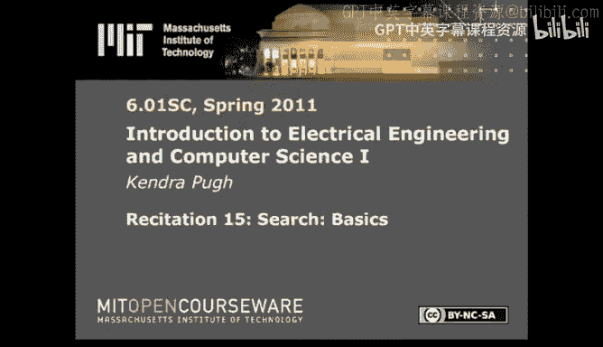

# 《电气工程与计算机科学导论1｜6.01SC Introduction to EECS I, Spring 2011》 - P25：-25-Rec 15 _ MIT 6.01SC Introduction to Electrical Engineering and Computer Scie - GPT中英字幕课程资源 - BV1oLBRB5EfQ

Hi， today I'd like to talk to you about search previously we've talked about ways to model uncertainty and also how to make estimations about a particular system when we're observing it from the outside or when we don't have perfect information。

At this point， we've almost got enough components to attempt to make an autonomous system。

But at this point， we also haven't enabled our autonomous systems to make complex decisions for itself。

This is why we want to be able to encode search， or we want to be able to enable a system to。

Make an evaluation of a succession of decisions or succession of actions when there are multiple choices and possibly multiple choices at every level。

 so as a consequence of being able to do search， our autonomous system should be able to complete a successive group of actions。

In 601， we're going to be searching state spaces and searching state spaces borrows a lot of ideas from state transition diagrams or what we already know about state machines when we're searching a state space。

 we want to know what states we're searching， what the transitions between them are going to look like or have access to the transitions from a given state to all the states that are its neighbors。

We're going to want the start space state to be specified so we know where to begin。

 We want a goal test which actually specifies what we're looking for as a consequence of the search。

 or if we get to a state and we want to know whether or not we're done。

 we use our goal test and it could look at the output of the state or actually just the state name。

 that sort of thing。The other thing that we're going to have while we're searching is a legal action list。

The searches that we're going to do today， you and I are going to be able to see the entire state transition diagram at once。

But if we're encoding how to search on our robot， our robot can't see the entire state transition diagram at once because if it could。

 then it wouldn't have to do search， it would know how to get there from here。Therefore。

 we give our system a legal action list or all the actions that it should attempt to do at a given state。

 it's entirely possible that there aren't legal transitions at every state for every legal action。

 but it's good to have an exhaustive list of things to try and see if they succeed or fail and as a consequence。

 what states you end up visiting。Every time you try to do one of these。

Being able to do search is great， but we also want to be able to keep track of where we searched and how so that once we're done searching。

 we can actually execute the best thing。We're going to use a search tree to keep track of where we've been and how we got there。

 Search tree is going to be comprised of node。 It's otherwise going to look like a directed ascyclic graph。

 and it's going to have a lot of similarity to any particular state transition diagram that we end up searching。

But it's going to have nodes instead of states。 Nos are different。

 Nos represent both the state that you've。Expanded as a consequence of being in that。

state you've visited as a consequence of。Expanding its parent node。

The parent node or the place that you came from as a consequence of getting to that node and the transition that you made in order to get there or the action that happened that got you from the parent node to the child node。

Keeping track of a list of nodes is known as a path or it specifies where you've been and how you've got there。

 and if you're at a given node you can actually use the reference to the parent node and the action to trace back from whatever node you're at currently to its parent node to its parent node to its parent node and then finally get back to the start state at that point you'll know what path to take。

So the only thing left to do is。How do you figure out which paths to follow first？

That's where the agenda comes in， the agenda is going to be the collection of all partial paths you've ever created as a consequence of expanding paths and then expanding nodes and then putting its child nodes on a partial path。

Meant for。Future expansion。The order in which you add and remove things to the agenda is going to determine what your search tree looks like。

That's a lot of information at this point I'm going to go over an example。

We're going to search the state transition diagram。We're going to start at A。

And our goal test would be whether or not our state was equal to E。Today。

 we're going to try two different kinds of basic search。

 One is referred to as breathth first search or BFS。

 and one is referred to as depth first search or DFS。

Breth first search refers to the idea that as you build your search tree。

 you're going to exhaustively expand all the nodes at a given level before advancing to the next level。

 or all the given nodes at a given depth before expanding to the next depth。

This means you're being very thorough。 It also means that youre。

Guaranteed to find the shortest path from your start node to the goal if it exists。

Depth for search is the opposite。As a consequence of depth first search。

 you're going to expand all the nodes in a given branch as far down the tree as you possibly can before advancing to the next branch。

It takes up a lot less space than breathth first search。

 but it's not guaranteed to find the optimal path。Another way to think about these two types of search is that if you're doing breath for search。

Then your agenda acts as a cue。First items in or first partial paths that you discover are the first items out or the first partial paths that you end up expanding。

Dob first search。Is when the agenda is used as a stack。Or the first partial paths that you visit。

Are the first partial paths or the most recent partial paths that you visited are going to be the partial paths that you first expend。

First in， lost out， or lost in， first out。Let me walk through a couple iterations。

On the state transition diagram， and hopefully it'll be clear what's going on。

The first thing that happens is that you end up visiting and expanding the stark node。

 That's pretty straightforward。So the path A is going to be added to both agendas。And the node。A。

It's going to be visited first。On both search trees。If in the general sense， I say that I'm going to。

Make a transition。Two states in alphabetical order。

 and that's the order in which I'm going to add them to my agenda。

That's going to be reflected in what I write up here。

Let's say that I'm going to visit new nodes in alphabetical order。So nodes I would visit are AB。

Or B and C， and I'm going to add AB and AC。To my agenda。

Here's where the difference between breathth first search and depth first search comes in。

In breath for。Because I'm following the convention first in for first out。

If I place the partial path AB in my agenda first。Then I'm going to expand B as a consequence of the partial path。

 A B first。So when I go to B， I'm actually going to expand B now。

I'm going to look at the nodes that I can visit as a consequence of expanding B。

The ones that I can visit are C。Andy。And I'm going to add the partial paths， A， B， C， and A， B D。

To my agenda。So AC， I'm just going to move to the front of the queue。Or the agenda。

And I'm going to add ABC in ABD。And I got there。Tbi。So I'm going to add C。And D。Here。

Deef first search grabs from the opposite end of the agenda。

So the first thing I'm going to look at is AC。I'm going to expand the sea。

Look at the nodes that I can reach as a consequence of expanding C。And visit。B， and D。

AB is still hanging out here。I popped off AC。To use it in order to expand， seize children。

And I'm going to add。ACB。First。An ACD。Second。Note that our search trees already look different。

And we'll actually end up reaching the goal using one of these search strategies first than the other or as opposed to the other。

If I go back to breathth for search， I'm going to pop the partial path AC off the front of my agenda。

 I'm going to expand C。Expanding C gets me B and D。I'm going to move over。My existing partial paths。

And add ACB。An ACD。I've staggered these in order to indicate that they're a consequence of a third iteration of breath first search。

 but they're actually considered to be at the same depth since their parents are considered to be at the same depth since their parents are parents of the start node。

That's the defining feature of breath first search。

 is the fact that we're going to exhaustively search a given depth in our search tree。

Before advancing to the next。D level。If I want run one more iteration of death first search。Again。

 I'm popping partial paths off this end of the agenda。I'm going to expand D。

D has one transition available to a node。And in plain old fashioned breath research and depth research。

 I run my goal test when I visit a node so at this point。

I would test whether or not E was my goal test。I would discover it's my goal test。

 my search would return successfully。And return the path found。So AB and ACB。Remain on the agenda。

I popped off ACD in order to expand D。And I found this path。

At this point I've concluded depthth for search， I'm going to do one roll round of breathth for search to demonstrate an important rule。

If I pop ABC off the agenda。And move all these over。If I'm looking at A， B， C。

 and I look at the children of C。The two children of C are B and D。

So the first partial path that I would end up adding to the agenda as a consequence of expanding C in this case would be A。

 B， C， B。And it would look like。This。You'll notice that we're going to create an infinite loop。

And the。There are two basic rules of basic search that I need to emphasize now to prevent you from doing things like creating an infinite loop。

If you look in the textbook， they're called"How to not Be completely stupid。

If at any point you are visiting a node in your partial path that it already exists in your partial path。

Don't add it to that partial path。You will prevent yourself from creating a cycle because if you visit the same node more than once。

 you've actually done more work than you need to。The second rule。

 and it's not demonstrated well on this state transition diagram。 but for instance， if I had。

Two arrows。From B2D。There's no particular reason to consider both of these actions。

And if you have a state transition diagram that allows multiple transitions from one state to another。

Based on different actions， then you need to come up with some sort of rule to decide between the two actions。

That's the second rule of how to not be completely stupid is if you have more than one transition from one state to another as a consequence of doing search。

 pick one and come up with a rule to pick one。This covers basic search。Next week。

 I'm going to talk about dynamic programming， costs and heuristics。

