# 《电气工程与计算机科学导论1｜6.01SC Introduction to EECS I, Spring 2011》 - P26：-26-Lec 13 _ MIT 6.01SC Introduction to Electrical Engineering and Computer Scie - GPT中英字幕课程资源 - BV1oLBRB5EfQ

The following content is provided under a creative Commons license。

 Your support will help M T Open Coseware continue to offer high quality educational resources for free。

To make a donation or view additional materials from hundreds of M T courses。

 visit M I T OpenCseware at O C W dot M I Tt E Du。

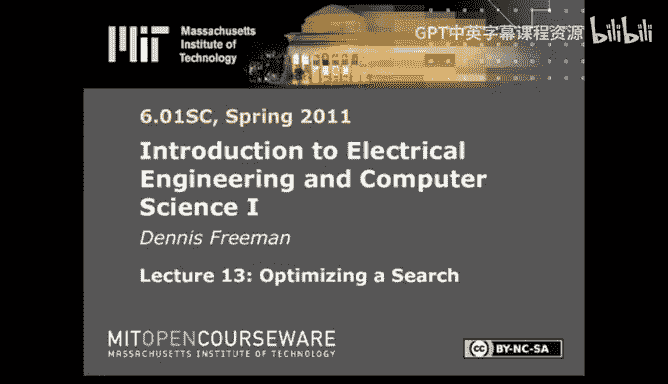

So， hello。Today， I want to talk about， and I want to finish talking about search algorithms。再。

So last time we started to think about a framework within which to think about search。

 and the important thing was to figure out a way to be systematic about it。

So we figured out a way to organize the way we think about searching by way of a tree。

Put all the possible places where we could be in the search。

Consider all the possible actions that we could take so if we started at A。

 there are two different actions we could have taken and we could have gone to B or D。

 think of the actions as the edges of the graph。And then think about where we land。

Then by way of that graph， think about the shortest path to the goal。 So that was the idea。

 And the big outcome was order matters。So if we were to construct an agenda。

 which is the list of nodes that we are currently considering。

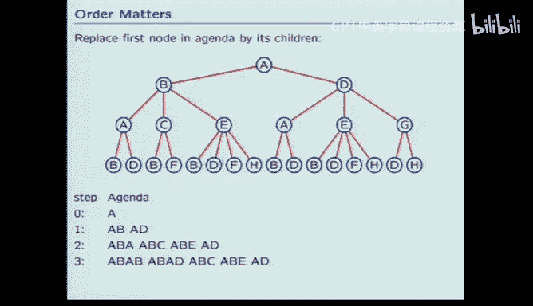

If we started at A， we would start by putting a on the agenda。

Then we would pop a out of the agenda and replace it with its children。 It children are A， B and A D。

If the algorithm was replaced the first node in the agenda by the children， the first node is AB。

 so then we would pop AB and replace it with its children， AB has children AE。E cetera。

And the result would be something that we call a depth first search。

Because what's happening is we're following lines。Deeply before we look crosswise。

And there's a million varieties of this that you could think of if you would get the same kind of algorithm if you replace the last node by its children。

Then you'd start with A， replace it by its children， which is still BD， but now expand D。

In terms of its children。Then take the last child， expand it， and we would get another depth search。

So the idea is whatever order you choose affects the solution that you find。 General。

 we're interested in finding a search that locates the best， shortest path。

And so a good method is to remove the first node from the agenda and add the children to the end。

That's a cube based ordering。Where the first out is the first in。Then if you imagine starting at A。

 replacing it by its children， BD。Take the first guy out。 That's A B。

Consider its children and put them at the end of the list。Then we go back and expand AD。😡。

Before we think about the children of A B。And so the result， if you just follow the red up here。

 the result of that search is what we call breakfast。

 so we systematically propagate down the search tree looking at short paths first。So that's the idea。

 the idea is that search is easy， you organize it around one of these graphs。

And just systematically run through the search by keeping track of what we call the agenda。

 the nodes under consideration。And the only trick is that order matters。

We found two useful orders last time， first in first out。And last and first out。

 one of those giving depth first， which is generally not a good idea， the other giving breadth first。

 which is generally a much better idea today what I want to do is generalize that structure to take into account a much more flexible group of problems。

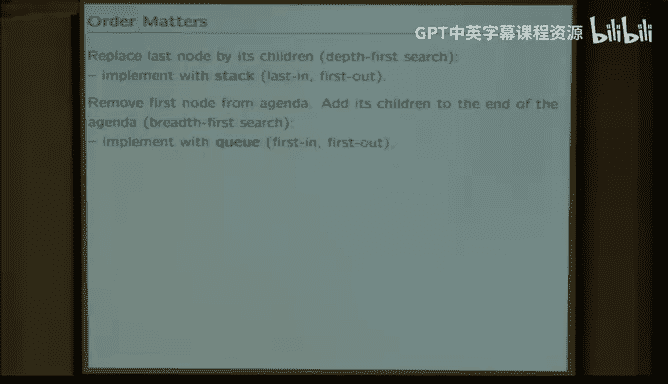

That'll give rise to something we'll call uniform cost search。

And the other thing that I wanted to think about is， again， the order。😡，By thinking about the order。

 we can drastically improve the efficiency of a search。

And that idea gives rise to something that we'll call heuristics。So the idea then。

That I want to look at first in terms of uniform cost search。

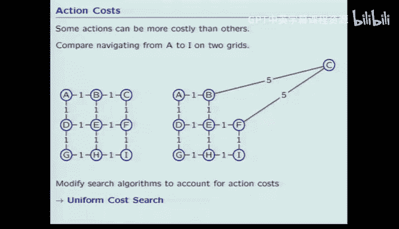

Is the idea that so far we've only looked at problems。Where the cost of each child。Is the same。

We were only looking at。How many children in total， how many generations did we have to go through？

To get from the starting point to the goal。That's an important class of problems。

 but it's by no means the only important class of problems and in fact the most trivial problems you can think of don't fall into that class。

 so for example， imagine that what we were doing， so I motivated the entire problem last time in terms of searching for a path on a Manhattan grid so if I wanted to go from A to I。

Where all the distances are equal。Then minimizing the number of generations。

 minimizing the number of intersections that I go through will give rise to the best search， however。

 imagine that one particular node is way off the map。

Then the number of generations that I go through is obviously not the right answer。

Because there's a penalty for taking a path that goes through C。

 because the distance between B and C is so much bigger than the distance， for example， from D to G。

So the first thing that I want to look at is how do we incorporate that kind of new information into the search algorithm？

So before I do that， think about how the Bth first search。

 the thing that we found last time that was the best Bth first search with dynamic programming。

 Think about how it would approach the problem and think about as we go through step by step。

 what is it doing wrong， Okay， so I'm going to go through an algorithm that is known not to work。

With the idea that you're supposed to identify as I'm doing that， what step was wrong？

So imagine that I'm doing this， and then I'm going compare it in a moment to C being off the map。

So if I do this problem。With dynamic programming， I have to keep track of how many nodes I already visited。

And I have to keep track of all the nodes under consideration。

 The nodes under consideration is what we call the agenda。

 and I will call the list of nodes that we're keeping track of for dynamic programming。

 I'll call that the visited list because we'll add nodes to the list。We'll add states to the list。

As we visit them。 So we start out the algorithm with node A being on the agenda。

 We're trying to go to node I。And by the time I've started， I've already visited A。

 So the starting point is that the visited list has one element in it A。

 the agenda has one element in it A。So the algorithm is going to be pop the first guy out of the agenda and add the children to the end。

Paying attention to the visiting visited list。 So pop A out of the agenda。

The children of A are B and D。As I visit them， they get added to the visited list， B And D。

So now I pop the first person out， that's AB。Then I want to think about the children of A B。

 That's A C， E。 where A is already visited。So I don't need to add that again， but C and E are not。

 so I add them and add them to the visited list。Then I pop AD D out， A D， well the children are AE G。

A and E are in the list already。 G is not。 So I end up adding G to the list。Next is to pop out C。😡。

The children of C are B and F， B was in the list。 F was not。

 so I add the child that has F at the end。Then the next one is E。 E has children， B， D， F， H。B， D， F。

 the only new one is H。Then G， A D G， take G out， the children of G R D and H。

 but they're already in the visited list， so I don't need to worry about them。Then ABC， F。

 So F is this guy， C， EI。CEI is not in the list。😡，And that's my answer。Yes。

A a slightly different algorithm might give me that solution。All that I'm tracing here。

 I'm trying to be consistent with the algorithm that we discussed last time。

But at the very good point。 So the breadth for search with dynamic programming is guaranteed to give you a solution that has minimum length。

It's not guaranteed to give you a particular solution。Of minimum length。

 So when there exists multiple solutions with the same length。

This search algorithm might give you any of them， and that's an important thing to keep in mind。

So with regard to the problem， So I'm thinking I'm trying to think ahead。

 I'm trying to think ahead to where the C is off the map。 It's over here someplace。

So what I want to do is stop thinking about how many hops there were and start thinking about how many miles there are。

The first thing I want you to notice is that this。Search pattern that we did。

Created a visitation list。 We visited the states in the order of increasing number of hops。😊。

That's obviously a good thing， right If we can always keep in the agenda。

 the smallest number of hops to the next place。 and if we faithfully visit states starting at the minimum number and proceeding up。

 So we started with A， there's no hops in getting to A。 So that's zero in going from A to B。

 there's one hop。In going from A to D， there's one hop， and going from A to B to C， ABC。

 there's two hops。So what the algorithm that we described last time。

 B with dynamic programming does is it visits the states in the order of increasing number of hops that's obviously a good thing。

Okay， so what's my next slide？I want to think about C being off the map。

So what I'd like to do is think about what order。With this algorithm。Visit number of miles。

So if I think about replacing the metric in the bottom。With the number of miles。

 whenever the different actions that can occur incur different costs。Think about what I'm saying。

 So I'm saying that if I were at B and I think about my children， A，E。Which action I take？

Go from B to A or go from B to C or go from B to E， which action I take incurs different costs。

So what I want to do now is think about， change the focus from thinking about how many hops is it to thinking about how many miles is it。

So now， if I replace the metric。 So over here， the metric was how many hops。

Replaces how many hops with how many miles。And what you see is that the algorithm is not picking up。

It's not visiting the states。😡，In order of increasing path length。That's what's wrong。

So what we'd like to do is modify the algorithm somehow。So that it proceeds through the paths。

Shortest to longest。So， that's the goal。And that's pretty easy to do。

The first thing we have to do is put that new information somewhere。

And I've already alluded to the fact that the way to think about the new information is that it's associated with actions。

It's not associated with states， states are where we go to in the diagram。Like state E。

The extra cost is not summarized in the state， The extra cost is summarized in the exact path that we took。

And the way we'll think about that is incrementally on So we create the path by doing actions。

And each action has a different cost， so the first thing we do is associate this additional cost with the actions。

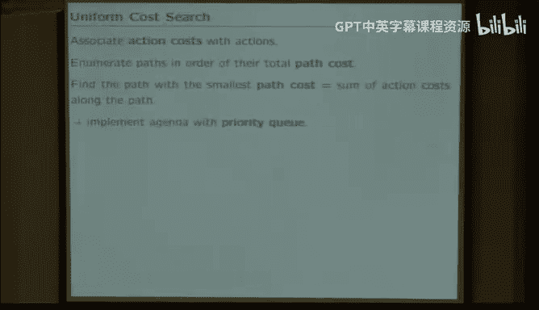

Then we're looking for a search procedure that will enumerate the paths in the order of path cost。

And the way to do that is to think about the basic ordering schemes that we had before。

 which were the stack。Last in first out。Versus the Q， first in first out。

 what we'll do is we'll make a trivial modification of the idea of a Q and we'll call it a priority Q。

So a priority queue is basically like a queue。Except the things that are cud have priorities。

So the idea will be that when you push at possible action， say I had actions A B or C。

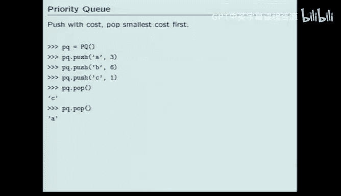

In addition to pushing them onto the queue， which is how we would have done bread for search。

In addition to pushing them on the queue， I'll also associate with them a cost。

So when I push a on the Q， the priority queue， I'll associate with that a cost。

 which I've arbitrarily said here， the cost is three。When I push B， I'll associate a cost6。

 when I push C， I'll associate a cost one， so that when I do the first pop。

 what will come out will be the element that I pushed that it has the smallest associated costs。

That'll be a way that I can order then my search through the search tree。😡。

In terms of the minimum costs。Is that clear？So the first time I do a pop。

 the element that pops out is the one with the least cost， which is this one， so I get C。

C is then removed from the list。And the second time I do it when I do a pop。

 I pick out the one with the cost three， which is a。

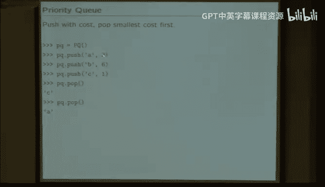

That's an easy modification to the schemes that we used before， just like before。

 we can implement a priority queue with the list。Here we've put all the complication into popping。

So we just pushed like we did before， just jam it in。So just add it to the end of the list。

 and we've put the complication into P。Pop looks through the list and finds the one that has the biggest negative cost。

 That's just because we had a utility routine that gave us the biggest。We want the smallest。

 We know that the costs are are non negative。So we implement the find the smallest by calling the routine find the biggest with a negative cost。

So notice that we've created all the new complication is in this pop routine。

 and if you think about it， P's doing far too much work。The way this routine works。

Every time you do a pop， it goes through the whole list， looking for something that is small。

 Obviously， it ought to be able to keep track of progress that is made in that previously。

 There are much better algorithms。 but for the purpose of this illustration。

 we didn't bother with it。 So this is not a very clever implementation。We're not trying to be clever。

 we're trying to illustrate the point。😡，Okay， so if you were seriously trying to do a big search。

 if you were writing code for Google， you would never do it this way。But the idea again。

 is in abstraction， we're going to bury those details in the way the queue is implemented。

 and then at the next higher level， we don't need to worry about those details。

 we'll abstract them away。Is that all clear？Okay， so this then is the way we end up doing the search。

So when we do the search， when we create a new node。

The idea is going to be that we can generate a cost， remember。

 nodes in the search tree summarize paths。Nodes are different from states， right。

 States are places that we can visit。

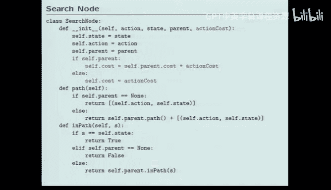

Nodes are paths。So the thing that we need to keep track of now， in addition to what we did before。

Before we had the idea that nodes had states， they have a place where you are currently in the search。

They have actions， which is which direction do you go next， and they have parents。

And that was enough information to create and maintain a search tree Now what we need to do is also keep track of cost。

 so we do that by at instantiation time when we create a new node。

 we have to also pass it what is the action cost。So in the previous example。

 the action cost would be the distance from B to C， for example， being5。

 which is different from the distance between B to E， which is one。

 So we have to associate at the time we create a node。

 what is the action cost associated with this new node and then the node keeps track of the total path cost。

So that's what the red stuff is doing。 So it's a very small change to the code that we used for creating nodes in the previous two searches。

And then we have to also change the way we do the basic search algorithm。And here too， the search。

 the idea is pretty simple， it's almost exactly the same thing that we did before with the idea that we substitute。

 keep track of the agenda with a priority queue rather than with a queue or a stack。

There's one more complication， and that is that in the past。

We knew that all children added the same penalty each because we were only keeping track of。

How many generations， how many hops are there to the current node， All children were， in some sense。

 created equal because we knew they all incurred one more hop。Here。

Because the children can have different associated。Action costs。We don't know at the time， we've。

Pick up the parent。 We don't know at that time which child is going to end up being the shortest one。

So previously the goal test was performed when the children were pushed onto the agenda。

 here we have to wait。Until we look at all of the children before we will know which child has the shortest length。

 and that just means that we take the goal test， which had been inside the4A in actions loop。

 we have to factor that out and defer it until the next time。

So that's the only change to the algorithm that we need to make。So is that clear。

 so the idea is it's a pretty simple modification of the algorithm that we have so far。

But it gives rise to a much more versatile kind of search。

So last time we saw that there was really no good point for not doing the search。

 the breadth of search with dynamic programming， we have the same thing here。

So when you're doing the priority search， when you're doing the excuse me when you're doing the uniform cost search。

 there's no real good reason for not implementing that with dynamic programming。

 so we also want to think about the dynamic programming algorithm so you remember in breadth first search and in depth first search dynamic programming referred to the principle that。

The shortest path from x to z through y。So if you have a path from x to Z and you don't go through Y。

 the shortest way you can get from x to Z through y is to add the shortest path from x to y to the shortest path from y to Z。

Sounds trivial， but it has a tremendous impact on the number of states that can be omitted from the search。

Here， when we do the uniform cost search， we can do the same sort of thing。

 But except that we run into the same sort of problem with。

Not all paths from x to y are created equally。😡，We don't want to remember any random path from X to Y。

 We want to remember the best one， which means that in general。

 we're going to have to expand all of the children。Before we'll know which child。

Give us the minimum length path。So that means that the dynamic programming principle that we'll use is to remember the state when it gets expanded。

Because it only gets expanded after it's already been compared to its siblings。So wait until a state。

 wait until a path。Has been compared to all the siblings of that particular path。

Before you consider it for dynamic programming， so we'll do that by not keeping track of states as they are visited。

 but instead keeping track of states as they are expanded。

 that's the same idea that we had to do when we had to reorder goal tests。

Deer the goal tests until after you think about all the children。

Der in the list of the dynamic putting it in the dynamic programming list until after you've looked at all the children。

 and so that means that we think about expansions instead of visits。And so that looks like this。

 So just like we took the， the goal test outside the action list。In the previous breakfast search。

 we did the test goal state in this loop。Here， we defer it until we've looked at all the children。

And fetch the parent。 So we defer it into the higher loop， We take it out of this loop and into this。

 And similarly， we take the dynamic programming membrane。

We now call it expanded to remind ourselves that what we're doing is keeping track of states after they were expanded。

 not after they were visited。And updating it again， not when we look at the individual actions。

 but only after we've decided which child。Is the winner。Okay。That's probably confusing。

 that's not important at this point。Because I've written an example。

And hopefully by thinking through the example， you'll be able to see what the code is supposed to be doing。

 And then a good exercise is to go through the example。

 which will be posted on the web with all the worry details and make sure that you can match up。

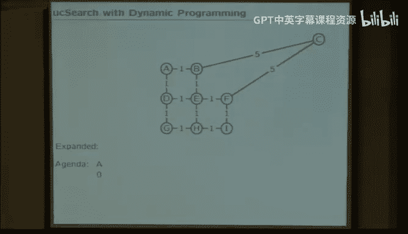

The search。The partial results to the search to the way the algorithm is written。ok。So， think about。

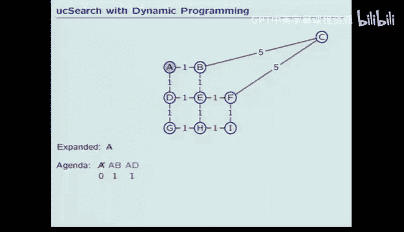

So now I want to do the problem of interest。Think about what if one of these nodes， nodes。

 one of the states， state C。Is very distant relative to all the rest。How will the new search。

 the uniform cost search？ToWork with this problem。 So we do the same sort of thing we did before。

Now we have an agenda to keep track of the nodes under consideration。

We have a dynamic programming list that is going to be called expanded。

Because we don't add to it until we expand states。It had previously been called visited。

 and we also keep track of the metric。Which is the path cost。

So if we start by putting node A on the agenda。Its path cost is zero because it doesn't cost anything to get there because that's where we started。

And we haven't expanded anybody yet。So notice that the starting state is a little bit different here。

Because we're keeping track of expanded， the expanded list started out with zero elements in it。

 previously where we were keeping track of visits it started out knowing already what was going on with A。

So now we expand A。Think about A's children， B and D。Put them on the agenda。

And add A to the expanded lists。We expand today， so it's time to add it to the dynamic programming list。

Then also keep track of the costs of these。Paths。AB costs one。😡，AD costs one。

That's the end of the first pass。 Now， pop the first guy off the queue。Expand it。

 that means we're expanding the B state， we go from A to B， so we're going to expand B。

 B has children A， C， and E。 A has already been expanded， so we don't need to think about A anymore。

B， as C and E。 So it was A， C and E， C and E have not been expanded。So I expand B to get these two。

 and I associate there。Total path costs。So the path AB C， ABC has length6。And the path。

 ABE has length two。Then I take the first one off the agenda again， that's AD D。 I expand AD。

 which is expanding D， put that on the expanded list on the dynamic programming list。

D has children A， E， G。 A is already on the expanded list。

 So that means I have to worry about A and G。 I have to worry about E and G。

Those paths have length to and tool。

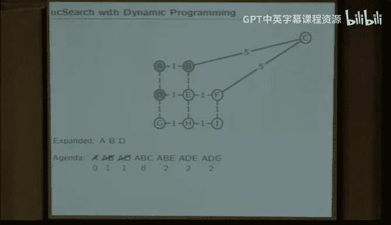

That was the same so far as the previous search， Now I see something different。

Because I'm using a priority queue， I skip ABC because that's just not the right one to do next。

So ABC， I'm keeping track with the priority queue， I know that that path is already length six。

It could end up being the optimum path。But at this phase of the search。

 it's not the 1 I should think of next。The1 I should think of next is the shortest path。

 So what I'm trying to do is search the search tree in order of shortest path。 So I skip。The ABC。

 because its path is long and the minimum length。 So going back up one。So in the priority Q idea。

 I want to extract from the Q the first item with the minimum length。 So that's A B， E。

Everyone's with that。So then I want to expand E。E has children， B， D， F， H。So B and D are here。

 F and H are not， so I add A B， E，FH to the agenda。😡，Each of those have length  three。

Then the so what's the next guy out of the agenda。I need this the first one with the smallest path。

The the smallest cost possible， the smallest cost possible is two。 So AD DE is the next guy。

 So I expand AD DE， but I've already expanded E。Don't need to do anything。Okay， the dynamic。

The dynamic expansion list is keeping track of the nodes I've already expanded。 I already did E。

 there's nothing new to be learned。So that doesn't do anything。So the next one is G。Okay， well。

 I didn't do G yet。 So add it to the expanded list。 G， G's children are D and H。 D was already there。

 H was not。 So at H。The next one is F。Okay， I haven't expanded F yet， so let's do F。

So F's children are CEI。C is not there， E is there， I is not there， so I add those。

So next is this guy。H has AH wasn't expanded， so I add H to the list， H's children are EGI。

EG are already there， I is not， so I add that。Try expanding H， but already did expand H。

 So that doesn't count。Try expanding C， that's fine。 Exp C。

 I haven't expanded C before added to the list， C's children are B and F， B and F are both there。

 didn't add any new children Why did you expand that？8。Oh， thank you very much， next slide。😊。

Ignore that， absolutely correct， thank you。So let's say。

 I guess this proves that 200 people watching the lecturer have greater insight anyway， Yes。

 that's wrong， don't bother with that because it's got the wrong priority， jump straight to that。

I'll fix the slide on the web。You're absolutely right， I should have gone straight to there。

 and when I try to expand I， I realize that that's my answer， so I'm done。Okay。Questions。Okay。

 it's a little tedious。 The point is that it really wasn't very much different。

From doing breakfast first search。The same ideas still work。

 the same idea of organizing the search on a tree。Looking for the minimum cost answer on the tree。

 That's the big picture。 That's what we want you to know about。 So the details， I mean。

 we may ask you a quiz question about breadth for search or depth for search or dynamic programming or whatever。

 But the big picture， The thing we really want you to know is how to think about a search。

The way to think about a search is as a sequence of states。Organized in a tree。

That you can then systematically search。 That's the idea。

 And the point of going through the uniform cost search。Is to see。First and foremost。

 that it fits the same structure。 It's the same kind of problem。Secondly。

 there are very tiny details。 and so I've tried to go over those details。

 The details have to do with keeping track of the action costs and keeping track of which one to do next by way of a priority queue。

 But the big picture is the same idea works， states， nodes， trees， search queuees。Questions。

 comments。Okay。诶。The the other important thing that I want to talk about today is again。

 this idea of trying to minimize the length of your search。

The other point that you're supposed to get from these two lectures is depending on exactly how you set up the search。

 you can do a lot of work。Or less work。

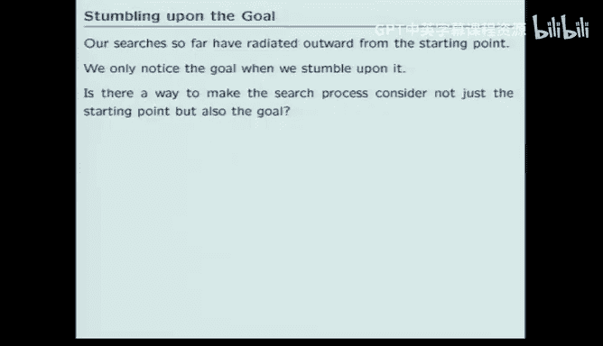

And we're always interested to do less。Especially because if you can do a lot less。

 you can do a lot harder problem。So the other thing that I want to talk about next。

Is the idea that our searches so far？Have been starting state centric。What do I mean by that？

 Every search has a starting state and a goal。And the ordering of our searches so far have been。

 go to the starting state。Think of all the steps you can make from the starting state。

And just keep widening your search。Wider and wider and wider until you stumble onto the goal。Okay。

 can you all see that that's what we've been doing， So nowhere in our code。

Was the code aware of the goal？Other than。Am I there yet？

So the search algorithm so far has been start at the beginning state， ask if I'm there yet。

Try the closest place I can go， Am I there yet， Am I at to go yet。

 try the next closest place I can go from the start， Am I at the goal yet。

 Try the next closest place I can start from。Am I there yet？Everything has been starting。

 state centric。Obviously， that's wrong。😡，Somehow， when you do a search。

If you were asked to find the shortest route。Through the interstate highway system。

From Kansas to Boston。There's a good chance。You wouldn't be looking at Wyoming。Okay。

 everybody knows enough geography to do that one， right？

So the idea is that in the searches we've done so far。

 you would look at Wyoming before you'd look at Massachusetts。Okay， that's stupid。

Everybody sort of see that。So the searches we have done so far have been starting state centric。

So what I'd like to do is think about a way to undo that。 But again， to set things up。

 let's think about what I mean by that。 Let's imagine a search very much like what we did before。

Except let's go from E to I。From Kansas to Boston。And I guess it's Kansas to Tallahassee but you get the idea。

 so we started E。And let's think about how our search proceeds。 So if you start at E。

 So think about we push E in the agenda， there's no places So I'm doing the uniform cost search with dynamic program。

With dynamic programming， I'm keeping track of the expanded states as my dynamic programming state。

 I'm starting at E， the cost of being at E is zero because that's where I started。

And now I think about expanding E， so E goes on the expanded list。

I think about all the children of E， the children are B，DFH， BDFH。

All of those children have distance one。So when I look among them to figure out the next one that I should do。

 I do the first guy， E B。B's children are A and C。So I take off E B from the beginning of the agenda。

 stick on A and C， wait， start to get B。 B's children are A， C， E。 E is already expanded。 P A and C。

Pop D， these children are AE G， push A and G because E is already there。Expand F。

F's children are CEI， E' is already there， push CI。Expand H。H' children are GI， EGI。

 E' is already there， pushed GI。Expand A。A's children are B and D， they're already there。

 don't need to do anything。Expand C， C's children are BF， BF or there， I don't need to do anything。

 expand A， B D are already there， I don't need to do anything， expand G， G's children are DH。

 DH are both there， I don't need to do anything， expand C， B F， BF， nothing， expand I， I'm there。Yes。

😊，We other。I supposed to be adding AC， you add A when you expand that。Yes， yes， yes， well okay。

 thank you， I'll fix this one too。So the question was when I expanded A， when I did this one。

 for example， when I tried to expand A。I should have added it to the list here so I don't try to do it again。

wouldn' have affected the outcome。But I should have added it to that list， thank you。Okay， class two。

 Freeman zero， okay？Yes。😊，どとでで。I mean， we we consider it。买个人错。

We didn't actually expand it if we consider it expanding within。correctrrect， correct。

 so what I really should do is go back and read the code and figure out what it should do。

What I'm trying to do is emulate the code。So your point is it's a technical definition about whether I want to think about whether I actually expanded it or not。

If I don't add any children， was at a real expansion？

And that's a question that is determined by where was the if statement？In the code。 and frankly。

 I don't remember。It does not expand it。 Oh， so I have the right answer。It't， okay。

 so I have the wrong answer。Okay， so。So the point of this。Is that the search was symmetric around E。

 even though the goal is not。Okay， and the question is， how could we fix it？

So the search is not symmetric around E， the starting point。

How do I fix it so the search is biased toward going toward the answer？

And so the way we think about this is with something we call heuristics。

So if you think about the searches we've been doing。

Either breakfast and depth first from last time where we counted the number of hops。

Or today where we counted the length of paths。Each of those considered what thing to do next based on the path from the starting point to the point under consideration。

The idea of a heuristic。Is to add something that informs the search。About how distance。

 how much distance we're expecting to add from the point under consideration to the goal。

So the idea of the heuristic。Is to put in the second part of the path。

The problem with a heuristic is that finding the second part of the hat。

Path is just as hard as finding the first part of the path。And it would be a terrible idea。

To for every point in the search tree。Run a new search to find the best answer。

From that point to the goal。Because that would。Increase the length of the search time enormously。

So it's a bad idea， so the problems are of equal complexity。

 the problem of getting from the start point to the place of interest。

And the problem of going from the place of interest to the goal are problems of equal complexity。

 We don't want to try to solve the problem of making the search better informed by increasing the complexity of the search drastically。

So that's the issue。 So a heuristic is going to be a way of approximating the amount of work we have to do yet。

Where what we would like it to be is not all that terribly difficult to compute。

So one way we could think about that would be to consider as an approximation to how much work we have to do。

 the Manhattan distance， for example， to complete the path。

Manhattan distance is the sum of the X and Y distance。Generally speaking。

 Manhattan distance is not a good idea for map like problems because generally you can cut across corners in such searches in this particular search since I've excluded cutting across diagonals。

Since the search space is already Manhattan， thinking about a heuristic that's based on Manhattan distance is probably okay。

Okay。So the idea is to develop a heuristic and here what I'm going to think about is。

 what if I complete the path？By adding the Manhattan distance from the point under consideration to the goal。

If I started at E like before and I'm going toward I like before。

Then I start with the agenda having just E and having expanded nothing。However。

 the cost associated with E is no longer zero。The cost of going from E， the starting point to E。

 the point under consideration is still zero。But I'm estimating the cost of going from E to I by the Manhattan distance between E and I。

 which is2。The Manhattan distance between E and I is you have to increment x by one。

 and you have to decrement y by one。So instead of saying that the cost of state E is 0。

 I'm saying that it's 2。That clear why I'm doing that？So now I expand E， I think about the children。

 BDFH， BDFH， and those children now are not the same cost。

Even though it costs the same amount to go from E to each of its children。

Going from its children to the goal。😡，Going from each child to the goal does not cost the same amount。

If I were to go from E to B。😡，That's a cost of one， but the Manhattan distance from B to I is3。

So I'm estimating then that the cost of making the decision go from E to B is four。

The real cost of going from E to B。Plus， the estimated cost of going from B to I。Similarly。

 if I go from E to D。The Manhattan distance is three， so that's a length4。 If I go from E to F。

 Manhattan distance from F to I is just one， so the total cost is just two。So now。

 rather than circling out from the starting point。My next step is biased toward the goal。😡。

So my next step is biased toward So in the remaining items， the smallest cost is two。

 So the next place that I expand is EF。F children are CEI。E is already here， so I only think of C。

 C and I also have different costs。So the cost of going EFC， EFC。

 the direct cost is 2 and the estimated distance， the Manhattan distance between C and I is also two。

 so that's a cost4， whereas the cost of EFI， EFI has a direct cost of2。

 and the Manhattan distance from I to I is zero。So now I look for the minimum distance。

This remaining。 So that's going to be H。I expand H， the children are EGI。So E is already here。

 I think about GI， same sort of deals， some of them are short， some of them are long。

And as I proceed through the search， I very quickly find I without having ever looked。

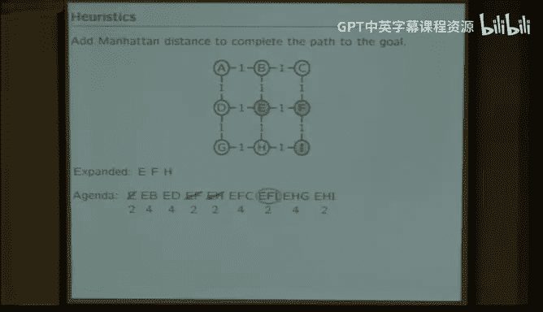

In the wrong direction， or at least having looked minimally。In the wrong direction， is that clear？

So the idea in a heuristic。Is to add an estimate。Of how much it will cost to complete the path。

So that you bias the search toward the goal。Rather than making circles that spiral out from the starting point make the spirals biased toward the goal。

And here's the way you do that it's very easy all you do is every place we would have looked at cost before add the heuristic function。

 so you have to add a heuristic function， that's the part that's hard， the code。

 given the heuristic function is easy， the really hard part is actually figuring out what a reasonable heuristic is。

The reason that's hard。Is that you have to be careful not to miss the solution。

So the heuristic function。Can't be bigger than the actual distance。 Okay， why is that？

 The agenda is trying to keep track of all the possible places that you could look next。

If your heuristic function makes the next step look too big。

It' will be taken out of the agenda and never appear again， and you'll never find that path。😡。

So when you're making a heuristic function， you have to be very careful not to ever overestimate。

The distance from where you are to the goal。If you ever overestimate it。

 then you can exclude forever more。 So think about the agenda as a pruning operation。

 right we did this starting last time when we think about pruning， we lop off things from the agenda。

 we say， don't ever need to look there。 don't need to look there。 We pruned it。If you put a。

If you have a heuristic that is too big， you can prune a path。That was the answer。

 so you have to be careful never to do that， so it's asymmetrical。

If you were to put in a heuristic that is too small。

That causes you to underestimate the penalty of going in the wrong direction。

So if you said I'm trying to go from Kansas to Boston。

And you inadvertently said that Wyoming really didn't cost anything。

Then you would not necessarily exclude the correct answer。

But you would include and cause the search to consider unnecessary paths。

So the idea is that you would like the heuristic to be the same as the real cost or smaller。

You don't want to end up solving another search problem in order to calculate it because that don't increase the cost of doing the search too much。

 so you would like some number that's easy to calculate。

That has the guarantee that it will always be less than or equal to the actual cost and that's the art of doing a heuristic if you satisfy those。

 then that previous algorithm that we looked at， which is in the literature it's called the A star algorithm for historical reasons。

 that algorithm， if you obey these rules for finding an admissible heuristic if you find itmiss heuristic。

 then the A star search will be a lot faster。And still find a solution with the same length。Okay。

 so now just to see if you're following what I'm saying。Here's a question to ask yourself。

Remember the tiles problem， the Ts problem is the first problem that I did last time。

The idea was imagine starting in this configuration 1，2，3，4，5，6，7，8。

 move one tile at a time by moving the tile into the free spot so I could move 8 to the right or six down。

Keep doing that until you pertuurrb this configuration into this configuration。

We saw last time that there are a large number of states， there's a third of a million states。

 so this is a big search problem， even though it's something that you've almost certainly all solved as a child。

 in fact， my version it was the same as your as I'm sure， was a four by4。 I did the 15 puzzle。

 not the eight puzzle， but it's the same idea。So what I want to do is consider heuristics。

Consider three heuristics， heuristic A。Is zero， it always returns zero。😡。

That's an easy heuristic to calculate， right。Huristic B is some the number of tiles that are in their wrong position。

What is heuristic B for this state？There's eight tiles that are out of position。So。

The heuristic C is the sum of the Manhattan distances required to move each tile。

To their respective locations。And the question is。Oh， and then calculate two partial sums。

Consider am I， to be the number of moves in the best solution。

 if you use heuristic I and EI is the number of states that are expanded while you're doing the search。

If you use Heuristic eye。HowWch of the following statements are true？Okay， take a minute。

 talk to your neighbor， figure out which of these are true。Well， if it takes longer than this。No。

Okay， so what's the smallest？Numbered， correct。Answer。The smallest numbered correct answer。Co。

 volunteers， planning on your neighbor very bad。😊，1。MA equals MB equals M， why is that？

How that do the A see what I do。对。running。So either what conditions will they all reach the same length？

要不愿再说。So they're all events first。Theres another condition， yes。So the heuristics。

All three heuristics have to be admissible。Which means that they have to be between。

 they have to be non negative numbers。To be admissible， a youruristic has to be non negative。

And it has to generate an answer that's smaller than the actual number of moves necessary to complete the path。

So we have to prove that these are all admissible。晓。Are they all gone negative， yes？

Are they all less than or equal to the number？So let's do that， let's first all that for a minutes。

 so we'll do that after we do the second bar， what's the second smallest correct statement？那に会ね。

And answers for F too。So how do you know that EA is bigger than EB is bigger than EC？

So the number of states expanded has to do with the size of the heuristic。

If the size of the heuristic is zero， that's the same as not using a heuristic that'll search all possible states in a breadth first search fashion。

 if the heuristic is anything that's bigger， the number of searches will go down。

 What's the greater than or equal to thing doing here， yes。Yes我在那。It very very。Okay， okay， okay。Okay。

 class。Three plus Freeman。Oh， well。Yes， you're right， yes， I agree。

 did you raise your hand for three， okay？So three is technically the second， yes， that's right。

 that's right。Okay。So moving on， number five， the same best solution will result for all the heuristics。

 true or false。Come on， things can only go downhill for me。

So the same best solution will resolve for all the hearings。How could it possibly be false？

Didn't we already say MA equals M equals MC？Yeah。So if there are multiple solutions of the same length。

The different heuristics don't have to give you the same solution exactly。

 They have to give you solutions with the same length。Right。

So what happens with the heuristics is that you perturb the order of search。

If you pertuurrb the order of search， the only thing that is proved is that you get a minimum length solution。

 not the same minimum length solution， this particular problem has lots of solutions and so you don't necessarily get the same solution when you use different heuristics。

Okay。Okay， so。The final point is that the addition of the heuristics can be extremely effective。

If you run this problem with our search algorithm。

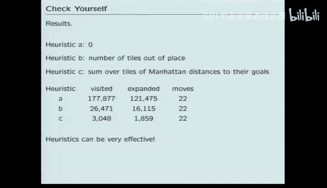

With heuristic A， so you always get solutions with 22 moves in them。

That's good because all the heuristics were admissible， so you always get a right answer。

 a shortest answer。But the number of visited and expanded are drastically different when you add the heuristics。

So if you use heuristic0， which is equivalent to heuristic A， which is equivalent to no heuristic。

 you end up visiting 170，000 states。To find this answer where if you use the Manhattan distance to the goal the some of the Manhattan distances。

 you you do a very small fraction of that。 So the point is that this stuff matters。

 especially when you do a higher dimension search， which is all the searches that we will be interested in。

 So the idea is that the order really does matter，And with that。

 I'll conclude with the reminder that。Tomorrow evening is the makeup retake day for antiquizzes。

 please come to the lab if you'd like to make up a retake an antiquiz。

