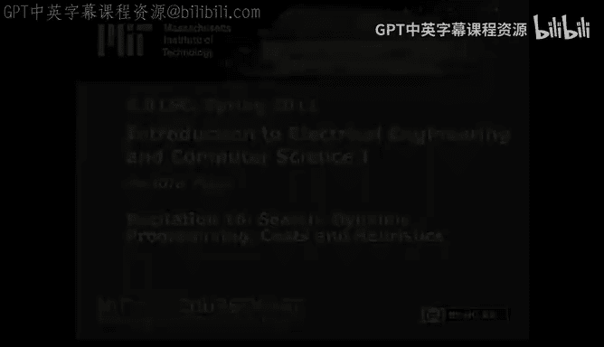

# 《电气工程与计算机科学导论1｜6.01SC Introduction to EECS I, Spring 2011》 - P27：-27-Rec 16 _ MIT 6.01SC Introduction to Electrical Engineering and Computer Scie - GPT中英字幕课程资源 - BV1oLBRB5EfQ

Today I'd like to talk to you about some techniques that you can add to basic search to enable your systems to make more intelligence decisions and save computation time。

Last time we introduced basic search and the basic idea of how to encode search so that our system can use search when encountering an unknown territory or state space。

And today， we're going to review some things you can do in terms of。

Using the information that you know and also using estimations of the information that you would like to know。

To improve your chances of discovering the path that you're interested in the fastest。

The first thing that we can do。In order to improve our search。Is used dynamic programming？

Dynamic programming。Refers to the idea that once you've done a computation for a particular kind of problem。

 you can save that computation and use it later as opposed to having to engage in that computation a second time。

The way this manifests in search is that once you've visited a particular state。

 you don't have to visit that state again because the way your agenda is set up。

 you found the fastest way to that particular state as far as you're concerned。

So the general idea is that once youve visited a particular state， you don't have to visit it again。

If you're building a normal search tree。It can be difficult to keep track of where you've been。

Especially if you're doing something like death research。

To get around this and to enable dynamic programming。

The easiest thing to do is just keep a list of the states that you visited as a consequence of this particular run of search。

I'm going to demonstrate dynamic programming by running depth for search。

On our state transition diagram from last time。The first two steps are the same。

 except for the fact that we're going to keep track of the fact that we've visited both A。B and C。

As a consequence of the first two iterations of search。If I'm running death for search。

My agenda acts as a stack， which means I'm going to take the partial path that I added most recently to the agenda。

 pop it off。And expand the last node in the partial path。When I expand C， I'm going to visit B。And D。

However。B is already in my list of states that I visited because it's already in one of the partial paths in my agenda。

So I'm not going to visit B again。Instead， I'm only going to add one new partial pass to my agenda。

AD。I'm also going to add D to my list of visited states。

If I run another iteration of depth for search， I find my goal。

For completeness is added to the list of visited states。

This took even fewer iterations than the original depth for a search。

We didn't waste time expanding different nodes。We also use less space， in the general sense。

The concept of dynamic programming is great to use whenever you can。

 and in search it can save you a lot of time and energy。

Another way we can intelligently improve our search technique is by making considerations for costs that we know that are associated with particular transitions in this state transition diagram。

 I've indicated some costs associated with the transitions between particular states。

If we know the costs associated with transitions， then we can use accumulation of the weights accumulated through traversing a particular partial path to prioritize which paths we're going to explore first in an effort to reduce the amount of cost associated。

With our final actions。In order to do that， we sort we can keep track of the value associated with that accumulation。

And sort the agenda at every iteration based on that cost。If we're using dynamic programming。

 while making considerations for both costs and heuristics。And also when we're running the goal test。

When making considerations for cost and heuristics。

We're actually going to make our considerations when we expand the node as opposed to when we visit the node。

This difference is very important because it provides us with the most optimal solution。

If it's possible for us to visit the gold node， but it's 100 cost units away。

It may be worth our while to search for alternatives that provide a much shorter path to the gold node。

That's why we switch from considering when we visit to considering when we expand。

Let's look at Uni Cot Search， run with dynamicmic programming。And my first step。I expand A。

And add two partial paths to my cu。 I'm also going to keep track of the amulative。

Cost associated with that partial path。When I expand a。I added to the agenda。

Note that I haven't talked about Stas or cues or death first or breath first or anything。

We're working with a priority queue， and what that means is that things with a high priority float to the top or things with the lowest cost associated with them we're going to consider first。

This means that I'm going to expand B in the partial path A B first。I'll add it to my list。

When I expand B。B has two child nodes， D and C。ABc。Has partial path Co  three associated with it。

 and A， B， D。Has partial path cost 11 associated with it？That means。When I reprioritize my cu。

 I'm going to end up sorting everything。Such that AC comes first。ABC come second。And ABD comes third。

Previously， with our strategy for dynamic programming。C would not have been added。

To this partial path。Because we've already visited it。With Path AC。At this step。

 we're going to expand the path AC。Add C to the list。And any other time that we。And the visiting sea。

 we will not add it to our paths。If I expand C。I have a transition to B， which is already in my list。

And it transition to D。That has cost 7。ABC is going to float to the top of my priority queue。

AB is not going to be considered because B is already part of my list。

And ABD is going to remain with cost 11。At this point you might say， but Kendra。

 why am I considering partial path ABC when C is in my list or C should be in my list， excuse me？

As a consequence of expanding the partial path AC。Even though we expanded the partial path AC。

 if we have not made any considerations to weed out our list at every iteration。

This is still going to float to the top， and we're still going to have to deal with it。

Even though we've already expanded C。Since we've already expanded C。

We're going to ignore this partial path。And just move aD 7 and ABD 11 up to the front。

D is not in our expanded list。When we expand D。We have one child node E。

Because we're working with cough and heuristics， we do not actually evaluate the goal test when we visit a node。

 we evaluate it when we expand a node。So I am going to add AC D E。To my agenda。

 it's going to have cost 8。An AD。11 still going to hang out here at the back of the priority queue。

At this point。I get to expand E。I skipped adding D to the。Expanded list。When I expanded it。

From ACD to ACDE。At this point， I'm going to expand E and the first thing I'm going to do。

Is test and see whether or not it passes the goal test。At that point。I stopped search。

 return that I successfully completed the search。And that my partial path is going to be AC， DE。

That covers uniform cost search。At this point， you might say， Kendra。

 this is bearing a lot of similarity to things like maps。 and I would really like to be able to。

Use my knowledge of things like Euclidean distance in order to make more even more intelligent decisions about where it is that I go with myself。

And I would say。Yes， you should be able to， in fact， people do， in fact， people do all the time。

they say， well， something's you know this far away as the crow flies。

 so I know that if I've gone further than that at any point， then I've wasted some amount of time。

 but it represents a good underestimate of the distance that I'm going to cover。

This is the basic concept of heuristics。If you're attempting to find a goal and you have an estimate for the remaining cost。

 but you know it's not exactly right， you can still use that information to attempt to save you an amount of computation or amount of search。

In particular， you probably shouldn't be using a heuristic if you know it's perfect。

 because if you know the heuristic is perfect， then you should be using the heuristic to solve your problems instead of doing search in the first place。

 or if， if the heuristic already tells you how long it's going to take to find something。

 then it probably also has the path that represents how long。Or that represents that amount of cost。

If you want to use an a heuristic effectively。You have to make sure that your heuristic represents a non strict underestimate。

Of the amount of。Cost that is left over。And what do I mean by that， I mean that。

If you have a heuristic。And you're using it as a thing to tell you whether or not you're wasting your time。

If you're heuristic。Represents information。That is bogus or says。This particular path。

Has more cost associated with it than it actually does。Then it will lead you astray。

 or you don't want to use a heuristic that will prevent you from using a path that actually costs less than the heuristic advertisers。

This is what's known as admissible heuristic， an admissible heuristic。Always。

Underestimates if it makes an error and estimation。About your total distance to the goal。All right。

 so at this point I've covered dynamic programming， I've covered costs， I've covered sheisticicks。

 and it turns out that you can use all of these techniques at the same time。

When you use both costs and heuristics in combination。While evaluating your priority queue。

That's known as an Astar search。And you'll see a decent amount of literature sugar on A star。

This covers。All of the intelligent improvements to basic search that I will talk about in this course。

We hope you enjoyed 601。