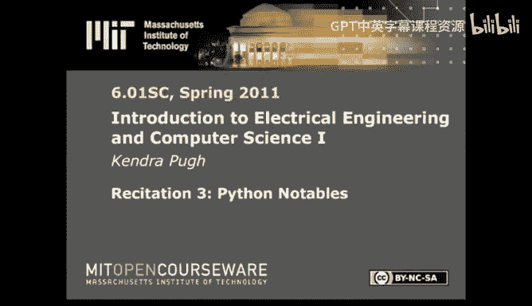
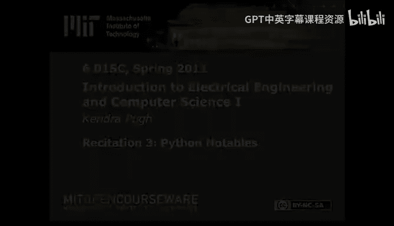

# Python编程基础：P5：函数式编程与列表操作





在本节课中，我们将学习Python中一些重要的概念，特别是函数式编程相关的特性，包括函数作为一等公民、Lambda表达式、列表推导式以及可变对象的注意事项。这些知识对于理解和使用Python进行高效编程至关重要。

## 函数作为一等公民

上一节我们提到了面向对象编程，本节中我们来看看函数式编程。在Python中，函数被视为“一等公民”。这意味着函数可以像其他数据类型（如整数、字符串）一样被处理。

具体来说，函数作为一等公民包含以下含义：
*   函数可以作为另一个函数的返回值。
*   函数可以作为参数传递给另一个函数。
*   函数可以赋值给变量，并像其他数据结构一样进行操作。

这一点非常重要，因为它允许我们创建高阶函数，即那些操作或使用其他函数的函数。

让我们看一个例子。假设我们有一个基础函数 `square`，用于计算一个数的平方：

```python
def square(x):
    return x * x
```

基于函数是一等公民的概念，我们可以编写一个函数，它接收一个函数作为参数，并返回一个新的函数。这个新函数会将传入的函数应用两次：

```python
def twice(some_function):
    def return_function(*args):
        return some_function(some_function(*args))
    return return_function
```

`twice` 函数做了以下事情：
1.  它接受一个函数 `some_function` 作为参数。
2.  在内部定义了一个新函数 `return_function`。
3.  `return_function` 接受任意参数 `*args`，先调用 `some_function(*args)`，然后将结果再次传给 `some_function` 并返回最终结果。
4.  最后，`twice` 返回这个新函数 `return_function`。

请注意，这个返回值的类型就是一个函数。

现在，我们可以使用 `twice` 来创建一个将 `square` 应用两次的新函数：

```python
F = twice(square)
```

当我们调用 `F(2)` 时，会发生：
1.  `args` 被赋值为 `2`。
2.  首先调用 `square(2)`，得到 `4`。
3.  然后调用 `square(4)`，得到 `16`。
4.  最终返回 `16`。

你可以尝试在IDLE中输入这些代码，并修改参数来验证其功能。

## Lambda表达式

既然函数可以像普通值一样传递和返回，那么我们是否可以直接使用一个“匿名”的函数值，而不必先使用 `def` 给它命名呢？这就是Lambda表达式的作用。

`lambda` 是Python的一个关键字，用于创建匿名函数。它的语法是：`lambda 参数: 表达式`。它直接返回一个函数对象。

例如，我们之前定义的 `square` 函数，可以用Lambda表达式简洁地表示为：

```python
lambda x: x * x
```

Lambda表达式源于计算机科学历史上的Lambda演算。它的常见用途包括：
*   需要快速定义一个简单的函数，不想花费额外的代码行数去写 `def`。
*   需要一个匿名函数，不想为其分配一个名字或占用额外的命名空间。

使用Lambda，之前的 `twice(square)` 可以写成：

```python
F = twice(lambda x: x * x)
```

这样，我们节省了定义 `square` 函数的两行代码，并且在这一行内就能清晰地表达意图。

## 列表操作：map、filter与列表推导式

在Python中，你会经常进行列表操作。匿名函数结合高阶函数，可以非常优雅地在一行内处理列表。

假设我们有一个简单的列表：

```python
demo_list = [1, 2, 3, 4]
```

以下是几个强大的工具：

**1. map函数**
`map` 函数接受一个函数和一个可迭代对象（如列表），将该函数应用到可迭代对象的每个元素上，并返回一个包含结果的新迭代器（在Python 3中，如需列表请使用 `list()` 转换）。

```python
list(map(lambda x: x * 2, demo_list))  # 返回 [2, 4, 6, 8]
```

这行代码完成了将列表中每个元素乘以2的操作，无需编写循环。重要的是，`map` 返回一个新的数据对象，原始的 `demo_list` 并没有被改变。

**2. 列表推导式**
列表推导式提供了一种更优雅、更数学化的方式来创建和操作列表。它的语法类似于数学中的集合表示法。

例如，要创建一个包含1到4的平方的列表：

```python
squared_list = [x**2 for x in range(1, 5)]  # 返回 [1, 4, 9, 16]
```

列表推导式非常简洁，可读性强。它也可以结合条件语句（实现类似 `filter` 的功能）和多个循环，功能强大。

列表推导式、`map`、`filter` 和匿名函数这些工具结合在一起，让你能用极少的代码实现复杂的功能。熟悉这些写法对于阅读许多函数式风格或人工智能领域的代码也很有帮助。

## 可变对象与别名

在讨论了高效操作列表的工具后，我们需要了解一个关于Python列表的重要特性：可变性。这对于避免程序中的错误至关重要。

如果你是编程新手，可能已经接触过一些数据类型：数字、字符串、元组都是**不可变**的。这意味着一旦创建，它们的值就不能改变。Python会进行优化，让指向相同不可变值的变量共享内存地址。

```python
g = “hello”
h = “hello”
# g 和 h 可能指向内存中同一个字符串 “hello”
x = 5
y = 5
# x 和 y 可能指向内存中同一个整数 5
x = 6 # x 现在指向了新的整数 6 的内存地址，y 仍然指向 5
```

然而，列表是**可变**对象。问题在于，当你修改一个可变对象时，它是在**原地**被修改的，内存地址不变。这可能导致“别名”问题。

```python
A = [1, 2, 3]
B = A  # B 和 A 现在指向内存中的同一个列表对象
B.append(4)  # 通过 B 修改了这个列表
print(A)  # 输出 [1, 2, 3, 4]！A 也被改变了，因为 A 和 B 是同一个对象的别名。
```

这种行为有时很有用，但你必须时刻意识到它，否则容易引发难以察觉的错误。

为了避免这种情况，当你需要修改一个列表但又想保留原列表时，应该创建它的一个副本，然后修改副本。

创建浅拷贝最简单的方法是使用切片：

```python
A = [1, 2, 3]
C = A[:]  # 创建 A 的一个副本赋值给 C
C.append(4)
print(A)  # 输出 [1, 2, 3]，保持不变
print(C)  # 输出 [1, 2, 3, 4]
```

此时，`C` 和 `A` 指向内存中两个不同的列表对象。对于嵌套的复杂数据结构，可以使用 `copy` 模块的 `deepcopy` 函数进行深拷贝。

## 总结

本节课中我们一起学习了Python函数式编程的核心概念。我们了解了函数作为一等公民的含义，学会了使用Lambda表达式创建匿名函数。接着，我们掌握了使用 `map` 函数和列表推导式来高效、简洁地操作列表。最后，我们探讨了可变对象（如列表）的特性以及由“别名”可能引发的陷阱，并学习了通过创建副本来安全修改数据的方法。这些知识为你进行更复杂的Python编程，尤其是处理数据和状态，奠定了坚实的基础。