# 电气工程与计算机科学导论1：第3讲：信号与系统入门 🚀

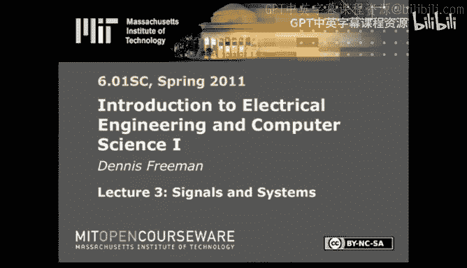

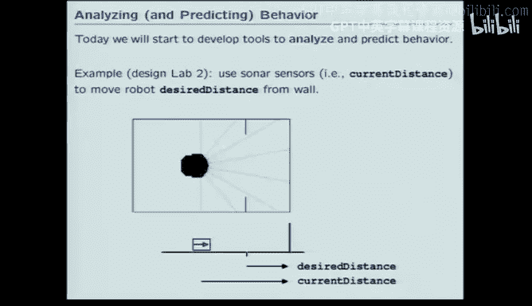

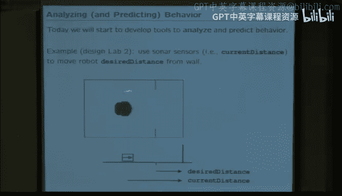

在本节课中，我们将要学习如何从“构建系统”转向“分析系统行为”。我们将引入一种强大的方法——信号与系统方法，它通过观察系统如何将输入信号转换为输出信号来表征系统。我们将重点学习离散时间系统的几种表示方法：差分方程、框图以及最重要的——算子表示法。

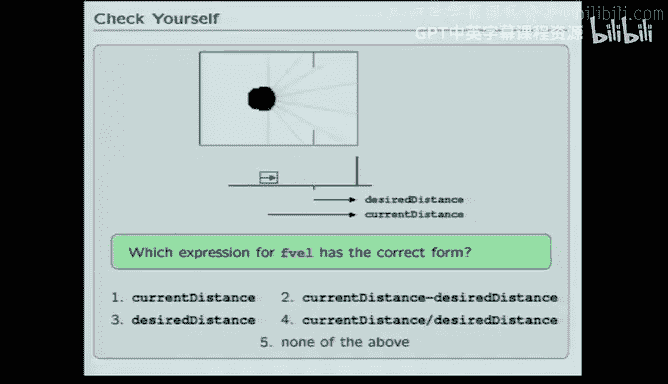

---

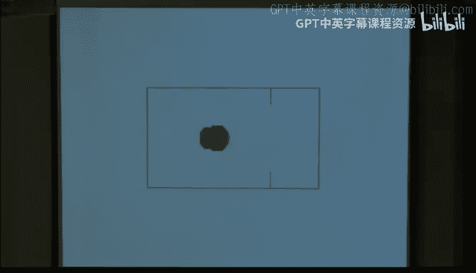

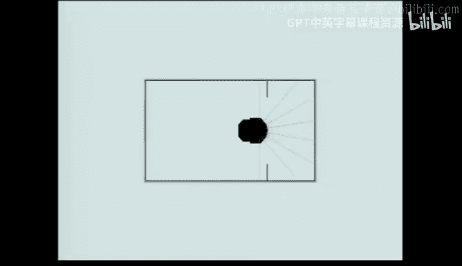

## 从编程到建模物理系统

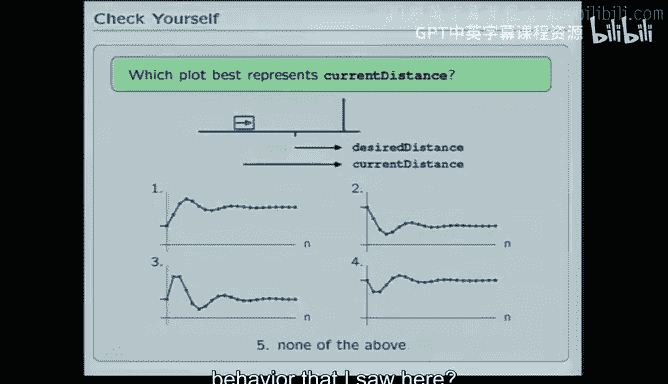

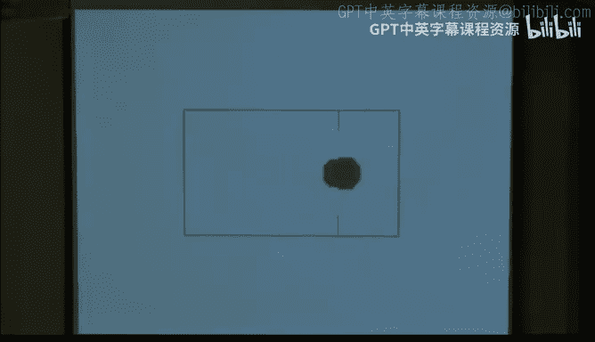

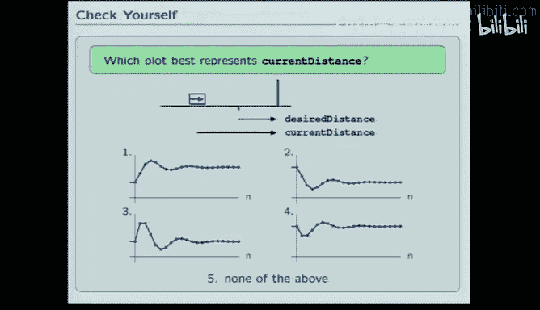

上一节我们介绍了如何通过编程（PAP原则：基本元素、组合方式、抽象和模式识别）来构建复杂系统。本节中，我们来看看如何分析和控制物理系统的行为。

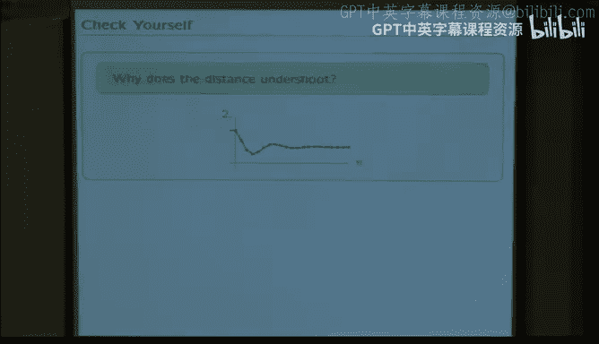

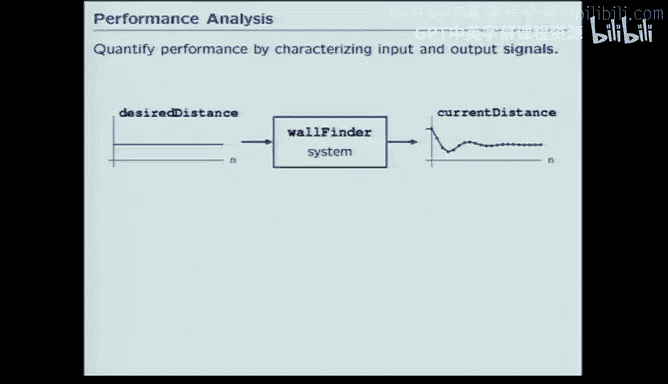

我们将通过一个机器人找墙的例子来引入。目标是编写程序，让机器人从当前位置平滑移动到距离墙壁半米的目标位置。一种直观的方法是使用**比例控制器**，其核心思想是让控制指令（如速度）与误差成比例。

在代码中，这可以表示为：
```python
forward_velocity = Kp * (current_distance - desired_distance)
```
其中，`Kp` 是一个比例常数。当 `current_distance` 等于 `desired_distance` 时，速度应为零；当距离过远时，速度应为正；当距离过近时，速度应为负。

然而，在实际系统中，由于传感器延迟、计算时间和机器人惯性等因素，简单的比例控制可能导致**超调**现象，即机器人会越过目标点，然后来回振荡。

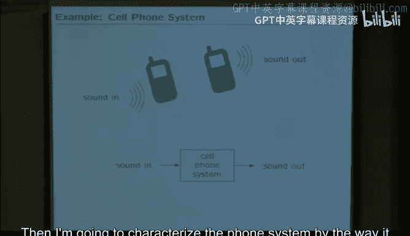

---

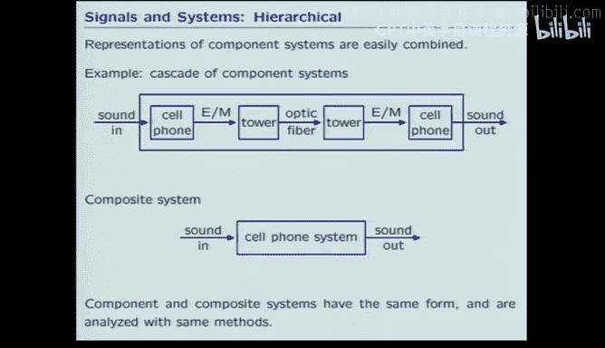

## 信号与系统方法

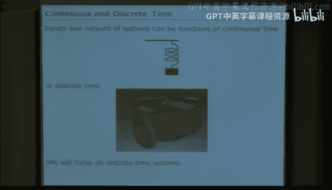

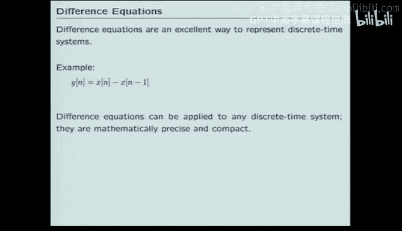

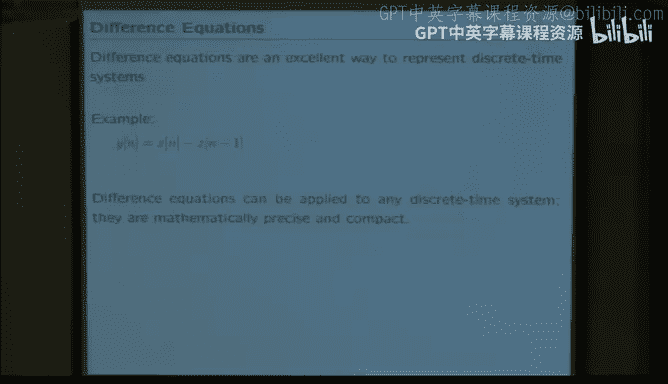

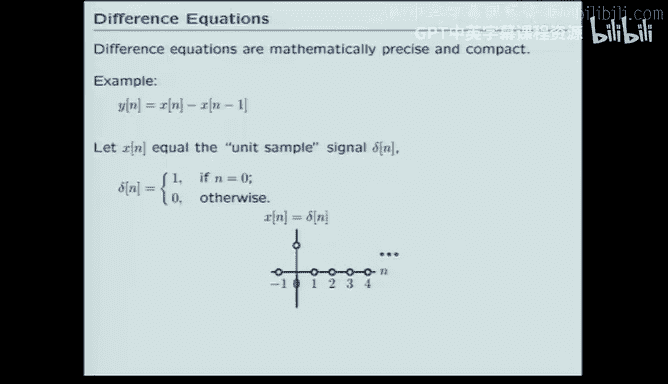

为了分析和预测这类行为，我们需要一种新的视角。我们不再仅仅关注系统内部如何构建，而是关注其**行为**，即输入与输出之间的关系。这就是**信号与系统**方法。

以下是该方法的核心思想：
*   将任何系统（机械、电气、计算等）视为一个“黑盒”。
*   这个黑盒接收一个**输入信号**，并产生一个**输出信号**。
*   系统的特性完全由它从输入到输出的**变换规则**所定义。

这种方法具有普适性和模块化的优点。例如，我们可以将手机系统视为将声音信号转换为电磁波信号，再转换回声音信号的几个模块的串联。

---

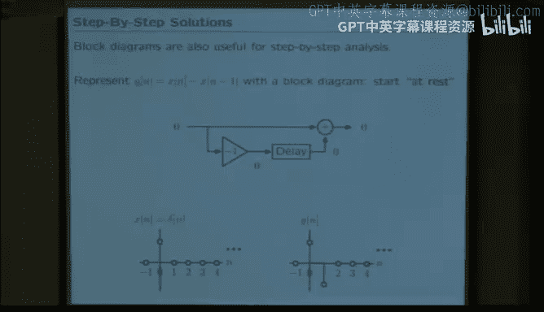

## 离散时间系统表示法

由于我们的机器人工作在离散的“步进”时间中，我们将专注于**离散时间系统**的分析。以下是三种主要的表示方法：

### 1. 差分方程
差分方程是离散时间系统最紧凑的数学描述，类似于连续时间系统的微分方程。

一个简单的例子是：
```
y[n] = x[n] - x[n-1]
```
这个方程表示，在时间步 `n` 的输出 `y[n]`，等于当前输入 `x[n]` 减去前一个时间步的输入 `x[n-1]`。

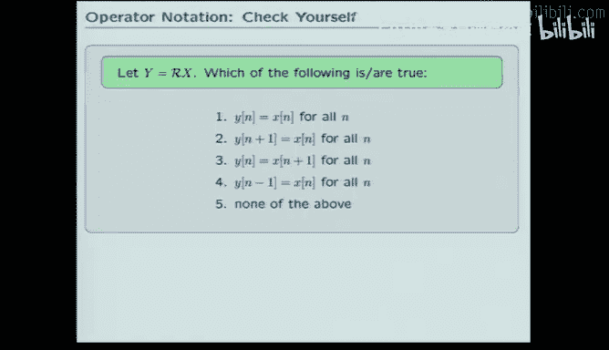

### 2. 框图
框图以图形化的方式展示了信号在系统中的流动路径。它包含代表加法、乘法和**延迟**（用 `R` 表示）的模块。

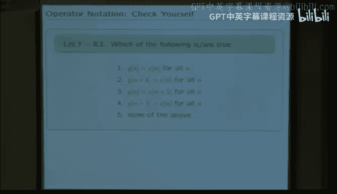

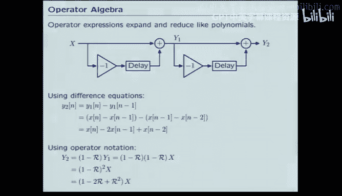

以下是表示 `y[n] = x[n] - x[n-1]` 的框图：
```
     x[n] --->(+)---> y[n]
               ^
               |
           (-1)|
               |
          [R]--'
```
框图是**命令式**的，它明确指出了计算每一步输出的流程，并且清晰地标明了输入和输出。

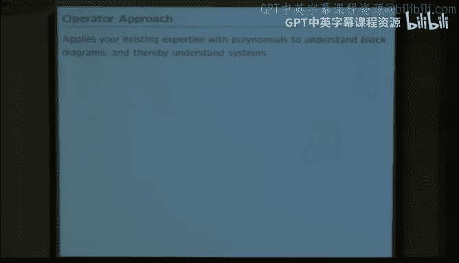

### 3. 算子表示法
算子表示法结合了差分方程的简洁性和框图的丰富信息。它通过将**整个信号**（而非单个样本）作为操作对象，实现了更高层次的抽象。

我们引入**右移算子 `R`**。对信号 `X` 应用 `R` 算子，即得到整个信号向右移动一步的新信号 `RX`。

利用算子，上面的系统可以表示为：
```
Y = (1 - R) X
```
这里，`1` 表示恒等算子（直接通过），`-R` 表示将信号右移后取反。整个表达式 `(1 - R)` 就是一个作用于输入信号 `X` 的算子。

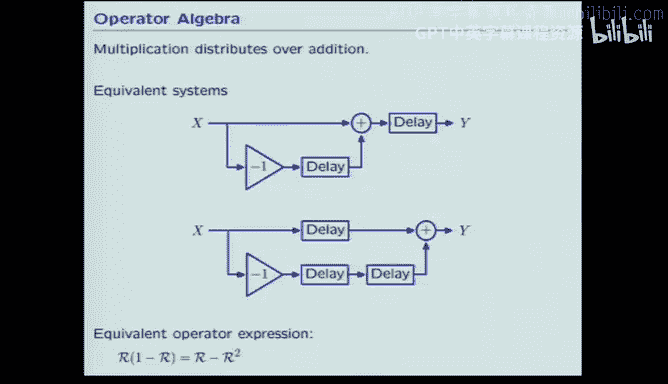

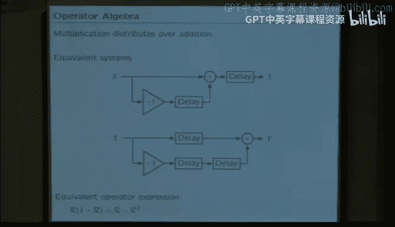

算子表示法的强大之处在于：
*   **简洁且包含方向信息**：像差分方程一样紧凑，同时像框图一样明确了输入 `X` 和输出 `Y`。
*   **易于操作**：算子遵循多项式代数规则（如交换律、分配律）。例如，两个系统 `(1-R)` 和 `(1+R)` 的级联可以简单地表示为 `(1-R)(1+R) = 1 - R^2`。
*   **便于证明等价性**：通过比较算子表达式，可以轻松判断两个不同的框图是否在初始静止条件下等价。

---

## 处理反馈系统

当系统中存在**反馈回路**时，情况变得更有趣。在反馈系统中，输出会反过来影响输入。

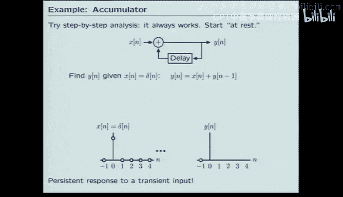

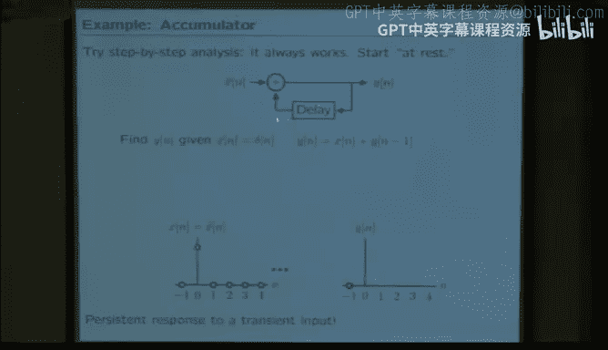

考虑一个简单的反馈系统：当前输出 `y[n]` 等于当前输入 `x[n]` 加上前一步的输出 `y[n-1]`。其框图包含一个回路。

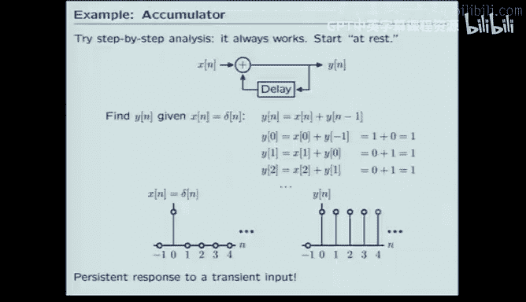

在算子域中，这表示为：
```
Y = X + RY   =>   (1 - R)Y = X   =>   Y = (1 / (1 - R)) X
```
这里，算子出现在分母上。为了理解其含义，我们可以利用多项式知识对其进行**级数展开**：
```
1 / (1 - R) = 1 + R + R^2 + R^3 + ...
```
这意味着，反馈系统 `Y = (1/(1-R)) X` 等价于一个具有无穷多条前向路径的馈通系统。当输入是单位样本信号（仅在 n=0 时为1）时，该系统的输出会是一个持续为1的无限长信号（阶跃响应）。这展示了反馈可以产生持久的影响。

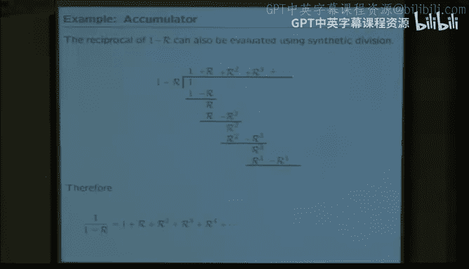

---

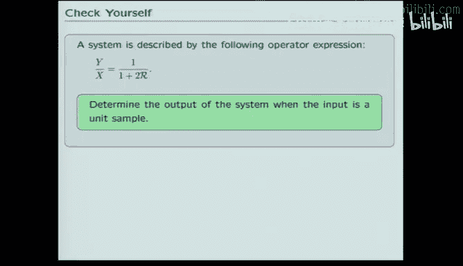

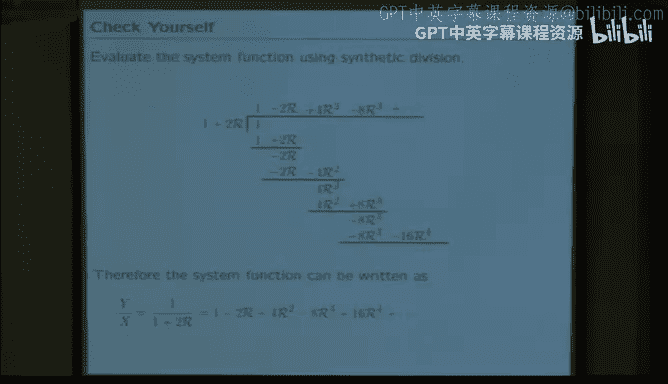

## 总结与应用

本节课中我们一起学习了：
1.  **行为分析的重要性**：从构建系统转向分析其输入/输出行为。
2.  **信号与系统框架**：将系统视为输入信号到输出信号的变换器。
3.  **三种系统表示法**：
    *   **差分方程**：数学上紧凑。
    *   **框图**：图形化、命令式，显示了信号流。
    *   **算子表示法**：结合了前两者的优点，利用 `R` 算子和多项式代数，成为分析和操作离散时间系统最有力的工具。
4.  **反馈的概念**：反馈回路能用算子分式表示，并通过级数展开理解其无限脉冲响应。

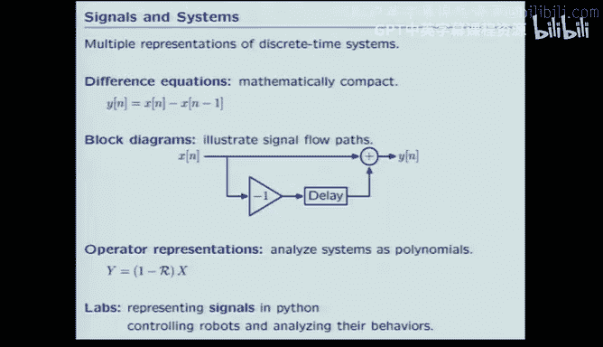


通过掌握算子表示法，我们可以用熟悉的多项式运算来解决复杂的系统互联问题。在接下来的课程和实验中，我们将运用这些工具来设计性能更好的控制器，并预测复杂系统的行为。