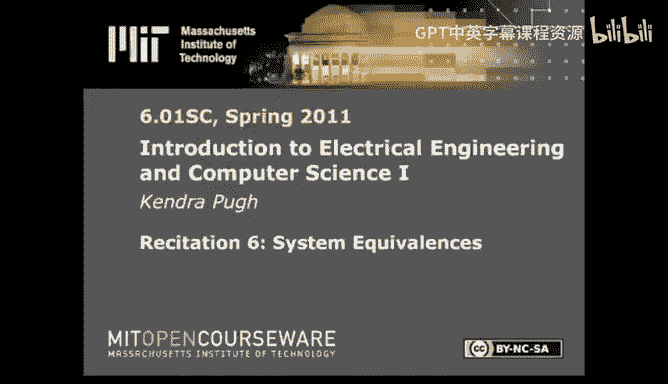

# 《电气工程与计算机科学导论1｜6.01SC Introduction to EECS I, Spring 2011》 - P9：-09-Rec 6 _ MIT 6.01SC Introduction to Electrical Engineering and Computer Scien - GPT中英字幕课程资源 - BV1oLBRB5EfQ

Hi， today I'd like to talk about signals and systems again at this point you're probably familiar with the motivation for why we're talking about discrete linear time invariant systems and also with a few of the representations that we're going to end up using in this course。

But you're still not sure what it is that we're trying to accomplish or where's the part where we get to predict the future based on the fact that we are capable of manipulating these systems。

Well， we actually have to be capable of manipulating these systems and at this point we can describe a system as we see it。

 but we can't also manipulate its representation in ways that make sense to us。

 so the thing that I'm going to do today is talk about different system equivalences and how to take a system and solve for an expression that represents a complex system and also how if you know that some things in your system are equivalent。

 how you can convert between them。At that point， we should be able to talk about polls。

 which is how we're going to actually predict the future。

Different equivalences that I'd like to talk about。

I'm first going to briefly review the fact that last time we discovered the notion of system function。

 right， we can take a representation of a system and abstract it away into some sort of function。

Where。We take the input as it's given to us and then multiply it by the system function and then get the output that we're interested in。

How do we deal with something more complex？I mean， why all the way over here and we've got multiple system functions and I don't even know what happens here but。

It doesn't have to be that scary， let's break it down。

One of the easiest ways to approach something like this。

Is to identify each position where you have a new signal， or if you were to sample here。

 you would have a new signal。And label those values appropriately。

You can then start with your final output and then backs solveve for the values that you're interested in as a consequence of that final output。

In this particular example。Why is going be。Y2 plus y3。Why2？Is going to be y1 times h2。

Where H2 is some system function。And it probably is abstracting away some combination of gains delays and adders like this one here。

Why1？It's going to be。X times H1。And y3 is going to be x。Time age3。

Now I've got all my expressions in terms of either why。Or something for which I have。

An equivalent expression for x。 so I can do my substitutions。

 come up for an expression for y over x in terms of H1， H2， and H3。

Here I've just made the substitutions of the equations above。And factored out the X。

If I wanted the system function， I would then just divide by x。

 and then I would have y over x as equal to this expression。The thing I wanted to indicate。

Is that if I wanted to。Abstract this away。Into its own box。

 maybe I wanted like a big H or an H0 or something like that。

 and it represented what was happening in this top line。Cascading two system functions。

Is the functional equivalent of multiplying them together。

 so if I have an expression for H1 and I have an expression for H2 and I want the expression that is equal to cascading H1 and H2。

 I just multiply them together。Likewise， if I want an expression for the linear combination of two system functions applied to an input individually。

Like。The combination H1H2。And H3。It's a summation of those two values。Which is expressed here。

This is the same as the relationship that we reviewed in a very basic sense when we were originally doing the accumulator。

The only thing I'm attempting to indicate is that that relationship scales， you know。

 to an arbitrary level of complexity。 So if you need to。

You could shift around these values if you can find some sort of equivalence。

Let's see what happens when H2 is equal to H3。I'm going to take my operator equation。What this means？

Is it if I wanted to rewrite this block diagram？I could do so。By doing。

This is really similar to bubble pushing if you've done 6W04 or 6W02 and have experience with logic Gs。

I just wanted to indicate that it's also a thing that you can do for block diagrams and system functions。

There's one more type of equivalence that I want to talk about。

 and it's I call it feedback equivalence。Here's our normal accumulator， right？

If I wanted to represent this feedback system。As a feed forward system， what would I have to do？Well。

 the first time that I sampled from X。It would just be why。So right now。

 this diagram matches for the first time step on the second time step。

If I had an input from X from the previous time step， I would also want to account for it。

By putting in a delay。And then summing it。With the current value。Of x in order to get y。

At the second time step。I would want access。To the starting value。

The value from the previous time step。And the value from the current time step。

And one more time to exhaustal the example at the third time step。

My output would be a linear combination of the starting value。The value from the first time step。

 the value from the second time step。And the value from the current third time step。

We end up doing this a nauseum。To model our feedback system。So it's difficult to do on paper。

But it turns out there's a great relationship between these two equivalences。

And things that we already know from。I want to say high school calculus or possibly 1801- 1802。

Geometric sequences。When we solved for the system function， we found an expression for。

Are our feedback system？If I wanted to find an equivalent expression using this feed forward system。

I would look at this infinite summation。Of externms。So if I wanted you to know something。

About the long term behavior of the system。In terms of this system function。

I would solve for this expression。And then using my knowledge of geometric sequences。

In order to express the long term behavior。In the general sense， in this course。

 we're going to be looking at the unit sample response of a system。What that means is。

It the only thing I ever do。For input。Is a single value at one of one at time zero？

Then what does my output look like？The reason we're looking at the unit sample response is because it's。

AThe simplest way to look at the long term behavior of a discretere linear time invariant system。

But the other reason is once we have this， we can also use it to do things like make predictions about the long term step response and other more complicated input signals。

In the case of the accumulator。If I input one at time zero。My output。Is going to be one forevermore。

That's reflected。In the coefficient of my geometric sequence。If I want to know。

What my long term response is going to look like？I can look at the coefficient of R。

And make a decision about。Whether or not I'm going to diverge or converge or do neither。

So if I put a coefficient on R。Whatever P0 converges to。Is what my system is going to converge to？

So using my knowledge of P0。I can make long term predictions about the behavior of the system。

Next time I'm going to go over some general classifications of those behaviors for the system and how to more effectively use our knowledge of P0 and how to deal with things like second order systems。

