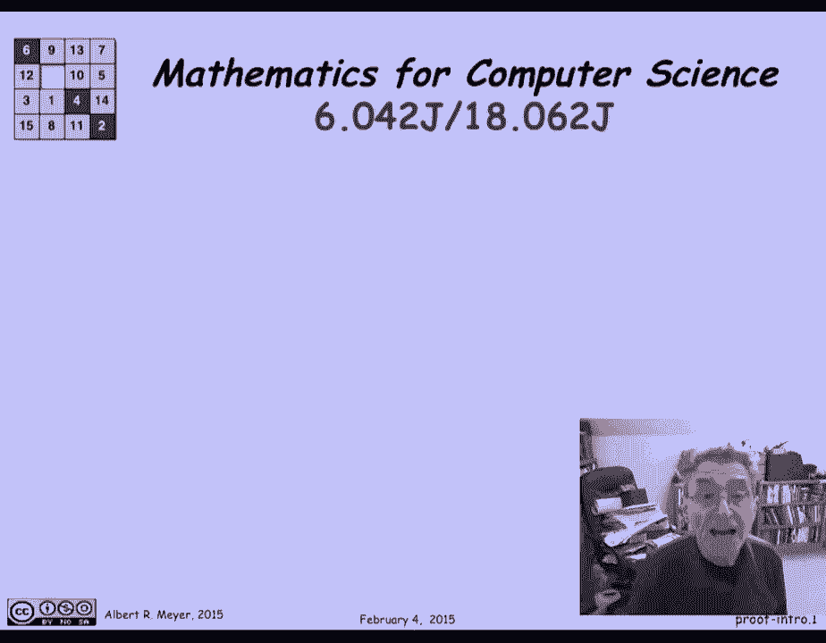
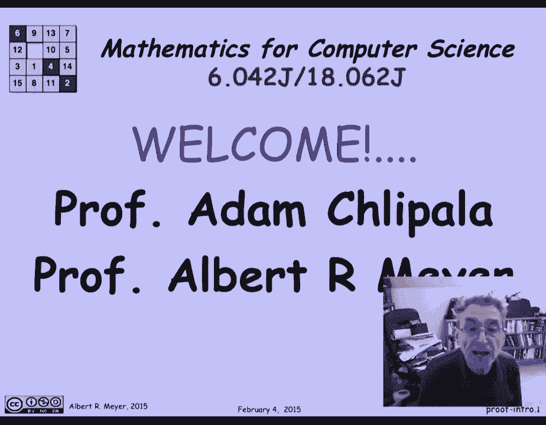
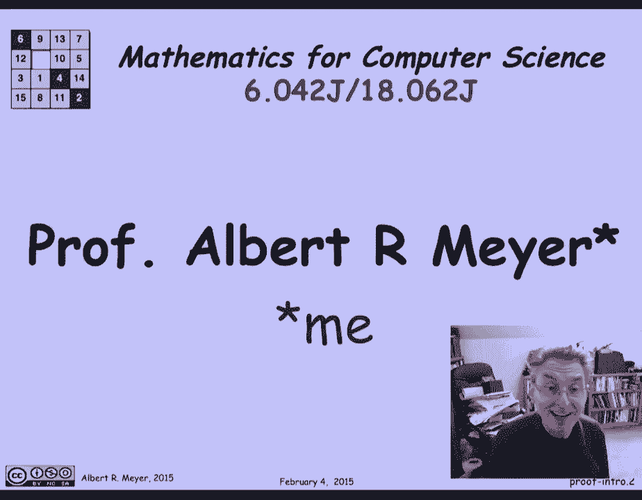
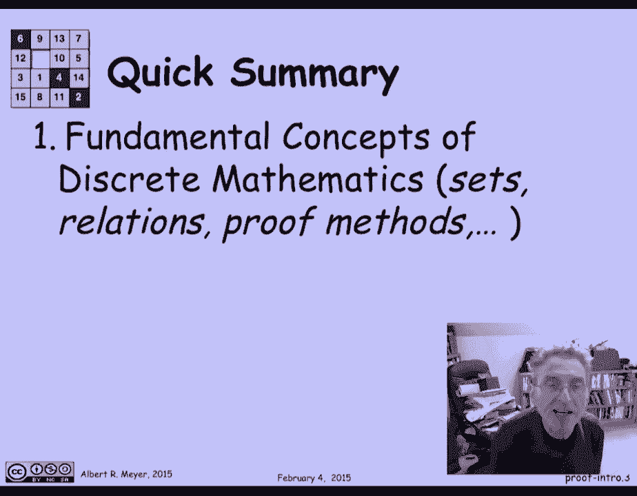
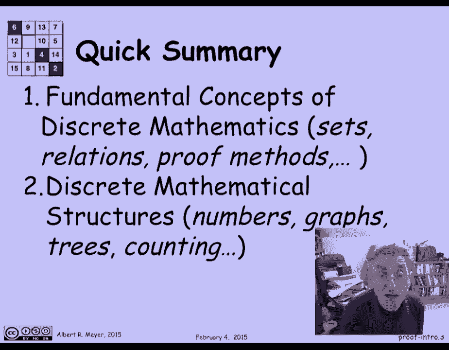
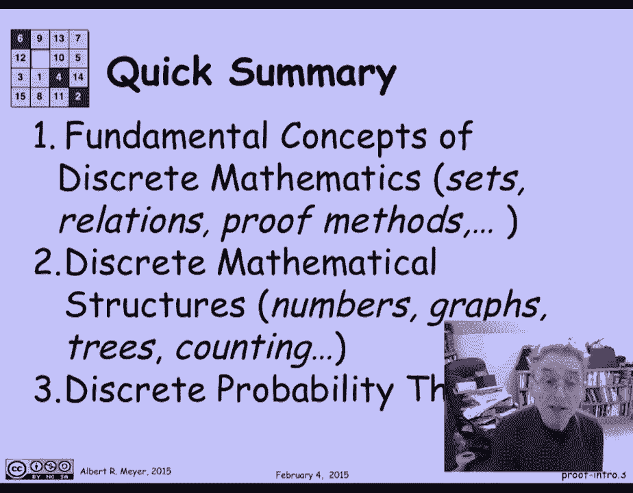
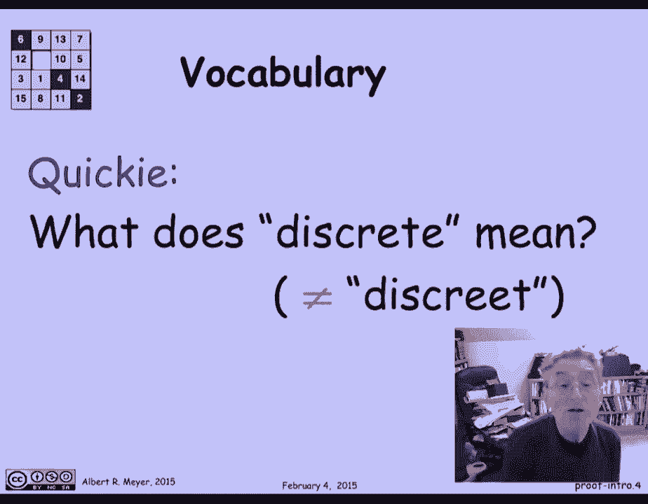

# MIT 6.042J 计算机科学的数学基础：P1：L1.1.1 - 欢迎来到 6.042 📚

在本节课中，我们将要学习 MIT 6.042J 课程《计算机科学的数学基础》的导论部分。我们将了解这门课程的核心内容、授课教师以及它为何对计算机科学家至关重要。

欢迎导师是亚当·查拉教授和阿尔伯特·梅尔教授。

我是艾伯特，你好。

## 课程内容概述

接下来，让我们快速总结本课程的内容。这门课程是关于计算机科学家几乎都经常需要的数学。这是你在标准微积分课上不太可能遇到的数学知识。

你可能在高中见过一些类似的内容。例如，在微积分课程中，人们谈论实数上的函数。有时他们会谈论复数上的函数。

但是，计算机科学家通常处理数据类型上更抽象的函数，甚至处理函数上的函数。我想知道你们中有多少人，如果我让你抽象地定义什么是函数，可以在几周内在这门课上给出这个定义。

你可以很方便地做那件事。

## 核心数学结构

上一节我们介绍了课程的整体方向，本节中我们来看看将要讨论的核心数学结构。

我们将讨论各种标准离散结构。我们从数字开始。我们认为数字是一个结构，因为它是包装在上面的操作的数字，就像加号、乘法和幂。

我们还将讨论各种其他标准图形数据结构，像图形和树。

## 计算方法与应用

了解了核心结构后，我们来看看如何应用它们。我们将研究计算这些数字的方法，以及不同类型的数据结构。

作为计算机科学中一个典型的基础问题，您通常想知道搜索空间有多大。比如说，密码的搜索空间最好大，或者一个程序可以把它们都搜索一遍，找到一个有效的。

## 离散概率论

最后，我们将讨论离散概率论。这只是概率论的一个版本，在那里我们可以用和来度过，而不是进入积分的复杂性。

## 关键概念检查

在结束之前，让我们做一个快速的概念检查。你知道“离散”是什么意思吗？我会给你一个提示，这并不意味着“谨慎”。如果你不知道，不用担心，我们将在课程中详细学习。

---

本节课中，我们一起学习了 MIT 6.042J 课程的欢迎导论。我们了解了课程将由亚当·查拉教授和阿尔伯特·梅尔教授授课，并概述了课程将涵盖的核心内容：包括抽象函数、离散结构（如数字、图、树）、相关的计算方法以及离散概率论。这些数学工具是计算机科学领域不可或缺的基础。