# 计算机科学的数学基础：P2：L1.1.2：证明入门 - 第一部分 🧮

在本节课中，我们将要学习数学证明的基本概念。我们将通过一个著名的例子——毕达哥拉斯定理——来理解什么是证明，以及为什么严谨的证明在数学和计算机科学中至关重要。我们还将探讨直观的“图示证明”可能存在的陷阱。

---

## 证明的重要性

上一节我们介绍了课程的整体目标。本节中，我们来看看证明的核心价值。

在数学和理论计算机科学中，我们非常关心证明。我们会帮助你学习如何进行基本的证明，无需畏惧它们。在某些方面，最重要的技能是区分“看似非常合理的论点”与“完全正确的证明”的能力。这二者可能不完全相同，而这项区分能力是一项重要的技能。

这是对数学本质的基本理解。这关乎于知道一件事在数学上是**绝对无可争辩的**，而不仅仅是**极有可能**。有趣的是，物理学家做了大量的数学工作，但他们往往不太担心证明的绝对严谨性。

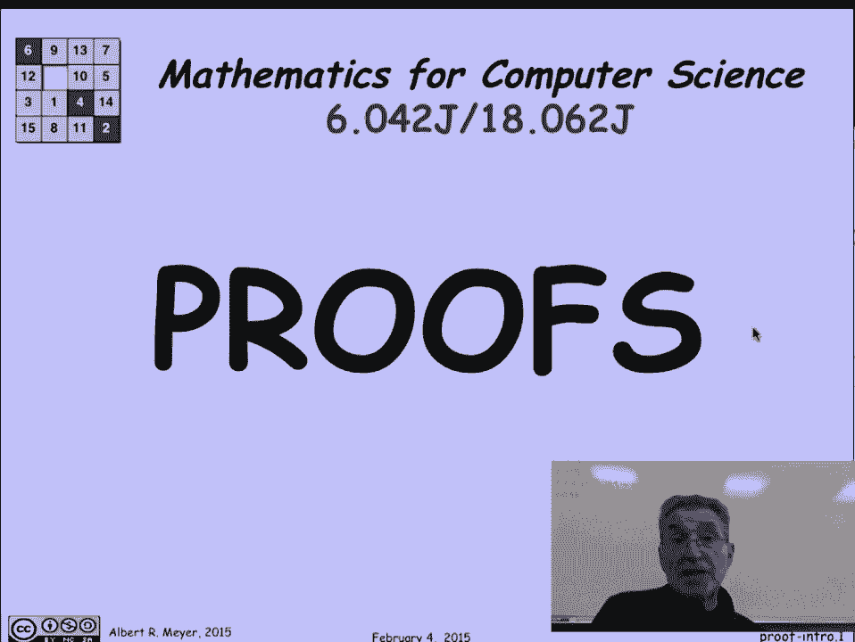

然而，所有的理论家和数学家都同意：除非你知道如何证明基本事实，否则你并未真正理解这个主题。从务实的角度看，证明的价值在于，本主题（以及许多其他数学科目）内容繁多。如果了解确切细节的唯一方法是死记硬背，你很容易迷失方向。

我们证明的大多数规则和定理，我无法全部记住细节，但我知道如何证明它们。这样，我就可以在需要时推导、调试它们，并确保其完全正确。

---

## 一个经典例子：毕达哥拉斯定理

在开始抽象地讨论证明之前，让我们先看一些具体的证明例子。

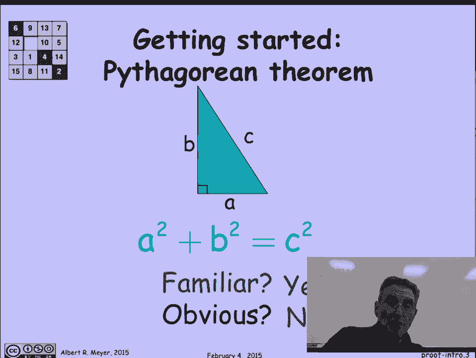

你们在高中早期就见过一个著名定理：**毕达哥拉斯定理**。它指出，对于一个边长为 `a` 和 `b` 的直角三角形，其斜边 `c` 满足以下关系：

**a² + b² = c²**

正如我所说，这个定理广为人知。它“明显”吗？有时学生会说它明显，但我想他们真正的意思是“很熟悉”。它其实并不明显。几千年来，人们一直觉得有必要证明它，以确定其真实性并解释其原因。有一个专门收集毕达哥拉斯定理证明的网站，上面收录了一百多种证明，甚至包括美国前总统提供的一种。

---

### 一个优雅的图示证明

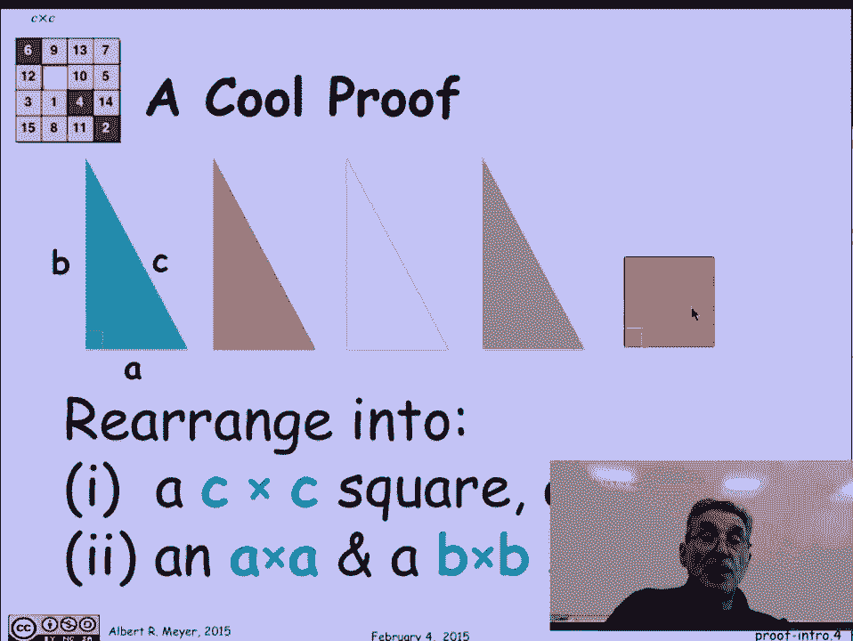

让我们看看我最喜欢的毕达哥拉斯定理证明之一。证明思路如下：

我们有四个全等的直角三角形（`ABC` 三角形的四个副本，用不同颜色区分）和一个大小未知的正方形。

毕达哥拉斯定理的证明，将包括把这四种形状重新组合成两种不同的图形：
1.  第一种组合形成一个边长为 `c` 的大正方形（`c × c`）。
2.  第二种组合形成两个正方形，分别是 `a × a` 和 `b × b`。

然后，根据面积守恒定律，`c × c` 的面积必须等于 `a × a` 加 `b × b` 的面积。因此，`a² + b² = c²` 成立。

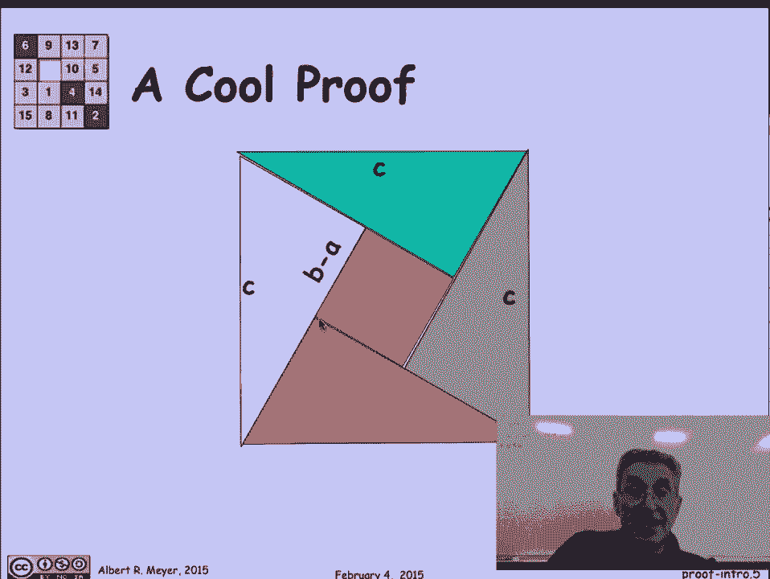

让我们看看这些重新排列。也许你应该在我给出解答之前，花点时间自己尝试一下。

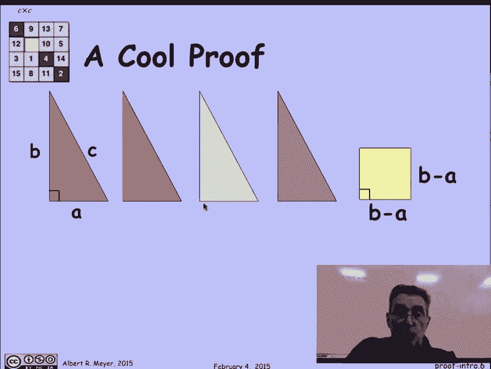

---

#### 第一种排列：形成 `c × c` 正方形

第一种排列是两者中较容易的一个，目标是形成边长为 `c` 的正方形。提示是：如果想得到 `c × c` 的正方形，除了将三角形的斜边 `c` 放在外围，你没有太多选择。通过摆弄三角形的位置使其贴合，你会发现中间恰好空出了一个正方形，这正是我们额外准备的那个小正方形所适合的位置。

这个排列也让你能够计算出中间小正方形的尺寸。观察图形，这是三角形的长边 `b`，这是短边 `a`，所以中间空出的边长是 `b - a`。因此，我们知道中间是一个 `(b - a) × (b - a)` 的正方形。

---

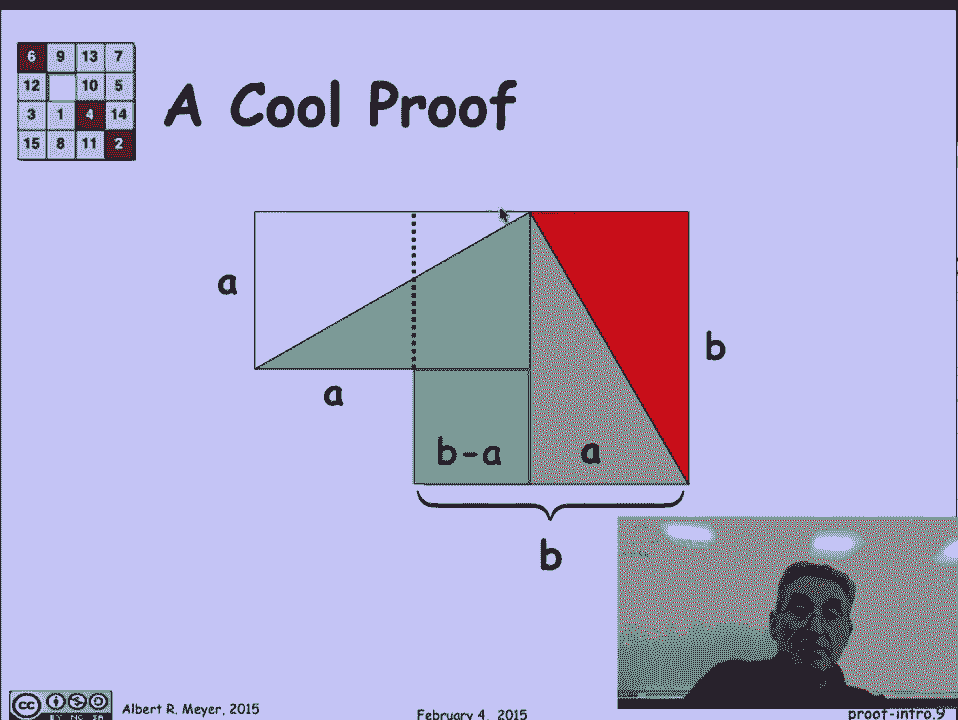

#### 第二种排列：形成 `a²` 和 `b²` 正方形

下一个排列是这样的：我们要将其中两个三角形拼成一个矩形，另外两个三角形拼成另一个矩形，并按特定方式对齐，同时放入那个 `(b - a) × (b - a)` 的小正方形。

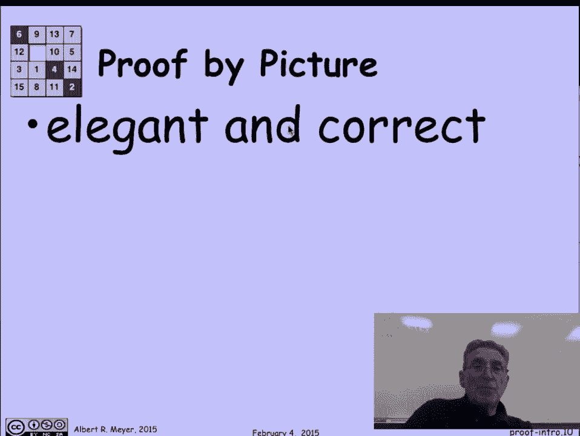

那么 `a × a` 和 `b × b` 的正方形在哪里？它们并没有以独立的大方块出现，但隐含在图形中。让我们观察这条边的长度：它是 `a + (b - a)`，这意味着它的长度是 `b`。这里突然出现了一个长度为 `b` 的边。

但是等等，这里有一段是 `b - a`，它正对着 `b` 边。所以，如果我观察剩余的部分：`b - (b - a)`，这告诉我那一小段的长度是 `a`。果然，当我添加一条概念上的分割线时，这部分是 `a × a` 的正方形，那部分是 `b × b` 的正方形。

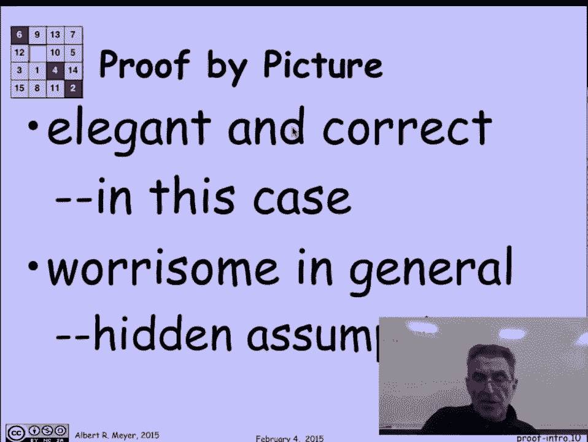

---

### 对图示证明的思考

我们就这样“证明”了毕达哥拉斯定理。那么这个证明如何？它非常优雅，并且看起来绝对正确。这是一个很好的“图示证明”案例，在这种情况下确实有效。

但不幸的是，这类证明让数学家感到担忧。他们的担忧是合理的，因为其中隐藏了许多假设和未经陈述的推理步骤。你需要回溯并思考所有隐含的几何信息。

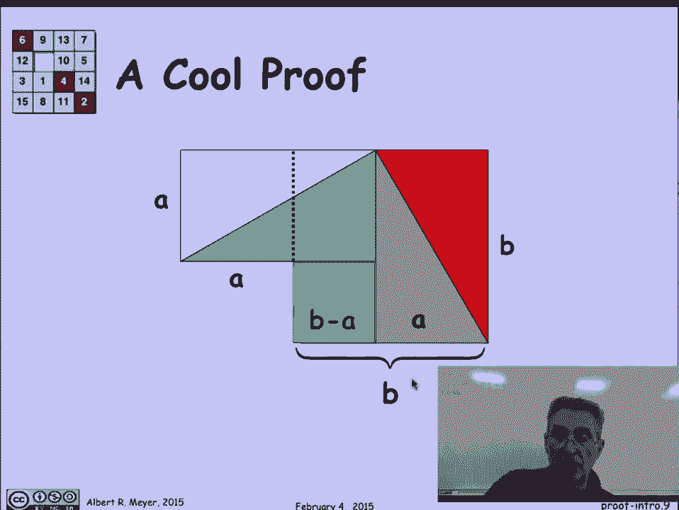

在这张图中，很多东西被认为是理所当然的。例如：
*   我们怎么知道那个角是直角？我们声称中间是一个正方形，这需要它是直角。
*   我们怎么知道那是一个矩形？我们利用了“直角三角形两锐角互余”以及“三角形内角和为180度”等事实。
*   我们还利用了“这是一条直线”的事实，这可能很明显，也可能不明显，但正是这一点保证了长度相加是可行的。

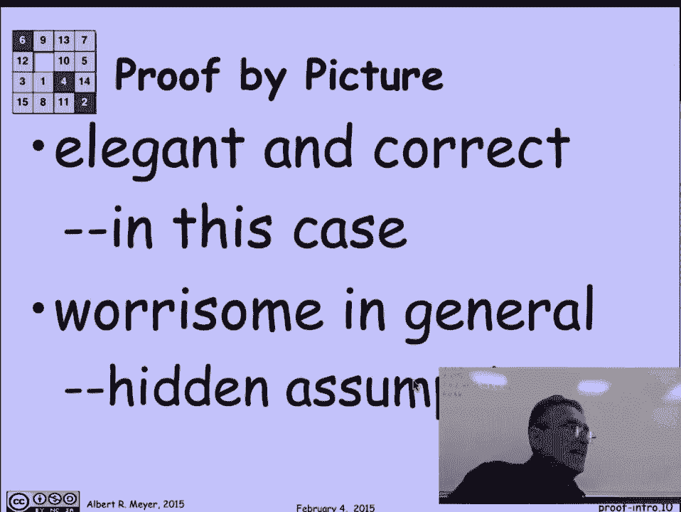

我的观点是：图示中真的有很多隐藏的假设，很容易被忽视，从而可能导致错误。

---

## 图示证明的陷阱：一个反例

为了展示被图示证明愚弄的例子，让我们看看如何“获得”无限的财富。

想象我有一张 `10 × 11` 的金箔（一个矩形，四个角都是直角）。我要做的是：在左上角，沿着边量出长度1并剪下一个小三角形；在右下角，也做同样操作。然后，我将这两个剪下的三角形移动位置，一个移到左上方，一个移到右下方。

最终我得到了一个新的形状。现在，这条边的长度是 `10`（因为从原长度中减去了1），这条边的长度是 `11`（因为给原长度加上了1）。这看起来很酷，因为现在我可以把那些突出的小三角形剪下来，它们恰好能拼成一个 `1 × 1` 的小正方形。

突然间，我多出了一小块金子！但再看这里：我剩下的部分，不又是一个 `10 × 11` 的长方形金箔吗？我可以把它旋转90度，重复这个过程。这样我就可以不断地生成 `1 × 1` 的小金块，变得无限富有！

这显然有问题。它违反了各种守恒定律，更会摧毁黄金市场。问题出在哪里？

关键在于一个隐含的假设：我声称剪下的那些小三角形是直角三角形，并且移动后形成的这条长边是一条完美的直线。实际上，那些三角形有两条长度为1的边，是等腰三角形，但它们放置的对角线角度并非45度，因此它们不是直角三角形。这条“边”实际上不是一条直线。由于 `10` 和 `11` 很接近，这在视觉上并不明显。

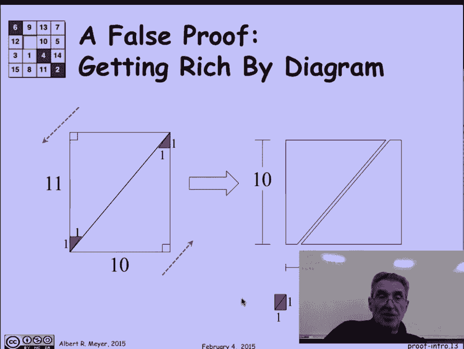

这就是一个简单的例子，展示了图示证明如何可能误导我们。如果我被要求证明“这是一条直线”，这个漏洞就会暴露出来。但如果它在视觉上不明显，你很可能不会注意到。

---

## 本节课总结

在本节课中，我们一起学习了：
1.  **证明的核心价值**：在于区分合理论点与严谨证明，是理解数学主题的基础。
2.  **通过例子学习**：以毕达哥拉斯定理为例，分析了一个优雅的图示证明。
3.  **认识图示证明的局限性**：图示可能隐藏许多几何假设，依赖视觉直观可能导致错误。
4.  **警惕陷阱**：通过一个“无限财富”的反例，我们看到了不严谨的图示推理如何产生荒谬的结论。

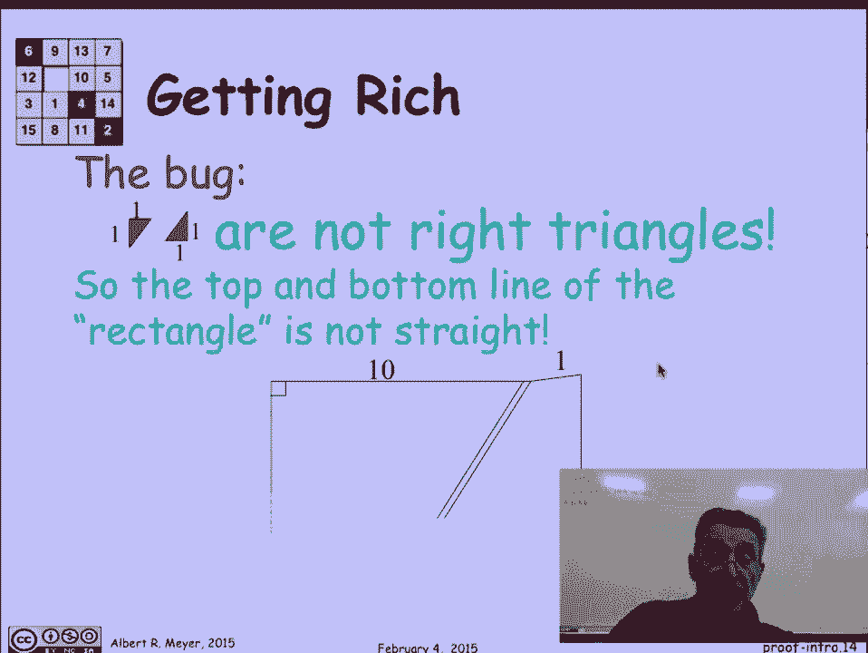

理解证明的严谨性，是迈向数学和理论计算机科学深处的重要一步。在接下来的课程中，我们将学习更形式化、更可靠的证明方法。