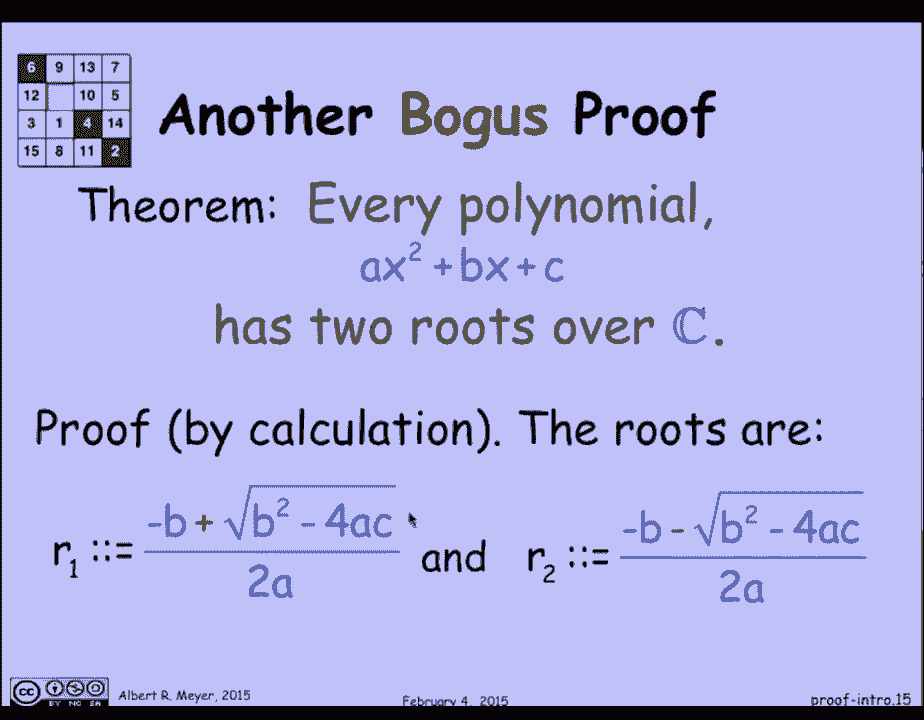

# 计算机科学的数学基础：P3：L1.1.3 - 证明入门 - 第二部分 🔍

## 概述
在本节课中，我们将继续探讨证明方法，重点关注一个关于多项式求根的“伪证明”案例。我们将分析这个证明中的逻辑漏洞，并理解为何盲目依赖公式计算可能导致错误结论。通过这个例子，我们将学习在数学证明中保持严谨和清晰理解的重要性。

---

上一节我们介绍了证明的基本概念和常见错误类型。本节中，我们来看看一个关于多项式根的典型错误证明案例。

还有其他类型的伪证明。让我们快速浏览一个关于多项式根的证明。你知道一个事实：每个多项式至少有两个根（在复数域C上）。你怎么证明这一点？你只需写下求根公式。你知道二次公式：一个根是 `(-b + sqrt(b^2 - 4ac)) / (2a)`。

另一个根是 `(-b - sqrt(b^2 - 4ac)) / (2a)`。证明到此结束。你可以把这个公式代入 `r1` 到多项式 `x` 中，它将简化为零，说明这是一个根。你可以把 `x` 的这个公式代入，简化代数运算，发现它等于零。这就证明了 `r2` 也是一个根。

我们刚刚“证明”了每个多项式都有两个根。但这不是真的。我们还没有完成证明。这是一个有问题的计算证明。

有什么问题？让我们看一个反例。多项式 `0*x^2 + 0*x + 1` 没有任何根。它只是一个常数，永远不会等于零，所以它没有根。多项式 `0*x^2 + 1*x + 0` 是一条45度的线 `y = x`，它只穿过原点一次，所以它只有一个根。

那么，两个公式 `r1` 和 `r2` 怎么了？答案是，在这种情况下，我们必须除以零，这是错误的。如果你看那个公式，分母是 `2a`。除以零导致这些公式不正确，它们不是根。因此，为了有两个根，我们需要隐含地假设分母 `a`（多项式的首项系数）不为零。

这样就修复了这两个漏洞吗？不。

因为看这个多项式 `1*x^2 + 0*x + 0`。它只有一个根。唯一可能的方式是，如果某物的平方加零等于零，那么该物必须为零，所以只有一个根。这里发生了什么？发生的事情是，在这种情况下，两个公式 `r1` 和 `r2` 是对同一事物的不同表述。当 `b=0`，`c=0`，`a=1` 时，这就是为什么它们看起来像不同的公式，但它们的值是一样的。所以只有一个根。公式 `r1` 和 `r2` 不是零。这就是你取判别式 `D = b^2 - 4ac` 的平方根需要为零的情况，这样我们才会得到两个相同的根。

现在还有一个复杂的问题。听起来我们现在已经修正了我们的计算证明，加入了这些限定条件：`a` 不为零，且判别式 `D` 非零。但是如果 `D` 不为零但是负数，会发生什么呢？这是一个有趣的复杂情况。

让我们看看多项式 `x^2 + 1`。`b^2 - 4ac` 是 `-4`。这将有两个根，即 `i` 和 `-i`。不可能分辨出哪个是 `r1`，哪个是 `r2`。`r1` 是 `sqrt(-1)`，`r2` 是 `-sqrt(-1)`。但 `sqrt(-1)` 没有办法区分是 `i` 还是 `-i`。抽象地说，它们的行为方式是一样的。所以我们对哪个是 `r1`、哪个是 `r2` 存在歧义。这本身并不影响“有两个根”的定理。

但这种歧义可能会带来问题。让我给你们一个例子。当存在这种歧义时，我可以“证明” `1 = -1`。这是证明过程。我会让你好好想想，试着弄清楚这个推理中哪一步出了问题。步骤似乎很合理，但尽管如此，我得出了 `1` 等于 `-1` 的荒谬结论。它在利用你不知道 `sqrt(-1)` 是指 `i` 还是 `-i` 这一事实。

所以这一切的寓意是：首先，确保你正确地应用了规则。这里有一个关于代数规则的隐含假设是不正确的。同样，当你并不真正明白自己在做什么、不清楚确切的规则是什么时，这种盲目的计算是有风险的。是理解把你从这种错误中解救出来。

让我们稍微看一下 `1 = -1` 的“证明”，因为它让我们用一句有趣的话来结束。`1` 等于 `-1` 的可怕之处在于它是错误的。你永远不想得出错误的结论。这令人担忧。当你断定某件事是假的时，那是灾难性的。

让我给你一个例子。假设 `1` 等于 `-1` 是正确的（基于我们错误证明的假设）。如果我把方程的两边乘以相同的东西，等式仍然成立。所以我可以把两边都乘以 `1/2`，我得到 `1/2 = -1/2`。现在我也可以把同样的东西加到两边，这是对等式进行推理的一个非常合理的规则。如果我把两边都加上 `3/2`，我把 `1 = -1` 变成了 `2 = 1`。

现在，我的状态很好，可以“证明”各种各样的事情。这里有一个著名的例子：因为我和教皇显然也是（基于 `2=1`），我们得出结论，我和教皇是一体的，那就是“我是教皇”。我刚刚向你“证明”了这个荒谬的事实。

这是一个被归因于伯特兰·罗素（著名的哲学家、逻辑学家、和平主义者、诺贝尔奖得主）的妙语。据说派对上的某个社交名媛找到了他，她听说数学家们认为如果 `1` 等于 `-1`，那你就可以证明任何事情。所以她挑战他证明“你是教皇”。据说是罗素（他以机智著称）想出了这个例子。谁知道这是不是真的，但这是个好故事。

有一张伟人的照片。

---

## 总结
本节课中，我们一起学习了一个关于多项式根的伪证明案例。我们分析了其中因忽略公式适用条件（如 `a ≠ 0`）、未考虑判别式为零或为负的情况以及符号歧义而导致的逻辑错误。这个例子深刻地提醒我们，数学证明不能仅仅依赖公式计算，而必须建立在清晰的理解和严谨的逻辑基础之上。理解规则背后的假设和限制，是避免得出荒谬结论的关键。