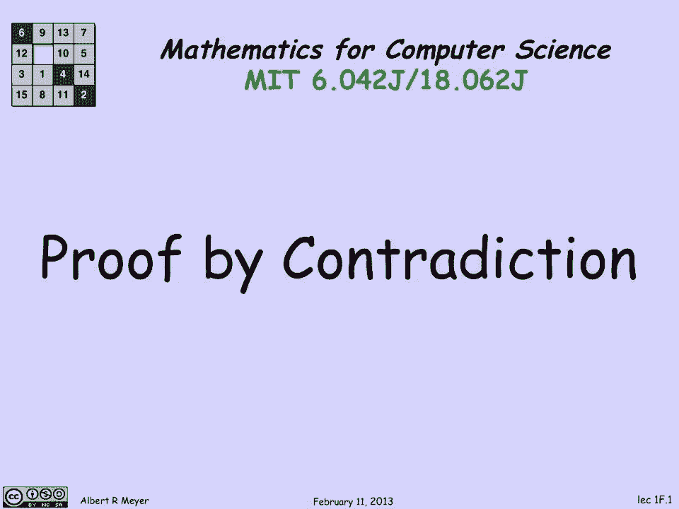
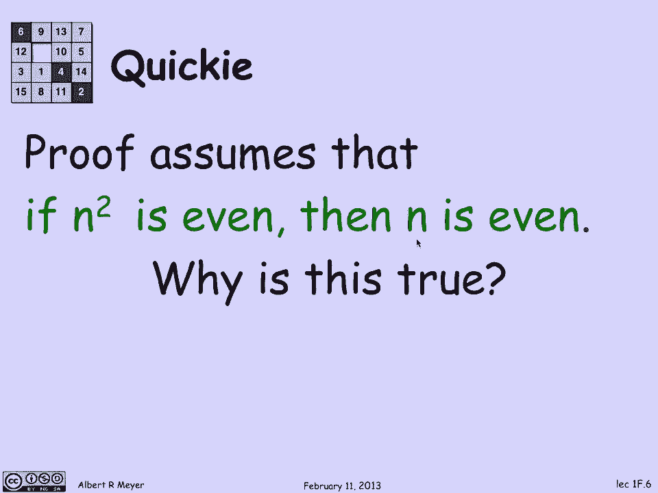

# 计算机科学的数学基础：P4：L1.2.1：矛盾证明法 🔍

在本节课中，我们将要学习一种在数学和计算机科学中至关重要的证明技术——矛盾证明法。我们将通过具体的例子来理解其工作原理，并学习如何应用它来证明一些基本但深刻的数学事实。

## 概述

证明是数学和计算机科学的核心。如果你无法解释某个陈述为何为真，那么你对它的理解就值得怀疑。矛盾证明法是一种通过假设结论不成立，并推导出逻辑矛盾，从而证明原结论必然成立的推理方法。这种方法非常强大，有时能让我们在不直接计算的情况下证明某些命题。

## 一个简单的例子

上一节我们介绍了证明的重要性，本节中我们来看看矛盾证明法是如何运作的。让我们从一个简单的例子开始。

假设我们想判断 **1332的立方根** 是否小于或等于 **11**。一种直接的方法是计算立方根，但这可能有些繁琐。我们可以尝试使用矛盾证明法。

首先，我们**假设**结论成立，即：
`立方根(1332) ≤ 11`

如果这个假设为真，那么我们可以对不等式两边同时进行立方运算（因为立方运算是单调递增的），得到：
`1332 ≤ 11³`

计算 `11³ = 1331`。因此，我们的假设导出了：
`1332 ≤ 1331`

这个结论 **显然是错误的**。这意味着我们最初的假设 `立方根(1332) ≤ 11` 导致了矛盾。因此，这个假设本身必然是假的。由此，我们证明了：
`立方根(1332) > 11`

我们并没有实际计算1332的立方根，但通过逻辑推理，明确地得出了这个结论。这个例子清晰地展示了矛盾证明法的基本思想：如果一个断言（假设）蕴含了错误的东西，那么这个断言本身一定是假的。

## 矛盾证明法的原理

如果一个断言通过一系列**有效的推理步骤**，最终推导出了一个**错误的结论**，那么唯一合理的解释就是：最初的断言是**假的**。这是因为，有效的推理会保持“真值”——如果你从真命题出发，经过有效推理，得到的结论也必然为真。反之，如果结论为假，那么前提必然为假。

## 一个经典的证明：√2 是无理数

现在，让我们运用矛盾证明法来解决一个著名的数学问题：证明 **2的平方根（√2）是无理数**。首先，我们需要明确，有理数是可以表示为两个整数之商（分数）的数，且分子分母没有大于1的公因数（即已化为最简形式）。

我们要证明：**√2 不是有理数**。

**证明过程如下：**

1.  **首先，做出相反的假设**：假设 √2 是有理数。那么，存在两个互质的整数 `n` 和 `d`（即它们没有共同的素因子），使得：
    `√2 = n / d`

2.  **从这个假设出发进行推导**：
    *   将等式两边同时乘以 `d`，得到：`√2 * d = n`
    *   再将等式两边同时平方，以消去根号：`2 * d² = n²`
    *   观察这个等式：左边 `2 * d²` 能被 2 整除，因此右边 `n²` 也必然能被 2 整除，即 `n²` 是偶数。

3.  **一个关键引理**：如果一个整数的平方是偶数，那么这个整数本身也是偶数。
    *   *（这个引理本身也可以用矛盾法证明：假设 `n` 是奇数，那么 `n = 2k+1`，则 `n² = 4k² + 4k + 1 = 2(2k²+2k) + 1`，结果是奇数，与 `n²` 是偶数矛盾。所以 `n` 必须是偶数。）*
    *   因此，`n` 是偶数，我们可以将其写为 `n = 2k`（`k` 是某个整数）。

4.  **继续推导**：
    *   将 `n = 2k` 代入等式 `2 * d² = n²`，得到：`2 * d² = (2k)² = 4k²`
    *   两边同时除以 2，得到：`d² = 2k²`
    *   现在，右边 `2k²` 能被 2 整除，所以左边 `d²` 也能被 2 整除，即 `d²` 是偶数。
    *   再次应用上面的关键引理，可知 `d` 也是偶数。

5.  **得出矛盾**：
    *   我们推导出 `n` 和 `d` 都是偶数。这意味着它们都含有因子 2。
    *   但这与我们最初的假设——“`n` 和 `d` 是互质的（没有共同的素因子）”——**直接矛盾**。

6.  **完成证明**：
    *   由于我们的假设（√2 是有理数）导致了一个逻辑矛盾（`n` 和 `d` 既互质又都有公因子2），因此这个假设必然是**错误的**。
    *   所以，√2 不是有理数，即 √2 是**无理数**。

## 总结

本节课中我们一起学习了**矛盾证明法**。我们首先通过一个计算立方根不等式的简单例子，直观感受了这种方法如何工作。然后，我们深入探讨了其核心逻辑：**如果一个假设导致矛盾，则该假设不成立**。最后，我们运用这一强大工具，完整地证明了 **√2 是无理数** 这一经典结论。矛盾证明法是逻辑推理的基石之一，在后续的数学和计算机科学学习中将会反复用到。