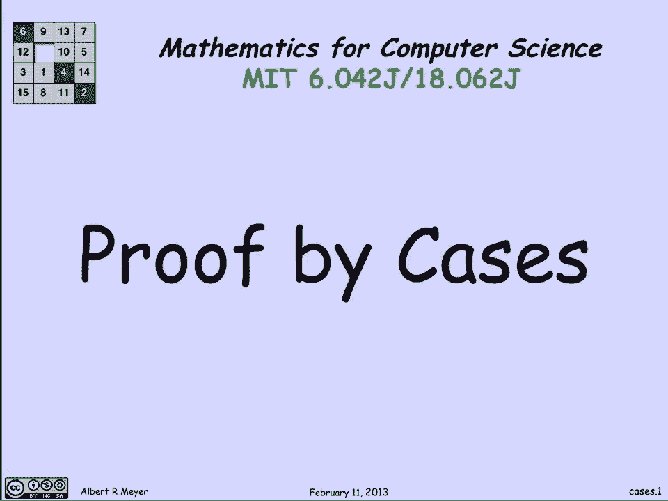
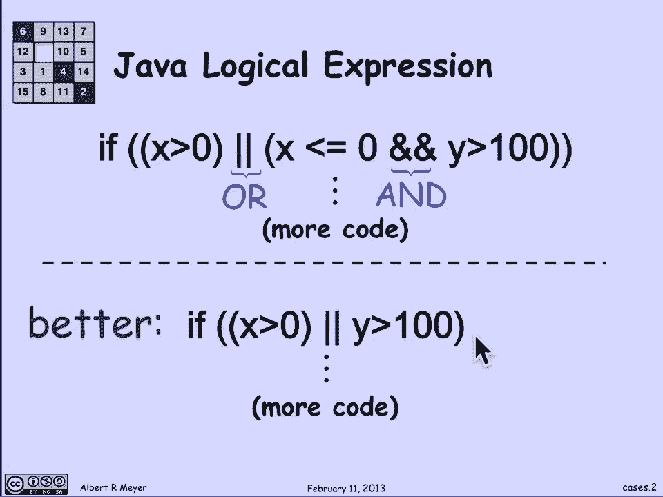
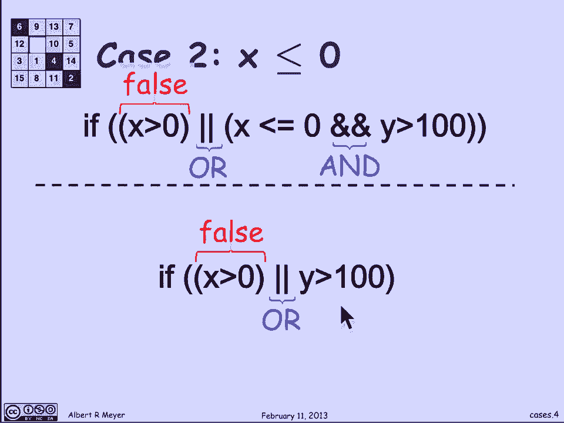
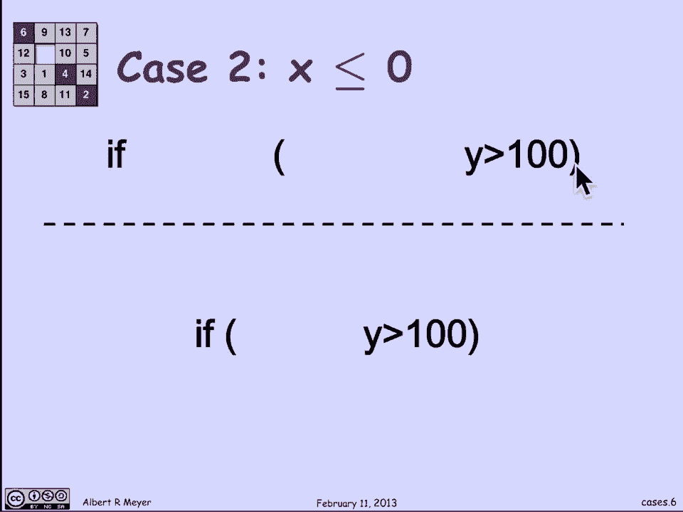
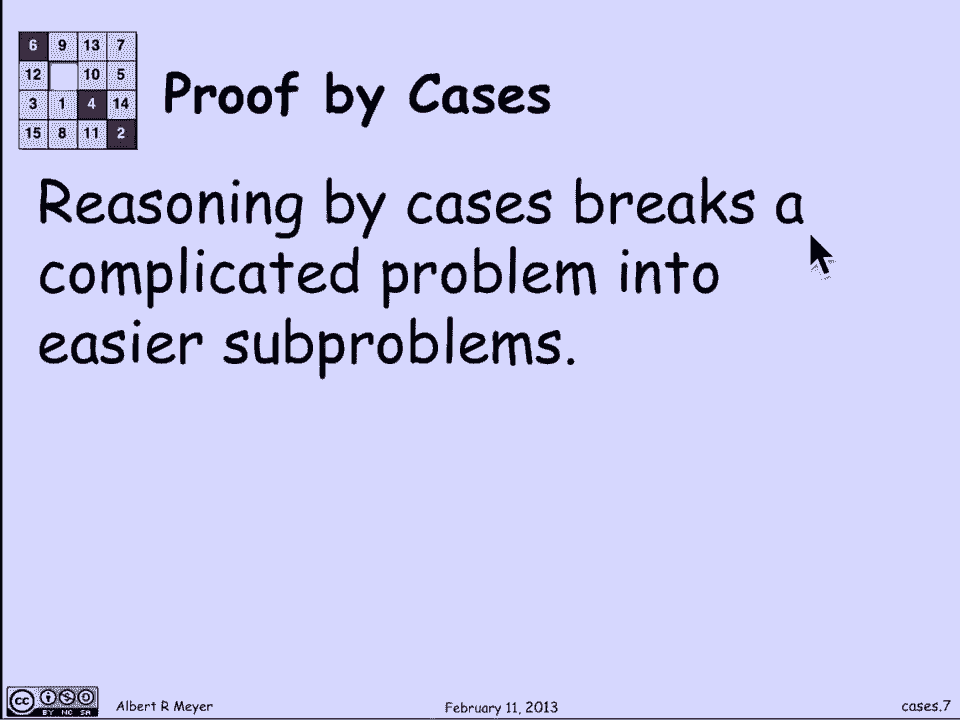
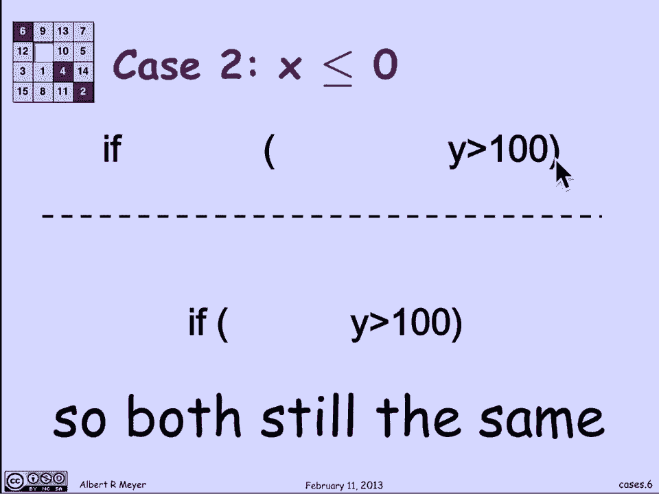
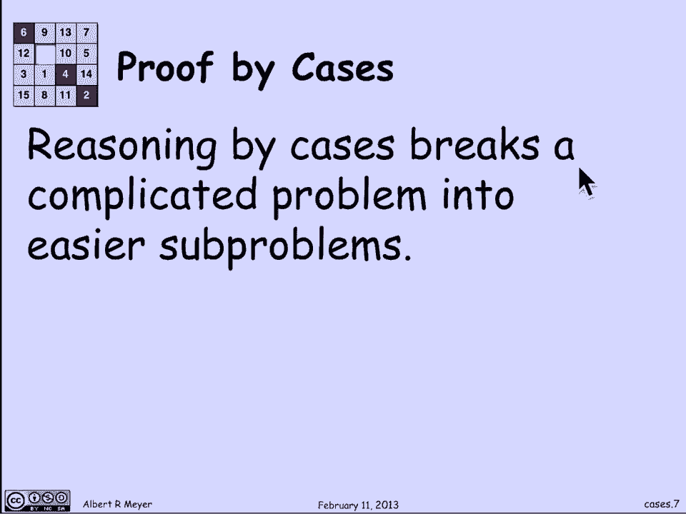
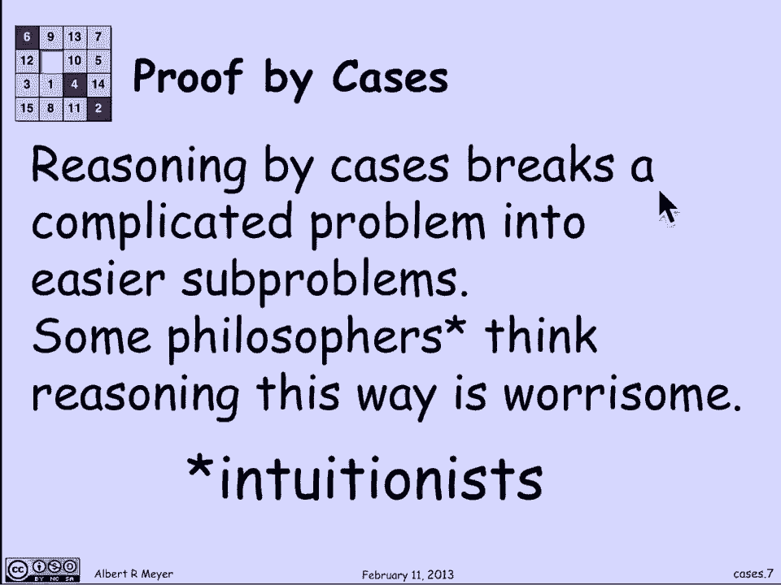
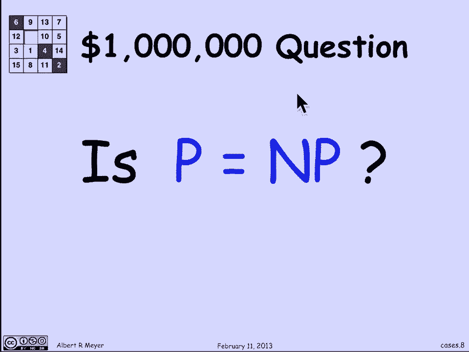
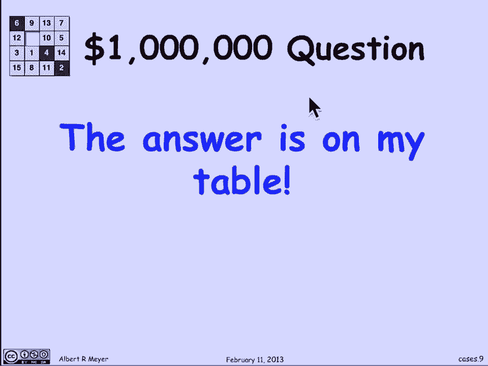

# 计算机科学的数学基础：P5：L1.2.3 - 分情况证明法 📚



在本节课中，我们将要学习一种基础的证明方法——**分情况证明法**。这种方法通过将一个复杂问题分解为几个更简单、易于证明的子情况，并且这些子情况共同覆盖了所有可能性，从而完成证明。

---

## 核心概念与示例

分情况证明法是一种将复杂问题拆解为多个简单子问题的策略。每个子问题都更容易处理，而所有子情况合起来则覆盖了原问题的全部可能性。

让我们来看一个来自计算机科学的明确而简单的例子。这是一个Java逻辑表达式：

```java
if (x > 0 || (x <= 0 && y > 100)) {
    // 执行某些代码
}
```

如何解读这个表达式呢？在Java中，双竖线 `||` 表示逻辑“或”，双与符号 `&&` 表示逻辑“与”。这是一个条件测试，如果测试结果为真，则执行后续的代码块。

这个测试可以解读为：如果 `x` 大于 `0`，**或者** `x` 小于等于 `0` **并且** `y` 大于 `100`，那么就执行代码块中的内容。我们假设变量 `x` 和 `y` 是浮点数或整数类型。

现在，我断言这段代码可以被优化。如果将其重写为以下形式，程序的行为将完全一致：



```java
if (x > 0 || y > 100) {
    // 执行相同的代码
}
```

这个断言是：用这个更短的表达式替换上面那个更长的表达式后，两个程序的行为方式将完全相同，因此后者更高效且更易于理解。

---

## 如何论证等价性

那么，如何论证这两段代码的行为完全相同呢？我们需要证明，在任何输入下，两个条件表达式的求值结果都一致。

我们可以通过考虑两种可能的情况来进行论证。

### 情况一：x > 0

首先，考虑 `x` 确实为正数，即 `x > 0` 的情况。

*   在原始表达式中，`x > 0` 这部分为真。由于这是“或”运算的第一个操作数，整个表达式立即为真，因此会执行后续代码。
*   在简化后的表达式中，`x > 0` 同样为真，整个表达式也为真，同样会执行后续代码。



因此，在 `x > 0` 的情况下，两个条件表达式都允许执行其后的代码。

---

### 情况二：x <= 0

接下来，考虑 `x` 小于或等于 `0` 的情况。

*   在原始表达式中，`x > 0` 这部分为假。由于是“或”运算，当第一个操作数为假时，我们需要继续检查第二个操作数 `(x <= 0 && y > 100)`。已知 `x <= 0` 为真，所以这个子表达式的结果完全取决于 `y > 100` 是否为真。因此，整个原始表达式的结果等同于 `y > 100` 的结果。
*   在简化后的表达式中，`x > 0` 为假，因此整个表达式的结果也完全取决于 `y > 100` 的结果。

所以，在 `x <= 0` 的情况下，两个条件表达式都简化为检查 `y > 100`，它们的行为也完全一致。

---





## 完成证明

综上所述，我们分析了所有可能的情况：

1.  当 `x > 0` 时，两个表达式都返回真。
2.  当 `x <= 0` 时，两个表达式都等同于 `y > 100`。



由于 `x` 要么大于 `0`，要么小于等于 `0`，没有其他可能性，因此我们覆盖了所有情况。在所有情况下，两个表达式都产生相同的结果。这就证明了用更简单的表达式 `(x > 0 || y > 100)` 替换复杂的原始表达式 `(x > 0 || (x <= 0 && y > 100))` 是安全的，它们完全等价。

---



## 方法总结与哲学探讨

上一节我们通过具体例子演示了分情况证明法。总的来说，分情况证明法通过将复杂问题分解为更容易解决的子问题来工作。在我们刚才的例子中，如果不分情况，很难直接看出两个表达式的等价性。但通过精心选择 `x > 0` 和 `x <= 0` 这两种情况，每个子问题的论证都变得简单明了。



然而，有一些哲学家出于微妙的理由对分情况推理感到担忧，他们被称为**直觉主义者**。让我用一个例子来说明他们的担忧。

有一个价值百万美元的克雷数学研究所悬赏问题，即著名的 **P 是否等于 NP** 问题。P 代表多项式时间，NP 代表非确定性多项式时间。如果两者相等，将具有重大意义，但普遍认为它们不相等，只是无人能证明。

现在，我声称这个问题的答案就在我的讲台上。我将展示给你看。

我可以通过以下论证“证明”答案存在：
1.  情况一：如果 P = NP，那么答案就是“是”。
2.  情况二：如果 P ≠ NP，那么答案就是“否”。

在这两种情况下，答案都存在于我的讲台上（要么是“是”，要么是“否”）。直觉主义者反对这种推理，因为他们认为，除非你能实际构造出那个答案（即明确写出“是”或“否”），否则你不能声称答案“存在”。分情况证明在这里只是抽象地指出了两种可能性，并没有具体给出哪一个是真的。这展示了在数学基础中形式化证明与构造性证明之间有趣的差异。

---



## 本节课总结



本节课中我们一起学习了**分情况证明法**。我们首先了解了其核心思想：通过穷尽所有可能的情况，并在每个情况下分别进行证明，从而完成整体论证。接着，我们通过一个Java代码优化的具体实例，一步步演示了如何应用这种方法来证明两个逻辑表达式的等价性。最后，我们简要探讨了围绕该方法的一些哲学思考，了解了直觉主义者对非构造性证明的立场。掌握分情况证明法，能帮助我们将复杂的逻辑问题化整为零，逐一击破。