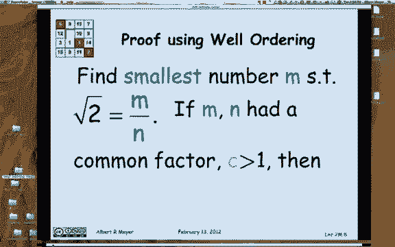
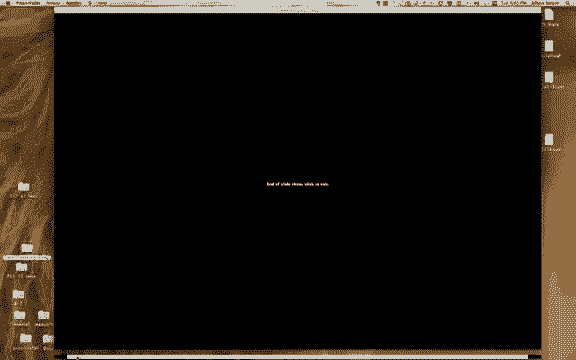

# 计算机科学的数学基础：P6：L1.3.1 - 良序原理1

## 📚 概述
在本节中，我们将学习一个在数学中非常基础且重要的概念——**良序原理**。这个原理看似显而易见，但它是许多数学证明和计算机科学论证的基石。我们将了解它的定义，探讨其适用范围，并通过一个经典例子来展示它的应用。

---

## 🔍 良序原理的定义
良序原理的陈述如下：**每一个非空的非负整数集合都有一个最小元素**。

这个原理可能听起来很熟悉，甚至显而易见。我们可以这样理解：给定一个非空的整数集合，你可以从0开始检查它是否在集合中。如果0是集合的元素，那么它就是最小元素。如果不是，就检查1，然后是2，依此类推。由于集合非空，你最终一定会“碰到”那个最小的元素。这可以看作是一个非正式的证明。

---

## ⚠️ 原理的适用范围与限制
上一节我们介绍了良序原理的基本定义，本节中我们来看看它的适用范围和一些需要注意的细节。

良序原理**只适用于非负整数**。如果我们改变讨论的对象，结论可能不再成立。

以下是两个关键的限制情况：
*   **情况一：非负有理数**。并非所有非负有理数集合都有最小元素。例如，考虑所有大于0的有理数集合，这个集合没有最小元素，因为无论你找到多小的正有理数，总能找到一个更小的。
*   **情况二：所有整数**。所有整数的集合（包括负整数）没有最小元素，因为不存在“最小的”整数（例如，-1不是最小，-2比-1更小，以此类推）。

我们在日常生活中经常不自觉地使用这个原理。例如，当我们询问“麻省理工学院毕业生的最小年龄”或“任何动物拥有的最小神经元数量”时，我们默认存在这样一个最小的数字，这正是因为年龄和神经元数量都是非负整数。

---

## 🧮 符号约定与回顾
在后续的讨论中，除非特别说明，**“数”将特指非负整数**。数学中有一个标准符号来表示非负整数集合，即 **`ℕ`**（有时被称为自然数，但为了避免“0是否自然”的争议，我们统一称之为非负整数）。

---

## 💡 原理的早期应用：证明√2是无理数
实际上，我们已经在不知不觉中应用过良序原理了。回想一下证明√2是无理数的过程。

那个证明始于一个假设：假设√2是有理数，即它可以表示为两个整数的商 `m/n`。论证的关键一步是：**任何分数都可以表示为最简形式（即分子和分母没有大于1的公因数）**。更准确地说，如果存在一个分数等于√2，那么就存在一个没有公因数的“最简分数” `m/n` 使得 √2 = `m/n`。

现在，我们可以用良序原理来清晰地论证为什么任何分数都能化为最简形式。具体论证如下：

1.  考虑所有满足 √2 = `m/n` 的分数 `m/n`。
2.  根据良序原理，在所有可能的分子 `m` 中，存在一个**最小的**分子 `m`，使得 √2 可以表示为 `m/n`（其中 `n` 是某个对应的分母）。
3.  我们声称，以这个最小分子 `m` 构成的分数 `m/n` 必然已经是最简形式。
4.  **反证法**：假设 `m` 和 `n` 有一个大于1的公因数 `c`。那么，我们可以将分数简化为 `(m/c) / (n/c)`。此时，分子 `m/c` 是一个比 `m` 更小的整数，并且它仍然满足 √2 = `(m/c) / (n/c)`。
5.  但这与我们最初选择的“最小分子 `m`”相矛盾。
6.  这个矛盾表明，我们的假设（`m` 和 `n` 有公因数）是错误的。因此，`m` 和 `n` 没有公因数，分数 `m/n` 已经是最简形式。

> **注意**：虽然我们是在证明√2是无理数的背景下引入这个论证的，但上述推理过程实际上证明了**任何有理数（任何分数）都可以表示为最简形式**。

---

## 📝 总结
本节课中，我们一起学习了**良序原理**。我们明确了它的定义：每个非空的非负整数集合都有一个最小元素。我们探讨了它的局限性，了解到它不适用于有理数集或全体整数集。最后，我们回顾了在证明√2是无理数的过程中，如何巧妙地运用良序原理来论证分数总可以化为最简形式。理解这个原理将为后续学习更多数学证明方法打下坚实的基础。