# 计算机科学的数学基础：P7：L1.3.3 - 良序原理应用示例 🧮

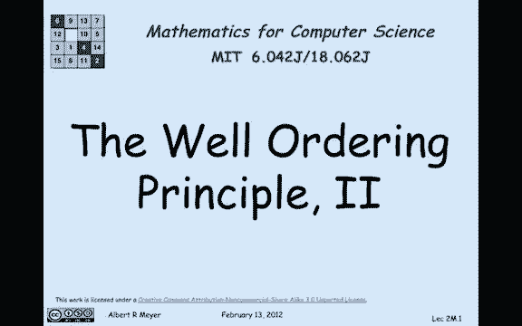

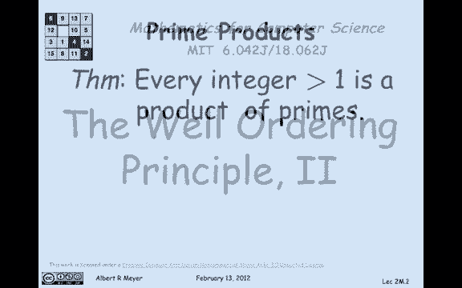

在本节课中，我们将学习如何应用良序原理来证明两个重要的数学命题。良序原理指出：**任何非空的自然数集合都有一个最小元素**。我们将通过两个例子来展示这一原理的强大之处：第一个是证明每个大于1的整数都是质数的乘积，第二个是分析使用3分和5分邮票可以组成哪些邮资。

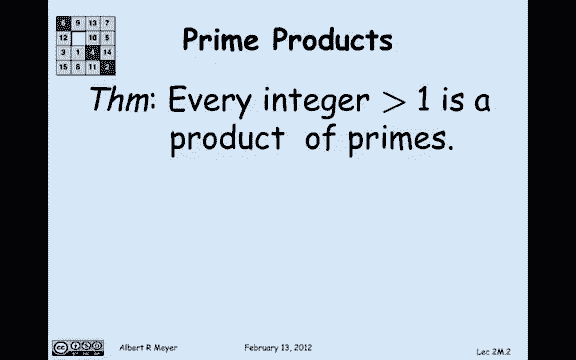

---

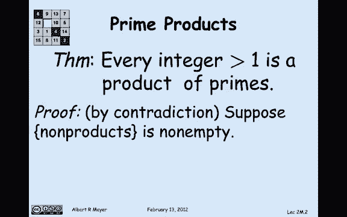

## 示例一：整数分解为质数乘积

上一节我们介绍了良序原理的基本概念，本节中我们来看看如何用它来证明一个关于整数分解的基本定理。

**定理**：每个大于1的整数都是质数的乘积。

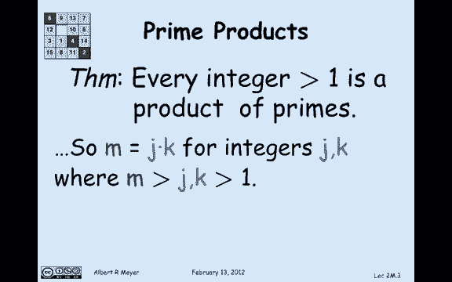

**证明**：我们将使用反证法来证明这个定理。

1.  **假设存在反例**：假设存在一些大于1的整数，它们不能表示为质数的乘积。也就是说，“非质数乘积”的集合是非空的。
2.  **应用良序原理**：根据良序原理，这个非空的“非质数乘积”集合中必然存在一个最小的元素。我们记这个最小的反例为 **M**。
3.  **分析M的性质**：根据定义，**M** 大于1且不是质数的乘积。注意，如果 **M** 本身是质数，那么它被视为一个质数（自身）的乘积。因此，**M** 不可能是质数。
4.  **推导矛盾**：
    *   由于 **M** 不是质数，那么它可以表示为两个大于1且小于 **M** 的整数的乘积，即 **M = J × K**，其中 **J, K > 1** 且 **J, K < M**。
    *   因为 **M** 是“非质数乘积”集合中的最小元素，而 **J** 和 **K** 都小于 **M**，所以 **J** 和 **K** 必然可以表示为质数的乘积。假设：
        *   **J = P₁ × P₂ × ... × Pₐ**
        *   **K = Q₁ × Q₂ × ... × Qᵦ**
    *   那么，**M = J × K = (P₁ × P₂ × ... × Pₐ) × (Q₁ × Q₂ × ... × Qᵦ)**。
    *   这个等式表明 **M** 本身也是质数的乘积，这与我们最初假设 **M** 是“非质数乘积”相矛盾。

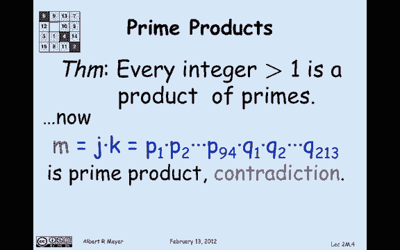

由于假设存在反例导致了矛盾，因此原假设不成立。结论是：**不存在不能表示为质数乘积的大于1的整数**，即每个大于1的整数都是质数的乘积。

---

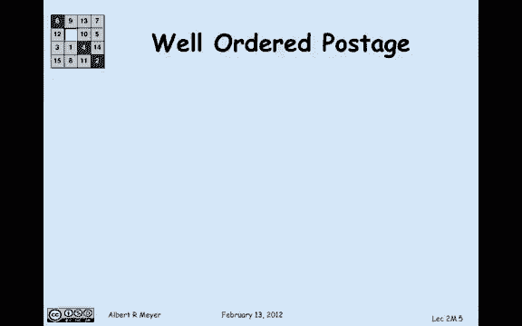

## 示例二：邮票组合问题

在理解了第一个例子后，我们来看一个稍微复杂但更有趣的应用，它涉及组合问题。

**问题**：假设我们拥有无限多的3分邮票和5分邮票。我们想要证明：**任何不少于8分的邮资都可以用这两种邮票组合出来**。

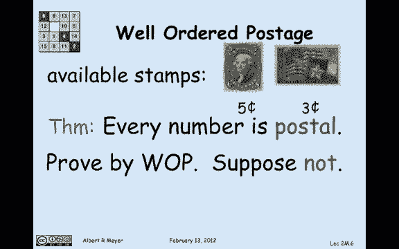

为了使证明更简洁，我们引入一个定义：如果一个数 **n** 满足“**n + 8** 分邮资可以用3分和5分邮票组成”，则称 **n** 是“可邮寄的”。

**目标**：证明所有自然数 **n** 都是“可邮寄的”。换句话说，从8分开始的所有邮资都能被组成。

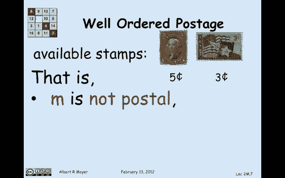

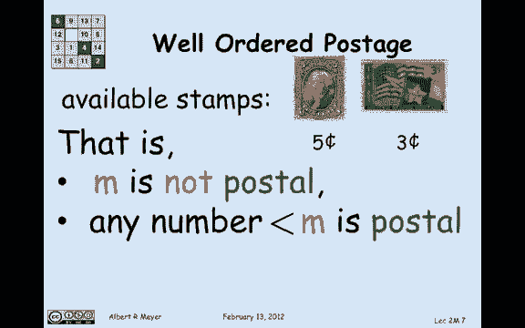

**证明**：我们再次使用反证法和良序原理。

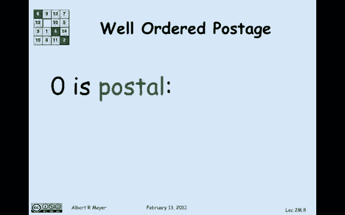

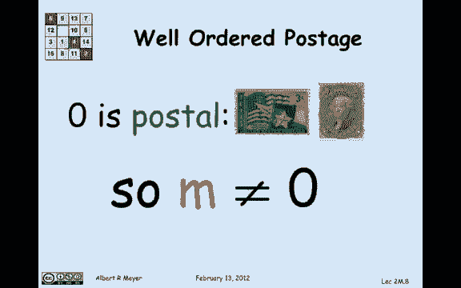

1.  **假设存在反例**：假设存在一些“不可邮寄”的数。那么，“不可邮寄数”的集合是非空的。
2.  **应用良序原理**：根据良序原理，这个非空集合中存在一个最小的“不可邮寄数”。我们记这个最小的反例为 **M**。
3.  **分析M的性质**：我们知道 **M** 是“不可邮寄的”，并且所有比 **M** 小的数都是“可邮寄的”。
    *   首先，**M** 不能是0、1或2。
        *   0是可邮寄的，因为 0+8=8 分可以用 (1个3分 + 1个5分) 组成。
        *   1是可邮寄的，因为 1+8=9 分可以用 (3个3分) 组成。
        *   2是可邮寄的，因为 2+8=10 分可以用 (2个5分) 组成。
    *   因此，**M ≥ 3**。
4.  **推导矛盾**：
    *   考虑 **M - 3**。因为 **M ≥ 3**，所以 **M - 3 ≥ 0**，并且 **M - 3 < M**。
    *   由于 **M** 是最小的“不可邮寄数”，而 **M - 3** 比 **M** 小，所以 **M - 3** 必然是“可邮寄的”。
    *   “M - 3 可邮寄”意味着我们可以用3分和5分邮票组成 **(M - 3) + 8** 分的邮资。
    *   如果我们在这个 **(M - 3) + 8** 分的邮资组合中**再额外加上一张3分邮票**，那么我们就得到了 **M + 8** 分的邮资。
    *   但这恰恰证明了 **M** 是“可邮寄的”，与我们最初假设 **M** “不可邮寄”相矛盾。

假设存在最小的“不可邮寄数” **M** 导致了矛盾。因此，这样的 **M** 不存在。结论是：**所有自然数 n 都是“可邮寄的”**，即从8分开始的所有邮资都能用3分和5分邮票组合出来。

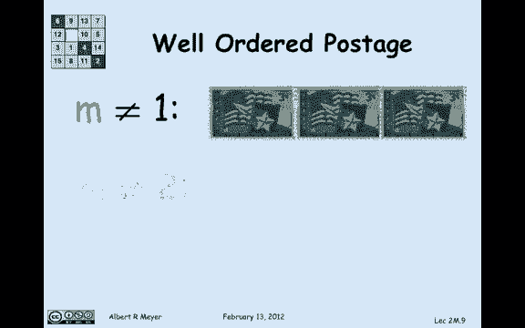

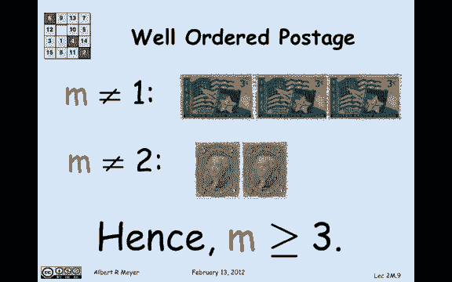

---

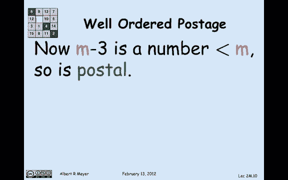

## 总结 📝

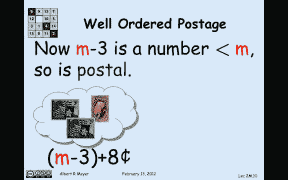

本节课中我们一起学习了良序原理的两个经典应用。

*   首先，我们证明了**每个大于1的整数都可以分解为质数的乘积**，这是算术基本定理的核心思想之一。
*   其次，我们解决了一个组合问题，证明了**使用3分和5分邮票可以组成任何不少于8分的邮资**。

这两个例子展示了良序原理作为证明工具的通用模式：**假设命题不成立 → 找出最小的反例 → 利用“最小性”推导出矛盾 → 从而证明命题成立**。掌握这种方法对理解计算机科学中的许多算法正确性证明至关重要。