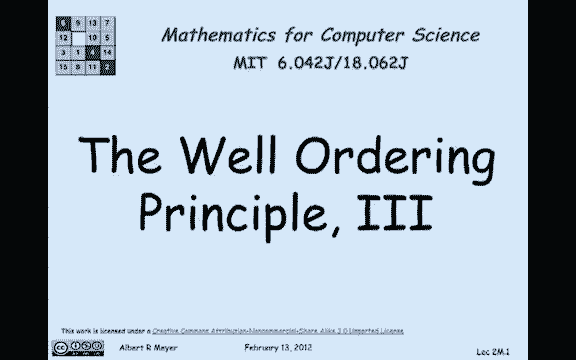
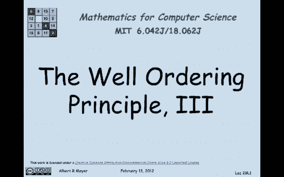
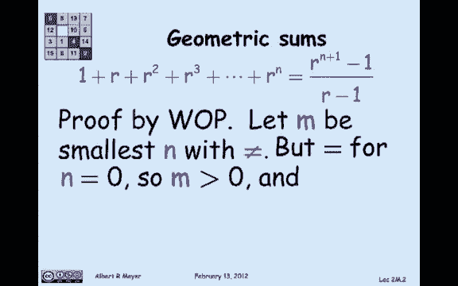
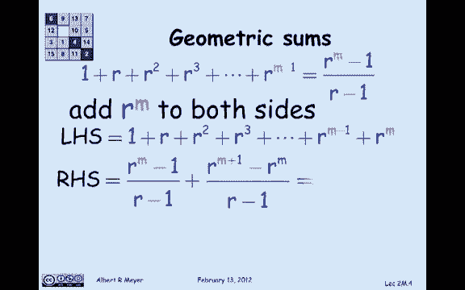
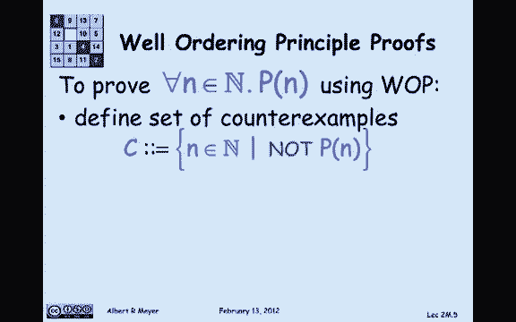

# 计算机科学的数学基础：1.3.5：良序原理应用3 🧮

在本节课中，我们将学习如何应用良序原理来证明一个关于几何级数求和的著名公式。我们将通过一个具体的例子，展示良序原理在证明数学恒等式中的强大作用。

---



## 概述



本节课我们将要学习良序原理的最后一个应用实例。我们将证明一个关于几何级数求和的公式。这个公式对于所有非负整数 `n` 和所有不等于1的实数 `r` 都成立。我们将看到，即使证明过程需要一些技巧，良序原理也能为我们提供一个清晰、严谨的证明框架。

---

## 几何级数求和公式

我们关注的定理是下面这个关于几何级数求和的著名公式：

对于几何级数（或称几何和），其形式为从 `r⁰` 到 `rⁿ` 的幂次之和。具体来说，左边的数字序列是：`1`（即 `r⁰`），`r¹`，`r²`，……，直到 `rⁿ`。将这些数字全部相加，结果可以用一个简洁的封闭公式表示，而不需要使用省略号。

该公式准确地给出了和的值，如下所示：

**公式：**
```
∑_{i=0}^{n} rⁱ = (r^{n+1} - 1) / (r - 1)
```

这个恒等式对所有非负整数 `n` 成立，并且对所有不等于 `1` 的实数 `r` 成立（因为分母不能为零）。

---

## 使用良序原理进行证明

我们如何证明这个公式呢？我们将使用良序原理。



首先，我们假设这个恒等式**不**对某些非负整数 `n` 成立。接下来，我们应用良序原理。

1.  **定义反例集合：** 设 `C` 是使该等式不成立的所有非负整数 `n` 的集合。即 `C = { n | P(n) 为假 }`，其中 `P(n)` 表示等式在 `n` 时成立。
2.  **寻找最小反例：** 根据良序原理，如果 `C` 非空（即存在反例），那么 `C` 中必然存在一个最小的元素。我们设这个最小的反例为 `m`。因此，`m` 是使等式不成立的最小非负整数。

现在，我们对这个最小的反例 `m` 进行分析。

我们知道，当 `n = 0` 时，等式左边是 `r⁰ = 1`。等式右边是 `(r¹ - 1)/(r - 1) = 1`。因此，当 `n = 0` 时，等式成立。这意味着，等式不成立的最小 `m` 必须是**正数**（即 `m > 0`）。

由于 `m` 是**最小的**反例，那么对于所有小于 `m` 的非负整数（即从 `0` 到 `m-1`），等式都成立。这是一个关键点。

因此，我们可以假设对于 `n = m-1`，等式成立：
```
∑_{i=0}^{m-1} rⁱ = (r^{(m-1)+1} - 1) / (r - 1) = (r^{m} - 1) / (r - 1)
```

---

## 推导矛盾

我们感兴趣的是 `n = m` 时的和，即 `∑_{i=0}^{m} rⁱ`。我们可以利用已知的 `m-1` 的情况来构造它。

从 `m-1` 的和出发，两边同时加上 `rᵐ`：
```
∑_{i=0}^{m} rⁱ = [∑_{i=0}^{m-1} rⁱ] + rᵐ
```
将我们假设成立的等式代入：
```
∑_{i=0}^{m} rⁱ = [(r^{m} - 1) / (r - 1)] + rᵐ
```

现在，我们化简右边的表达式。将 `rᵐ` 写成分母为 `(r-1)` 的形式：
```
rᵐ = rᵐ * (r - 1) / (r - 1) = (r^{m+1} - rᵐ) / (r - 1)
```
将其与前面的分式相加：
```
∑_{i=0}^{m} rⁱ = [(r^{m} - 1) + (r^{m+1} - rᵐ)] / (r - 1)
```
合并分子中的项：
```
∑_{i=0}^{m} rⁱ = (r^{m+1} - 1) / (r - 1)
```



看！我们恰好得到了当 `n = m` 时，原公式右边的形式。这意味着，根据我们“等式在 `m-1` 时成立”的假设，我们推导出等式在 `n = m` 时**也必然成立**。

---

## 完成证明

但这与我们最初的设定矛盾！我们最初设定 `m` 是使等式**不成立**的最小反例。然而，上面的推导却表明，如果等式在 `m-1` 时成立，那么它在 `m` 时也成立。因此，`m` 不可能是一个反例。

这个矛盾源于我们最初的假设——“存在至少一个 `n` 使等式不成立”。既然这个假设导致了矛盾，那么它必然是假的。

因此，我们得出结论：**不存在使等式不成立的非负整数 `n`**。也就是说，该几何级数求和公式对所有非负整数 `n` 都成立。

---

## 良序原理证明模板总结



上一节我们通过一个具体例子完成了证明，本节我们来总结一下使用良序原理进行证明的一般组织框架。这可以作为一个通用的证明模板。

**目标：** 证明某个性质 `P(n)` 对所有非负整数 `n` 都成立。

以下是证明步骤：

1.  **假设存在反例：** 假设结论不成立，即存在至少一个非负整数使得 `P(n)` 为假。定义反例集合 `C = { n | P(n) 为假 }`。
2.  **寻找最小反例：** 根据良序原理，如果 `C` 非空，则其中存在一个最小的元素。记这个最小的反例为 `m`。
3.  **推理得出矛盾：** 这是证明的核心，没有固定套路。通常通过以下两种方式之一利用“`m` 是最小反例”这一事实进行推理：
    *   **方式一：** 证明存在另一个反例 `c`，且 `c < m`。这与“`m` 是 `C` 中最小元素”矛盾。
    *   **方式二：** 证明 `P(m)` 实际上成立（就像我们在几何级数例子中所做的）。这与“`m` 是反例（即 `P(m)` 为假）”的设定直接矛盾。
4.  **得出结论：** 由于假设存在反例会导出矛盾，因此原假设错误。故性质 `P(n)` 对所有非负整数 `n` 都成立。

---

## 本节课总结

在本节课中，我们一起学习了良序原理的第三个重要应用。我们使用它严谨地证明了几何级数的求和公式。通过假设存在一个最小的反例 `m`，并利用 `m-1` 时公式成立的归纳思想，我们推导出 `m` 时公式也必须成立，从而否定了最小反例的存在，完成了证明。最后，我们总结了使用良序原理进行证明的通用模板，它为我们证明关于非负整数的命题提供了一个强大而清晰的方法。