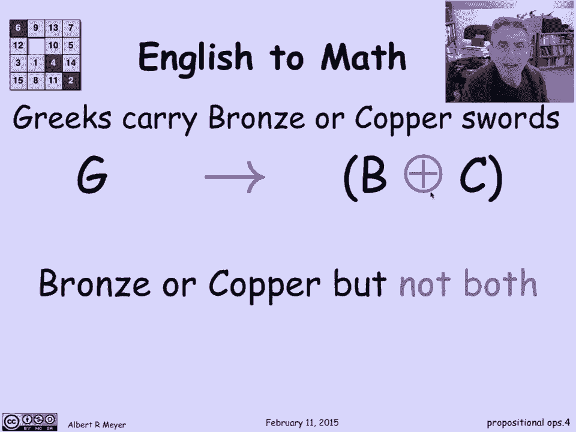
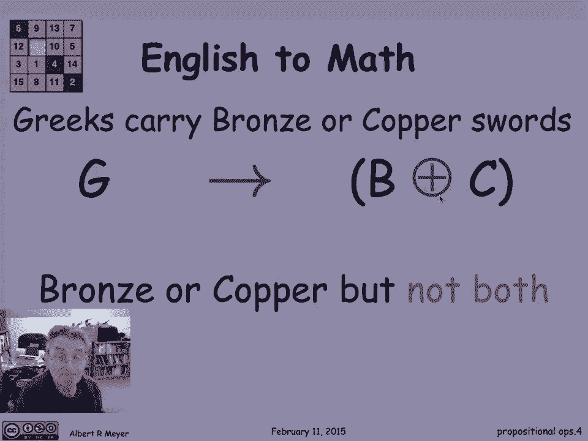
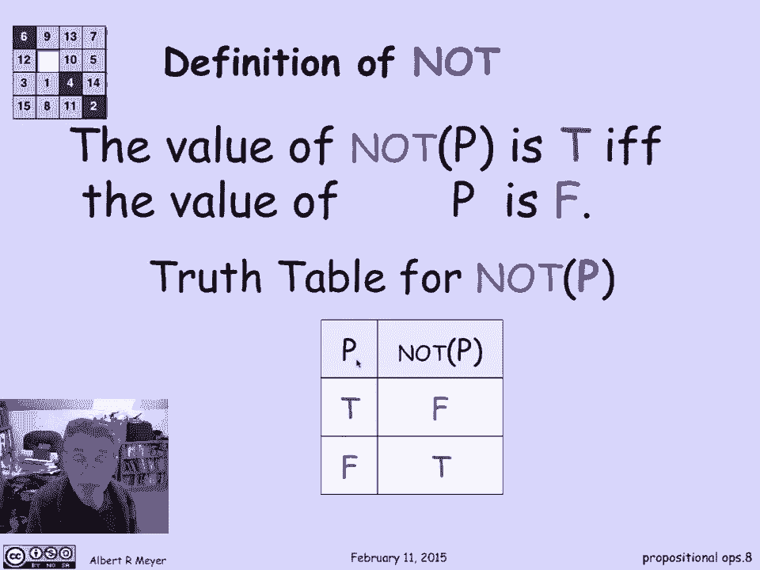
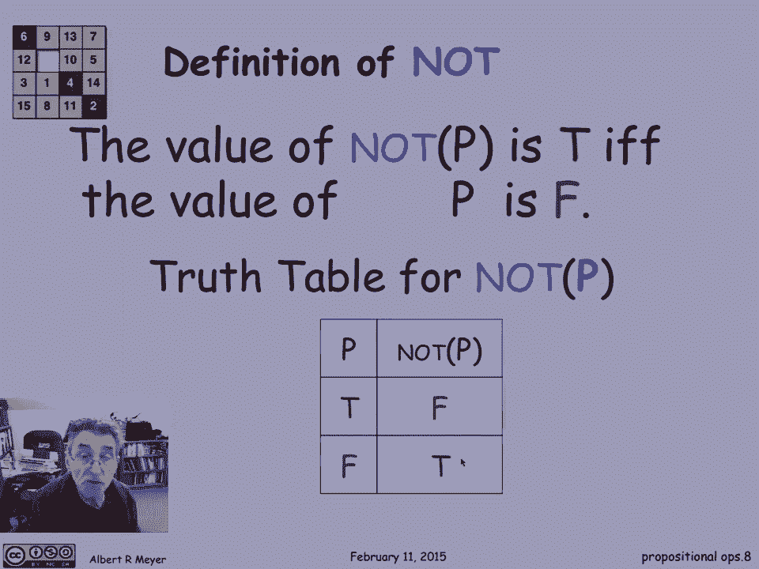
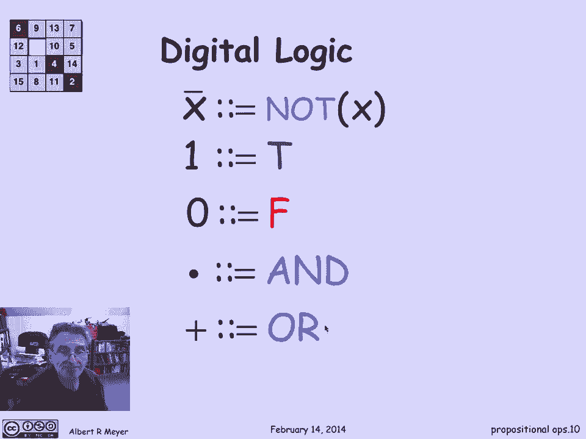

# 计算机科学的数学基础：P9：L1.4.1 - 命题与逻辑运算符 🧠

在本节课中，我们将要学习命题逻辑的基础知识，包括什么是命题，以及如何使用逻辑运算符（如“与”、“或”、“非”等）来构建更复杂的复合命题。理解这些概念是进行严谨数学推理和编程的基础。

## 什么是命题？

对一个数学家来说，尤其是在这门课上，我们将使用“命题”这个词，指代一个可以明确判断为真或为假的事物。

例如，“有五种正多面体”是一个命题，它恰好是真的。在某些方面，我们甚至可以证明这一点。它暗示着，假设你想让一百颗卫星以统一的方式绕着地球运行，你做不到，因为没有一百个顶点的正多面体，最大的正多面体只有二十个顶点。

如果我将命题换成“有六个正多面体”，那么这个断言就是假的。所以，这是一个定义良好的命题的简单例子，其中一个是真的，另一个是假的。命题不一定是真的，总存在一些非真的例子。

“醒一醒”不是一个命题，因为这是一个祈使句，没有真假之分。“我在哪里”是一个问题，也没有真假之分。“是三便士”不是一个命题，因为它在任何特定的时刻可能是真的或假的，但其真假取决于时间，这是一个复杂的问题，我们不想深入探讨。一个命题是一个固定的断言，它要么永远为真，要么永远为假。

## 为什么需要形式逻辑？

数学家提出命题抽象以及对其运算的原因之一是，普通语言往往模棱两可，这会给数学推理带来问题，就像在程序设计中一样。

英语中连接命题的最模棱两可的短语之一是“或”。让我们看一个例子：“希腊人意味着拿着剑或标枪”。如果我把这个转录成精确的数学符号，我可以说：`G` 代表“是希腊人”意味着 `S` 代表“拿着剑”或 `J` 代表“拿着标枪”。所以，这是一个断言：如果你是希腊人，那么你拿着剑或标枪。

问题在于“或”意味着什么？事实证明，对于标枪和剑来说，即使一个希腊人同时带着剑和标枪，这个断言也为真。这是一个“包容性的或”。一个希腊士兵确实可能同时带着剑和标枪，因为标枪是很好的长距离武器，而剑在近处用于自卫很好，你当然想两者兼得。

## 逻辑运算符及其符号

这些逻辑连接词有许多标准符号，用于从简单的命题构建更大的命题。

其中之一是 `∨` 符号，这个连接符号是逻辑学家经常用来代替“或”的。箭头 `→` 表示“蕴含”，有时双杠箭头 `⇒` 也意味着“蕴含”。但我们不打算深入讨论这些，我们主要使用词语来描述。

让我们看另一个例子：“希腊人佩带青铜或铜剑”。语法上，这与前一个短语的结构相同，但我们要用不同的方式翻译它。原因在于，这里指的是一个希腊士兵不会同时携带一把青铜剑和一把铜剑。因为青铜剑比铜剑好很多，它们要硬得多。所以这次我们的意思是，希腊人只携带青铜或铜制武器中的一种。如果你没有青铜的，你才会带铜的。

所以现在我们把它翻译成：希腊人意味着 `B`（青铜）或 `C`（铜），但这次我们用“异或”（XOR）。XOR意味着其中一个是正确的，但不是两者都有。XOR有一个加号表示法 `⊕`，因为我们将看到，它的行为有点像模2加法：`1 ⊕ 1 = 0`。

## 精确定义 OR 和 XOR

让我们更精确地定义 OR 和 XOR 以及它们是如何工作的。

断言是：如果 `P` 和 `Q` 是代表真或假命题的占位符，那么复合命题 `P OR Q` 为真，当且仅当 `P` 为真，或 `Q` 为真，或者两者都为真。

我可以用一个所谓的“真值表”来表达这个断言。在表中，我列举了 `P` 和 `Q` 所有可能的真值组合，并告诉你 `P OR Q` 对应的真值。

| P | Q | P OR Q |
|---|---|--------|
| T | T | T      |
| T | F | T      |
| F | T | T      |
| F | F | F      |

值得注意的是，`P OR Q` 为假的唯一方法是 `P` 和 `Q` 都为假。





对于 XOR，`P XOR Q` 为真，当且仅当 `P` 和 `Q` 中正好有一个为真。

| P | Q | P XOR Q |
|---|---|---------|
| T | T | F       |
| T | F | T       |
| F | T | T       |
| F | F | F       |

这个真值表只是定义 XOR 如何作用于真值的精确方法。

## 其他基本运算符：AND 和 NOT

还有另一个连接词 AND，它的工作方式更直接。`P AND Q` 的值为真，当且仅当 `P` 和 `Q` 都为真。

| P | Q | P AND Q |
|---|---|---------|
| T | T | T       |
| T | F | F       |
| F | T | F       |
| F | F | F       |

突出的一点是，`P AND Q` 为真仅当 `P` 和 `Q` 都为真。

逻辑运算中还有否定运算 NOT。`NOT P` 只是翻转了 `P` 的真值。如果 `P` 为真，那么 `NOT P` 是假的；如果 `P` 为假，那么 `NOT P` 是真的。

| P | NOT P |
|---|-------|
| T | F     |
| F | T     |

## 在编程中的应用

使用逻辑运算来构建更复杂的复合命题的一个主要应用领域是在编程中。



这里有一个来自 Java 的典型短语。Java 使用双竖线 `||` 来表示“包容性或”，使用双与号 `&&` 来表示“与”。



```java
if (x > 0 || (x <= 0 && y > 100)) {
    // 执行一些代码
}
```

这是一段合法的 Java 代码。它正在测试并求值此表达式：如果 `x` 大于零，或者（`x` 小于等于零且 `y` 大于一百），那么如果那个测试为真，则执行大括号内的代码；如果是假的，则跳过所有代码继续执行。

在大多数编程语言中，我们以非常标准的方式使用类似这样的布尔表达式或逻辑表达式。

## 在数字逻辑中的应用

这些操作出现的另一个地方是在数字逻辑，即数字电路设计中。数字电路设计者有自己的符号。

一个常用的缩写是：`NOT x` 可以通过在 `x` 上写一个横杠 `x̄` 来表示。更一般地，NOT 可以通过在复杂的表达式上写一个横杠来缩写，这可以节省空间。我们会使用这个符号。

在数字逻辑中，电路处理的是电信号，其唯一区别是高电压还是低电压。高电压用 `1` 表示，低电压用 `0` 表示。数字逻辑的行为方式是：`1` 对应于真（True），`0` 对应于假（False）。

那么 AND 运算就是简单的乘法，因为对于 `1` 或 `0` 的普通乘法，只有当两者都为 `1` 时，结果才为 `1`。这正是当 `1` 表示为真、`0` 表示为假时 AND 运算的行为方式。

```数学
1 AND 1 = 1 * 1 = 1
1 AND 0 = 1 * 0 = 0
0 AND 1 = 0 * 1 = 0
0 AND 0 = 0 * 0 = 0
```

不幸的是，数字设计师在他们使用 `+` 表示 OR 时，并不意味着普通加法（`1+1=2`），而是意味着 `1 OR 1 = 1`。这是需要注意的一部分，也是我们不常使用这个 `+` 符号表示 OR 的部分原因。

## 总结



本节课中我们一起学习了命题逻辑的基础。我们首先定义了命题是能判断真假的陈述。然后，我们探讨了普通语言的模糊性如何促使我们使用形式化的逻辑运算符，包括 **OR（∨）**、**XOR（⊕）**、**AND（∧）** 和 **NOT（¬）**。我们通过真值表精确地定义了这些运算符的行为。最后，我们看到了这些概念在编程（如Java中的条件判断）和数字电路设计中的实际应用。理解这些基本构件是进行更复杂数学推理和计算机科学学习的关键一步。