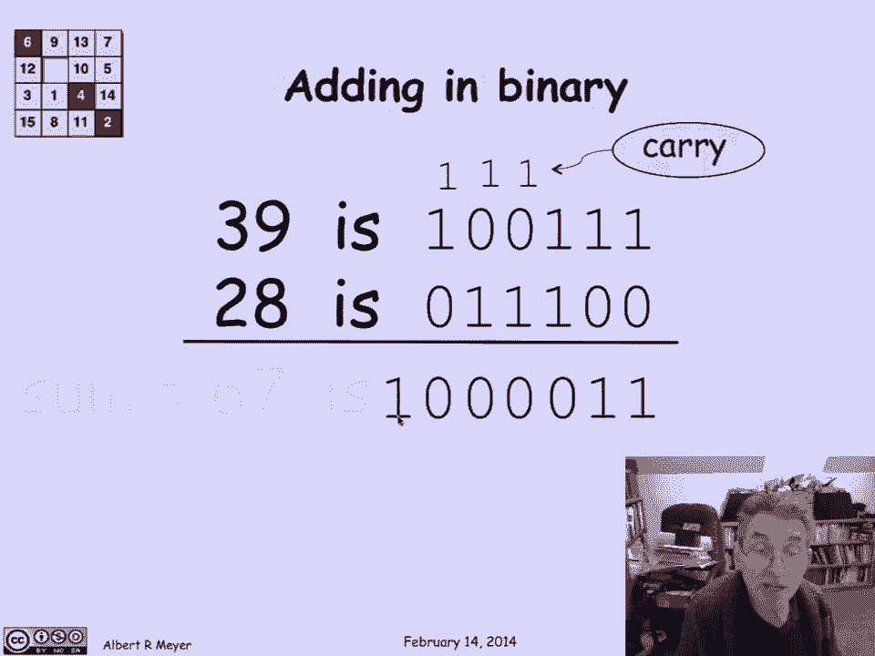
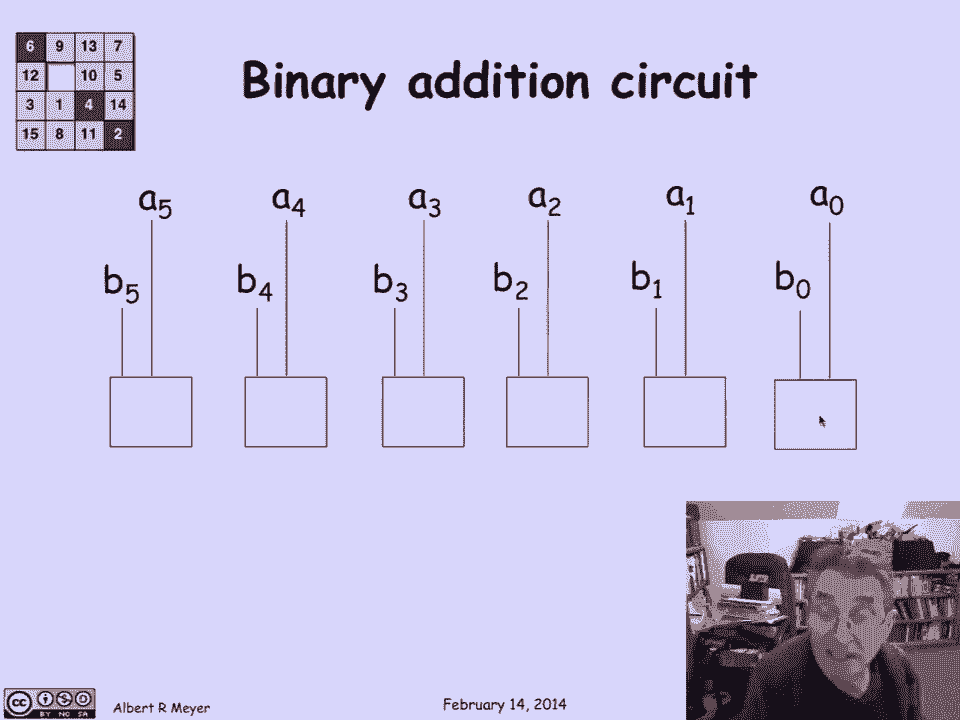
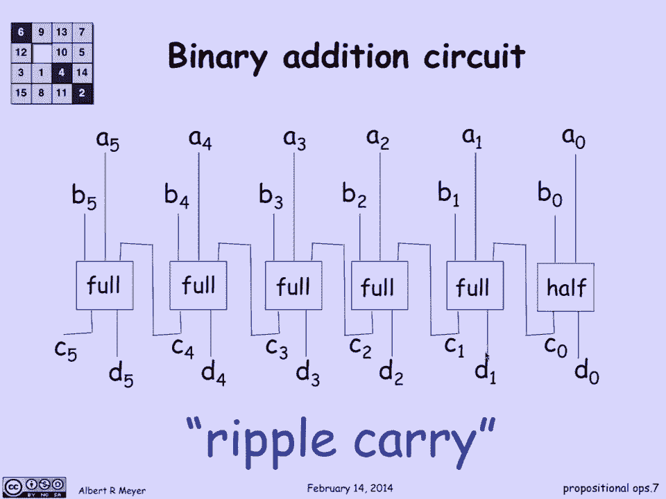
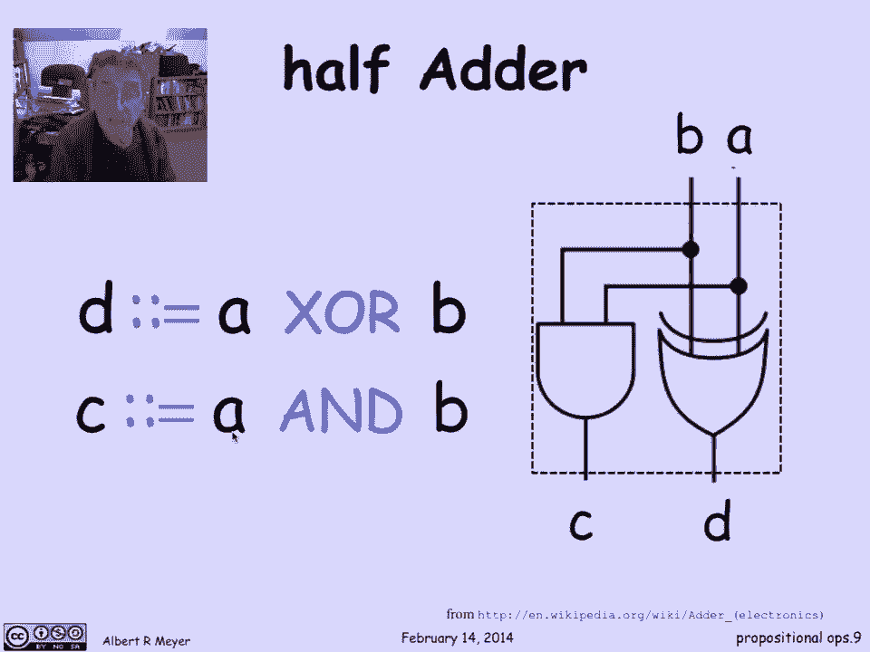
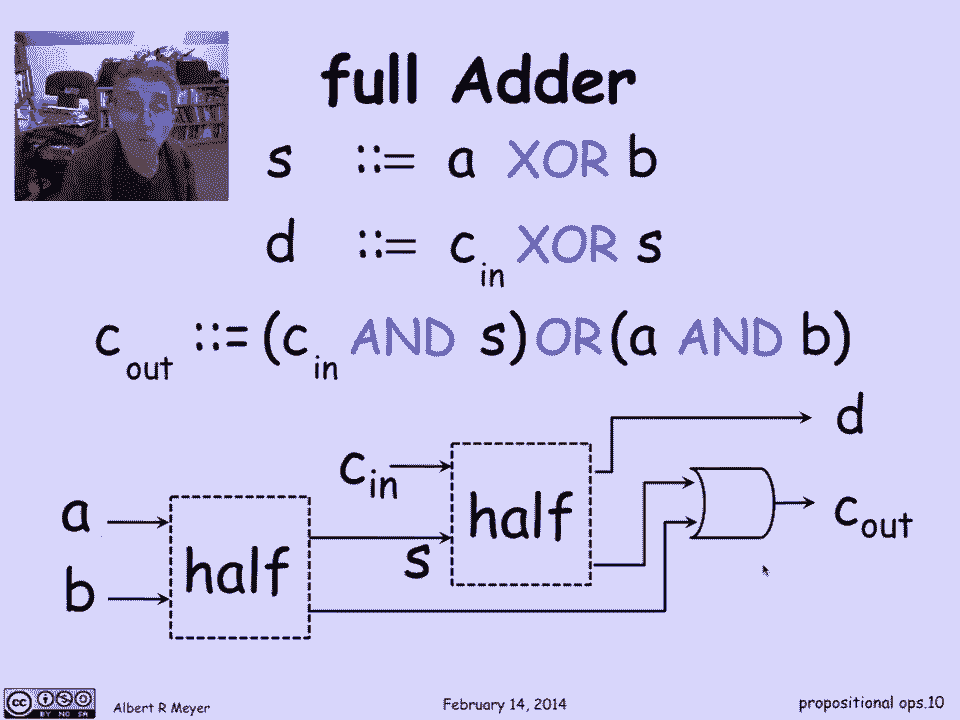
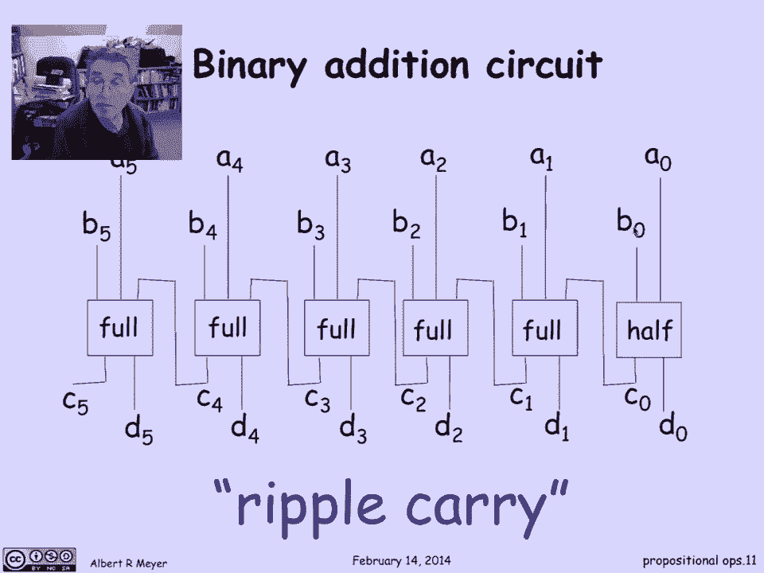
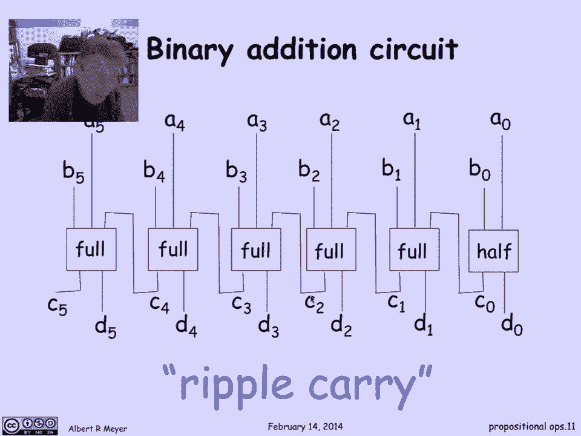

# 计算机科学的数学基础：1.4.3：数字逻辑 🧮

在本节课中，我们将学习命题运算符在数字电路设计中的基础作用。我们将通过设计一个简单的二进制加法电路来具体说明这一点。

## 二进制表示与加法回顾

二进制的工作原理与十进制类似，区别在于它使用2的幂次方，而非10的幂次方。例如，数字39的二进制表示是 `100111`。理解方式是：从右向左，依次是1位、2位、4位、8位、16位、32位。因此，`1+2+4=7`，加上32位上的1，`32+7=39`。

同样，数字28的二进制表示是 `011100`。你可以通过计算`1*4 + 1*8 + 1*16`来验证。

二进制加法与十进制加法类似，但数字只有0和1。当`1+1`时，会产生进位。让我们计算`100111`（39）加上`011100`（28）：
*   第一列：`1+0=1`
*   第二列：`1+0=1`
*   第三列：`1+1=0`，进位1
*   第四列：`1+1+进位1=1`，进位1
*   第五列：`0+1+进位1=0`，进位1
*   第六列：`1+0+进位1=0`，进位1
*   第七列：进位1
最终结果是 `1000011`，即`1+2+64=67`。

## 设计二进制加法电路

现在，我们尝试使用数字逻辑（信号0和1）来设计一个执行加法运算的电路。我们的目标是设计一个6位二进制加法电路。

我们将有两个输入：第一个6位二进制数 `A5, A4, ..., A0` 和第二个6位二进制数 `B5, B4, ..., B0`。这些0或1信号将通过导线传入一些包含数字运算符的“盒子”中。

我们希望输出的是这两个数二进制和的可能为7位的表示：`S0, S1, ..., S5` 以及可能的高位进位 `C5`。`S0`是`A0`和`B0`相加后的低位（可能考虑进位），依此类推。如果两个6位数相加产生7位数，`C5`就会是1。

实现方式很明确：处理`A`和`B`输入以产生低位数字的“盒子”可能会产生一个进位，这个进位必须传递到下一列（如果存在）。因此，我们需要一根导线将这个盒子产生的0或1进位信号传递给下一个盒子。

这种结构被称为**行波进位加法器**。它精确地模仿了我们逐列相加两个数字、可能将进位传播到下一列的方式。

## 半加器与全加器

这些“盒子”需要具体设计。第一个盒子（处理最低位）只有两个输入（`A0`和`B0`），而其他盒子都有三个输入（`Ai`, `Bi`和来自低位的进位`Ci-1`）。

因此，我们将三输入盒子称为**全加器**，两输入盒子称为**半加器**。

*   **半加器**的规格是：输入为`A`和`B`，输出是`A+B`的二进制表示（一个两位数，因为最大和为2）。我们称低位输出为`D`，进位输出为`C`。
*   **全加器**的规格是：输入为`A`、`B`和进位输入`C_in`，输出是`A+B+C_in`的二进制表示（一个两位数，因为最大和为3）。

上一节我们介绍了电路的基本结构，本节我们来看看构成这些结构的基本单元——半加器和全加器是如何实现的。

### 半加器设计

半加器相对简单。它的输入是`A`和`B`，需要产生`A+B`的二进制和。低位`D`是`A`和`B`的模2和（即异或运算），进位`C`仅在`A`和`B`都为1时发生（即与运算）。

以下是半加器的电路逻辑描述：
*   `D`被定义为`A`和`B`的异或：`D ::= A XOR B`
*   `C`被定义为`A`和`B`的与：`C ::= A AND B`

### 全加器设计

全加器稍微复杂一些。我们可以用两个半加器和一个或门来构建它。

首先，我们引入一个中间变量`s`，它是输入`A`和`B`的异或：`s ::= A XOR B`。

全加器的输出可以如下描述：
1.  和输出`D`是进位输入`C_in`与中间变量`s`的异或：`D ::= C_in XOR s`
2.  进位输出`C_out`有两个来源：
    *   第一个半加器产生的进位：`A AND B`
    *   第二个半加器（处理`s`和`C_in`）可能产生的进位：`C_in AND s`
    因此，总进位输出是这两者的或：`C_out ::= (A AND B) OR (C_in AND s)`

## 电路行为的公式化描述

现在我们已经有了描述半加器和全加器行为的公式，可以回到我们的行波进位加法器，用公式来描述所有输出（`C_i`和`D_i`）的行为。

对于第一个半加器（处理最低位`i=0`）：
*   `D0 ::= A0 XOR B0`
*   `C0 ::= A0 AND B0`

对于后续的每一个全加器（`i`从1到5）：
*   首先定义中间变量：`s_i ::= A_i XOR B_i`
*   然后，和输出为：`D_i ::= C_{i-1} XOR s_i`
*   最后，进位输出为：`C_i ::= (A_i AND B_i) OR (C_{i-1} AND s_i)`

关键在于，我们已经将电路的具体连线图翻译成了这样一组逻辑方程。这些方程更能体现电路的逻辑行为，因为它不依赖于具体的物理布局，只依赖于这些逻辑关系。

## 总结

本节课中，我们一起学习了数字逻辑的基础。我们从二进制表示和加法开始，然后逐步设计了一个6位行波进位加法器。我们定义了构成该电路的基本单元：**半加器**和**全加器**，并给出了它们的逻辑实现（使用异或、与、或门）。最后，我们将整个加法电路的行为用一组清晰的逻辑公式进行了描述，这比具体的电路图更能体现其计算本质。这展示了命题逻辑运算符在硬件设计中的直接应用。