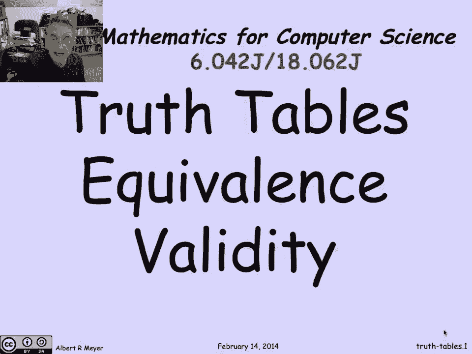
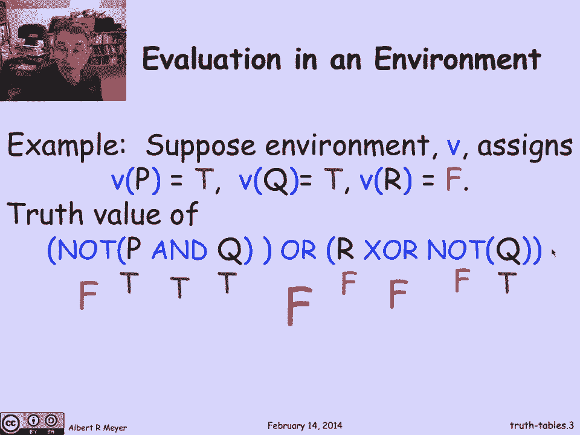
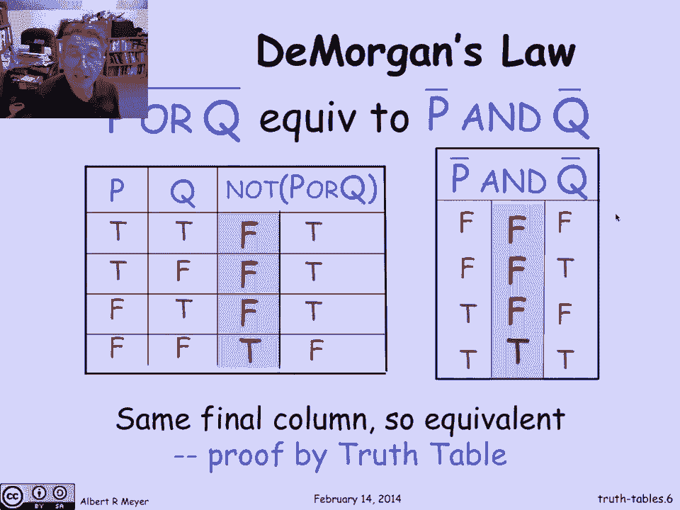
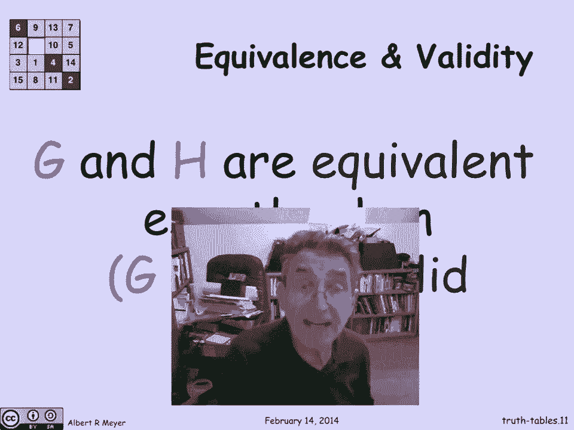
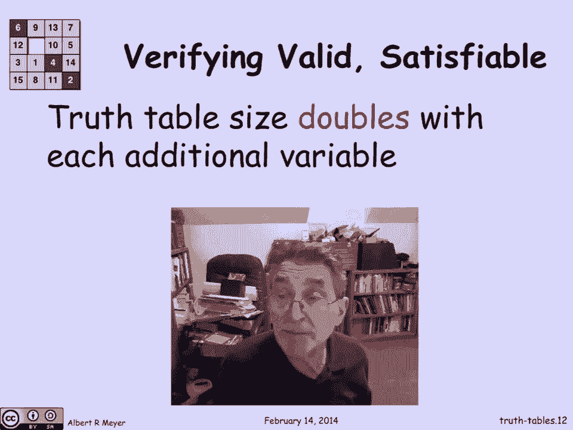
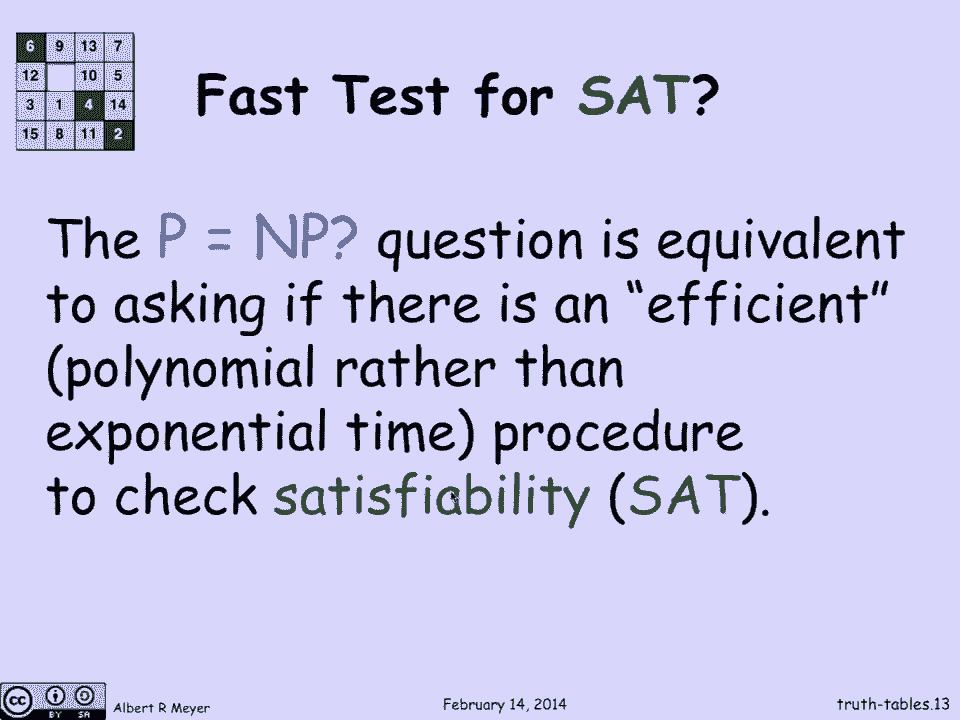
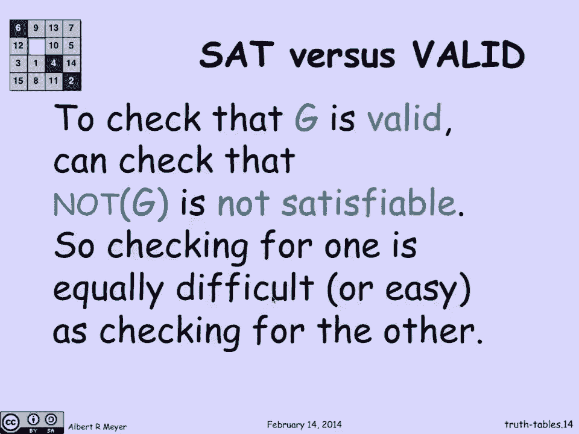

# 计算机科学的数学基础：1.4.4：真值表 📊

在本节课中，我们将学习如何使用真值表来定义和理解命题逻辑中公式的行为。真值表是一种系统化的方法，可以帮助我们判断公式是否等价，或者一个公式是否总是成立（即有效）。

---

## 环境与赋值

上一节我们介绍了命题连接词，本节中我们来看看如何评估一个复合命题公式的真值。为了确定整个公式的真假，我们需要知道其各个组成部分（即原子命题变量）的真假值。

在计算机科学中，为变量分配值的过程称为**环境**。逻辑学家则称之为**真值赋值**。环境是一个函数，它告诉我们每个变量是**真**还是**假**。

让我们看一个例子。假设有三个变量 **P**、**Q** 和 **R**。我们有一个环境 **V**，其中：
- **V(P) = True**
- **V(Q) = True**
- **V(R) = False**

现在，我们想评估复合公式 `(P AND Q) XOR (NOT Q)` 在这个环境下的值。

以下是评估步骤：
1.  将环境中的值赋给变量：P=True, Q=True, R=False。
2.  从最内层的子公式开始计算：
    *   `P AND Q`：由于 P 和 Q 都为真，所以结果为 **True**。
    *   `NOT Q`：Q 为真，所以结果为 **False**。
3.  计算外层连接词：
    *   `(True) XOR (False)`：XOR 在两边值不同时为真，所以结果为 **True**。

这个过程可以递归地进行，从内到外或从上到下，最终得到整个公式的真值。

---

## 公式的等价性

两个命题公式是**等价**的，当且仅当它们在**所有可能的环境**下都具有相同的真值。真值表是验证等价性的完美工具。

一个重要的等价关系是**德摩根定律**。它指出：
*   `NOT (P OR Q)` 等价于 `(NOT P) AND (NOT Q)`

我们可以通过真值表来证明：

以下是 `NOT (P OR Q)` 的真值表：

| P | Q | P OR Q | NOT (P OR Q) |
|---|---|--------|--------------|
| T | T | T      | F            |
| T | F | T      | F            |
| F | T | T      | F            |
| F | F | F      | **T**        |

以下是 `(NOT P) AND (NOT Q)` 的真值表：

| P | Q | NOT P | NOT Q | (NOT P) AND (NOT Q) |
|---|---|-------|-------|---------------------|
| T | T | F     | F     | F                   |
| T | F | F     | T     | F                   |
| F | T | T     | F     | F                   |
| F | F | T     | T     | **T**               |

比较两表的最后一列，它们完全相同。因此，我们通过穷举所有可能环境（即真值表）证明了这两个公式是等价的。

---

## “当且仅当”连接词

现在，我们引入一个新的重要连接词：**当且仅当**，记作 `↔` 或 `IFF`。

公式 `P IFF Q` 的真值定义为：当 **P** 和 **Q** 的真值**相同**时为真，否则为假。

其真值表如下：
| P | Q | P IFF Q |
|---|---|---------|
| T | T | T       |
| T | F | F       |
| F | T | F       |
| F | F | T       |

可以发现，`P IFF Q` 为真，恰好与 `(NOT (P XOR Q))` 为真是同一回事。这个连接词在表达等价关系时非常有用。

---

## 可满足性与有效性

基于真值表，我们可以定义两个核心概念：

1.  **可满足性**：一个公式是**可满足的**，当且仅当**存在至少一个**环境使其为真。
    *   例如：`P` 是可满足的（令 P=True 即可）。
    *   例如：`P AND NOT P` 是**不可满足的**（无论P取何值，该公式恒为假）。

2.  **有效性（永真式）**：一个公式是**有效的**（或称**永真式**），当且仅当它在**所有可能**的环境下都为真。
    *   例如：`P OR NOT P` 是有效的（P要么真，要么假，总有一成立）。
    *   例如：根据德摩根定律，`(NOT (P OR Q)) IFF ((NOT P) AND (NOT Q))` 是一个永真式，因为它表达了一个等价关系。

可满足性与有效性通过以下方式紧密关联：
*   公式 **G** 是有效的，当且仅当 **NOT G** 是**不可满足的**。
*   公式 **G** 是可满足的，当且仅当 **NOT G** 是**无效的**（不是永真式）。

---

## 计算的挑战：P vs NP 问题

使用真值表判断可满足性或有效性在理论上是直接且完备的。然而，这种方法存在一个巨大的实践问题：**状态空间爆炸**。

对于一个有 **n** 个变量的公式，其真值表有 **2^n** 行。这意味着：
*   2个变量：4行
*   3个变量：8行
*   4个变量：16行
*   ...
*   100个变量：约 1.3 x 10^30 行——这是一个天文数字，无法实际计算。

因此，一个核心的理论计算机科学问题是：**是否存在一种比穷举所有真值赋值（指数时间）更高效（例如多项式时间）的方法，来判断一个命题公式是否可满足？**

这就是著名的 **P vs NP 问题**。SAT（布尔可满足性问题）是NP完全问题的典型代表。目前，没有人知道是否存在解决SAT问题的高效算法。如果能找到，将意味着P=NP，这将是计算机科学领域的革命性发现；如果证明不存在，则确认了P≠NP。

由于有效性问题（检查 `G` 是否永真）可以转化为可满足性问题（检查 `NOT G` 是否不可满足），所以这两个问题的计算难度是相同的。

---

## 总结

本节课中我们一起学习了：
1.  如何使用**环境**（赋值）来递归地评估命题公式的真值。
2.  如何利用**真值表**这一系统化工具来证明两个公式的**等价性**，例如德摩根定律。
3.  认识了“**当且仅当**”连接词及其真值表。
4.  理解了**可满足性**（存在为真的情况）和**有效性**（永真式）这两个关键概念及其相互关系。
5.  初步了解了**SAT问题**的挑战性及其与**P vs NP**这一计算机科学核心未解问题的关联。真值表方法虽然直观，但在变量较多时因指数级增长而不可行，这引出了对更高效算法的探索。