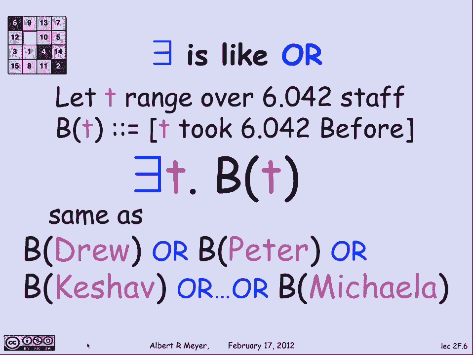
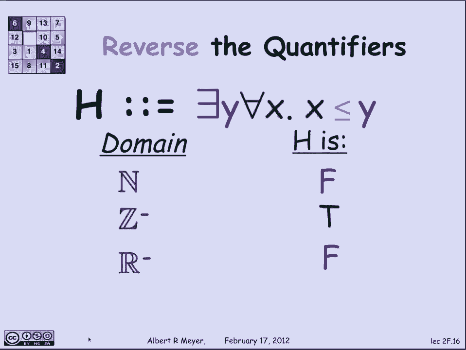

# 计算机科学的数学基础：P12：L1.5.1-谓词逻辑1 🧠

在本节课中，我们将要学习**谓词逻辑**的基本概念，特别是两个核心量词：**全称量词**和**存在量词**。我们将通过具体的例子来理解什么是谓词，以及量词如何改变命题的含义。

## 什么是谓词？

上一节我们介绍了命题逻辑，本节中我们来看看**谓词**。谓词本质上是一个包含变量的命题。为了判断一个谓词的真假，我们需要知道其中变量的具体值。

例如，我们可以定义一个依赖于变量 `x` 和 `y` 的谓词 `P(x, y)`，其含义为 `x + 2 = y`。
*   如果 `x = 1`, `y = 3`，则 `P(1, 3)` 为真，因为 `1 + 2 = 3`。
*   如果 `x = 1`, `y = 4`，则 `P(1, 4)` 为假，因为 `1 + 2 ≠ 4`。

## 量词：全称与存在

理解了谓词后，现在我们来引入控制变量的**量词**。量词主要有两种：
*   **全称量词**：符号为 `∀`，读作“对于所有”。
*   **存在量词**：符号为 `∃`，读作“存在”。

为了理解它们的作用，我们来看一个例子。假设变量 `s` 的取值范围是某课程 `6.042` 的所有工作人员（大约30人）。我们定义谓词 `P(s)` 表示“工作人员 `s` 对 `6.042` 充满热情”。

以下是量词的应用方式：
*   **全称量词**：命题 `∀s P(s)` 表示“对于所有工作人员 `s`，`P(s)` 都为真”。这相当于说：德鲁充满热情，彼得充满热情，克沙夫充满热情……所有30名工作人员都充满热情。
*   **存在量词**：定义另一个谓词 `B(t)` 表示“工作人员 `t` 之前上过 `6.042`”。命题 `∃t B(t)` 表示“存在一个工作人员 `t`，使得 `B(t)` 为真”。这意味着至少有一名工作人员（德鲁、彼得、克沙夫或米凯拉等中的某一位）之前上过这门课。

## 量词应用练习

让我们通过一些数学例子来巩固对量词的理解。假设变量 `x` 和 `y` 的取值范围是**非负整数**（即 0, 1, 2, 3, …）。

### 存在量词练习

考虑谓词 `Q(y)`：`∃x (x < y)`，其含义是“存在一个 `x`，使得 `x` 小于 `y`”。
*   `Q(3)` 为真，因为可以取 `x = 1`（或0, 2），满足 `1 < 3`。
*   `Q(1)` 为真，因为可以取 `x = 0`，满足 `0 < 1`。
*   `Q(0)` 为假，因为不存在一个非负整数 `x` 能满足 `x < 0`。

### 全称量词练习

考虑谓词 `R(y)`：`∀x (x < y)`，其含义是“对于所有 `x`，都有 `x` 小于 `y`”。
*   `R(1)` 为假。反例：取 `x = 5`，`5 < 1` 不成立。
*   `R(8)` 为假。反例：取 `x = 12`，`12 < 8` 不成立。
*   事实上，对于任何有限的 `y`，`R(y)` 都为假，因为总可以找到一个比 `y` 大的 `x`（例如 `x = y + 1`）。

## 量词的顺序至关重要

初学者容易混淆的一点是**量词的顺序**，不同的顺序会导致命题的含义发生根本改变。

让我们看一个直观的例子：假设 `v` 代表计算机病毒，`d` 代表防御软件。
*   **命题 A**：`∀v ∃d (d defends against v)`。
    *   含义：**对于每一种**病毒，**都存在**一种能防御它的软件。
    *   解读：每种病毒都有对应的克星，但针对不同病毒可能需要不同的软件。这成本可能很高。
*   **命题 B**：`∃d ∀v (d defends against v)`。
    *   含义：**存在一种**软件，能防御**所有**病毒。
    *   解读：存在一种“万能”防御软件，可以抵御所有攻击。这显然更理想、更经济。

可以看到，`∀∃` 和 `∃∀` 的含义截然不同。

## 论域对命题真值的影响

一个含有量词的命题是否为真，严重依赖于变量**论域**（即取值范围）的选择。

考虑命题 `G`：`∀x ∃y (y > x)`，其含义是“对于每一个 `x`，都存在一个 `y` 使得 `y` 大于 `x`”。
*   如果论域是**非负整数**，`G` 为真。因为给定任何非负整数 `x`，总可以取 `y = x + 1`。
*   如果论域是**负整数**，`G` 为假。例如当 `x = -1` 时，不存在比 `-1` 更大的负整数。
*   如果论域是**负实数**，`G` 又为真。因为给定任何负实数 `r`，取 `y = r / 2`（它比 `r` 更接近0，所以更大）。

## 颠倒量词的顺序

现在让我们颠倒量词，考虑命题 `H`：`∃y ∀x (x ≤ y)`，其含义是“存在一个 `y`，使得对于所有 `x`，都有 `x` 小于或等于 `y`”。这实际上是在断言论域中存在一个**最大值** `y`。
*   如果论域是**非负整数**，`H` 为假。因为对于任何整数 `y`，`y+1` 都比它大。
*   如果论域是**负整数**，`H` 为真。最大值 `y` 就是 `-1`。
*   如果论域是**负实数**，`H` 为假。因为对于任何负实数 `y`，`y / 2` 都比它大。

这个例子再次说明，量词顺序和论域共同决定了命题的真假。

## 总结

本节课中我们一起学习了谓词逻辑的核心内容：
1.  **谓词**是包含变量的命题，其真值取决于变量的赋值。
2.  两个基本**量词**：
    *   **全称量词 `∀`**：表示“对于所有……”。
    *   **存在量词 `∃`**：表示“存在至少一个……”。
3.  **量词的顺序**极其重要，`∀x ∃y P(x,y)` 与 `∃y ∀x P(x,y)` 含义完全不同。
4.  含有量词的命题的**真值**依赖于变量的**论域**。改变论域可能会翻转命题的真假。

理解谓词和量词是掌握更复杂数学表述和进行严谨逻辑推理的基础。