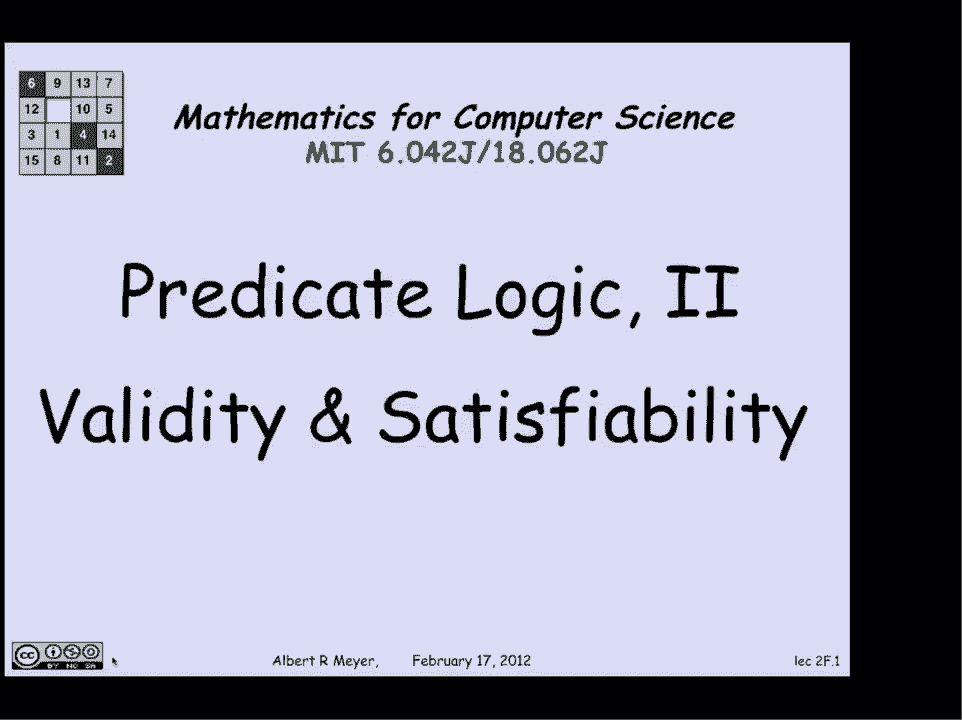
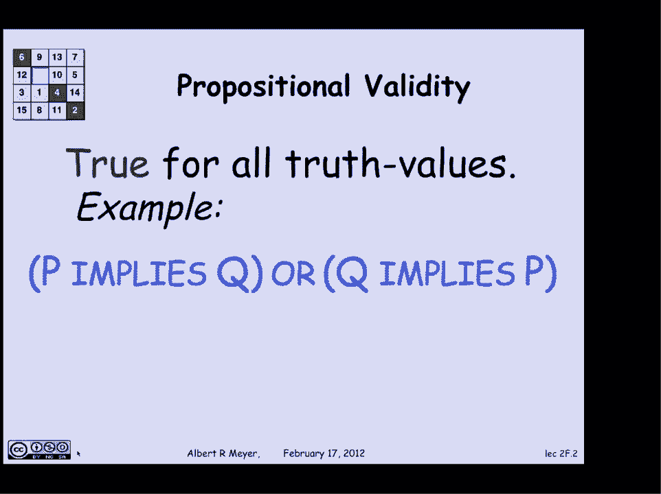
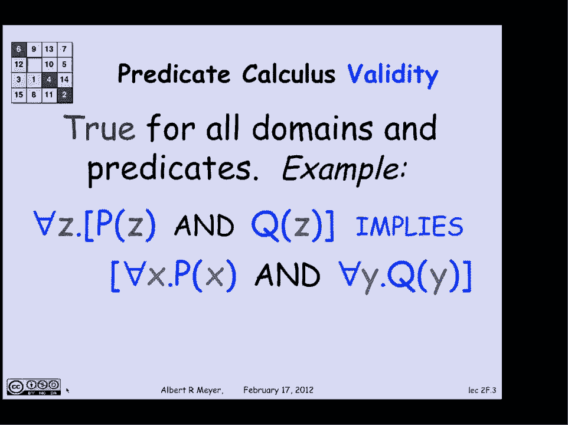
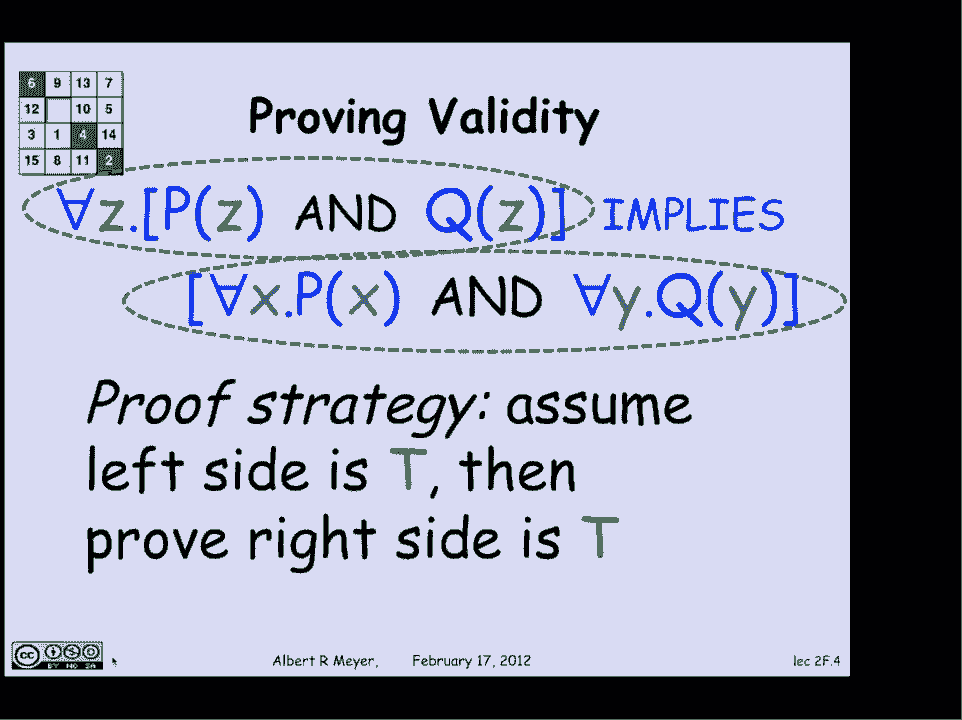
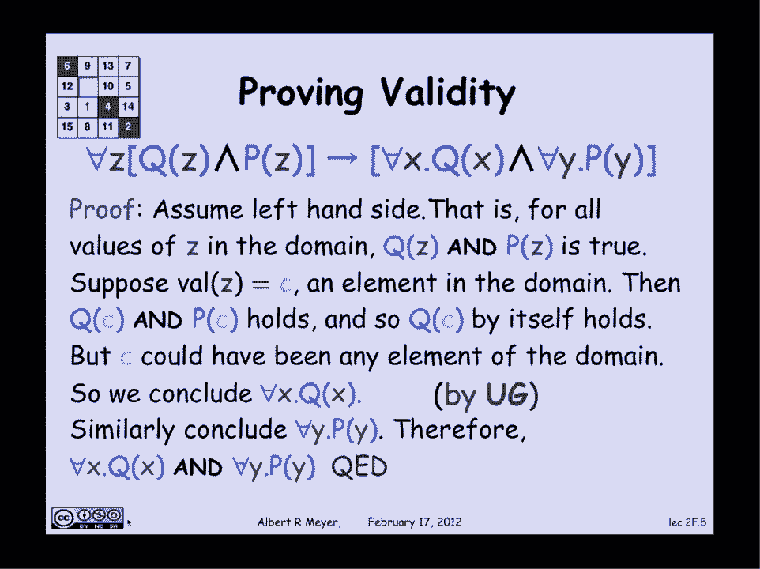
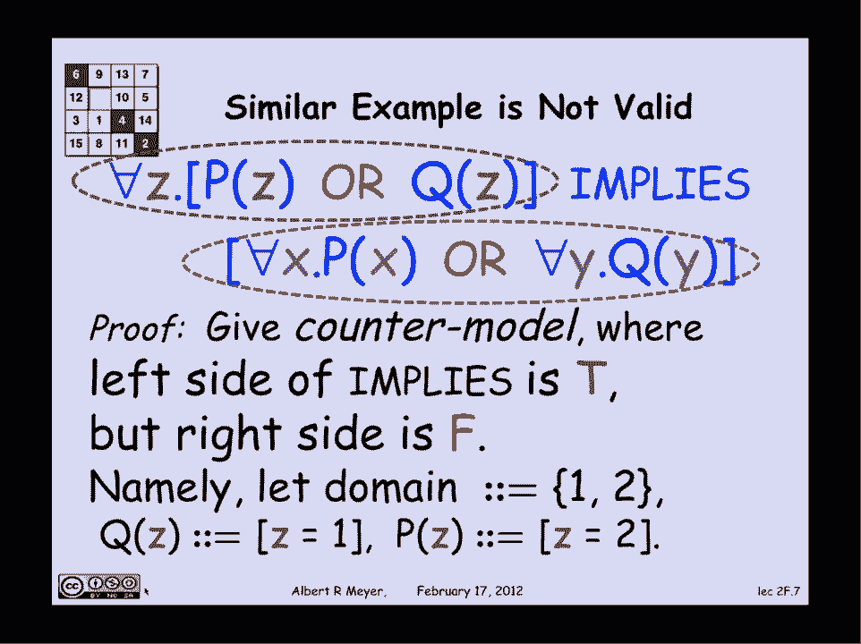
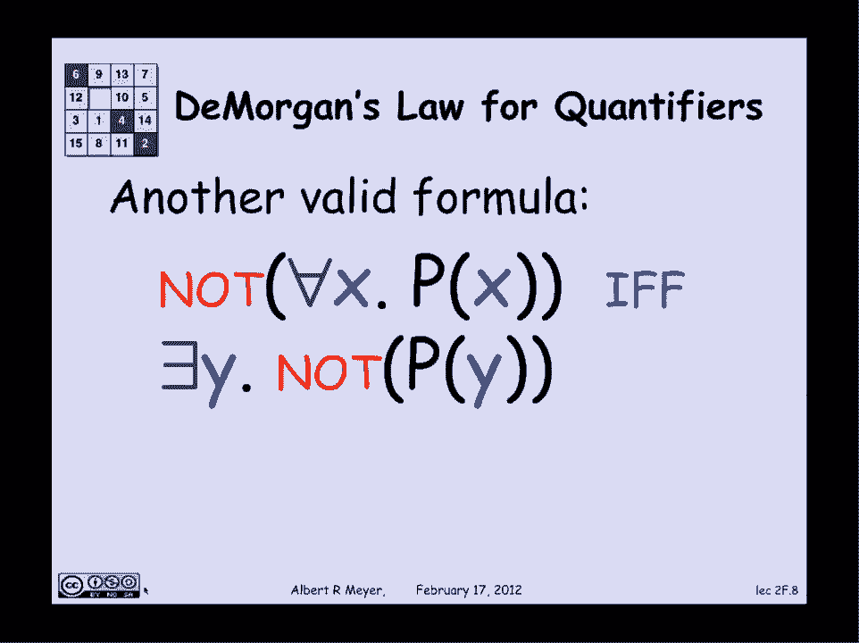

# 计算机科学的数学基础：P13：L1.5.2：谓词逻辑 2 🔍



在本节课中，我们将要学习谓词逻辑中的两个核心概念：**有效性**与**可满足性**。我们将通过具体的公式和例子，理解如何判断一个谓词逻辑公式是否总是为真，以及如何构造反例来证明其不总是为真。



---

## 有效性概念回顾 📚

上一节我们介绍了命题逻辑的有效性。现在，我们来看看它在谓词逻辑中的扩展。

在命题逻辑中，一个公式是**有效的**，当且仅当对于其变量的**所有**可能的真值赋值，该公式的结果都为真。例如，公式 `(p → q) ∨ (q → p)` 是有效的，因为无论 `p` 和 `q` 取真或假，整个公式始终为真。

在谓词逻辑中，情况更为复杂。一个谓词逻辑公式是**有效的**，当且仅当对于**所有**可能的话语领域（即变量取值的非空集合），以及对于公式中提到的**所有**谓词的所有可能解释，该公式都为真。换句话说，公式的真理性不依赖于特定的领域或谓词的具体含义。



以下是理解有效性的一个关键公式示例：
```
∀z (P(z) ∧ Q(z)) → (∀x P(x) ∧ ∀y Q(y))
```
这个公式是有效的。它陈述的是：如果领域中的每个元素 `z` 都同时满足性质 `P` 和 `Q`，那么自然可以推出“所有 `x` 都满足 `P`”并且“所有 `y` 都满足 `Q`”。这是一个逻辑事实，不依赖于 `P`、`Q` 的具体含义或领域的构成。



---

## 如何论证有效性？ 🛠️

本节中，我们来看看如何非正式地论证一个谓词公式的有效性。我们以上述公式为例。

论证策略是假设蕴含式（`→`）的左边为真，然后推导出右边也为真。
1.  **假设**：`∀z (P(z) ∧ Q(z))` 为真。这意味着对于领域中的任意元素 `c`，`P(c)` 和 `Q(c)` 都成立。
2.  **推导**：由于 `c` 是领域中任意选取的元素，且 `Q(c)` 成立，我们可以得出结论：`∀x Q(x)` 成立。同理，由 `P(c)` 成立可推出 `∀y P(y)` 成立。
3.  **结论**：因此，`(∀x P(x) ∧ ∀y Q(y))` 为真。由假设推导出结论，证明了整个蕴含式为真。

这个推导过程用到了一个基本的逻辑推理规则——**全称概括**：
```
如果证明了对于某个未做特殊假设的常量 `c` 有 `P(c)` 成立，那么可以推出 `∀x P(x)` 成立。
```
在逻辑符号中，这条规则常写作：
```
P(c)
------
∀x P(x)
```
（适用条件：`c` 不出现在关于 `P` 的其他未证假设中）

---

## 如何证明无效性？ ⚠️

理解了有效性后，我们来看看如何证明一个公式**不是**有效的，即它是**可满足的**但非永真。方法是构造一个**反例模型**。



考虑以下公式：
```
(∀z (P(z) ∨ Q(z))) → (∀x P(x) ∨ ∀y Q(y))
```
我们需要证明这个公式是无效的。为此，我们需要找到一个具体的领域和对谓词 `P`、`Q` 的解释，使得该蕴含式的**前件（左边）为真**，但**后件（右边）为假**。

以下是构造反例的步骤：
1.  **选择领域**：选择最简单的非空领域，例如只包含两个元素：`{1, 2}`。
2.  **解释谓词**：
    *   令 `P(z)` 表示 “`z = 2`”。
    *   令 `Q(z)` 表示 “`z = 1`”。
3.  **验证前件**：公式 `∀z (P(z) ∨ Q(z))` 意为“所有 `z` 要么等于2，要么等于1”。在领域 `{1, 2}` 中，这显然为真。
4.  **验证后件**：公式 `∀x P(x) ∨ ∀y Q(y)` 意为“所有 `x` 都等于2” 或者 “所有 `y` 都等于1”。
    *   `∀x P(x)` 是假的，因为 `1` 不等于 `2`。
    *   `∀y Q(y)` 是假的，因为 `2` 不等于 `1`。
    *   因此，整个析取式为假。
5.  **得出结论**：在这个模型中，蕴含式前真后假，所以整个公式为假。这证明了该公式**不是有效的**。

---

## 量词与德摩根定律 ⚖️

最后，我们来看一个在谓词逻辑中同样重要的有效公式，它是命题逻辑中德摩根定律的推广。

在命题逻辑中，德摩根定律为：
```
¬(p ∧ q) ≡ (¬p ∨ ¬q)
¬(p ∨ q) ≡ (¬p ∧ ¬q)
```
在谓词逻辑中，全称量词（`∀`）和存在量词（`∃`）之间也存在类似的关系。一个重要的有效公式是：
```
¬∀x P(x) ≡ ∃x ¬P(x)
```
这个公式可以理解为：“并非所有东西都有性质 `P`” 等价于 “存在某个东西没有性质 `P`”。这直观上很好理解，也是进行逻辑推理和公式变换时的一个有力工具。

---



## 总结 📝

本节课中我们一起学习了谓词逻辑的核心概念：
1.  **有效性**：一个公式对所有可能的领域和谓词解释都为真。我们通过逻辑推导来论证有效性。
2.  **无效性**：一个公式并非总是为真。我们通过构造具体的反例模型（指定领域和谓词含义）来证明其无效性。
3.  **关键规则**：我们接触了**全称概括**规则，并看到了**德摩根定律**在量词上的表现形式。



理解有效性与可满足性是分析逻辑语句、进行严谨数学证明的基础。通过具体的例子和构造练习，我们可以更好地掌握这些抽象概念。