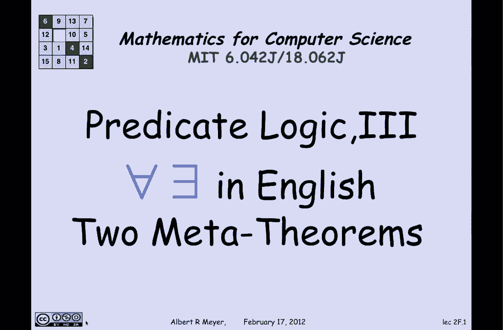
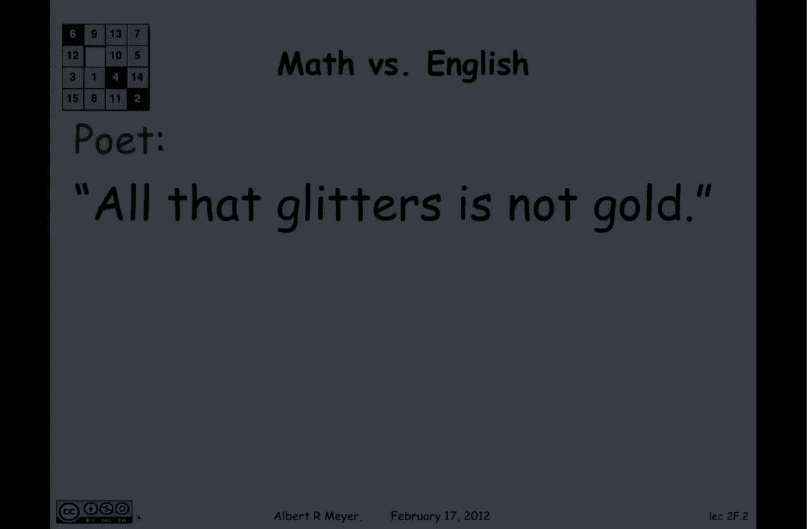
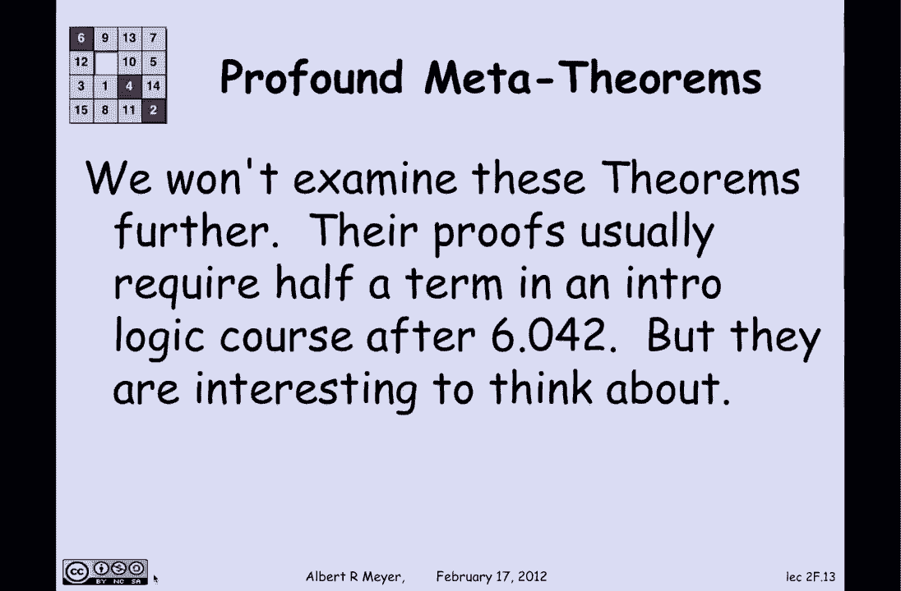

# 计算机科学的数学基础：P14：谓词逻辑 3

在本节课中，我们将要学习谓词逻辑的最后两个议题。首先，我们会探讨将全称量词和存在量词从英语翻译成逻辑时可能遇到的一些问题。英语本身具有模糊性，我们将通过两个有趣的例子来说明翻译并非总是机械的。其次，我们将简要介绍元数学领域中的两个重要定理，它们描述了谓词演算的性质与极限。这部分内容是选学的，但有助于你理解逻辑系统的能力与边界。

## 英语翻译中的歧义问题

上一节我们介绍了谓词逻辑的基本翻译。本节中我们来看看从英语翻译到逻辑表达式时可能遇到的陷阱。英语的表述有时并不直接对应逻辑量词的顺序，需要我们根据语境理解其真实含义。

以下是两个需要仔细处理的英语句子翻译示例。

*   **“All that glitters is not gold.”**
    *   **字面翻译**：∀x (G(x) → ¬Au(x))。这个翻译是错误的，因为它声称所有发光的东西都不是金子，这显然不符合事实（因为金子本身就会发光）。
    *   **正确理解**：诗人实际想表达的是“并非所有发光的东西都是金子”。因此，正确的逻辑翻译应为：¬∀x (G(x) → Au(x))。这个例子说明，不能仅凭字面顺序进行翻译，而需理解句子的深层含义。

*   **“There is a season to every purpose under heaven.”**
    *   **字面翻译**：∃s ∀p (SeasonFor(s, p))。这个翻译意味着存在一个季节（例如夏天）适用于所有目的，这显然不合理（夏天不适合铲雪）。
    *   **正确理解**：这句话的实际含义是“对于每一个目的，都存在一个适合的季节”。因此，量词的顺序需要调换，正确的逻辑翻译应为：∀p ∃s (SeasonFor(s, p))。这个例子再次表明，英语表述中的量词顺序可能与逻辑上应有的顺序相反。

## 关于谓词演算的元定理

在探讨了翻译的复杂性之后，我们现在转向一个更理论化的话题，看看关于谓词逻辑系统本身有哪些深刻的数学结论。这些定理属于“元数学”的范畴，即研究数学本身（特别是数学逻辑）的数学。

以下是两个基础且重要的元定理。

*   **哥德尔完备性定理**
    *   这是一个“好消息”定理。它指出，**仅使用少数几条公理和推理规则（例如假言推理和全称推广），理论上就足以证明所有在谓词逻辑中有效的陈述**。这意味着，任何逻辑上为真的命题，都可以从这个简单的系统中推导出来。尽管在实际的自动定理证明中需要更复杂的系统，但该定理在理论上具有重要意义。

*   **丘奇-图灵不可判定性定理**
    *   这是一个“坏消息”定理。它指出，**不存在一个通用的算法（或计算机程序），能够判定任意一个给定的谓词逻辑公式是否有效（永真）**。这与命题逻辑不同，命题逻辑公式可以通过真值表（至少在理论上）进行判定。谓词逻辑的“不可判定性”意味着，我们无法编写一个总能给出“是”或“否”答案的程序来解决所有谓词公式的有效性问题。

---

本节课中我们一起学习了谓词逻辑的最后两部分内容。我们首先通过两个例子，认识到将英语翻译成逻辑表达式时，必须超越字面意思，理解量词的真实逻辑顺序。随后，我们简要了解了关于谓词演算系统的两个元定理：哥德尔完备性定理揭示了系统在证明能力上的完整性，而丘奇-图灵不可判定性定理则指出了该系统在自动判定问题上的根本限制。