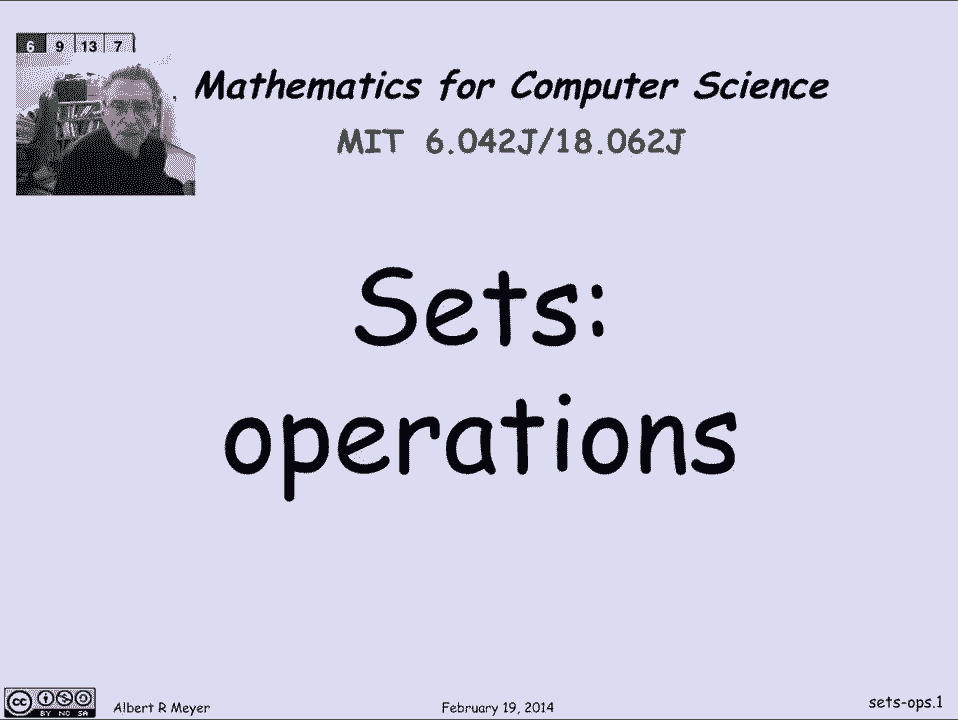
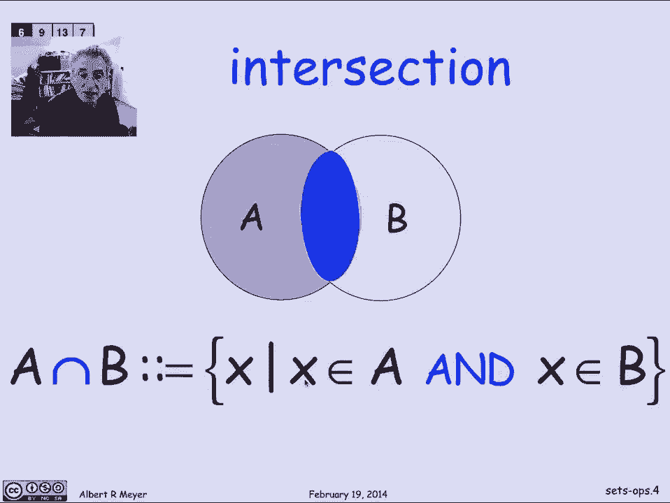
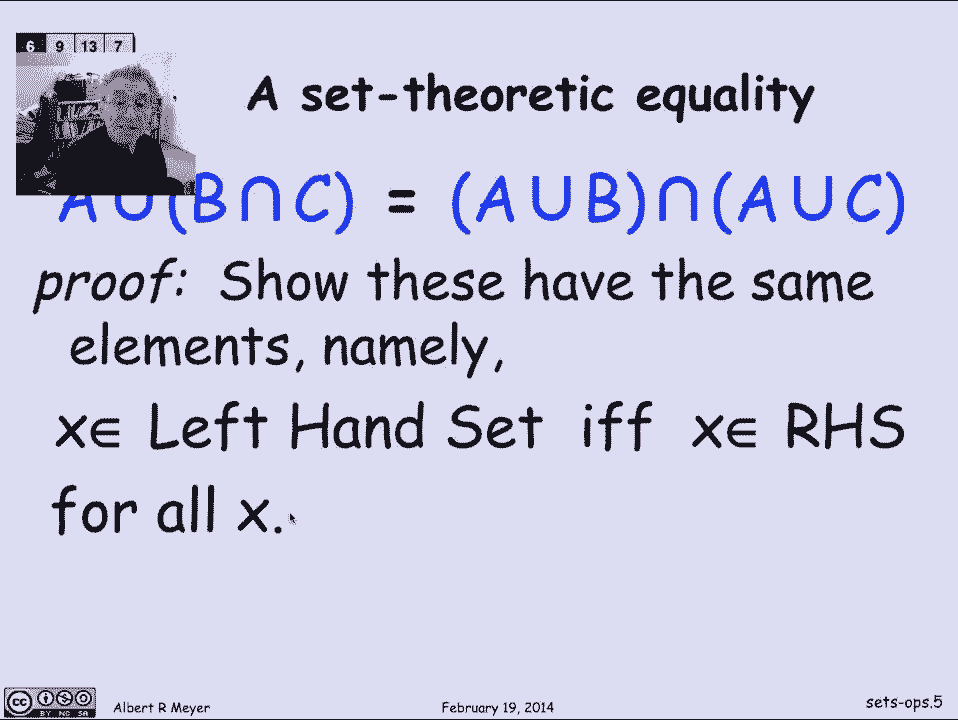
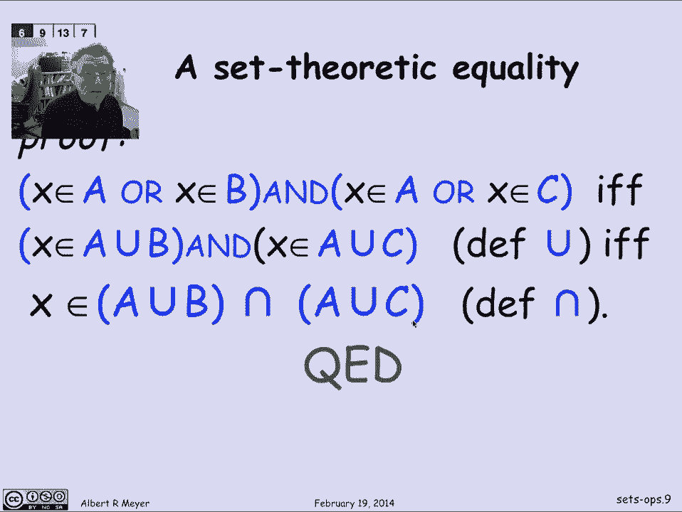
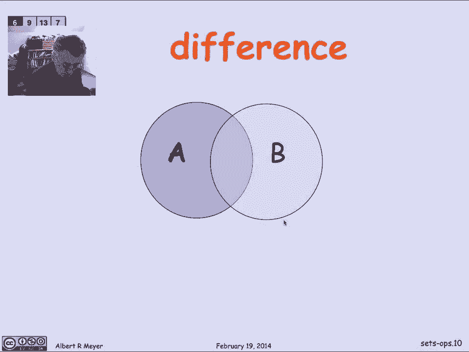
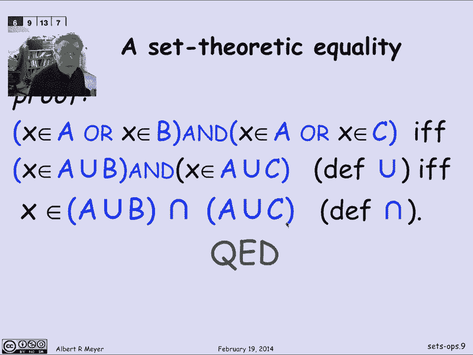
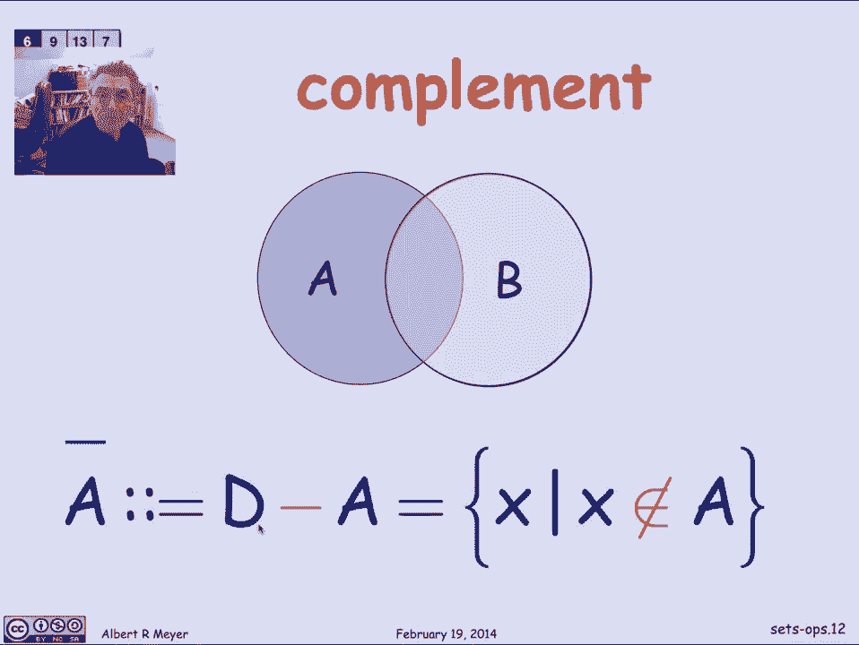
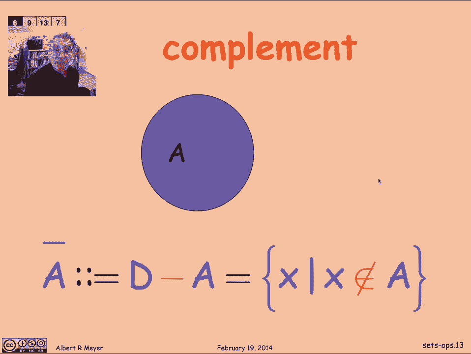

# 计算机科学的数学基础：L1.6.2：集合运算

在本节课中，我们将要学习集合的基本运算，包括并集、交集、差集和补集。我们将通过直观的韦恩图来理解这些概念，并学习如何利用命题逻辑来证明集合恒等式。

## 集合运算的定义

让我们定义几个熟悉且标准的集合运算。下图展示了两个集合A和B。圆圈代表集合A中的点，另一个圆圈代表集合B中的点。透镜形状的重叠区域是同时属于A和B的点，而背景区域则是属于A或B的点。这是一种通用图示，可以帮助你根据A和B对点进行分类，它被称为韦恩图。对于两个集合的情况，它非常有用；对于三个集合，情况会变得更复杂；对于四个及以上的集合，韦恩图就不那么实用了。但许多基本运算可以通过两个集合的韦恩图很好地说明，这正是我们接下来要做的。

### 并集

第一个运算是**并集**。图中洋红色区域所示的点集，就是属于A或属于B的所有点的集合。

如果我们用集合论符号或谓词表示法来定义，并集符号`U`代表并集运算。因此，`A ∪ B`被定义为那些属于A**或**属于B的点X的集合。

你已经开始看到并集运算与命题逻辑中的“或”连接词之间的紧密联系。但请不要混淆它们。如果你对集合使用“或”，编译器会报类型错误；如果你对命题变量使用并集，编译器同样会报类型错误。因此，尽管它们看起来很相似，但请将命题运算符和集合论运算符视为截然不同的概念。

### 交集

下一个基本运算是**交集**。它指的是同时属于A和B的点，即两个集合共有的点，图中用蓝色高亮显示。

`A ∩ B`的定义使用了一个倒置的并集符号来表示交集。它是那些既属于A**又**属于B的点的集合。

## 利用命题逻辑证明集合恒等式

让我们暂停一下，利用集合论运算与命题运算符之间的相似性。

让我们看一个集合论恒等式。我断言，无论你谈论的是哪三个集合A、B和C，这个恒等式都成立。我们将通过建立集合论运算与命题运算之间的联系来证明它。

这个恒等式说的是：`A ∪ (B ∩ C)` 等于 `(A ∪ B) ∩ (A ∪ C)`。现在，我们先不深入思考如何给出一个直观的论证，稍后我们会用一种自动化的方式推导出来。但我们可以这样记忆：并集对交集满足**分配律**。如果你把并集想象成乘法，交集想象成加法，那么我们得到的规则就是 `A × (B + C) = (A × B) + (A × C)`。

同样地，如果你交换并集和交集的角色，会得到另一个分配律：交集对并集也满足分配律。不过，我们暂且只看这一个。我们试图证明并集对交集的分配律。我们该如何仅从定义出发来证明它呢？

我们将通过证明等式左右两边的集合包含完全相同的元素来完成。也就是说，如果一个元素X出现在左边描述的集合中，那么它也一定出现在右边的集合中，反之亦然。这表明左右两边的表达式定义了具有相同点集的集合。这个证明将利用我们之前讲座中证明过的一个命题等价式，即“或”对“与”的分配律：`P ∨ (Q ∧ R)` 等价于 `(P ∨ Q) ∧ (P ∨ R)`。

你可以看到，这个紫色的命题等价式与蓝色的集合论等式具有相同的结构，只是并集被替换为“或”，交集被替换为“与”，集合变量A、B、C被替换为命题变量P、Q、R。请记住，我们已经证明了这个命题等价式，我们将在证明这两个集合相等的过程中用到它。

我们说过，通过证明两个集合包含相同的点来证明它们相等。以下是证明过程，它将是一个贯穿始终的“当且仅当”论证。

观察左边：一个点X属于 `A ∪ (B ∩ C)`，根据并集的定义，**当且仅当** X属于A **或** X属于 `B ∩ C`。这里我只是应用了并集的定义。

现在，看表达式 `X ∈ B ∩ C`，这等价于 `X ∈ B` **且** `X ∈ C`，这里应用了交集的定义。

现在我得到了一个包含“或”和“与”的命题公式，以及关于X是否属于A、B、C的基本断言。此时，我可以立即应用我的命题等价式，断言 `X ∈ A ∨ (X ∈ B ∧ X ∈ C)` 成立，**当且仅当** `(X ∈ A ∨ X ∈ B) ∧ (X ∈ A ∨ X ∈ C)` 成立。

为什么？因为我只是调用了命题等价式。让我们这样看：如果我把 `X ∈ A` 看作命题P，把所有 `X ∈ A` 替换为P；把 `X ∈ B` 看作Q；把 `X ∈ C` 看作R。那么我可以看到，第一个集合论断言具有 `P ∨ (Q ∧ R)` 的形式，并且我可以根据命题等价式将其转换为 `(P ∨ Q) ∧ (P ∨ R)`，然后记住P、Q、R代表什么，就能回到集合论的基本成员关系断言。

现在，我们刚刚证明了 `(X ∈ A ∨ X ∈ B) ∧ (X ∈ A ∨ X ∈ C)`。而这**当且仅当**（就像我们在左边所做的那样）X属于 `A ∪ B`，同样地，这里X属于 `A ∪ C`。然后，`X` 属于这个集合**且**属于那个集合，等价于说X属于它们的交集。至此，我已经完成了证明：一个点属于左边集合，当且仅当它属于右边集合。请记住，那正是恒等式的右边。

这实际上是一个通用方法：任何涉及并集、交集以及我们稍后将讨论的差集和补集运算的集合论等式，都可以转换为命题等式或命题等价式。我们可以检查该命题断言是否是一个等价式，并通过将集合表达式中的成员关系语句转换为命题组合，来自动验证任何涉及并集、交集的集合论恒等式。事实上，像Mathematica这样的自动引擎正是通过这种方式来证明集合论恒等式的。

## 差集与补集

最后，为了记录完整，我们列出最后一个运算：**差集**运算。差集是指属于A但不属于B的元素集合。

我们将其写作 `A - B`，它是那些属于A**且**不属于B的点的集合，图中用橙色高亮区域表示。

差集运算的一个特例是**补集**。当你知道所有集合都从属于某个整体论域时，你可以定义补集为所有不在A中的东西的集合。即集合 `{X | X ∉ A}`，其中X被理解为在某个论域内取值。如果要用图表示，我们会看整个橙色区域，即所有不在A中的部分，如果我们把整个幻灯片看作代表论域的话。

## 总结

本节课中，我们一起学习了集合的四种基本运算：并集、交集、差集和补集。我们通过韦恩图直观地理解了它们的含义，并掌握了利用命题逻辑的等价关系来证明集合恒等式的重要方法。理解这些运算及其关系是深入学习集合论和计算机科学数学基础的关键一步。