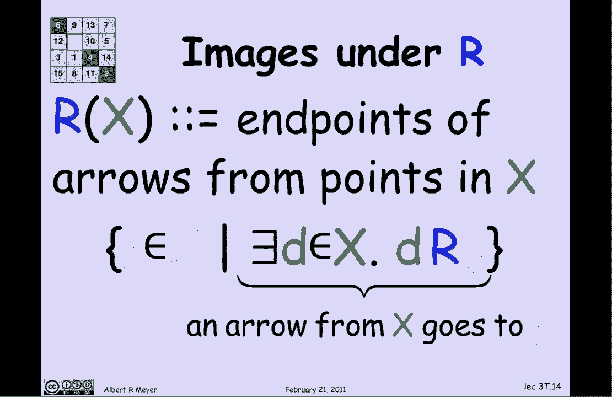
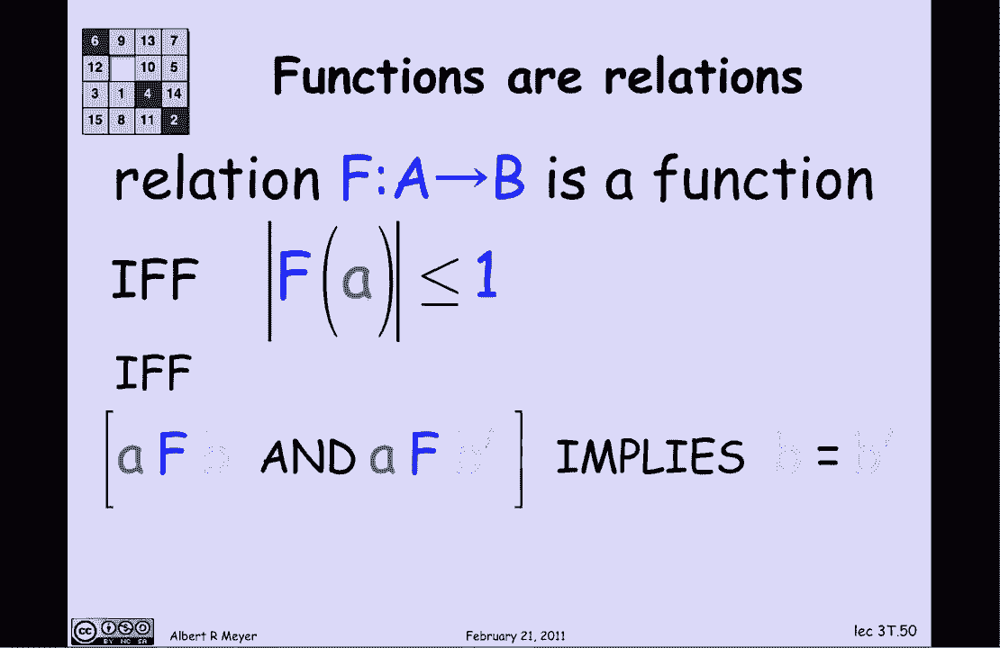

# 计算机科学的数学基础：L1.7.1：关系 🔗

在本节课中，我们将学习数学中的一个基本概念：**关系**。关系是比集合更进一步的数学抽象，它在计算机科学（如数据库）和数学的许多领域（如等价关系、偏序）中都有广泛应用。我们将从直观的例子入手，逐步建立关系的正式定义，并学习如何操作和组合关系。

## 什么是二元关系？

在微积分中，你见过很多函数，如三角函数、有理函数、指数函数和对数函数。本节我们将从更一般的角度讨论函数，并将其视为**二元关系**的一个特例。

一个**二元关系**是一个数学对象，它将一个称为**定义域**的集合中的元素，与另一个称为**陪域**的集合中的元素关联起来。关系是继集合之后最基本、最重要的数学抽象之一。

## 关系的例子：注册关系

让我们看一个贴近生活的例子：“注册”关系。这个关系关联着学生（定义域）和课程（陪域）。

*   **定义域 (D)**: 学生集合 {Jason, Joan, Eva, Adam}
*   **陪域 (J)**: 课程集合 {6.042, 6.001, 6.003, 6.004}
*   **关系 (R)**: “注册”关系，用箭头表示。例如，箭头从 Jason 指向 6.042，表示 Jason 注册了 6.042 这门课。

### 关系的表示方法

有多种方式表示一个关系：
*   **中缀表示法**: `Jason R 6.042`
*   **前缀表示法**: `R(Jason, 6.042)`
*   **有序对表示法**: 关系 `R` 可以看作是一组有序对的集合，例如 `(Jason, 6.042)` 是 `R` 的一个元素。这组有序对的集合称为关系的**图**。

## 关系的像

关系的一个核心概念是**像**。你可以把关系看作一个“操作符”，作用于定义域中的元素（或元素集合）。

*   **单个元素的像**: `R(Jason)` 表示 Jason 注册的所有课程。根据上图，`R(Jason) = {6.042, 6.001}`。
*   **集合的像**: 如果 `X` 是学生的一个子集，那么 `R(X)` 表示 `X` 中**任何**学生所注册的所有课程的集合。

例如，`R({Jason, Eva})` 就是 Jason 或 Eva 注册的课程。从图中看，Jason 注册了 {6.042, 6.001}，Eva 注册了 {6.001, 6.004}。因此，`R({Jason, Eva}) = {6.042, 6.001, 6.004}`。

### 像的正式定义

用集合论的语言可以更精确地定义像：
`R(X) = { j ∈ J | ∃ d ∈ X, d R j }`
这个公式的意思是：`R(X)` 是所有满足以下条件的课程 `j` 的集合：**存在**某个学生 `d` 属于集合 `X`，并且 `d` 与 `j` 有关系 `R`（即 `d` 注册了 `j`）。

## 关系的逆

我们可以对关系进行一种操作，得到它的**逆关系**，记作 `R⁻¹`。逆关系就是将原关系的箭头方向全部反转。

对于“注册”关系 `R`，其逆关系 `R⁻¹` 可以理解为“被...注册”关系。例如，如果 `Jason R 6.042`（Jason注册了6.042），那么就有 `6.042 R⁻¹ Jason`（6.042被Jason注册）。

### 逆像

利用逆关系，我们可以定义**逆像**。`R⁻¹(Y)` 表示所有注册了集合 `Y` 中**任何**一门课程的学生。

例如：
*   `R⁻¹({6.001}) = {Jason, Eva}` （注册了6.001的学生）
*   `R⁻¹({6.003, 6.001}) = {Jason, Joan, Eva}` （注册了6.003或6.001的学生）

逆像可以用来简洁地表达关于数据库的断言。例如，语句“所有学生都至少注册了一门课”可以写成：
`D ⊆ R⁻¹(J)`
其中 `D` 是所有学生的集合，`J` 是所有课程的集合。这个包含关系断言：每个学生（`D` 中的元素）都至少与一门课程（`J` 中的某个元素）通过 `R` 相关联，因此也就在 `R⁻¹(J)` 中。

## 关系的复合

关系可以像函数一样进行**复合**。假设我们有两个关系：
*   `V`: “指导”关系，从教授关联到学生（教授 `P` 指导学生 `D`）。
*   `R`: “注册”关系，从学生关联到课程（学生 `D` 注册课程 `J`）。

那么，复合关系 `R ∘ V` 表示“有指导关系”后接“有注册关系”。它从教授关联到课程，其含义是：**教授 `P` 指导的某位学生注册了课程 `J`**。

### 复合关系的计算与定义

计算 `(R ∘ V)({FTL, TLF})` 的步骤：
1.  先计算 `V({FTL, TLF})`，得到这两位教授指导的所有学生，假设是 {Joan, Eva, Adam}。
2.  再计算 `R({Joan, Eva, Adam})`，得到这些学生注册的所有课程，例如 {6.003, 6.001, 6.004}。

因此，`(R ∘ V)({FTL, TLF}) = {6.003, 6.001, 6.004}`。

复合关系的正式定义是：
`P (R ∘ V) J ⇔ ∃ d, (P V d) ∧ (d R J)`
这个公式的意思是：教授 `P` 与课程 `J` 具有 `R ∘ V` 关系，当且仅当**存在**一个学生 `d`，使得 `P` 指导 `d`，并且 `d` 注册了 `J`。

## 关系的集合运算与断言

关系本身是有序对的集合，因此可以对它们进行集合运算（如交集、并集、补集）。这让我们能够简洁地表达复杂的规则或查询。

假设我们还有另一个关系：
*   `T`: “授课”关系，从教授关联到课程（教授 `P` 教授课程 `J`）。

现在，我们想表达一条规则：“教授不应教授自己指导的学生的课程”。用逻辑语言描述是：对于任何教授 `P` 和课程 `J`，不能同时有 `P (R ∘ V) J`（P有学生注册J）和 `P T J`（P教授J）。

利用集合运算，这个规则可以极其简洁地表达为：
`T ∩ (R ∘ V) = ∅`
即，“授课”关系 `T` 与“指导学生的注册”关系 `R ∘ V` 没有共同的有序对。等价地，也可以写成：
`(R ∘ V) ⊆ ¬T`
即，`R ∘ V` 关系中的所有配对，都不在 `T` 关系中。

## 关系的正式定义与函数

现在，让我们更正式地定义二元关系。一个从集合 `A` 到集合 `B` 的二元关系 `R`，包含三部分：
1.  定义域 `A`
2.  陪域 `B`
3.  一个由有序对 `(a, b)` 组成的集合，其中 `a ∈ A`, `b ∈ B`。这个集合称为关系的**图**，它精确描述了哪些元素被关联起来。

*   **值域**: 关系 `R` 的**值域**是指陪域 `B` 中**实际**被 `A` 中元素关联到的那些元素组成的集合，即 `R(A)`。值域通常是陪域的一个子集。

### 函数是特殊的关系

**函数**是一种特殊的二元关系，它要求定义域中的**每个**元素，最多与陪域中的一个元素相关联。
*   用像的语言描述：对于所有 `a ∈ A`，`f(a)` 这个集合的大小 **≤ 1**。
*   用关系的语言描述：如果 `a f b` 且 `a f b‘`，那么必然有 `b = b’`。

换句话说，在函数的关系图中，定义域每个点发出的箭头数不能超过一个（可以为0，即未定义）。这使得每个输入值都对应**唯一确定**的输出值（如果存在的话）。

## 总结

本节课我们一起学习了二元关系这一核心数学概念。
*   我们首先通过“注册”的例子直观理解了关系如何关联两个集合的元素。
*   然后学习了关系的**像**和**逆像**，它们用于描述关系如何作用于元素或集合。
*   接着，我们探讨了关系的**复合**操作，它允许我们将多个关系链式组合。
*   我们还看到，关系作为集合，可以进行交集等运算，从而简洁地表达复杂的逻辑断言。
*   最后，我们给出了关系的正式集合论定义，并明确了**函数**是“每个输入至多有一个输出”的特殊关系。

理解关系是学习后续更复杂的数学结构（如等价关系、偏序）以及数据库理论的重要基础。