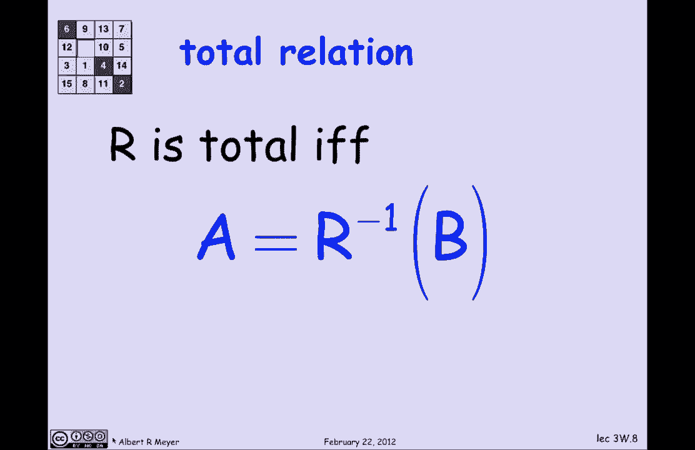
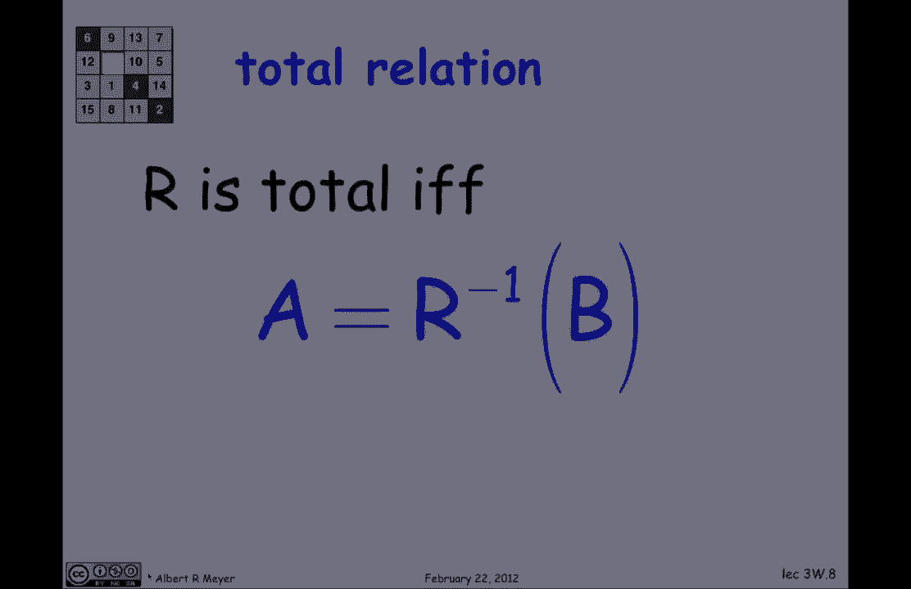
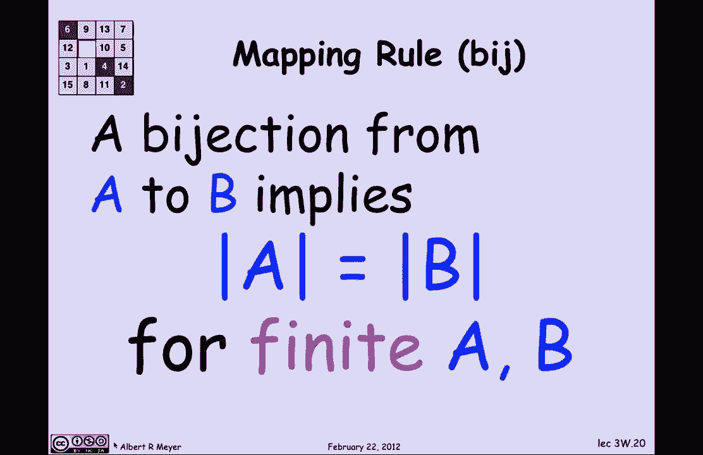

**MIT 6.042J：P18：L1.7.3- 关系映射属性**

在本节短片中，我们将讨论一些关系属性，这些属性被称为映射属性，也可称为关系的“箭头”属性。本节内容主要是词汇介绍，包含该领域标准且学习离散数学必须了解的六七个概念。这些概念的应用将在下一节短片开始，届时我们将把这些属性应用于计数问题，尽管本节末尾也会有一个关于计数的关键结论。

现在，让我们继续。请记住，一个二元关系由三部分组成：一个定义域（图中用A表示）、一个陪域（图中用B表示）以及定义域元素与陪域元素之间的关联关系，由箭头表示，这些箭头被称为关系的图。

我们已经观察过箭头的一个方面，即函数的概念可以通过“每个定义域元素最多只有一个箭头射出”来描述。这意味着从一个定义域点出发的箭头有唯一确定的另一端，称为该点在该关系下的值，这实际上就是一个函数f。例如，f(绿色) = 品红色，表示有一个箭头从绿色元素射出。

但在本图中，并非每个定义域元素（并非每个绿点）都有箭头射出，这是典型情况。因此，这将是一个部分函数的示例，其中f(绿色元素)并不总是有定义（如果没有箭头射出）。

关系的一般概念延续了这个函数思想。基本上，我们将根据定义域元素射出的箭头数量对关系进行分类，主要有三类：每个定义域元素最多射出一个箭头的关系、每个定义域元素恰好射出一个箭头的关系，以及每个定义域元素至少射出一个箭头的关系。

对称地，我们也将以同样的方式根据陪域元素射入的箭头数量对关系进行分类：每个陪域元素至少有一个箭头射入、恰好有一个箭头射入，或最多有一个箭头射入。这些分类的各种组合有标准的名称，事实证明你需要了解它们。接下来我们将逐一介绍。

**全关系**

全关系意味着每个定义域元素至少有一个箭头射出。观察此图，它目前还不是全关系，因为有两个绿色定义域元素没有箭头射出（已用红色高亮显示）。我们可以通过移除它们来修正。现在，我们得到了一个全关系：每个定义域元素至少有一个箭头射出。

另一种表述“全”的方式是：如果你观察陪域的逆像，它等于整个定义域。这意味着，如果你取出所有从定义域射出的箭头，将它们反转方向，然后观察所有有箭头指向的元素，结果就是整个定义域。用关系运算符和集合来表示就是：关系R是**全的**，当且仅当 `R^{-1}(B) = A`。

**全函数**

全函数意味着每个定义域元素恰好有一个箭头射出。这可能是函数中最常见的情况，许多领域直接假设函数是全的。但事实是，函数常常不是全的，而人们对此并不总是很仔细。

让我们看一个类似微积分的例子。这里有一个函数G，它取一对实数并返回一个实数，将实数平面映射到实数线。其定义是 `G(x, y) = 1 / (x - y)`。

现在，这个函数G的定义域实际上是所有实数对（这就是“从R×R（简写为R²）到陪域R”的含义），陪域是所有实数的集合。但这个G显然不是全函数，因为1/0无定义，这意味着在45度线上，G无定义。因此，G实际上不是一个全函数，尽管它很常见，而你通常不会担心部分函数，所以你可能不会注意到它是部分的，因为你不习惯关注这一点。

让我们看一个稍作修改的版本。这是函数G₀，它从一个稍后指定的未指定定义域映射到实数。它具有完全相同的公式 `G₀(x, y) = 1 / (x - y)`。但现在我要告诉你，定义域不再是所有实数，而是去掉了那条45度线的实数集。我想去掉那些坏点，不再担心它们。一旦我这样做，我就得到了两个具有相同图但不同定义域的关系。结果是，我从G的定义域中移除了所有坏点，剩下的是一个全函数G₀。

**满射**

满射是一种关系，其中陪域B中的每个点至少有一个箭头射入。同样，在这张图中，这一点并不完全成立，因为至少有一个坏点（用红色标出）没有箭头射入。让我们再次通过移除它来修正。现在我得到了一个满射关系或满射，因为实际上陪域B中的每个元素都至少有一个箭头射入，每个元素都是某个箭头的终点。

同样，我们可以用集合运算来表示：关系R是**满射**，当且仅当定义域A的像等于陪域B，即 `R(A) = B`。另一种说法是，当且仅当函数的值域等于其整个陪域。请记住，值域是被映射到的点的集合，即R(A)。它并不总是等于陪域，但当它等于时，就构成了满射。

**单射**

单射是关系的另一种变体，它要求陪域中的每个元素最多有一个箭头射入。观察此图，它目前还不是单射，因为这里至少有两个点有超过一个箭头射入，这使它无法成为单射。让我们通过删除几条造成拥挤的边来修正。现在我得到了一种情况，实际上B中的每个元素最多只有一个箭头射入，因此我向你展示了一个单射的图示。

**双射**

最后一个概念是当你拥有所有良好属性时：双射要求每个定义域元素恰好有一个箭头射出，且每个陪域元素恰好有一个箭头射入。它是一个既是单射又是满射的全函数，因为它对定义域和陪域都满足“至少一个”、“至多一个”且最终“恰好一个”的条件。

关于双射，有一个显而易见的结论，我们将以此结束本节，这也是它们在计数理论中有用的原因。因为很明显，既然A中每个元素恰好射出一个箭头，那么箭头的数量就等于A的大小。同样，既然B中每个元素恰好有一个箭头射入，那么箭头的数量就等于B的大小。这意味着，当存在一个双射时，两个集合的大小相等。如果两个有限集合A和B之间存在一个双射，那么 `|A| = |B|`。

**总结**

在本节中，我们一起学习了关系的几种关键映射属性：全关系、全函数、满射、单射和双射。我们了解了如何根据定义域元素射出箭头和陪域元素射入箭头的数量来定义和区分这些属性。最后，我们看到了双射在计数中的一个基本应用：两个集合间若存在双射，则它们的大小相等。下一节我们将开始应用这些属性进行具体的计数分析。