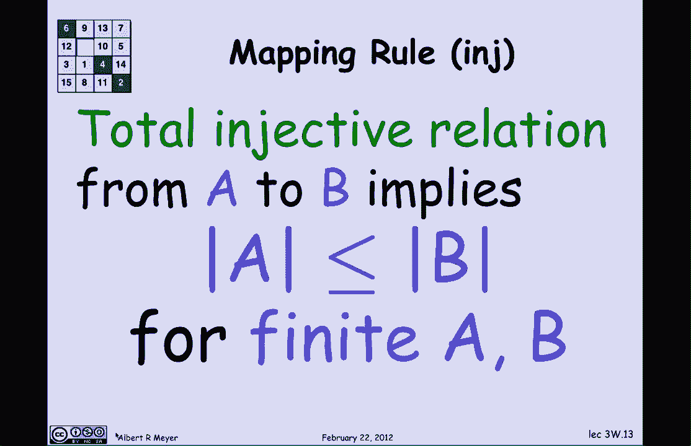
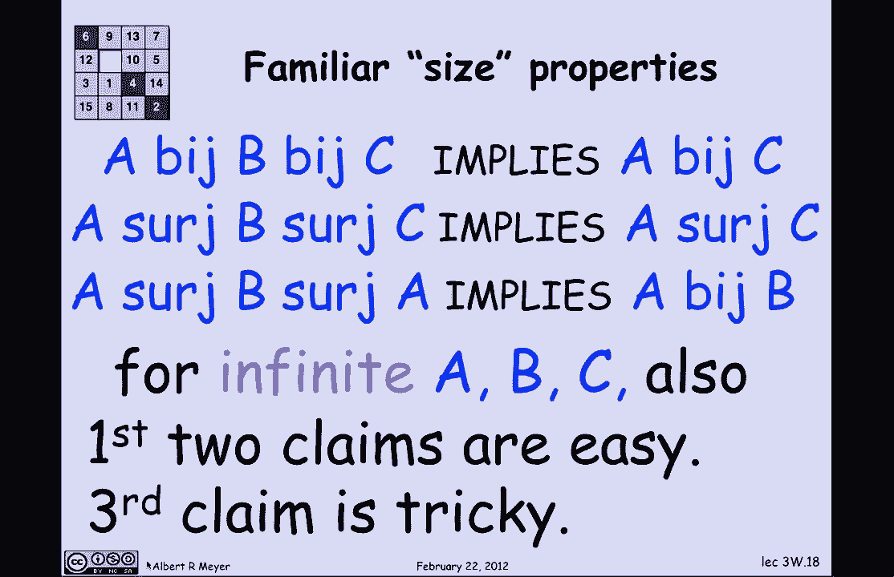

# 计算机科学的数学基础：P19：L1.7.5- 有限集合的基数 📊

在本节课中，我们将学习如何将集合之间的映射性质与计数性质联系起来。我们将从双射的基本概念出发，探讨如何利用映射来证明集合的大小关系，并最终得出一些重要的计数规则。

---

## 映射与计数

上一节我们介绍了双射、满射和单射的概念。本节中，我们来看看这些映射如何帮助我们确定有限集合的大小。

首先，我们重申一个基本观点：如果存在从一个有限集合 **A** 到另一个有限集合 **B** 的双射，那么 **A** 和 **B** 的大小相同。我们用 `|A|` 表示集合 **A** 的大小（即元素个数）。

---

## 幂集大小的计算

让我们立即应用双射的思想来解决一个具体问题：如何计算一个有限集合的幂集（所有子集的集合）的大小？

假设我们不知道答案。我们要求的是 **A** 的幂集 `P(A)` 的大小。例如，如果集合 **A** 有三个元素 `{a, b, c}`，那么它的幂集包含：
*   1个空子集
*   3个单元素子集：`{a}`, `{b}`, `{c}`
*   3个双元素子集：`{a, b}`, `{a, c}`, `{b, c}`
*   1个三元素子集：`{a, b, c}`
总计 8 个子集。

现在，让我们进行一般性的论证。假设集合 **A** 有 `n` 个元素，我们将其编号为 `a₀, a₁, ..., aₙ₋₁`。考虑 **A** 的任意一个子集 **S**。

我们可以为这个子集 **S** 构造一个长度为 `n` 的二进制位串（比特串）。构造规则如下：
*   如果元素 `aₖ` 在子集 **S** 中，则位串的第 `k` 位为 `1`。
*   如果元素 `aₖ` 不在子集 **S** 中，则位串的第 `k` 位为 `0`。

**公式**：`位串的第k位 = 1 当且仅当 aₖ ∈ S`

这个规则清晰地定义了子集与位串之间的一个双射：
*   给定一个子集，我们可以唯一地确定一个位串。
*   给定一个位串，我们可以唯一地确定一个子集。

因此，根据双射定理，`n` 位二进制串的数量等于幂集 `P(A)` 的大小。每个计算机科学家都知道，长度为 `n` 的二进制串总共有 `2ⁿ` 个。

由此我们得到了著名的公式：
**公式**：`|P(A)| = 2^{|A|}`

---

## 更多计数规则：映射引理

除了双射规则，我们还可以根据映射是满射或单射来推导集合大小之间的不等式关系。

以下是基于映射性质的计数规则：

**满射规则**：如果存在从集合 **A** 到集合 **B** 的满射函数，那么对于有限集合 **A** 和 **B**，有 `|A| ≥ |B|`。
*   **推理**：满射要求 **B** 中每个元素至少有一个箭头射入，所以箭头总数至少为 `|B|`。函数要求每个 **A** 中元素至多射出一个箭头，所以箭头总数至多为 `|A|`。因此 `|A| ≥ 箭头数 ≥ |B|`。

**单射规则**：如果存在从集合 **A** 到集合 **B** 的全单射关系（或函数），那么对于有限集合 **A** 和 **B**，有 `|A| ≤ |B|`。
*   **推理**：单射要求 **B** 中每个元素至多有一个箭头射入，所以箭头总数至多为 `|B|`。全关系要求每个 **A** 中元素至少射出一个箭头，所以箭头总数至少为 `|A|`。因此 `|A| ≤ 箭头数 ≤ |B|`。

---

## 关系的定义与映射引理

我们可以定义三种表示集合间大小比较的二元关系：

1.  **A bij B**：表示存在从 **A** 到 **B** 的双射。
2.  **A surj B**：表示存在从 **A** 到 **B** 的满射函数。
3.  **A inj B**：表示存在从 **A** 到 **B** 的全单射关系。

根据我们刚才的论证，对于有限集合，这些关系等价于集合大小的比较：
*   `A bij B` 当且仅当 `|A| = |B|`
*   `A surj B` 当且仅当 `|A| ≥ |B|`
*   `A inj B` 当且仅当 `|A| ≤ |B|`

这个结论被称为**映射引理**。它将抽象的映射存在性问题，转化为了具体的集合大小比较问题。

---

## 从有限到无限的思考

映射引理是针对有限集合证明的。对于无限集合，“大小”的概念变得复杂。然而，我们可以探究这些关系本身的性质是否在无限集合中依然成立。

以下是三个基于关系传递性的命题：
1.  如果 `A bij B` 且 `B bij C`，那么 `A bij C`。（双射的复合仍是双射）
2.  如果 `A surj B` 且 `B surj C`，那么 `A surj C`。（满射的复合仍是满射）
3.  如果 `A surj B` 且 `B surj A`，那么 `A bij B`。

对于有限集合，这些命题直接从映射引理得出。对于无限集合：
*   命题1和2很容易证明，只需使用映射复合的性质。
*   命题3则非显然，它是一个重要的定理，称为**施罗德-伯恩斯坦定理**。我们将在后续课程中遇到它。

---

## 总结

本节课中我们一起学习了：
1.  利用双射证明集合等势，并以此推导出幂集大小的公式：`|P(A)| = 2^{|A|}`。
2.  利用满射和单射的性质，得到了比较有限集合大小的映射规则（`|A| ≥ |B|` 和 `|A| ≤ |B|`）。
3.  引入了 `bij`、`surj`、`inj` 三种关系，并总结了**映射引理**，该引理将这些关系与有限集合的基数比较等价起来。
4.  初步探讨了这些关系性质在无限集合中的延伸，并指出了施罗德-伯恩斯坦定理的重要性。

这些工具将帮助我们在后续学习中，以更严谨和巧妙的方式处理与计数和集合大小相关的问题。