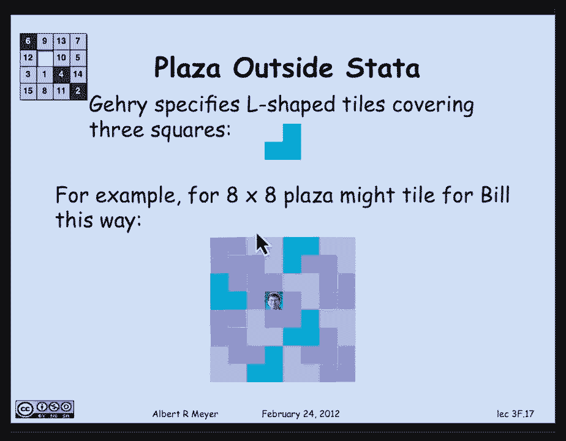
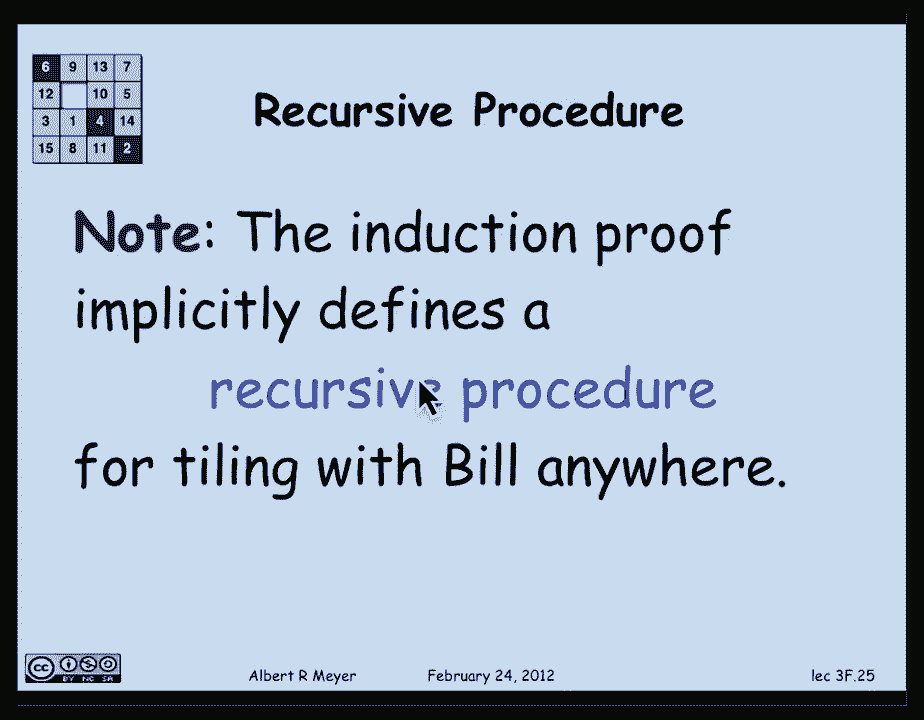

# 计算机科学的数学基础：P20：L1.8.1：归纳法 🧮

在本节课中，我们将要学习数学归纳法。归纳法是证明关于非负整数命题的一种强大工具。我们将从基本概念开始，通过一个简单的例子理解其原理，然后学习一个标准的证明模板，并应用它来证明一个几何求和公式。最后，我们将通过一个有趣的铺砖问题，展示如何通过证明一个更强的命题来简化归纳证明。

## 归纳法的基本概念

上一节我们介绍了课程概述，本节中我们来看看归纳法的核心思想。归纳法的概念可以这样解释：假设我们计划为非负整数分配颜色。

例如，我们定义一种颜色分配规则：
*   0是蓝色。
*   1是红色。
*   2是蓝色。
*   3是红色。
*   4是绿色。
*   5是绿色。
*   ……

现在，我描述我心目中的颜色规则，看看你能否推断出结果。规则如下：
1.  0不是红色。
2.  如果一个整数紧挨着一个红色整数，那么它也是红色。

根据这些规则，你可以推断出所有整数都不是红色。这实际上体现了归纳法的思想。

抽象地陈述归纳法规则：假设你有一个关于数的性质 `R`（例如“是红色”）。如果满足以下两个条件：
1.  **基础步骤**：`R(0)` 为真（0具有性质R）。
2.  **归纳步骤**：对于任意非负整数 `n`，如果 `R(n)` 为真，那么 `R(n+1)` 也为真。

那么，你可以得出结论：对于所有非负整数 `m`，`R(m)` 都为真。

使用量词可以简洁地表示为：
*   **前提**：`R(0) ∧ (∀n. R(n) ⇒ R(n+1))`
*   **结论**：`∀m. R(m)`

请注意，前提中的变量 `n` 和结论中的变量 `m` 是相互独立的局部变量，可以任意命名。

有时归纳法可以用多米诺骨牌来比喻：推倒第一块骨牌（基础步骤），并确保每一块倒下的骨牌都能推倒下一块（归纳步骤），那么所有骨牌都会倒下。

## 归纳法证明模板与应用

上一节我们介绍了归纳法的逻辑规则，本节中我们来看看如何具体地使用归纳法进行证明。我们将通过证明几何求和公式来演示一个标准的证明模板。

**定理**：对于任意实数 `r ≠ 1` 和非负整数 `n`，有：
`∑_{i=0}^{n} r^i = (r^{n+1} - 1) / (r - 1)`

以下是使用归纳法证明的步骤模板：

**证明**（对 `n` 进行归纳）：
*   **归纳假设** `P(n)`：等式 `∑_{i=0}^{n} r^i = (r^{n+1} - 1) / (r - 1)` 成立。
*   **基础步骤**（证明 `P(0)` 成立）：
    当 `n = 0` 时，左边和为 `r^0 = 1`。
    右边为 `(r^{0+1} - 1) / (r - 1) = (r - 1) / (r - 1) = 1`。
    因此，`P(0)` 成立。
*   **归纳步骤**（证明 `P(n) ⇒ P(n+1)`）：
    假设 `P(n)` 对某个 `n ≥ 0` 成立，即：
    `∑_{i=0}^{n} r^i = (r^{n+1} - 1) / (r - 1)`。 (归纳假设)
    我们需要证明 `P(n+1)` 成立，即：
    `∑_{i=0}^{n+1} r^i = (r^{(n+1)+1} - 1) / (r - 1) = (r^{n+2} - 1) / (r - 1)`。
    从左边开始推导：
    `∑_{i=0}^{n+1} r^i = (∑_{i=0}^{n} r^i) + r^{n+1}`。
    将归纳假设代入：
    `= (r^{n+1} - 1) / (r - 1) + r^{n+1}`。
    将第二项通分：
    `= (r^{n+1} - 1) / (r - 1) + (r^{n+1}(r - 1)) / (r - 1)`。
    合并分子：
    `= (r^{n+1} - 1 + r^{n+2} - r^{n+1}) / (r - 1)`。
    化简：
    `= (r^{n+2} - 1) / (r - 1)`。
    这正是 `P(n+1)` 的右边。因此，`P(n+1)` 成立。
    由归纳法可知，对于所有非负整数 `n`，`P(n)` 成立。∎

这个模板清晰地组织了证明的结构：声明证明方法、明确归纳假设、验证基础情况、利用归纳假设完成归纳步骤。

## 强化归纳假设：铺砖问题 🧱

上一节我们掌握了标准的归纳证明，本节中我们来看一个需要技巧的例子。有时直接证明一个命题很困难，但通过证明一个更强的命题，反而能让归纳证明变得更容易。

**问题描述**：有一个 `2^n × 2^n` 的广场，由单位正方形组成。我们需要用“L”形瓷砖（由3个单位正方形组成）铺满整个广场，但正中心留出一个单位正方形的位置放置雕像。

**初始尝试**：尝试直接对 `n` 进行归纳。
*   **归纳假设** `P(n)`：可以铺满 `2^n × 2^n` 的广场，并让雕像在中心。
*   **基础步骤** `n=0`：`1×1` 广场，直接把雕像放进去，无需铺砖，成立。
*   **归纳步骤**：假设 `P(n)` 成立，考虑 `2^{n+1} × 2^{n+1}` 的广场。它可以被分成4个 `2^n × 2^n` 的象限。我们希望雕像在整体广场的中心，但根据归纳假设，我们只能保证在每个小象限的中心放置雕像。这无法直接拼合成一个完整的、中心留空的铺砖方案。我们卡住了。

**解决方案**：证明一个更强的命题。
*   **强化归纳假设** `Q(n)`：对于 `2^n × 2^n` 的广场，**无论指定哪一个单位正方形留空**，我们都能用L形瓷砖铺满其余部分。
*   **基础步骤** `n=0`：`1×1` 广场，唯一的正方形就是被指定的留空位置，自然铺满（零块瓷砖），成立。
*   **归纳步骤**：假设 `Q(n)` 成立。考虑一个 `2^{n+1} × 2^{n+1}` 的广场，并指定任意一个单位正方形留空（如图中紫色方块）。
    1.  将大广场分成4个 `2^n × 2^n` 的象限。
    2.  留空方块必然位于其中一个象限内（例如右上象限）。根据强化归纳假设 `Q(n)`，我们可以铺满这个右上象限，并精确地在指定位置留空。
    3.  对于其他三个象限，我们在每个象限中**指定靠近大广场中心的那一个角**作为留空位置（如图中三个蓝色方块）。再次根据 `Q(n)`，我们可以铺满这三个象限。
    4.  现在，大广场中心区域恰好有三个留空的单位正方形（来自三个象限的角），它们形成一个“L”形。我们只需用一块L形瓷砖覆盖这个位置。
    5.  至此，整个 `2^{n+1} × 2^{n+1}` 的广场已被L形瓷砖铺满，且最初指定的正方形留空。`Q(n+1)` 得证。

通过证明“可以在任意指定位置留空”这个更强的性质 `Q(n)`，我们在归纳步骤中拥有了更大的灵活性（可以自由指定子象限中的留空位置），从而巧妙地构造出了整体的铺砖方案。这个证明过程也隐含地给出了一个递归算法来生成铺砖图案。

---

本节课中我们一起学习了数学归纳法。我们从其基本逻辑原理出发，学习并应用了一个清晰的证明模板来证明几何求和公式。最后，我们通过有趣的铺砖问题，掌握了“强化归纳假设”这一重要技巧，即通过证明一个更强的命题来简化归纳证明过程。归纳法是计算机科学中分析递归算法、证明程序正确性的基石，务必熟练掌握。