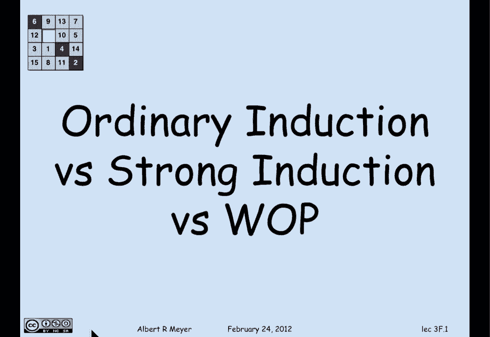
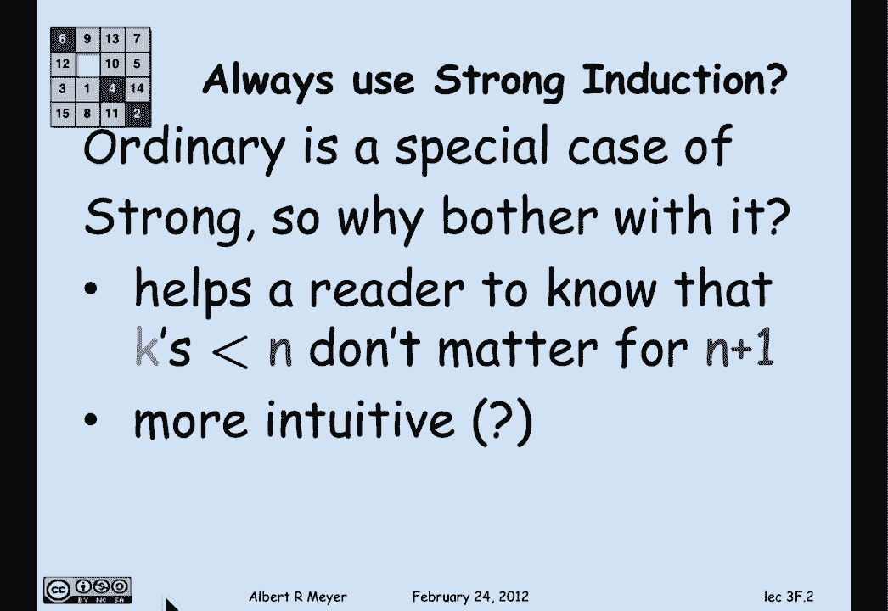
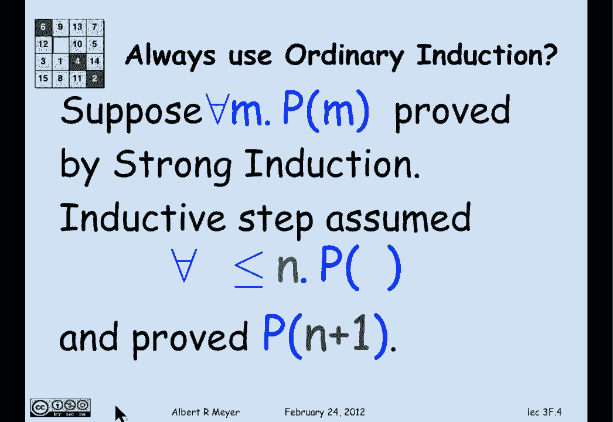
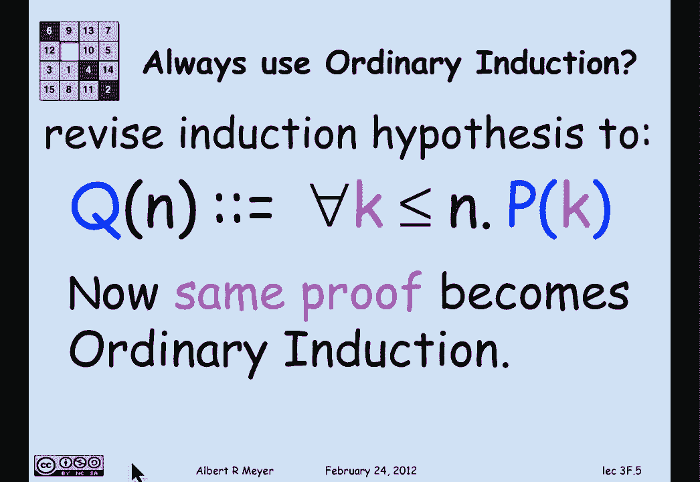
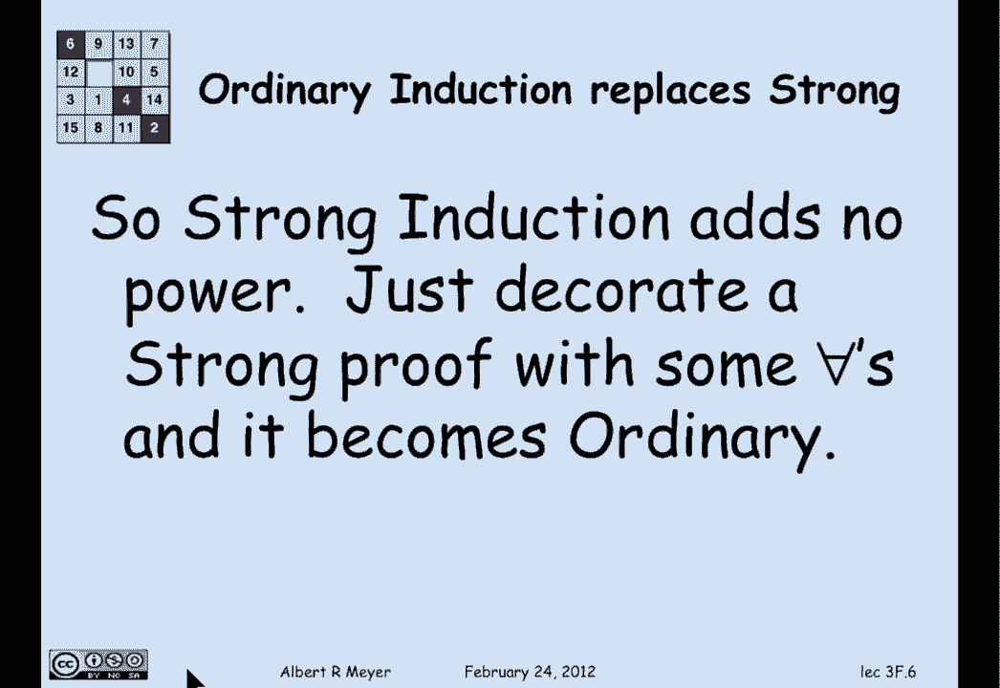
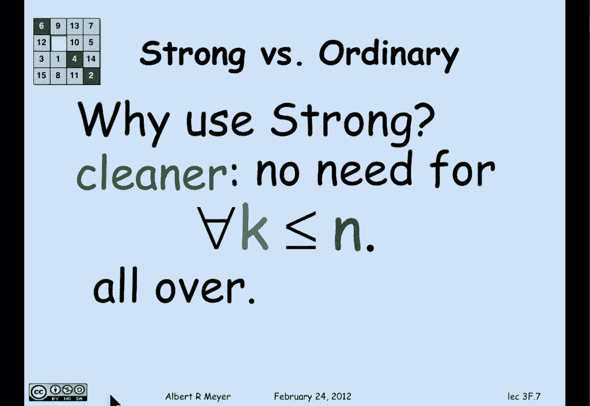
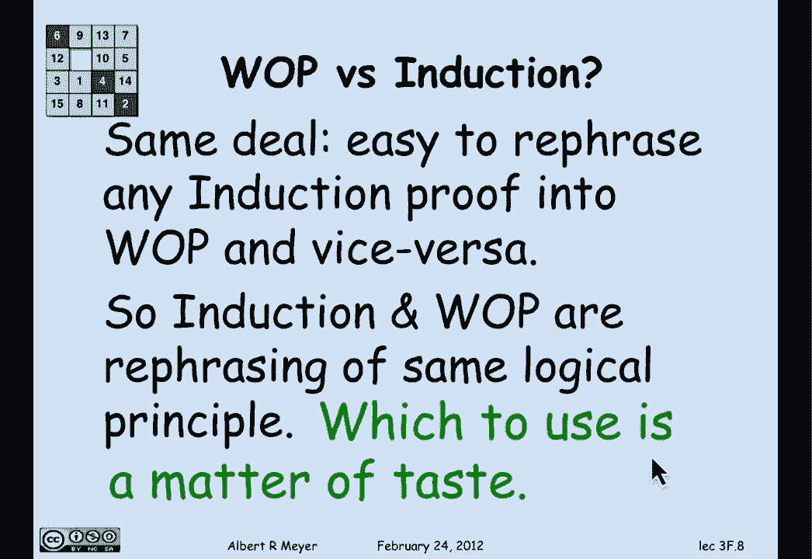
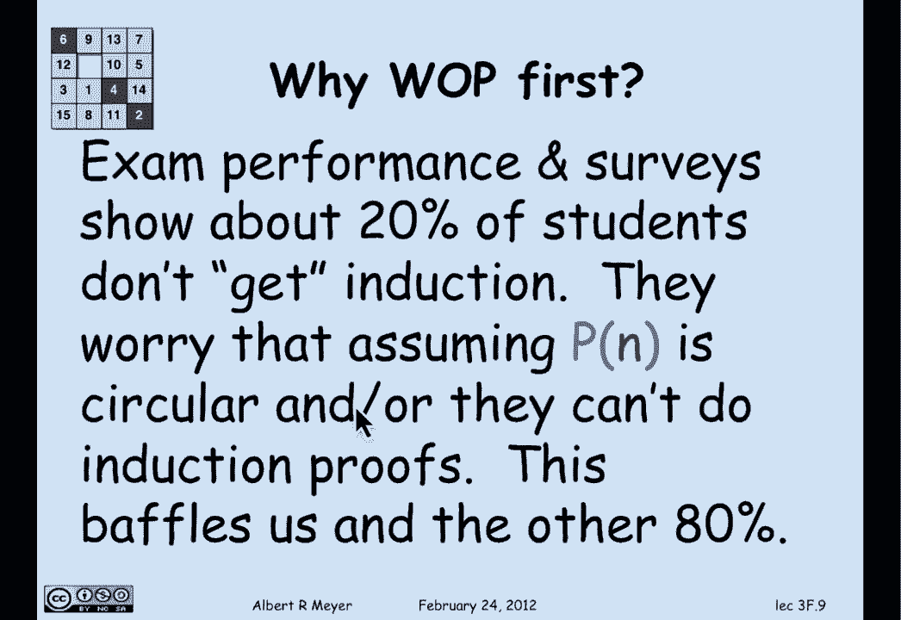
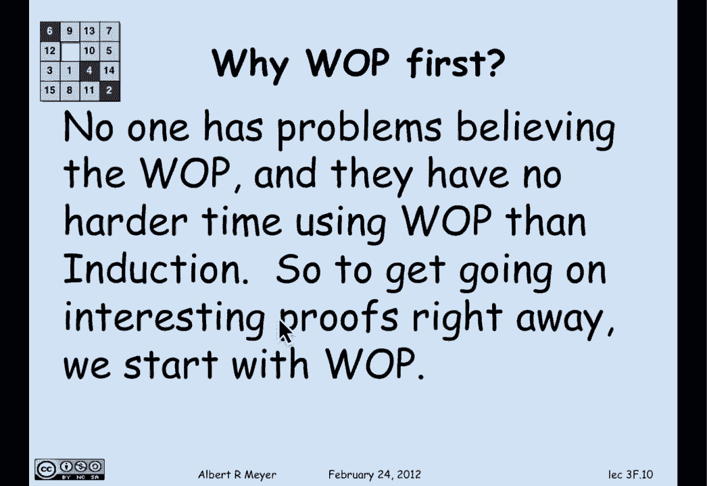

# 计算机科学的数学基础：L1.8.6：良序原理与归纳法对比 🧮

在本节课中，我们将要学习普通归纳法、强归纳法与良序原理之间的关系。我们将看到，尽管它们在表述上有所不同，但在逻辑上是等价的。理解这一点有助于我们在证明时选择最清晰、最合适的表述方式。

---

## 普通归纳法与强归纳法的关系

上一节我们介绍了归纳法的基本形式。本节中我们来看看普通归纳法与强归纳法之间的具体联系。

首先，普通归纳法是强归纳法的一个特例。在普通归纳法中，我们只假设 `P(n)` 成立来证明 `P(n+1)`。而在强归纳法中，我们可以假设对于所有 `k ≤ n`，`P(k)` 都成立，来证明 `P(n+1)`。但你在强归纳法中并不一定要使用所有额外的假设，你可以只使用 `P(n)`。因此，任何普通归纳法都可以被视为强归纳法的一个特例。

以下是两种归纳法的核心假设对比：

*   **普通归纳法**：假设 `P(n)` 为真，证明 `P(n+1)` 为真。
*   **强归纳法**：假设对于所有 `k ≤ n`，`P(k)` 为真，证明 `P(n+1)` 为真。

那么，为什么还要区分它们呢？主要原因在于表述的清晰度。使用普通归纳法可以让读者清楚地知道，对 `n+1` 情况的证明仅依赖于 `n` 的情况，而不是像典型的强归纳法证明那样依赖于所有小于等于 `n` 的情况。此外，有人认为从 `n` 到 `n+1` 的推理比从“所有小于等于 `n` 的情况”到 `n+1` 的推理更直观。

---

## 将强归纳法转化为普通归纳法

一个有趣且可能令人惊讶的观点是：我们总是可以使用普通归纳法。那么，如何用普通归纳法来替代强归纳法呢？方法很简单。

假设你使用强归纳法证明了对于所有 `m`，`P(m)` 成立，其归纳假设是对于所有 `k ≤ n`，`P(k)` 成立。现在，我们定义一个新的性质 `Q(n)`：

`Q(n)` 定义为：对于所有 `k ≤ n`，`P(k)` 成立。

通过将归纳假设修改为包含这个全称量词“对于所有 `k ≤ n`”，原本对 `P(k)` 的强归纳法就变成了对 `Q(n)` 的普通归纳法。我们只需对公式进行一些简单的符号修饰，就可以将强归纳法转化为普通归纳法。

由此可见，强归纳法并没有提供超越普通归纳法的新能力。它只是让你省略了在使用普通归纳法时必须明确写出的一连串全称量词。使用强归纳法的原因正是因为它更简洁，你不必到处重复书写“对于所有 `k ≤ n`”这样的语句。

---

## 良序原理与归纳法的关系

现在我们来看最后一个问题：良序原理与归纳法之间有什么关系？本质上，它们是同一回事。

你可以轻松地将一个归纳法证明的模板，转化为一个良序原理证明的模板，反之亦然。虽然我们不深入探讨具体转换的细节，但这个过程是常规的。由此可知，良序原理并没有为任何给定的证明增加新的数学能力或提供新的视角。它只是组织和讲述同一个故事的不同方式。

这也意味着，从概念上讲，这些表面上不同的推理规则——普通归纳法、强归纳法、良序原理——实际上只有一种核心思想。其他形式都可以用它来证明，并解释为它的变体。这在知识上是经济的，避免了不同推理原则的泛滥。

---

## 如何选择证明方法

这自然引出了一个问题：我们该如何选择使用哪种方法？可以说，这取决于个人偏好。

事实上，当我在撰写证明时，我经常会尝试不同的版本。我会尝试用普通归纳法写一遍，再用良序原理写一遍，然后阅读两者，决定哪一个看起来更清晰明了，就选择哪一个。因此，并没有关于选择哪种方法的简单规则，但在某种意义上，这真的不重要，你只需选择一种即可。

当然，唯一的例外是在考试或类似场合，题目要求你使用其中一种特定的方法，以展示你对该方法的理解。那时，你就不能随意选择了。

---

## 教学策略：为何先讲良序原理

最后，我们讨论一个教学法上的问题：为什么在6.042这门课中，我们先讲授良序原理（事实上是在第二讲），直到现在第三周快结束时才讲到更为人熟悉、许多人认为更喜欢的归纳法原理？

答案是，这是一种教学策略。事实上，教材作者们对此意见并不统一。我的观点是，先讲良序原理更好。原因在于，根据与学生们的交流、调查以及考试成绩，我们的印象是，无论我们多么努力地解释和教授归纳法，只有大约20%的学生真正掌握了它。

他们报告说，担心“假设 `P(n)` 成立去证明 `P(n+1)`”在某种程度上是循环论证。可以明确观察到，大约20%的学生无法可靠地进行归纳法证明。这让另外80%觉得归纳法显而易见、能轻松掌握的学生感到困惑，也让我们教师感到困惑。我们无法弄清楚那20%的学生到底遇到了什么问题，并且我们已经尝试了多种不同的方式来教授归纳法。

另一方面，没有人难以理解良序原理，并且在使用它时，他们肯定不比使用普通归纳法或强归纳法时更困难。关于“它安全吗？我真的相信它吗？”这种概念性问题，在良序原理上根本不会出现。每个人都同意“一个非空的非负整数集合必然有一个最小元素”是显而易见的。

因此，我们选择一开始就讲授良序原理，因为解释它没有额外的认知负担，并且它能让我们从一开始就着手进行有趣的证明，而不是等待一段时间，或者花几节课的时间讲解归纳法，却让部分学生将其视为唯一（且难以掌握）的证明非负整数性质的方法。

---

## 总结

本节课中我们一起学习了普通归纳法、强归纳法与良序原理之间的等价关系。我们看到，强归纳法在逻辑上并未超越普通归纳法，它主要提供了更简洁的表述。而良序原理与归纳法则本质上是同一核心思想的不同表述形式，选择哪一种通常取决于证明的清晰度和个人偏好。理解它们的等价性，能帮助我们在面对问题时，灵活选用最合适的证明框架。