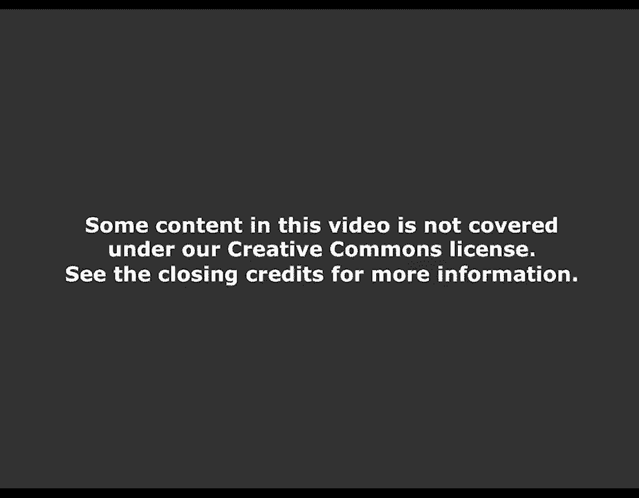
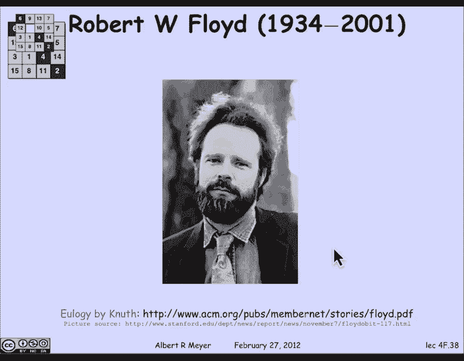

# MIT 6.042J 计算机科学的数学基础：P24：L1.9.1- 状态机与不变量 🧮

在本节课中，我们将要学习**状态机**以及如何使用**不变量**来分析它们。状态机是描述逐步过程的有力模型，在计算机科学和数字电路设计中非常常见。我们将通过几个有趣的例子，学习如何形式化地定义状态机，并利用“保持不变量”的原理来证明状态机的一些重要性质。

## 什么是状态机？ 🤖

上一节我们介绍了状态机的基本概念。状态机用于建模按步骤执行的过程。例如，计算过程通常被看作是一步接一步地执行指令，直到最终终止。同样，各种数字电路也会经历一系列状态，直到产生最终输出。

状态机的一般模型可能涉及输入和响应，但为了我们的目的，我们可以先看一个简单的例子。下面是一个计数到99的状态机：

状态用圆圈表示，命名为0到99，还有一个名为“溢出”的最终状态。双圈标记表示起始状态。箭头表示状态之间的转换。

以下是该状态机的完整数学描述：
*   **状态集合**： `{0, 1, 2, ..., 99, 溢出}`
*   **转换规则**： 对于 `i` 在 0 到 98 之间，有 `i -> i+1`；`99 -> 溢出`；`溢出 -> 溢出`。

这个状态机一旦进入“溢出”状态就会永远停留，一个更有用的真实机器会有一个将“溢出”重置为0的转换，但这个例子已经说明了基本思想。

## 示例：《虎胆龙威》水壶问题 💧

现在，我们来看一个来自电影《虎胆龙威》的有趣例子。电影中，反派西蒙给出了一个挑战：有一个3加仑的水壶和一个5加仑的水壶，以及一个无限供水的水源。目标是通过倒水操作，在其中一个水壶中得到**恰好4加仑**的水。

我们需要将这个问题形式化为一个状态机。首先，我们需要决定**状态**是什么。一个明显的模型是用水壶中的水量来表示状态。设 `B` 为大壶（5加仑）中的水量，`L` 为小壶（3加仑）中的水量。`B` 的取值范围是0到5，`L` 的取值范围是0到3。为了精确控制，我们要求水量必须是整数。

接下来，我们定义可能的**转换**（操作）。起始状态是 `(0, 0)`，即两个水壶都空。

以下是所有允许的安全操作（避免因随意倒水而无法追踪水量）：

*   **灌满小壶**： 如果 `L < 3`，则 `(B, L) -> (B, 3)`。
*   **灌满大壶**： 如果 `B < 5`，则 `(B, L) -> (5, L)`。
*   **倒空小壶**： `(B, L) -> (B, 0)`。
*   **倒空大壶**： `(B, L) -> (0, L)`。
*   **将大壶倒入小壶**：
    *   如果 `B + L <= 3`（无溢出），则 `(B, L) -> (0, B+L)`。
    *   否则（有溢出），则 `(B, L) -> (B - (3-L), 3)`。即，将小壶倒满，大壶剩余 `B - (3-L)` 加仑。
*   **将小壶倒入大壶**：
    *   如果 `B + L <= 5`（无溢出），则 `(B, L) -> (B+L, 0)`。
    *   否则（有溢出），则 `(B, L) -> (5, L - (5-B))`。即，将大壶倒满，小壶剩余 `L - (5-B)` 加仑。

这就是《虎胆龙威》水壶问题的状态机形式化描述。

### 如何得到4加仑？

西蒙的挑战是得到恰好4加仑水。我们可以通过一系列状态转换来实现：

1.  起始状态：`(0, 0)`。
2.  灌满大壶：`(5, 0)`。
3.  将大壶水倒入小壶：`(2, 3)`。（大壶剩2加仑，小壶满）
4.  倒空小壶：`(2, 0)`。
5.  将大壶水倒入小壶：`(0, 2)`。
6.  灌满大壶：`(5, 2)`。
7.  将大壶水倒入小壶（直到小壶满）：小壶已有2加仑，只能再倒入1加仑。操作后状态为 `(5-1, 3) = (4, 3)`。

成功！我们在5加仑的大壶中得到了**4加仑**水。

## 保持不变量与弗洛伊德不变量原理 🔍

上一节我们解决了原始问题。现在，让我们提出一个新问题：如果把5加仑壶换成9加仑壶（即一个3加仑壶和一个9加仑壶），还能否得到4加仑水？

直觉上，你可能会发现，无论你怎么操作，每个水壶中的水量似乎总是**3的倍数**。这是一个**保持不变量**。我们可以这样表述：对于任何可达状态 `(B, L)`，性质 `P(B, L)`：**3 整除 B，且 3 整除 L** 始终成立。（符号 `3 | B` 表示“3整除B”）。

为什么这是一个保持不变量？我们需要检查所有转换规则。以“将大壶倒入小壶（有溢出）”这一复杂规则为例：
转换是： `(B, L) -> (B - (3-L), 3)`。
假设在旧状态中，`3 | B` 且 `3 | L`（即B和L都是3的倍数）。那么在新状态中：
*   小壶水量为3，显然能被3整除。
*   大壶水量为 `B - (3 - L) = B + L - 3`。由于B和L都是3的倍数，`B+L`也是3的倍数，`B+L-3`也是3的倍数。

检查所有其他转换规则，同样成立。如果旧状态满足性质P，那么经过任何转换得到的新状态也满足性质P。这就是**保持不变量**的定义。

由于起始状态 `(0, 0)` 满足P（0能被任何数整除），根据**弗洛伊德不变量原理**，所有从起始状态可达的状态都满足性质P。

**弗洛伊德不变量原理**指出：如果一个性质P是保持不变量（即从任意满足P的状态出发，经过一步转换到达的新状态也满足P），并且起始状态满足P，那么P在所有可达状态中都成立。这本质上是归纳法在状态机上的应用。

因此，在3加仑和9加仑水壶的问题中，所有可达状态的水量都是3的倍数。而目标水量4**不是**3的倍数，所以**不可能**达到。布鲁斯·威利斯这次恐怕在劫难逃了。

> **注意**：严格来说，我们要区分“保持不变量”和“不变量”。一个在所有状态中都成立的性质叫“不变量”。我们通过找到一个“保持不变量”并证明起始状态满足它，来证明该性质是一个“不变量”。恒假的性质（如 `1=0`）是平凡的保持不变量，但不是我们通常关心的不变量。

## 更多示例：机器人移动与快速幂算法 ⚡️

为了巩固理解，我们再看两个使用不变量分析的例子。

### 示例1：对角线移动的机器人

假设一个机器人在整数网格上移动，其坐标为 `(x, y)`，`x` 和 `y` 都是非负整数。它每一步只能沿对角线移动：东北 `(+1, +1)`、东南 `(+1, -1)`、西北 `(-1, +1)`、西南 `(-1, -1)`。

问题：从原点 `(0, 0)` 出发，能否到达点 `(0, 1)`？

答案是否定的，原因在于一个保持不变量：**坐标和 `x + y` 的奇偶性**。
*   观察每一步移动：`x` 和 `y` 同时变化 ±1。因此，`x+y` 的变化可能是 `+2`, `0`, 或 `-2`。无论哪种情况，`x+y` 的奇偶性（是奇数还是偶数）都**保持不变**。
*   起始状态 `(0, 0)`，`0+0=0` 是偶数。
*   根据弗洛伊德原理，所有可达状态的 `x+y` 都是偶数。
*   目标状态 `(0, 1)`，`0+1=1` 是奇数。
*   因此，`(0, 1)` 不可达。

这个奇偶性不变量将帮助我们分析更复杂的“15拼图”游戏。

### 示例2：快速幂算法

最后，我们看一个重要的算法示例——快速幂算法，并用不变量验证其正确性。目标是高效计算 `a^b`（a的b次方），其中a是实数，b是非负整数。

算法的状态机描述如下：
*   **状态**： 一个三元组 `(x, y, z)`，其中 `x`, `y` 是实数，`z` 是非负整数。
*   **起始状态**： `(a, 1, b)`。`x` 存放底数a，`y` 作为累加器初始为1，`z` 存放指数b。
*   **转换规则**：
    1.  如果 `z > 0` 且 `z` 是**偶数**： `(x, y, z) -> (x^2, y, z/2)`。
    2.  如果 `z > 0` 且 `z` 是**奇数**： `(x, y, z) -> (x^2, x*y, (z-1)/2)`。
*   **终止状态**： 当 `z = 0` 时，算法停止，此时 `y` 中存放的就是结果。

这个算法的关键在于一个**保持不变量**：在**任何状态** `(x, y, z)` 下，恒有 **`y * (x^z) = a^b`**。

**验证**（以z为奇数的转换为例）：
假设旧状态 `(x, y, z)` 满足不变量：`y * x^z = a^b`。
转换后新状态为 `(x^2, x*y, (z-1)/2)`。
检查新状态是否满足不变量：
新 `y` * (新 `x`) ^ (新 `z`) = `(x*y) * (x^2)^((z-1)/2)`
= `(x*y) * x^(z-1)`
= `y * x^z`
= `a^b`。
成立！对于z为偶数的转换，验证类似。

由于起始状态 `(a, 1, b)` 满足 `1 * a^b = a^b`，根据弗洛伊德原理，该不变量在所有可达状态成立。
当算法终止于 `z=0` 时，不变量变为：`y * x^0 = y = a^b`。因此，最终 `y` 中的值就是正确的 `a^b`。

我们还需要证明算法总会终止。因为 `z` 是正整数，每次转换后 `z` 至少减半（`z/2` 或 `(z-1)/2`），所以最多经过大约 `log₂(b)` 步，`z` 就会变为0，算法终止。

这个算法的设计者和不变量原理的阐述者之一，是计算机科学家**罗伯特·弗洛伊德**。他在程序正确性验证和编程语言领域做出了奠基性贡献，并获得了图灵奖。

## 总结 📝

本节课中，我们一起学习了：
1.  **状态机**的基本概念：状态集合、转换规则和起始状态。
2.  如何将实际问题（如《虎胆龙威》水壶问题）形式化为状态机。
3.  **保持不变量**的概念：在状态转换下保持不变的性质。
4.  **弗洛伊德不变量原理**：如果保持不变量在起始状态成立，那么它在所有可达状态都成立。这是证明状态机全局性质（如“某些状态不可达”或“算法结果正确”）的强大工具。
5.  我们通过**水壶问题**、**机器人移动**和**快速幂算法**三个例子，实践了如何发现、验证并应用不变量进行分析。

掌握状态机和不变量，为你理解计算过程、验证算法正确性奠定了重要的数学基础。