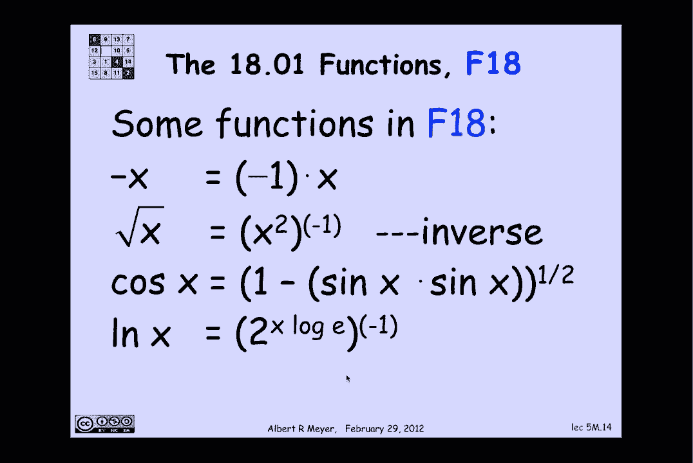

# 计算机科学的数学基础：L1.10.1：递归数据 📚

在本节课中，我们将要学习**递归数据**。递归数据是计算机科学中定义复杂结构的一种核心方法。我们将通过数学视角来理解其工作原理，并通过几个具体的例子来掌握如何定义和使用递归数据类型。

## 概述

递归数据的基本思想是：定义一类对象，其定义依赖于同一类对象的更简单版本。更精确地说，我们从一个已知的、非递归的**基础对象**集合开始，然后通过一系列**构造函数规则**，利用已有的对象来构造新的、更复杂的对象。这个过程是累积的，而非循环的，因为我们总是从已有的东西中构建出新的东西。

## 递归数据的定义方法

定义一个递归数据类型通常包含以下三个部分：

1.  **基础情况**：指定一些最简单的、直接属于该类型的对象。
2.  **构造函数规则**：说明如何通过组合已有的对象来创建该类型的新对象。
3.  **极值子句**：这是一个隐含的规则，它声明“只有通过上述两种方式（基础情况或应用构造函数规则）得到的对象才属于该类型”。这个子句通常被默认理解，很少明确写出。

上一节我们介绍了递归数据的基本概念，本节中我们来看看具体的例子。

## 示例一：偶数集合 `E`

我们首先定义一个整数子集的递归数据类型 `E`。

*   **基础情况**：`0` 属于 `E`。
*   **构造函数规则**：
    1.  如果 `n` 属于 `E` 且 `n >= 0`，那么 `n + 2` 也属于 `E`。
    2.  如果 `n` 属于 `E` 且 `n > 0`，那么 `-n` 也属于 `E`。

让我们看看如何构造 `E` 中的元素。从基础情况 `0` 开始，反复应用第一个构造函数规则，我们可以得到 `0, 2, 4, 6, ...`，即所有非负偶数。然后，对这些正数应用第二个构造函数规则（取负），我们可以得到 `-2, -4, -6, ...`。因此，`E` 包含了所有偶数。

根据极值子句，`E` 中**只有**通过上述方式构造出来的元素。所以我们可以得出结论：`E` 恰好是所有偶数的集合。

## 示例二：匹配括号字符串集合 `M`

现在，我们来看一个更有趣的例子：定义所有左右括号正确匹配的字符串集合 `M`。我们用 `{ ), ( }*` 表示所有由左右括号组成的有限字符串的集合。

*   **基础情况**：空字符串 `ε` 属于 `M`。
*   **构造函数规则**：如果字符串 `s` 和 `t` 都属于 `M`，那么由 `(`、`s`、`)` 和 `t` 连接而成的新字符串 `(s)t` 也属于 `M`。

让我们练习一下这个构造过程：
1.  最初，我们只有 `ε`。令 `s = ε`, `t = ε`，应用构造函数得到 `()ε`，即 `()`。
2.  现在 `M` 中有 `ε` 和 `()`。我们可以令 `s = ()`, `t = ε`，得到 `(())`。或者令 `s = ε`, `t = ()`，得到 `()()`。
3.  继续这个过程，我们可以构造出 `(()())`、`((()))`、`()()()` 等所有匹配的括号字符串。

基于这个递归定义，我们可以证明一些性质。例如，我们可以证明：**`M` 中没有任何字符串以右括号 `)` 开头**。
*   基础情况 `ε` 不以 `)` 开头。
*   构造函数规则生成的所有新字符串都以左括号 `(` 开头。
*   根据极值子句，`M` 中的元素只能通过上述方式获得。因此，`M` 中不可能存在以 `)` 开头的字符串。

## 示例三：F18 函数类

最后，我们看一个关于函数的递归定义示例：F18 函数类，它涵盖了微积分入门课程中常见的单变量实函数。

*   **基础情况**：以下函数属于 F18：
    *   恒等函数 `f(x) = x`
    *   任意常数函数 `f(x) = c`（c 为常数）
    *   正弦函数 `f(x) = sin(x)`
*   **构造函数规则**：如果 `f` 和 `g` 是 F18 中的函数，那么以下函数也属于 F18：
    *   加法：`f + g`
    *   乘法：`f * g`
    *   指数：`2^f` （即以 2 为底，`f(x)` 为指数的函数）
    *   求逆：`f^{-1}`（在逆函数有定义的情况下）
    *   复合：`f ∘ g`

让我们看看如何用这些规则推导出其他常见函数：
*   **负函数 `f(x) = -x`**：常数函数 `-1` 乘以恒等函数 `x` 得到 `-x`。
*   **平方根函数 `f(x) = √x`**：恒等函数 `x` 自乘得到 `x^2`，然后对其求逆得到 `√x`。
*   **余弦函数 `f(x) = cos(x)`**：方法一，`sin(x + π)` 是 `sin` 与 `(x + π)` 的复合，而 `(x + π)` 是 `x` 与常数 `π` 的和。方法二，利用恒等式 `cos(x) = √(1 - sin^2(x))`，通过常数函数、乘法、减法和平方根运算得到。
*   **自然对数函数 `f(x) = ln(x)`**：首先，常数 `log_2(e)` 乘以 `x` 得到 `log_2(e) * x`，然后应用指数构造函数得到 `2^(log_2(e) * x) = e^x`，最后对 `e^x` 求逆即得到 `ln(x)`。

这个例子展示了递归定义的强大之处：从一个小的基础集合出发，通过有限的规则可以构造出一个非常丰富且复杂的函数家族。

## 总结

本节课中我们一起学习了**递归数据**。我们了解到，递归数据类型通过**基础情况**和**构造函数规则**来定义，并隐含了**极值子句**。我们通过三个例子——偶数集合 `E`、匹配括号字符串集合 `M` 和 F18 函数类——具体实践了如何定义递归数据类型，并利用定义来推导其性质或构造复杂对象。递归是计算机科学中表示无限复杂结构（如链表、树、表达式）的基石，掌握其数学定义是理解这些结构的关键。