# 计算机科学的数学基础：P27：L1.10.4- 结构归纳法 🧱

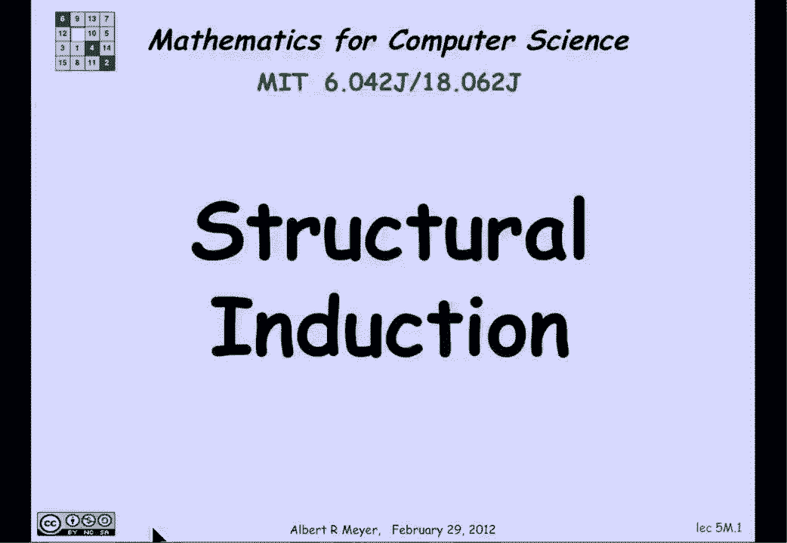

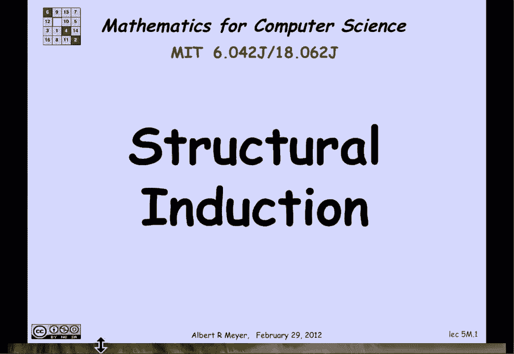

在本节课中，我们将要学习一种重要的证明方法——结构归纳法。它专门用于证明递归定义的数据类型所具有的性质。我们将通过几个具体的例子，来理解其工作原理和应用方式。

## 结构归纳法的原理

上一节我们介绍了递归定义的数据类型。本节中我们来看看如何证明这类数据类型的性质。

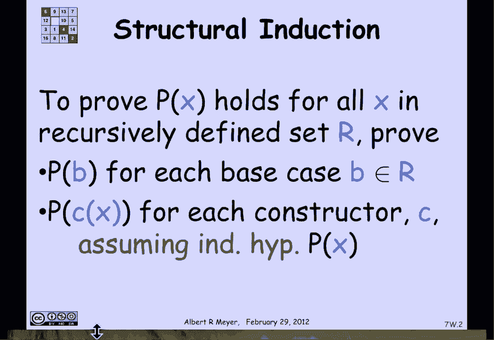

每当定义一个递归数据类型时，其定义中隐含了一种证明方法，称为结构归纳法。结构归纳法的工作方式如下：如果你想证明某个递归定义的数据类型中的**每一个**元素都具有特定性质 **P**，那么你需要按以下步骤进行：

1.  **基础步骤**：证明基础情形 **R** 中的每一个元素都具有性质 **P**。
2.  **归纳步骤**：对于每一个构造器 **C**，证明：如果你将构造器 **C** 应用于元素 **X**，那么只要 **X** 具有性质 **P**（你可以将此作为结构归纳假设 `P(X)`），那么 `C(X)` 也具有性质 **P`。

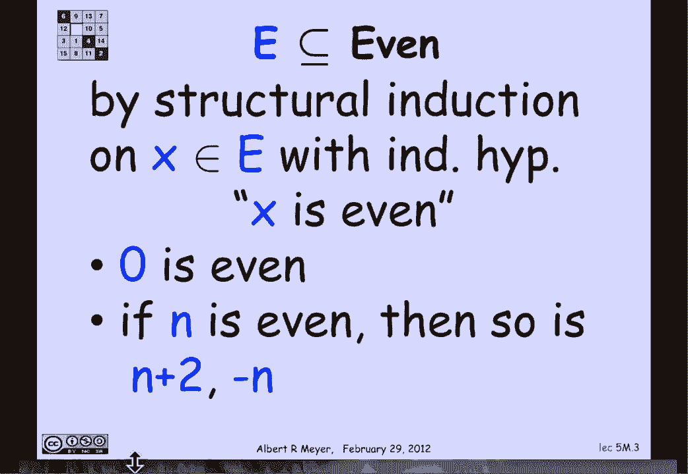

有些构造器接受多个参数，但以上模式说明了其通用思想。

## 简单示例：偶数集

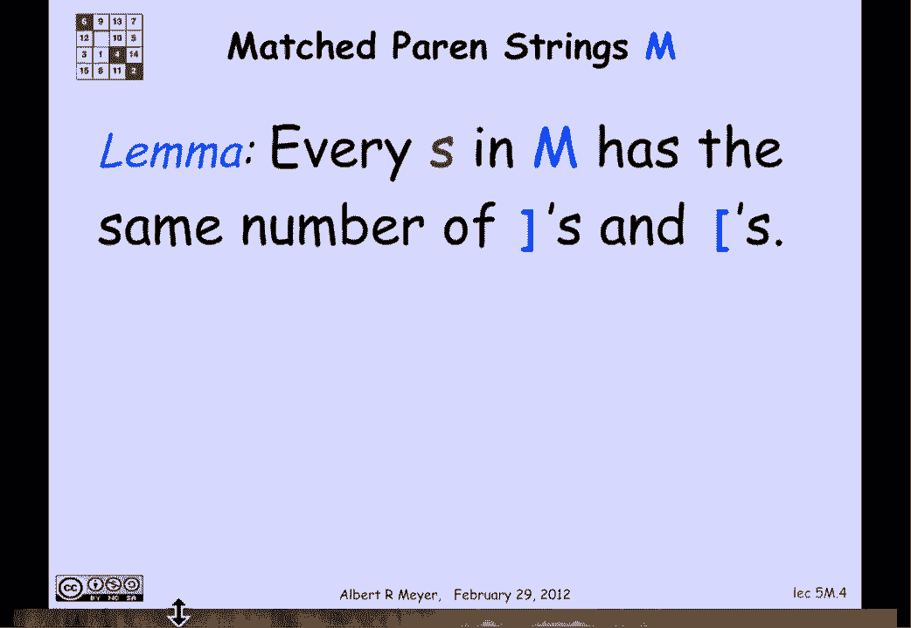

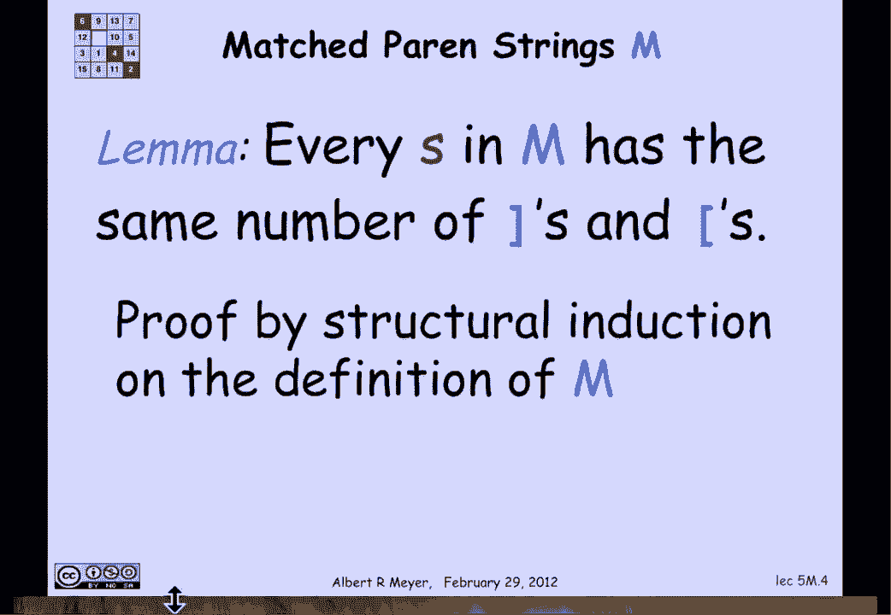

让我们先看一个简单的例子。我们在之前的讲解中实际上已经见过这个方法，但没有特别强调它。当时我们论证了递归定义的集合 **E** 只包含偶数。

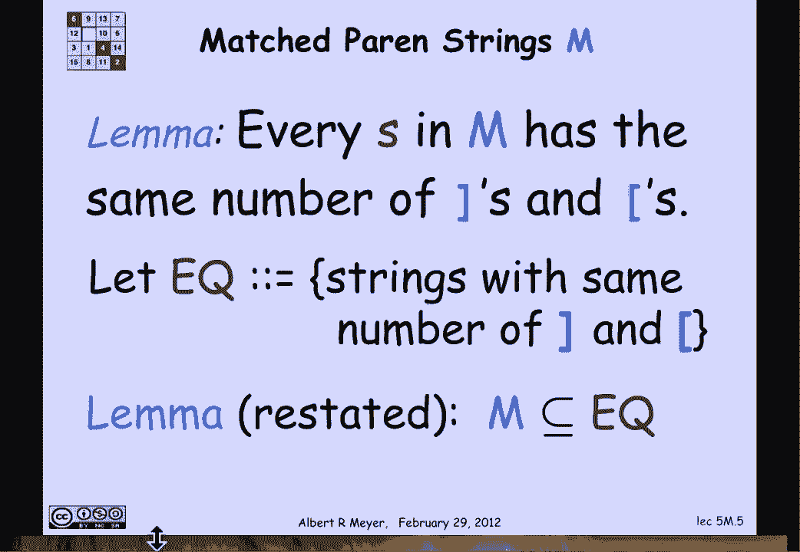

以下是集合 **E** 的定义：
*   **基础情形**：`0 ∈ E`
*   **构造情形**：如果 `n ∈ E`，那么 `n+2 ∈ E` 且 `-n ∈ E`

我们想通过归纳法证明 **X** 是偶数。我们需要检查：
*   **基础情形**：`0` 是偶数，成立。
*   **归纳步骤**：假设归纳假设 `n` 是偶数成立，那么当我们应用构造器 `n+2` 时，结果显然是偶数；应用构造器 `-n` 时，结果也是偶数。

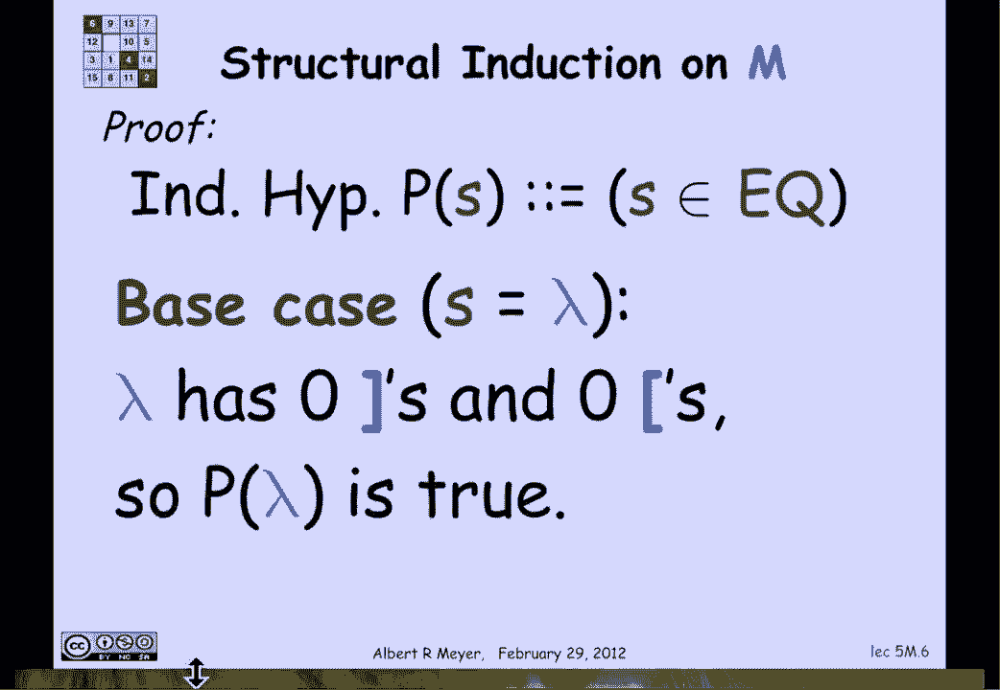

因此，结构归纳法告诉我们，集合 **E** 中的每一个字符串（数字）确实都是偶数。

## 匹配括号示例

现在让我们看一个更有趣的例子：匹配的左右括号集合 **M**。我想通过结构归纳法证明：**M** 中的每一个字符串都包含相同数量的左括号和右括号。

我可以重新表述这个命题：定义 **EQ** 为包含相同数量左右括号的字符串集合。那么我真正想说的是：**M** 是 **EQ** 的一个子集。

以下是证明方法：
*   定义我的归纳假设 `P(s)` 为：字符串 `s` 属于 **EQ**，即 `s` 具有相同数量的左括号和右括号。
*   回忆 **M** 的定义：
    *   **基础情形**：空字符串 `λ`（没有括号）属于 **M**。
    *   **构造情形**：如果 `R` 和 `T` 属于 **M**，那么 `[R]T` 也属于 **M`。

以下是证明过程：
1.  **基础步骤**：空字符串 `λ` 满足 `P(s)` 吗？是的，它有 0 个右括号和 0 个左括号，数量相等。因此我们确立了基础情形 `P(λ)` 为真。
2.  **归纳步骤**：我们需要考虑构造情形。假设 `R` 和 `T` 属于 **M**，并且归纳假设 `P(R)` 和 `P(T)` 成立（即 `R` 和 `T` 各自左右括号数量相等）。现在考虑通过构造器得到的字符串 `s = [R]T`。
    *   字符串 `s` 中的右括号数量 = `R` 中的右括号数 + `T` 中的右括号数 + **1**（因为构造器额外添加了一个 `]`）。
    *   字符串 `s` 中的左括号数量 = `R` 中的左括号数 + `T` 中的左括号数 + **1**（因为构造器额外添加了一个 `[`）。
    *   根据归纳假设 `P(R)`，`R` 中左右括号数相等；根据 `P(T)`，`T` 中左右括号数也相等。
    *   因此，上面两个等式的右边是相等的，所以 `s` 中的右括号数量等于左括号数量。故 `P(s)` 为真。

构造情形得证。因此，我们可以通过结构归纳法得出结论：递归定义的匹配括号字符串集合 **M** 中的每一个字符串 `s`，确实都具有相同数量的左右括号。这意味着 **M** 是 **EQ** 的子集，正如所声称的那样。

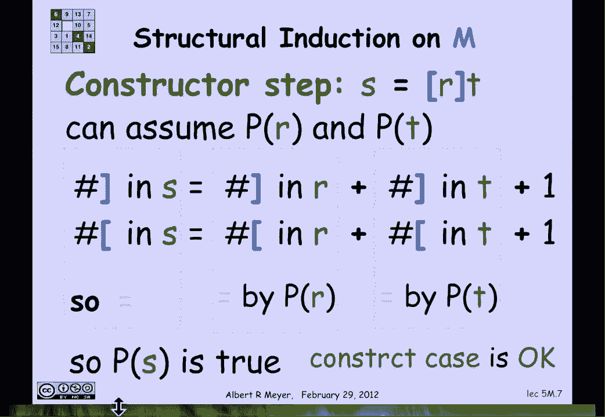

## 一个有趣的应用：F18函数

这些结构归纳证明相对简单。和常规归纳证明一样，当你找到正确的归纳假设时，证明往往会变得容易。我们将要研究一个与 **F18函数** 相关的有趣例子。

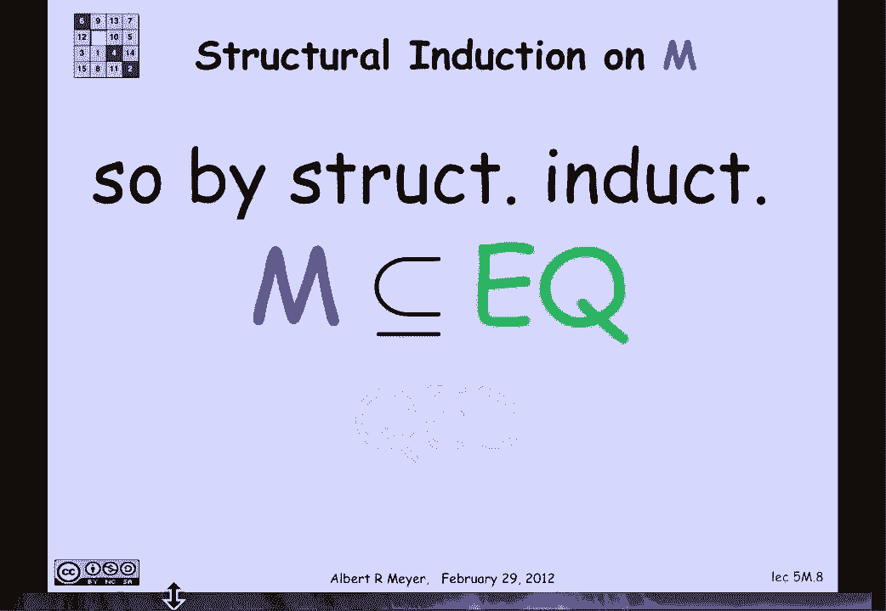

F18函数在微积分入门课程中被考虑的原因之一是：如果你观察所有这些函数（它们由常数函数、恒等函数 `id(x)=x`、正弦函数 `sin(x)` 通过加法、乘法、指数运算、复合等构造器组合而成），你会发现不需要添加“求导”作为一个构造器。因为可以通过结构归纳法证明：**F18函数在求导运算下是封闭的**。也就是说，任何一个F18函数的导数，仍然是一个F18函数。

---

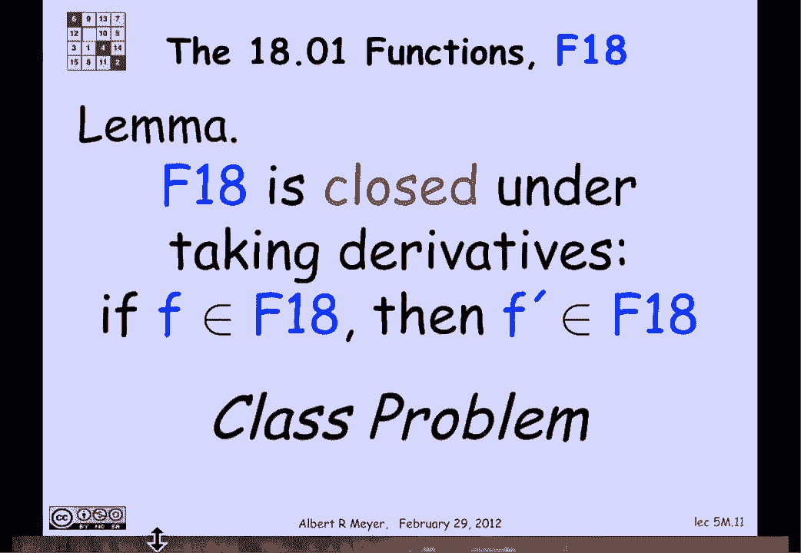

本节课中我们一起学习了结构归纳法。它是一种强大的工具，用于证明递归定义集合或数据类型的性质。我们通过证明偶数集的性质、匹配括号字符串的平衡性，并提及了其在F18函数求导封闭性证明中的应用，掌握了其基础步骤和归纳步骤的核心思想。记住，关键在于：1）验证基础情形；2）在归纳假设下，证明每个构造器都能保持所需性质。