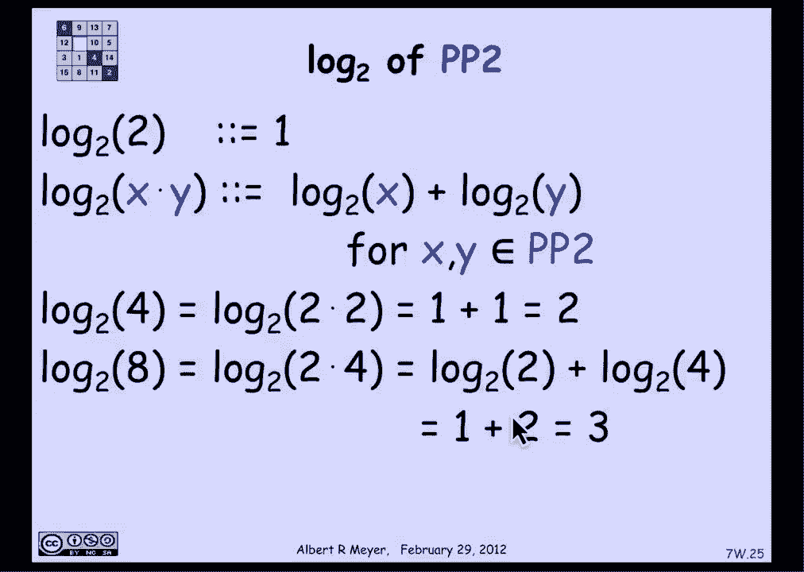
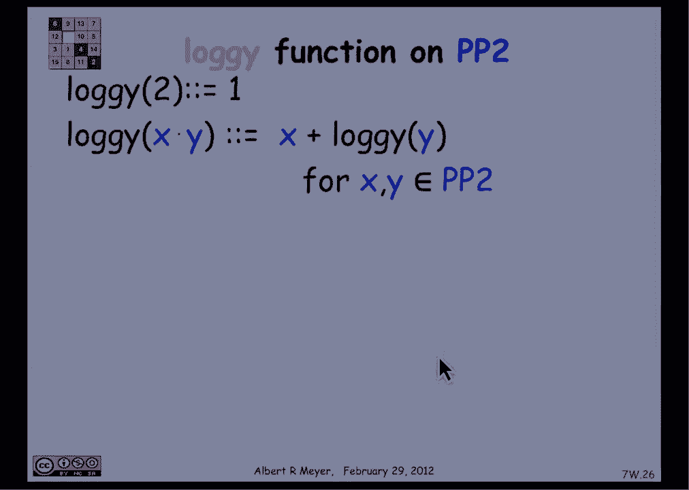

# 计算机科学的数学基础：P28：L1.10.7- 递归函数 📚

在本节课中，我们将学习如何在递归定义的数据类型上定义递归函数。我们将通过具体的例子，如匹配括号字符串的“深度”和指数运算，来理解其标准方法。同时，我们也会探讨一个关键问题：当数据类型定义不明确时，递归函数的定义可能会失败。

---

## 递归函数的定义方法 🔄

上一节我们介绍了递归数据类型，本节中我们来看看如何在其上定义函数。

在编程中，处理递归数据类型的标准做法是定义递归过程。具体方法如下：对于一个递归数据类型 `R`，我们定义一个函数 `f`。首先，为 `R` 的所有**基本情况** `b` 直接定义 `f(b)` 的值。然后，对于每个**构造函数** `C(x)`，我们根据 `x` 和 `f(x)` 来定义 `f(C(x))`。

如果遵循这个结构，我们就得到了一个在递归定义数据集上的递归函数 `f`。

---

## 示例一：匹配括号字符串的深度 🧱

为了使上述方法更清晰，我们来看一个在匹配括号字符串集合上定义递归函数的例子。

我们定义字符串的“深度”概念，它衡量括号嵌套的层数。

*   **基本情况**：空字符串的深度为 `0`。
*   **构造函数**：如果 `s` 和 `t` 是匹配括号字符串，那么 `(s)t` 也是一个匹配括号字符串。其深度定义为 `1 + max(深度(s), 深度(t))`。

用公式表示递归定义如下：
*   `深度(“”) = 0`
*   `深度(“(s)t”) = 1 + max(深度(s), 深度(t))`

---

## 示例二：更熟悉的递归定义——指数运算 ⚡

让我们看一个更熟悉的递归定义示例：计算 `k` 的 `n` 次方（`k` 为整数或实数，`n` 为非负整数）。

*   **基本情况**：`k^0 = 1`
*   **递归步骤**：`k^(n+1) = k * (k^n)`

这个定义利用了非负整数可以递归定义的事实（0是整数；如果n是整数，则n+1也是整数），它本身就是结构归纳法的一个应用。

---

## 递归函数配方总结 📝

以下是定义递归函数的通用步骤：

1.  确定递归数据类型 `R`。
2.  为所有基本情况 `b` 直接定义 `f(b)`。
3.  对于每个构造函数 `C(x)`，用 `x` 和 `f(x)` 来定义 `f(C(x))`。

这样定义的函数 `f` 是良定义的。我们可以通过**结构归纳法**来证明关于这个函数的性质。

---

## 结构归纳法证明示例 ✅

现在，我们使用结构归纳法来证明关于括号字符串深度的一个性质。

**命题**：对于任何匹配括号字符串 `r`，其长度满足 `|r| + 2 ≤ 2^(深度(r) + 1)`。

**证明**：
*   **基本情况**：当 `r` 是空字符串时，`|r| = 0`，`深度(r) = 0`。左边 `0 + 2 = 2`，右边 `2^(0+1) = 2`。等式成立。
*   **归纳步骤**：假设 `r` 由构造函数生成，即 `r = (s)t`，且归纳假设对 `s` 和 `t` 成立。我们需要证明命题对 `r` 成立。
    *   根据定义，`|r| = |s| + |t| + 2`（两个括号）。
    *   所以 `|r| + 2 = (|s|+2) + (|t|+2)`。
    *   根据归纳假设，`|s|+2 ≤ 2^(深度(s)+1)`，`|t|+2 ≤ 2^(深度(t)+1)`。
    *   因为 `深度(s)` 和 `深度(t)` 都 `≤ max(深度(s), 深度(t))`，我们可以将指数替换为这个最大值，得到：
        `|r|+2 ≤ 2 * 2^(max(深度(s), 深度(t)))`。
    *   根据深度定义，`深度(r) = 1 + max(深度(s), 深度(t))`，所以 `max(深度(s), 深度(t)) = 深度(r) - 1`。
    *   代入上式：`|r|+2 ≤ 2 * 2^(深度(r)-1) = 2^(深度(r)+1)`。

证明完成。

---

## 定义不明确导致的问题 ⚠️

上一节我们看到了成功的递归定义，本节中我们来看看一个因定义不明确而导致问题的例子。

假设我们递归定义“2的正幂”集合 `P2`：
*   **基本情况**：`2 ∈ P2`。
*   **构造函数**：如果 `x ∈ P2` 且 `y ∈ P2`，那么 `x * y ∈ P2`。

现在，我们尝试在这个集合上定义一个“对数”函数 `log_i`：
*   `log_i(2) = 1`
*   `log_i(x * y) = log_i(x) + log_i(y) + 1` （注意，这里我们故意加了一个 `+1`，与常规对数不同，以制造问题）

让我们计算几个值：
*   `log_i(4) = log_i(2*2) = log_i(2) + log_i(2) + 1 = 1 + 1 + 1 = 3`。
*   `log_i(8) = log_i(2*4) = log_i(2) + log_i(4) + 1 = 1 + 3 + 1 = 5`。
*   `log_i(16)` 可以通过不同方式构造：
    *   构造方式一：`16 = 8 * 2` -> `log_i(16) = log_i(8) + log_i(2) + 1 = 5 + 1 + 1 = 7`。
    *   构造方式二：`16 = 2 * 8` -> `log_i(16) = log_i(2) + log_i(8) + 1 = 1 + 5 + 1 = 7`。（巧合相同）
    *   构造方式三：`16 = 4 * 4` -> `log_i(16) = log_i(4) + log_i(4) + 1 = 3 + 3 + 1 = 7`。

在这个修改后的例子中，`16` 得到了相同的值 `7`。但如果我们把构造函数规则改为 `log_i(x * y) = log_i(x) + log_i(y)`（即常规对数），那么：
*   `16 = 8*2` -> `log_i(16) = 5 + 1 = 6`
*   `16 = 4*4` -> `log_i(16) = 2 + 2 = 4`
*   `16 = 2*8` -> `log_i(16) = 1 + 3 = 4`

此时，`log_i(16)` 得到了 `6` 和 `4` 两个不同的结果，这产生了**矛盾**。函数对于同一个输入必须输出唯一的值，因此这不是一个良定义的函数。

---

## 核心问题：定义的明确性 🎯

问题的根源在于数据类型 `P2` 的定义是**不明确**的。同一个元素（如 `16`）可以通过多种不同的方式构造出来。

当我们基于一个不明确的数据类型定义递归函数时，如果函数定义依赖于具体的构造路径，就可能给同一个元素赋予不同的值，从而导致矛盾。

因此，在定义递归函数时，我们必须确保：
1.  递归数据类型本身的定义最好是明确的（如匹配括号字符串）。
2.  如果数据类型不明确，则需要额外证明：无论使用哪种构造路径，函数定义都会产生相同的结果。例如，常规的以2为底的对数函数 `log2(x*y) = log2(x) + log2(y)` 在 `P2` 上是良定义的，但这需要基于对数的性质来证明，而不能直接从递归定义中安全得出。

---

## 总结 🏁

本节课中我们一起学习了：
1.  **递归函数的定义方法**：为基本情况直接赋值，为构造函数基于其组成部分的函数值进行定义。
2.  **应用示例**：我们定义了匹配括号字符串的“深度”和指数运算 `k^n`。
3.  **证明技术**：我们使用结构归纳法证明了关于字符串深度的一个不等式。
4.  **关键注意事项**：我们通过“2的正幂”集合上的伪对数函数例子，揭示了当**递归数据类型定义不明确**时，在其上定义递归函数可能导致矛盾。确保函数定义不依赖于具体的构造路径至关重要。